# RIManager Implementation

ReactiveInfoManager (RIManager) の実装リポジトリです。

RIManager は Device の生データを Canonical Data に正規化し、Canonical Data・Snapshot・Capability・Notification を提供するライブラリです。

---

# Design Principles

本リポジトリは以下の原則に基づいて設計されています。

- `core` は製品非依存の共通ロジック
- `products` は製品固有の定義と構成
- Runtime の共通識別子は `RIMDataId`
- Product は宣言的な `ProductDefinition` として記述
- Data 定義の唯一の正本は `DataItemDefinition`
- Core は Product の知識を持たない
- Capability は現在状態として保持する
- Notification は状態変化を外部へ通知する
- Capability は Canonical Data の集合から導出される
- Data と Capability は独立に通知可能
- Capability は Snapshot を入力として生成する
- 将来的には Data 変更を起点とした部分再評価へ移行可能な構造を維持する

---

# Architecture Overview

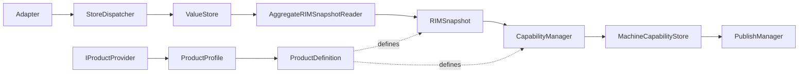

---

# Repository Structure

```text
RIManager
├─ include
├─ core
├─ products
├─ test
├─ samples
└─ docs
```

---

## Public API

公開ヘッダは `include` 配下のみ。

```text
include
├─ rim_api.h
├─ rim_types.h
├─ rim_version.h
├─ rim_data_id.h
└─ rim_capability_id.h
```

---

## Core

`core` 配下には製品知識を持たない共通実装のみを配置する。

```text
core
├─ adapter
├─ capability
├─ common
├─ publisher
├─ storage
└─ store
```

### 責務

```text
Adapter
Storage
Snapshot
Capability
Publisher
Worker
Common Interface
```

### 主な構成

```text
IProductProvider

ValueStore

RIMSnapshot
AggregateRIMSnapshotReader

CapabilityManager
MachineCapabilityStore

PublishManager
```

---

## Products

`products` 配下には製品固有定義のみを配置する。

製品定義の詳細は [docs/products.md](docs/products.md) を参照。

```text
products
├─ common
├─ printer_a
└─ skeleton
```

### 責務

```text
Domain 定義
DataItem 定義
Capability 定義
Pipeline 定義
ProductProfile
ProductDefinition
```

---

# Product Model

Product は宣言的な構成定義である。

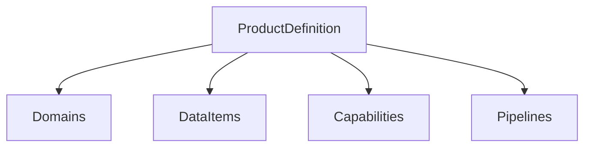

---

# ProductProfile

製品構成の入口。

```cpp
struct ProductProfile
{
    const ProductDefinition& definition;
};
```

### 役割

```text
ProductDefinition へのアクセス入口
```

---

# Product Provider

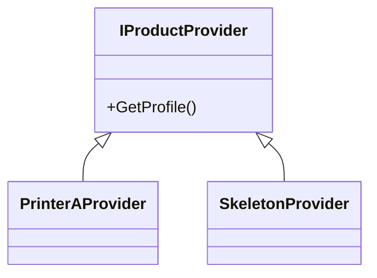

製品固有情報は Provider 経由で取得する。

---

# ProductDefinition

製品全体の宣言的構成情報。

```cpp
struct ProductDefinition
{
    const DomainDefinition* domains;
    std::size_t domainCount;

    const DataItemDefinition* dataItems;
    std::size_t dataItemCount;

    const CapabilityItemDefinition* capabilities;
    std::size_t capabilityCount;

    const PipelineDefinition* pipelines;
    std::size_t pipelineCount;
};
```

### 役割

```text
製品に存在する要素を宣言する

- Domain
- DataItem
- Capability
- Pipeline
```

---

# DataItemDefinition

RIManager における Canonical Data Model。

```cpp
struct DataItemDefinition
{
    RIMDataId id;

    std::string_view name;

    std::string_view domain;

    ValueType valueType;
};
```

### 例

```text
TemperatureSensorA
TemperatureSensorB
HumiditySensor

UpperDoorOpen
RightDoorOpen
LeftDoorOpen

JobActive
JobId

StapleLevel
ErrorList
```

---

# Data Model

DataItem はシステム内部で扱う正規化後データを定義する。

```text
DataItem
 ├ ID
 ├ Name
 ├ Domain
 └ ValueType
```

### 将来的な拡張候補

```text
Unit
NormalizationRule
ValidationRule
Dependency Metadata
```

---

# Runtime Identification Model

Runtime では `RIMDataId` を唯一の識別子として利用する。

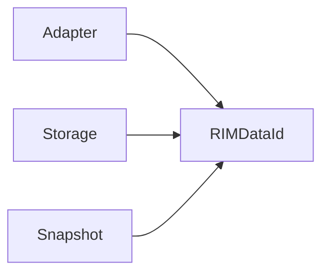

---

# Adapter Responsibility

Adapter は Device の生データを Canonical Data に変換する。

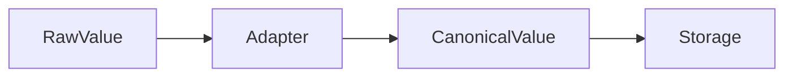

### 例

```text
300.15 Kelvin

↓

Adapter

↓

27.0 Celsius
```

---

# Storage Responsibility

Storage は Canonical Data の保管と検証を担当する。

### 責務

```text
Store
Lookup
Type Validation
Snapshot Generation
Snapshot Management
```

---

# Definition Lookup

Storage は ProductDefinition を参照して検索を行う。

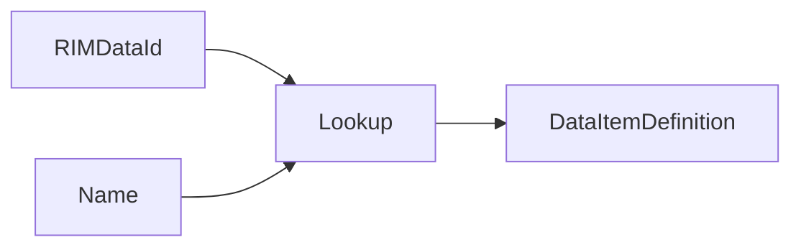

---

# Type Validation Policy

型生成責任と型検証責任を分離する。

```text
Adapter
 └ 正しい型を生成する責任

Storage
 └ 型を検証する責任
```

Storage は最後の防壁として機能する。

---

# Data Flow

Canonical Data 更新の基本フロー。

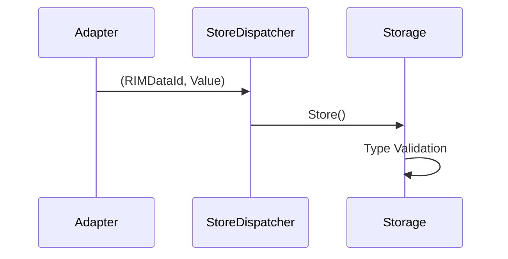

---

# Snapshot Flow

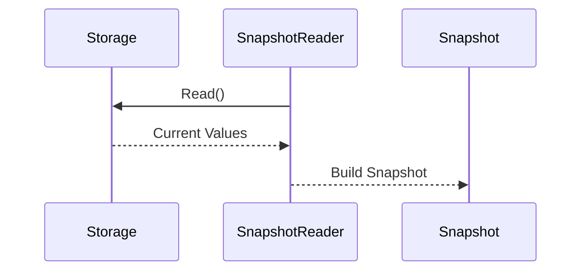

---

# Capability Flow

現在の実装は Snapshot 中心設計である。

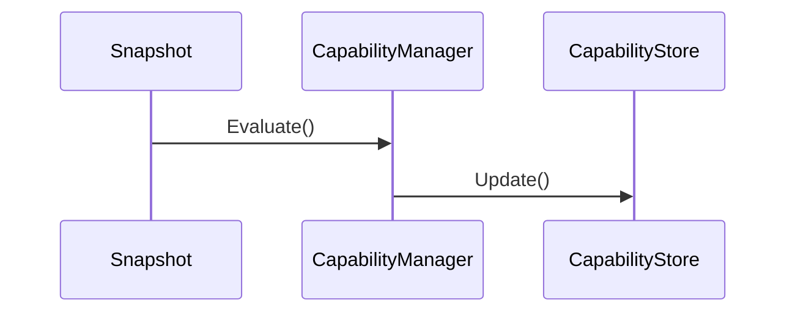

---

# Runtime Processing Flow

現在の Worker 構成。

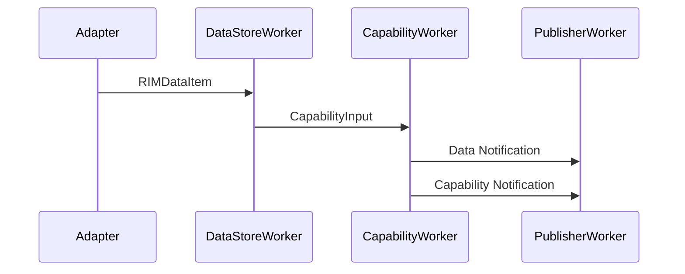

---

# CapabilityInput

Capability 再評価要求。

```cpp
struct CapabilityInput
{
    RIMSnapshot snapshot;

    RIMDataId changedDataId;
};
```

### 現在の用途

```text
Snapshot
 └ Capability再評価

changedDataId
 └ Data Notification生成
```

### 将来の用途

```text
変更Data
 ↓
影響Capability特定
 ↓
部分再評価
```

---

# Capability

Capability は製品機能を表す現在状態である。

```text
Environment
PrintReady
Consumable
Job
```

現在は Snapshot 全体から生成される。

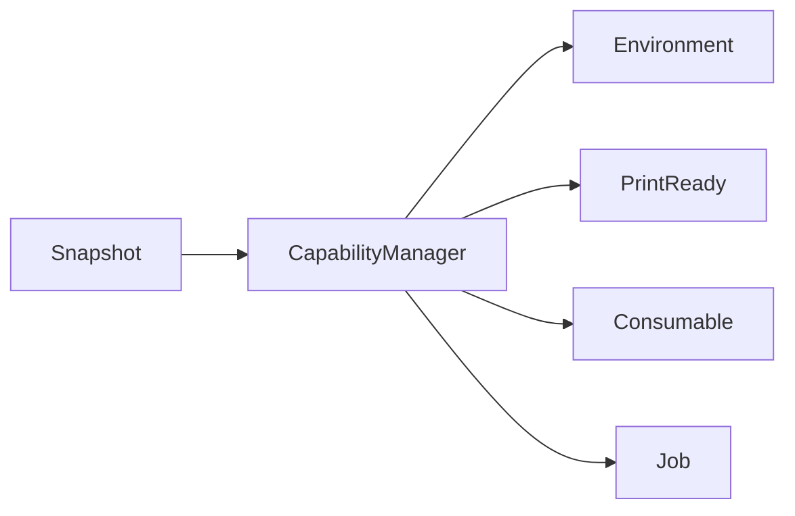

---

# Capability Evaluation Strategy

## 現在

現在は Data 更新時に Capability 全体を再評価する。

```text
Data Changed
    ↓
Build Snapshot
    ↓
Evaluate All Capabilities
    ↓
Detect Changes
    ↓
Notify
```

### 利点

```text
実装が単純
依存関係管理不要
正しさを保証しやすい
```

### 欠点

```text
影響のない Capability も再計算
Capability 数増加時に効率低下
ProductDefinition の依存情報を活用していない
```

---

## 将来構想

Data 依存関係を ProductDefinition に持たせる。

```text
Changed DataId
    ↓
Affected Capability Lookup
    ↓
Evaluate Affected Capabilities
    ↓
Notify
```

例:

```text
UpperDoorOpen
    ↓
Environment
PrintReady
```

これにより部分再評価が可能になる。

---

# Notification

RIManager は Data Notification と Capability Notification を提供する。

---

## Data Notification

Canonical Data の更新通知。

```cpp
NotificationTargetType::Data
```

例:

```text
UpperDoorOpen Changed
TemperatureSensorA Changed
ErrorList Changed
```

---

## Capability Notification

Capability 状態変更通知。

```cpp
NotificationTargetType::Capability
```

例:

```text
Environment Changed
PrintReady Changed
Consumable Changed
Job Changed
```

---

# Notification Flow

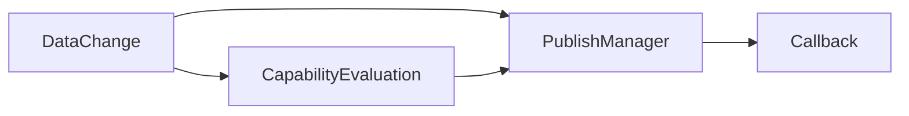

---

# C API

### 現在状態取得

```cpp
RIM_GetCapability(...)
```

### Data更新

```cpp
RIM_SetBool(...)
RIM_SetInt32(...)
RIM_SetDouble(...)
RIM_SetBinary(...)
```

### Capability購読

```cpp
RIM_SubscribeCapability(...)
```

### 汎用購読

```cpp
RIM_Subscribe(...)
```

### 購読解除

```cpp
RIM_Unsubscribe(...)
```

---

# Design Direction

Canonical Data を単一の真実のソースとする。

```text
ProductDefinition
 └ DataItemDefinition
      ├ Name
      ├ Domain
      ├ ValueType
      └ Extension Points
```

### Adapter

```text
Raw Value
 ↓
Normalize
 ↓
Canonical Data
```

### Storage

```text
Canonical Data
 ↓
Validate
 ↓
Store
```

### Capability

```text
Canonical Data
 ↓
Snapshot
 ↓
Evaluate
 ↓
Capability
```

### Notification

```text
Data Change
 ↓
Notify

Capability Change
 ↓
Notify
```

定義の重複は作らない。

---

# Testing

本リポジトリのテストは、責務ごとに以下へ分割している。

- Unit: 単体ロジック検証
- Integration: コンポーネント間連携検証
- End-to-End: API/通知を含む経路検証
- Thread: ワーカ・並行アクセス検証
- Performance: スループット/レイテンシ計測

ビルド成果物は以下の2系統。

- `rimanager_functional_test`: unit/integration/e2e/thread を集約
- `rimanager_performance_test`: performance を集約

CI の PR 品質ゲートは `rimanager_functional_test` を実行対象とし、性能系は PR 毎の必須ゲートには含めない。

詳細な構造、ディレクトリ責務、実行方針は [docs/testing.md](docs/testing.md) を参照。

---

# Current Status

```text
✅ Core / Products 分離
✅ Public API 整理
✅ ProductProfile 導入
✅ ProductProvider 導入
✅ ProductDefinition 導入
✅ DomainDefinition 導入
✅ DataItemDefinition 導入
✅ CapabilityDefinition 導入
✅ PipelineDefinition 導入
✅ Runtime Identifier 統一 (RIMDataId)
✅ Adapter による正規化
✅ Storage による型検証
✅ Snapshot 中心設計
✅ Capability 生成パイプライン
✅ Data Notification 実装
✅ Capability Notification 実装
✅ ProductDefinition Lookup API
✅ Callback Notification
✅ Functional Tests Green
✅ End-to-End Tests Green
✅ 177 Tests Passed

⬜ Capability Dependency Metadata
⬜ ChangedData → Capability Reverse Lookup
⬜ Partial Capability Evaluation
⬜ Notification Optimization
⬜ Dependency Driven Capability Generation
```

---

# 開発環境のセットアップ

## 前提

- VS Code
- Docker（Dev Containers が起動できること）
- インターネット接続（ビルド時に googletest を GitHub から自動取得）

## DevContainer でのセットアップ（推奨）

1. VS Code で本リポジトリを開く
2. コマンドパレットから `Dev Containers: Reopen in Container` を実行する
3. 初回起動時に `postCreateCommand` で `cmake -S . -B build` が自動実行される

本リポジトリの DevContainer は Ubuntu 24.04 ベースで、以下が事前インストールされる。

- `build-essential`
- `cmake`
- `git`
- `lcov`

## ビルド手順（DevContainer 内）

```bash
# Configure（初回は自動実行されるが、再実行してもよい）
cmake -S . -B build

# Build
cmake --build build
```

## make コマンド一覧（DevContainer 内）

`cmake -S . -B build` 実行後、`build` ディレクトリで以下を利用できる。

```bash
cd build

# ビルド（全ターゲット）
make -j"$(nproc)"

# ビルド（テストバイナリのみ）
make rimanager_functional_test
make rimanager_performance_test

# テスト実行（CTest 経由）
ctest --output-on-failure

# 実行（テストバイナリを直接実行）
./rimanager_functional_test
./rimanager_performance_test
```

## テスト実行（DevContainer 内）

```bash
cd build

# 機能テスト + インテグレーションテスト + E2E テスト
./rimanager_functional_test

# パフォーマンステスト
./rimanager_performance_test
```

## カバレッジレポート生成（DevContainer 内）

```bash
cmake -B build -DENABLE_COVERAGE=ON -DCMAKE_BUILD_TYPE=Debug
cmake --build build --target coverage
```

生成された HTML レポートは `build/coverage_html/index.html` で確認できる。

## ローカル環境で実行する場合（任意）

Ubuntu 系環境では以下のパッケージを事前にインストールする。

```bash
sudo apt update
sudo apt install -y cmake build-essential git lcov
```

---

# Repository Rules

## ブランチ命名規則

```text
<type>/<内容>

例:
  feature/add-capability-dependency-metadata
  bugfix/fix-snapshot-race-condition
  chore/update-googletest
  docs/add-architecture-diagram
  test/add-e2e-notification-test
```

| type | 用途 |
|------|------|
| `feature` | 新機能開発 |
| `bugfix` | バグ修正 |
| `chore` | 保守・依存更新 |
| `docs` | ドキュメントのみの変更 |
| `test` | テスト追加・修正 |

## 品質ゲート

変更完了前に以下を必ず実行し、全テストが通ることを確認する。

```bash
cmake -S . -B build
cmake --build build --parallel
./build/rimanager_functional_test
```

Draft PR では CI がスキップされる。レビュー依頼前に Draft を解除すること。

## Coverage 基準

| 種別 | 基準 |
|------|------|
| C0（行カバレッジ） | 80% 以上（必須） |
| C1（分岐カバレッジ） | 30% 以上（必須）、60% 以上（推奨） |

## コーディング規則

- **マジックナンバー禁止**: 意味を持つ数値は名前付き定数または enum として定義する
- **マジックストリング禁止**: 意味を持つ文字列は名前付き定数またはテーブルとして定義する
- **コメントは日本語**: 実装コードのコメントは日本語で記述する
- **Doxygen**: 公開ヘッダの関数・型・enum 値には Doxygen コメントを記載する（引数・戻り値・所有権・スレッド安全性を含む）
- **文字コード / 改行**: テキストファイルは UTF-8 + LF を標準とする
- **変更範囲**: 要求に直接関係する最小差分に限定する。無関係な整形・リファクタを同時に行わない

## テストコメント規則

新規作成または変更するテスト関数の直前に、以下の4観点を含む日本語コメントを記載する。

```cpp
/**
 * @brief <テスト名の意図>
 *
 * 前提: テスト開始時点の状態・依存条件・入力条件
 * 実施内容: 何を実行するか
 * 検証期待: 何をもって成功と判定するか
 * テストの意味: このテストが防ぐ不具合や担保する仕様
 */
TEST(SuiteName, TestName) { ... }
```

## lcov 除外パターン規則

`lcov --remove` の除外パターンに `/workspace` 等の絶対パスを使用しない。  
リポジトリルート基準の相対パターン（`*/test/*`、`*/_deps/*`）のみを使用する。