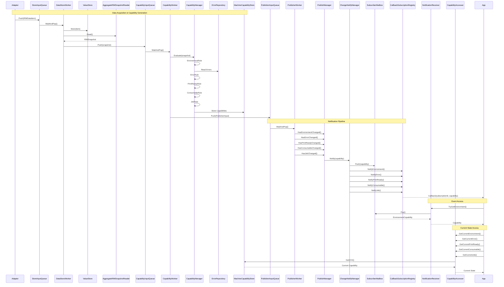
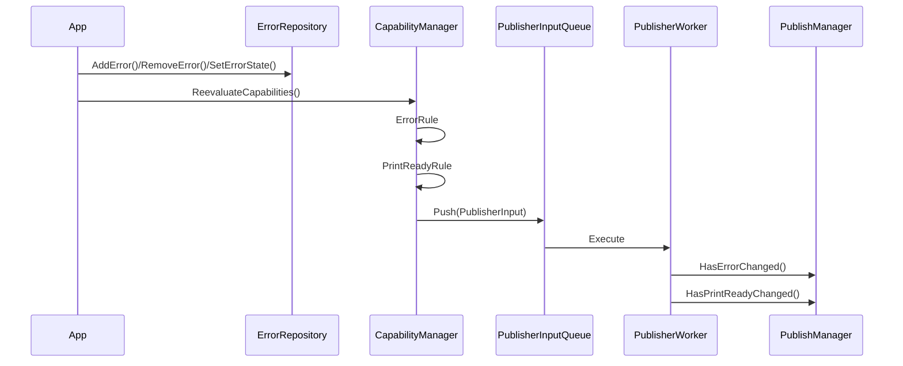

# RIManager 全体シーケンス図

本シーケンス図は、Adapter から入力されたデータが Capability に変換され、通知および Current State として利用されるまでの全体フローを示します。

```mermaid
sequenceDiagram

    participant Adapter
    participant StoreInputQueue
    participant DataStoreWorker
    participant ValueStore
    participant SnapshotReader as AggregateRIMSnapshotReader

    participant CapabilityInputQueue
    participant CapabilityWorker
    participant CapabilityManager
    participant ErrorRepository
    participant CapabilityStore as MachineCapabilityStore

    participant PublisherInputQueue
    participant PublisherWorker
    participant PublishManager
    participant ChangeNotifyManager

    participant Mailbox as SubscriberMailbox
    participant CallbackRegistry as CallbackSubscriptionRegistry

    participant Receiver as NotificationReceiver
    participant Accessor as CapabilityAccessor

    participant App

    Note over Adapter,CapabilityStore: Data Acquisition & Capability Generation

    Adapter->>StoreInputQueue: Push(RIMDataItem)

    StoreInputQueue->>DataStoreWorker: WaitAndPop()

    DataStoreWorker->>ValueStore: Store(item)

    DataStoreWorker->>SnapshotReader: Read()

    SnapshotReader-->>DataStoreWorker: RIMSnapshot

    DataStoreWorker->>CapabilityInputQueue: Push(snapshot)

    CapabilityInputQueue->>CapabilityWorker: WaitAndPop()

    CapabilityWorker->>CapabilityManager: Evaluate(snapshot)

    CapabilityManager->>CapabilityManager: EnvironmentRule
    CapabilityManager->>ErrorRepository: Read Errors
    CapabilityManager->>CapabilityManager: ErrorRule
    CapabilityManager->>CapabilityManager: PrintReadyRule
    CapabilityManager->>CapabilityManager: ConsumableRule
    CapabilityManager->>CapabilityManager: JobRule

    CapabilityManager->>CapabilityStore: Store Capabilities

    CapabilityWorker->>PublisherInputQueue: Push(PublisherInput)

    Note over PublisherInputQueue,CallbackRegistry: Notification Pipeline

    PublisherInputQueue->>PublisherWorker: WaitAndPop()

    PublisherWorker->>PublishManager: HasEnvironmentChanged()
    PublisherWorker->>PublishManager: HasErrorChanged()
    PublisherWorker->>PublishManager: HasPrintReadyChanged()
    PublisherWorker->>PublishManager: HasConsumableChanged()
    PublisherWorker->>PublishManager: HasJobChanged()

    PublishManager->>ChangeNotifyManager: Notify(capability)

    ChangeNotifyManager->>Mailbox: Push(capability)

    ChangeNotifyManager->>CallbackRegistry: NotifyEnvironment()
    ChangeNotifyManager->>CallbackRegistry: NotifyError()
    ChangeNotifyManager->>CallbackRegistry: NotifyPrintReady()
    ChangeNotifyManager->>CallbackRegistry: NotifyConsumable()
    ChangeNotifyManager->>CallbackRegistry: NotifyJob()

    CallbackRegistry-->>App: Callback(subscriptionId, capability)

    Note over App,Receiver: Event Access

    App->>Receiver: TryGetEnvironment()
    Receiver->>Mailbox: Pop()
    Mailbox-->>Receiver: EnvironmentCapability
    Receiver-->>App: Capability

    Note over App,Accessor: Current State Access

    App->>Accessor: GetCurrentEnvironment()
    App->>Accessor: GetCurrentError()
    App->>Accessor: GetCurrentPrintReady()
    App->>Accessor: GetCurrentConsumable()
    App->>Accessor: GetCurrentJob()

    Accessor->>CapabilityStore: GetXXX()

    CapabilityStore-->>Accessor: Current Capability

    Accessor-->>App: Current State
```

## Error更新シーケンス

```mermaid
sequenceDiagram

    participant App
    participant ErrorRepository
    participant CapabilityManager
    participant PublisherQueue as PublisherInputQueue
    participant PublisherWorker
    participant PublishManager

    App->>ErrorRepository: AddError()/RemoveError()/SetErrorState()

    App->>CapabilityManager: ReevaluateCapabilities()

    CapabilityManager->>CapabilityManager: ErrorRule
    CapabilityManager->>CapabilityManager: PrintReadyRule

    CapabilityManager->>PublisherQueue: Push(PublisherInput)

    PublisherQueue->>PublisherWorker: Execute

    PublisherWorker->>PublishManager: HasErrorChanged()

    PublisherWorker->>PublishManager: HasPrintReadyChanged()
```
