# RIManager Architecture

ReactiveInfoManager (RIManager) は、製品定義と実行エンジンを明確に分離した Capability ベースの情報管理システムである。

RIManager は Device の生データを Canonical Data に正規化し、Canonical Data・Snapshot・Capability・Notification を提供する。

---

# Design Principles

RIManager は以下の責務分離を採用する。

```text
core
    = 実行エンジン (How)

products
    = 製品定義 (What)

products/common
    = 共通ルールライブラリ
```

基本方針:

```text
core
    は製品を知らない

products
    は製品仕様を宣言する

Runtime
    は RIMDataId を唯一の識別子として扱う

DataItemDefinition
    を Canonical Data Model とする

Capability
    は Canonical Data から生成する

Notification
    は Data と Capability の両方を通知可能とする
```

---

# High Level Architecture

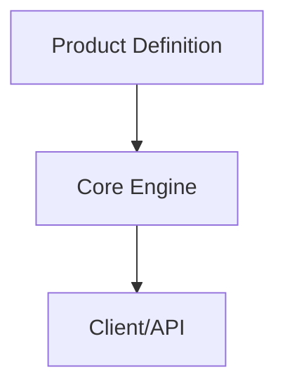

---

# Repository Structure

```text
RIManager
├─ include
├─ core
│  ├─ adapter
│  ├─ capability
│  ├─ common
│  ├─ publisher
│  ├─ storage
│  └─ store
│
├─ products
│  ├─ common
│  ├─ printer_a
│  └─ skeleton
│
└─ test
```

---

# Responsibility Separation

## core

core は製品知識を持たない。

持たないべきもの:

```text
PrinterA
TemperatureSensorA
TemperatureSensorB
HumiditySensor
Door
Consumable
Job
```

責務:

```text
入力処理

データ保存

Snapshot生成

Capability生成

通知
```

---

## products

products は製品仕様を保持する。

責務:

```text
どんなDomainが存在するか

どんなDataItemが存在するか

どんなCapabilityが存在するか

どんなPipelineが存在するか

どんな正規化が必要か
```

---

## products/common

共通ルールライブラリ。

例:

```cpp
IdentityNormalize()
```

将来候補:

```cpp
PercentNormalize()

KelvinToCelsiusNormalize()

CelsiusToKelvinNormalize()
```

---

# Product Boundary

core と products の境界は ProductProfile。

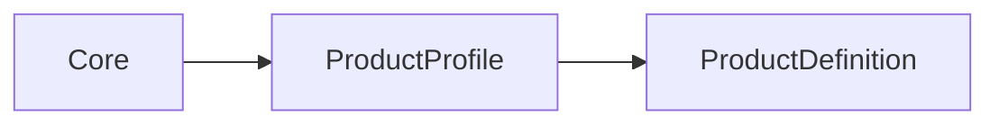

```cpp
struct ProductProfile
{
    const ProductDefinition& definition;
};
```

---

# Product Provider

製品構成の入口。

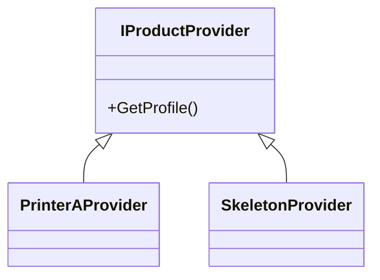

---

# ProductDefinition

製品仕様の中心となる宣言モデル。

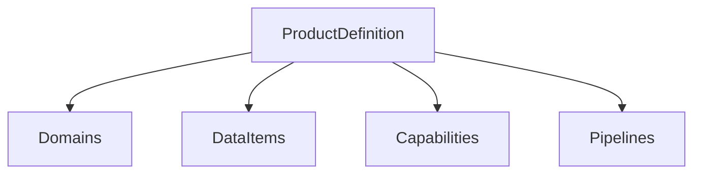

```cpp
struct ProductDefinition
{
    const DomainDefinition* domains;
    std::size_t domainCount;

    const DataItemDefinition* dataItems;
    std::size_t dataItemCount;

    const CapabilityItemDefinition* capabilities;
    std::size_t capabilityCount;

    const PipelineDefinition* pipelines;
    std::size_t pipelineCount;
};
```

---

# DataItemDefinition

RIManager における Canonical Data Model。

```cpp
struct DataItemDefinition
{
    RIMDataId id;

    std::string_view name;

    std::string_view domain;

    ValueType valueType;
};
```

例:

```text
TemperatureSensorA
TemperatureSensorB
HumiditySensor

UpperDoorOpen
RightDoorOpen
LeftDoorOpen

JobActive
JobId

StapleLevel
ErrorList
```

---

# Runtime Identifier

Runtime の識別子は `RIMDataId` に統一する。

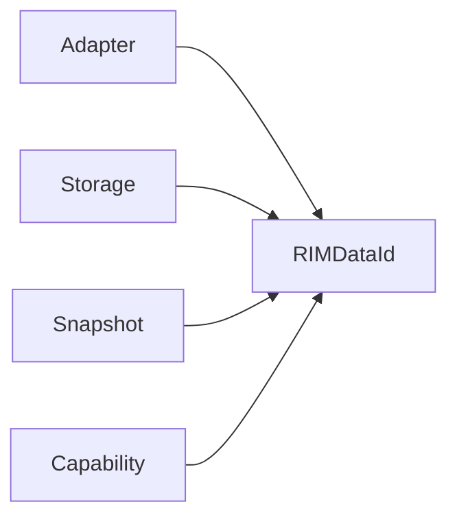

---

# Normalize Function

正規化処理は products 側に配置する。

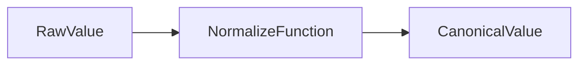

例:

```cpp
IdentityNormalize()
```

---

# Adapter Responsibility

Adapter の責務。

```text
入力受信
↓
正規化
↓
Store投入
```

入力:

```text
Raw Device Data
```

出力:

```text
RIMDataId
Canonical Value
```

---

# Adapter Architecture

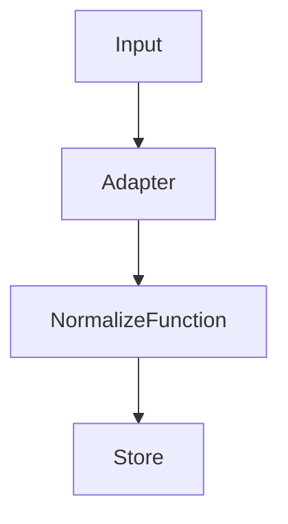

---

# Storage Responsibility

Storage は Canonical Data の保存と検証を担当する。

責務:

```text
Store

Lookup

Type Validation

Snapshot Generation

Snapshot Management
```

---

# Definition Lookup

Storage は ProductDefinition を参照して検索する。

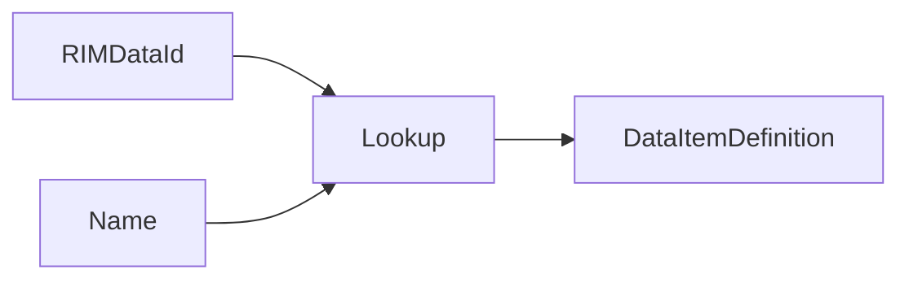

例:

```cpp
FindDataItem(
    product,
    RIMDataId::kTemperatureSensorA);

FindDataItem(
    product,
    "TemperatureSensorA");
```

---

# Type Validation Policy

型生成責任と型検証責任を分離する。

```text
Adapter
 └ 正しい型を生成する責任

Storage
 └ 型を検証する責任
```

Storage は最後の防壁として機能する。

---

# Runtime Class Diagram

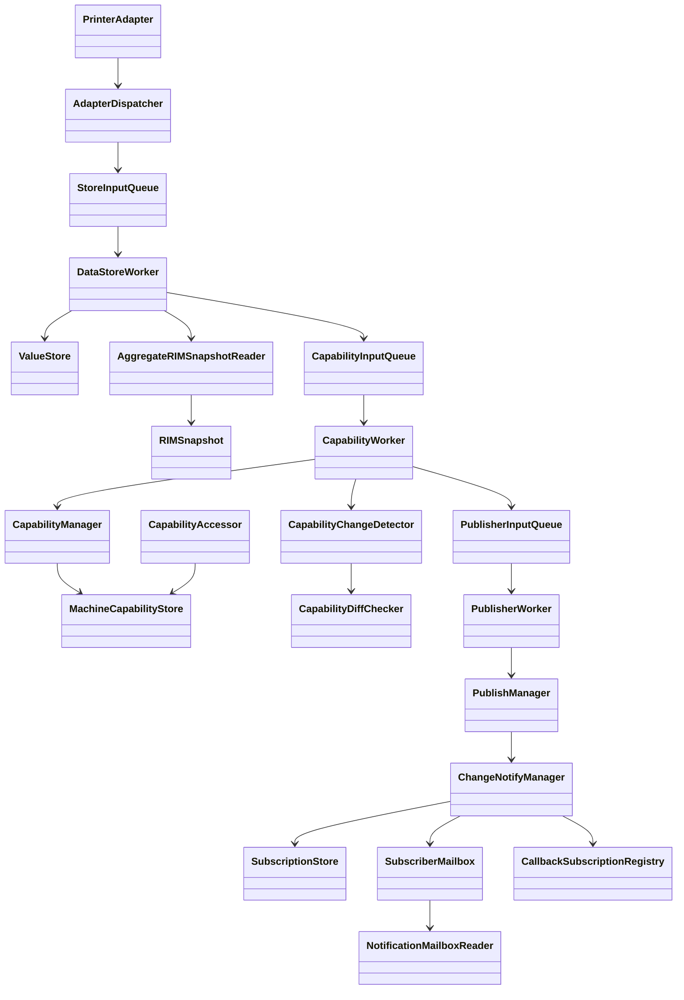

---

# Layer Class Diagram

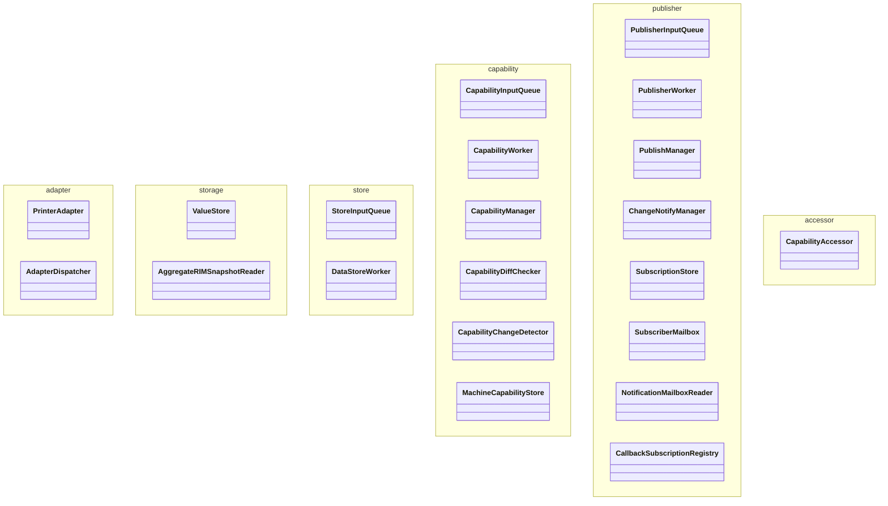

---

# Data Flow

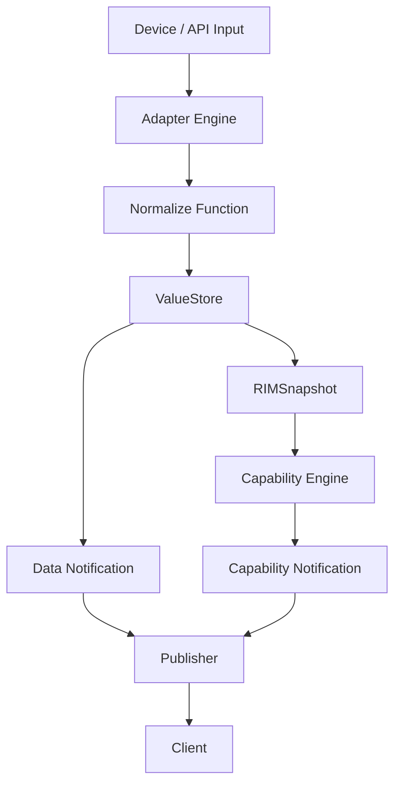

---

# Snapshot Flow

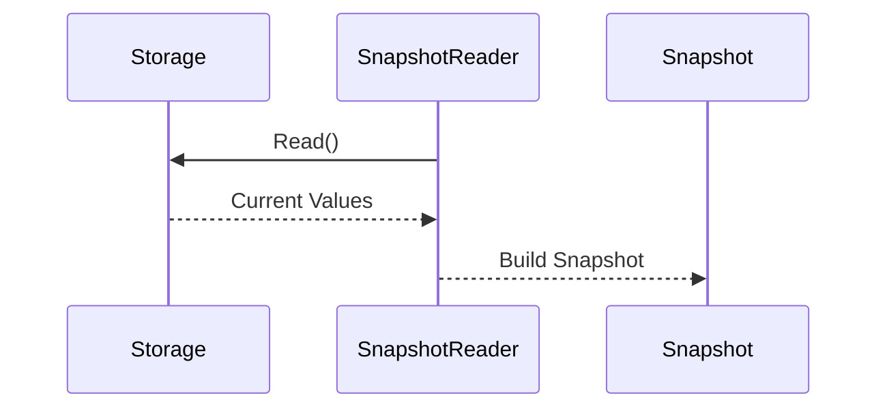

---

# Capability Flow

現在の実装は Snapshot 全体を入力として Capability を再生成する。

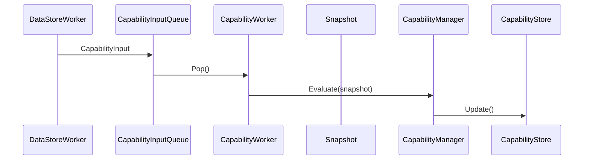

---

# CapabilityInput

Capability 再評価要求。

```cpp
struct CapabilityInput
{
    RIMSnapshot snapshot;

    RIMDataId changedDataId;
};
```

現在の用途:

```text
snapshot
    → Capability再評価

changedDataId
    → Data Notification生成
```

将来構想:

```text
changedDataId
    ↓
Affected Capability Lookup
    ↓
Partial Capability Evaluation
```

---

# Notification

RIManager は Data Notification と Capability Notification の両方を提供する。

---

## Data Notification

Canonical Data の変更通知。

```cpp
NotificationTargetType::Data
```

---

## Capability Notification

Capability 状態変更通知。

```cpp
NotificationTargetType::Capability
```

---

# Capability

Capability は製品機能を定義する。

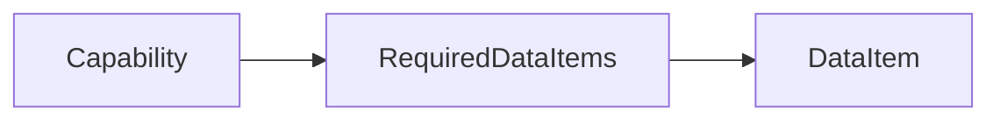

例:

```cpp
requiredDataItems =
{
    "UpperDoorOpen",
    "StapleLevel"
};
```

---

# Pipeline

Pipeline は Capability の集合。


例:

```text
OperationalPipeline
 ├ PrintReady
 ├ Consumable
 └ Job
```

---

# Current Capability Evaluation Strategy

現在:

```text
Data Changed
    ↓
Snapshot Build
    ↓
Evaluate All Capabilities
    ↓
Detect Changes
    ↓
Notify
```

利点:

```text
単純

正しさを保証しやすい

依存関係の管理が不要
```

欠点:

```text
影響のないCapabilityも再評価

Capability数増加時に効率低下

Dependency情報を活用していない
```

---

# Future Architecture

将来的には ProductDefinition に依存情報を追加し、

```text
ChangedDataId
    ↓
Affected Capability Lookup
    ↓
Evaluate Affected Capabilities
    ↓
Notify
```

へ移行する。

例:

```text
UpperDoorOpen
    ↓
Environment
PrintReady
```

---

# Placement Rules

## Rule 1

```text
PrinterA を知っているか？
```

YES

```text
products
```

NO

```text
core
```

---

## Rule 2

```text
DataItem を定義しているか？
```

YES

```text
products
```

NO

```text
core
```

---

## Rule 3

```text
これは定義か？
これは実行か？
```

定義

```text
products
```

実行

```text
core
```

---

# Target Architecture

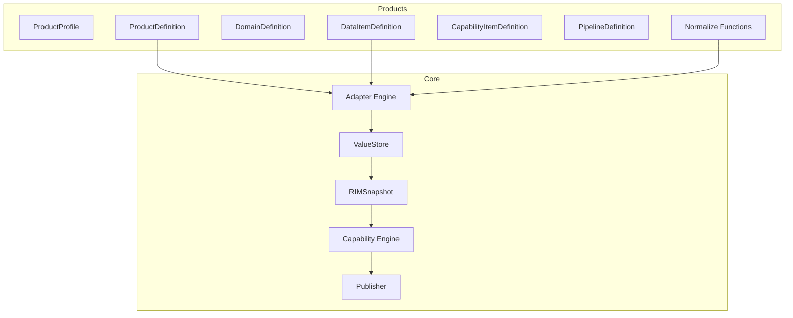

---

# Current Status

```text
✅ Core / Products 分離
✅ Public API 整理
✅ ProductProfile 導入
✅ ProductProvider 導入
✅ ProductDefinition 導入
✅ DomainDefinition 導入
✅ DataItemDefinition 導入
✅ CapabilityDefinition 導入
✅ PipelineDefinition 導入
✅ Snapshot中心設計
✅ Runtime Identifier 統一 (RIMDataId)
✅ Adapter 正規化設計
✅ ProductDefinition Lookup API
✅ Storage 型検証
✅ Rule レイヤ削除
✅ RIManager 削除
✅ NotificationMailboxReader 導入
✅ SubscriptionStore 導入
✅ DataItemDefinition を唯一のデータ定義へ統一
✅ Data Notification
✅ Capability Notification
✅ GetCapability API
✅ Subscribe API
✅ Callback Notification
✅ Mailbox Notification
✅ Functional Tests Green
✅ End-to-End Tests Green
✅ 177 Tests Passed

⬜ Capability Dependency Metadata
⬜ ChangedDataId → Capability Reverse Lookup
⬜ Partial Capability Evaluation
⬜ Dependency Driven Capability Generation
```

# Summary

```text
core
    = How

products
    = What

products/common
    = Shared Rules

ProductDefinition
    = Product Specification

DataItemDefinition
    = Canonical Data Model

RIMDataId
    = Runtime Identifier

CapabilityInput
    = Snapshot + ChangedDataId

Notification
    = Data + Capability
```