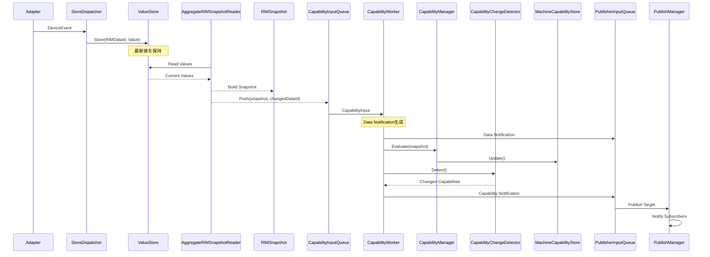
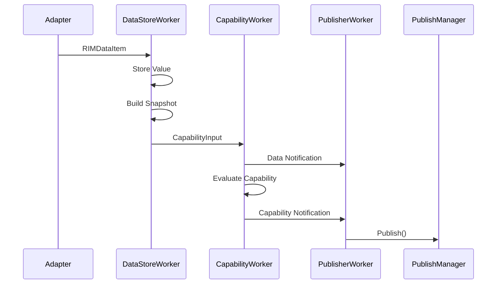
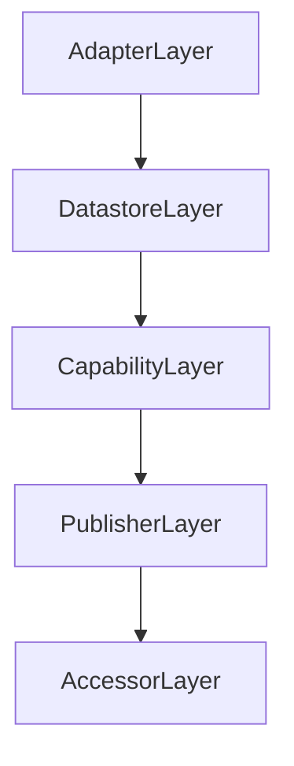
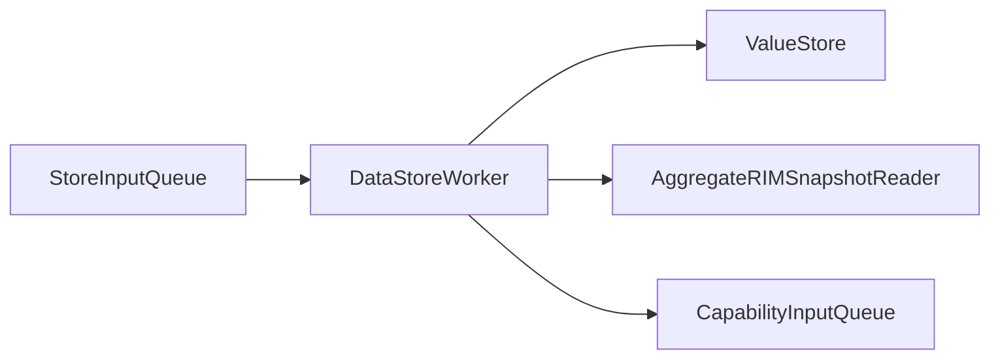
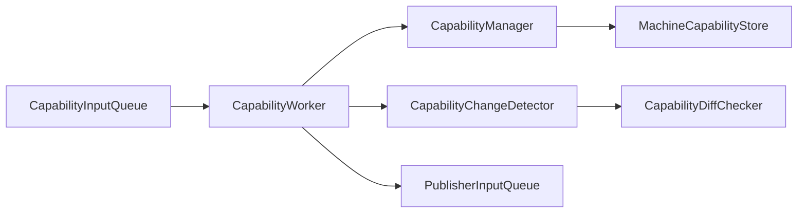
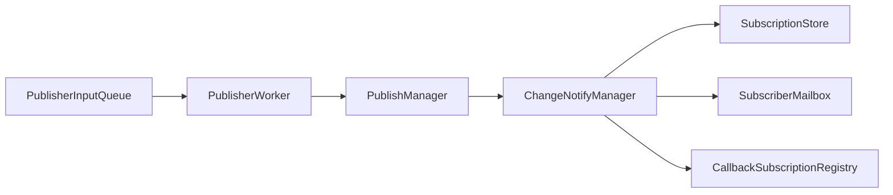
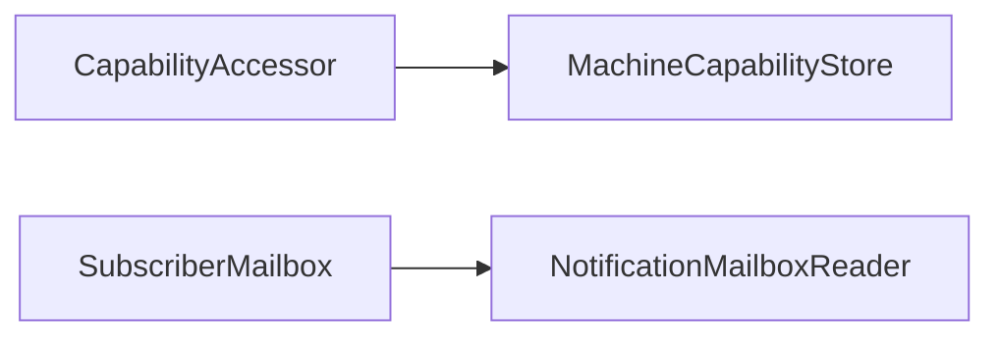
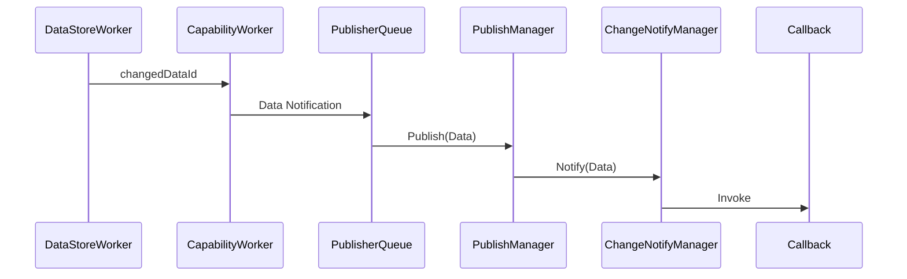
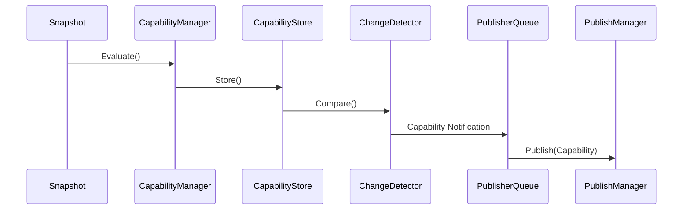

# RIManager Main Sequence



---

# Runtime Processing Sequence



---

# RIManager Module

## アーキテクチャ概要

```mermaid
flowchart LR

    Adapter

    StoreInputQueue

    DataStoreWorker

    ValueStore

    AggregateRIMSnapshotReader

    CapabilityInputQueue

    CapabilityWorker

    CapabilityManager

    CapabilityChangeDetector

    CapabilityDiffChecker

    MachineCapabilityStore

    PublisherInputQueue

    PublisherWorker

    PublishManager

    ChangeNotifyManager

    SubscriberMailbox

    NotificationMailboxReader

    CallbackSubscriptionRegistry

    SubscriptionStore

    Adapter
        --> StoreInputQueue

    StoreInputQueue
        --> DataStoreWorker

    DataStoreWorker
        --> ValueStore

    DataStoreWorker
        --> AggregateRIMSnapshotReader

    DataStoreWorker
        --> CapabilityInputQueue

    CapabilityInputQueue
        --> CapabilityWorker

    CapabilityWorker
        --> CapabilityManager

    CapabilityManager
        --> MachineCapabilityStore

    CapabilityWorker
        --> CapabilityChangeDetector

    CapabilityChangeDetector
        --> CapabilityDiffChecker

    CapabilityWorker
        --> PublisherInputQueue

    PublisherInputQueue
        --> PublisherWorker

    PublisherWorker
        --> PublishManager

    PublishManager
        --> ChangeNotifyManager

    ChangeNotifyManager
        --> SubscriptionStore

    ChangeNotifyManager
        --> SubscriberMailbox

    ChangeNotifyManager
        --> CallbackSubscriptionRegistry

    SubscriberMailbox
        --> NotificationMailboxReader
```



---

# Layer Structure



---

# Datastore Layer

## 責務

```text
Data保持

Snapshot生成

Capability再評価要求生成

変更DataId通知
```

## 構成



---

# Capability Layer

## 責務

```text
Snapshot評価

Capability生成

Capability差分検出

Data Notification生成

Capability Notification生成
```

## CapabilityInput

```cpp
struct CapabilityInput
{
    RIMSnapshot snapshot;

    RIMDataId changedDataId;
};
```

### 現在の利用

```text
snapshot
    → Capability再評価

changedDataId
    → Data Notification生成
```

### 将来構想

```text
changedDataId
    ↓
影響Capability特定
    ↓
部分再評価
```

## 構成



---

# Publisher Layer

## 責務

```text
Notification配送

Subscription管理

Mailbox通知

Callback通知
```

## 構成



---

# Accessor Layer

## 責務

```text
Capability取得

Notification取得
```

## 構成



---

# Data Notification Flow



---

# Capability Notification Flow



---

# Notification Model

RIManager は 2 種類の通知を提供する。

## Data Notification

```cpp
NotificationTargetType::Data
```

対象:

```text
TemperatureSensorA

TemperatureSensorB

HumiditySensor

UpperDoorOpen

RightDoorOpen

LeftDoorOpen

JobId

JobActive

StapleLevel

ErrorList
```

---

## Capability Notification

```cpp
NotificationTargetType::Capability
```

対象:

```text
Environment

PrintReady

Consumable

Job
```

---

# Current Capability Evaluation Strategy

現在の実装:

```text
Data Changed
    ↓
Build Snapshot
    ↓
Evaluate All Capabilities
    ↓
Detect Changes
    ↓
Notify
```

### 利点

```text
単純

実装しやすい

正しさを保証しやすい
```

### 欠点

```text
影響のない Capability も再評価

Capability数増加時に効率低下

依存情報を利用していない
```

---

# Future Direction

ProductDefinition に Capability依存情報を持たせる。

```text
ChangedDataId
    ↓
AffectedCapabilities
    ↓
Evaluate Only Affected Capabilities
    ↓
Notify
```

例:

```text
UpperDoorOpen
    ↓
Environment

PrintReady
```

将来的には Data変更起点の部分再評価へ移行する。

---

# Module Responsibilities

## ValueStore

```text
DataId → Value保持
```

---

## AggregateRIMSnapshotReader

```text
ValueStore → Snapshot生成
```

---

## DataStoreWorker

```text
Store

Snapshot生成

CapabilityInput生成
```

---

## CapabilityManager

```text
Snapshot → Capability生成
```

---

## MachineCapabilityStore

```text
Capability保持
```

---

## CapabilityDiffChecker

```text
Capability比較
```

---

## CapabilityChangeDetector

```text
Capability差分検出
```

---

## CapabilityWorker

```text
Data Notification生成

Capability評価

Capability Notification生成
```

---

## PublisherWorker

```text
PublisherInput解釈
```

---

## PublishManager

```text
通知実行
```

---

## ChangeNotifyManager

```text
購読者検索

Mailbox通知

Callback通知
```

---

## SubscriptionStore

```text
購読条件保持

通知先検索
```

---

## SubscriberMailbox

```text
Pull型通知キュー
```

---

## CallbackSubscriptionRegistry

```text
Push型通知購読管理
```

---

# Current Responsibility Separation

```text
Datastore
    = Data保持

DataStoreWorker
    = Snapshot生成

CapabilityManager
    = Capability生成

CapabilityChangeDetector
    = 差分検出

CapabilityWorker
    = Notification生成

PublisherWorker
    = Publish指示解釈

PublishManager
    = 通知実行

ChangeNotifyManager
    = 配信制御
```

---

# Current Status

```text
✅ Data Notification
✅ Capability Notification
✅ NotificationTargetType導入
✅ SubscriptionStore導入
✅ Callback Subscription
✅ Mailbox Subscription
✅ ChangedDataId伝搬
✅ CapabilityInput導入
✅ Snapshot中心設計
✅ Core / Products 分離
✅ Functional Tests Green
✅ End-to-End Tests Green
✅ 177 Tests Passed

⬜ Capability Dependency Metadata
⬜ ChangedDataId → Capability Reverse Lookup
⬜ Partial Capability Evaluation
⬜ Dependency Driven Capability Generation
```