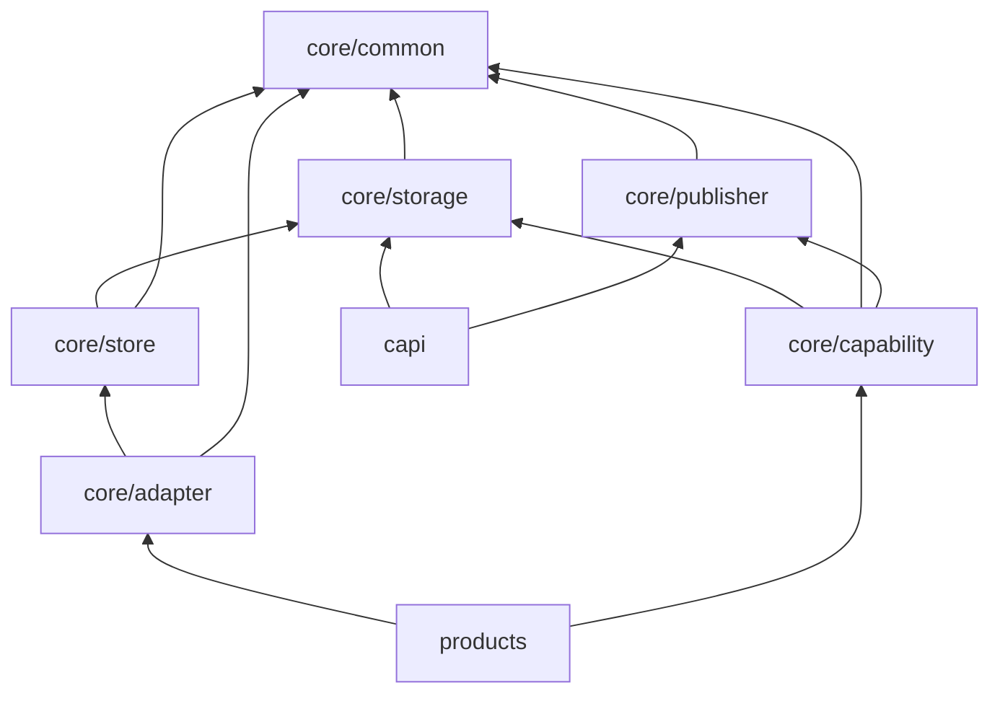
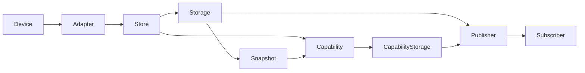
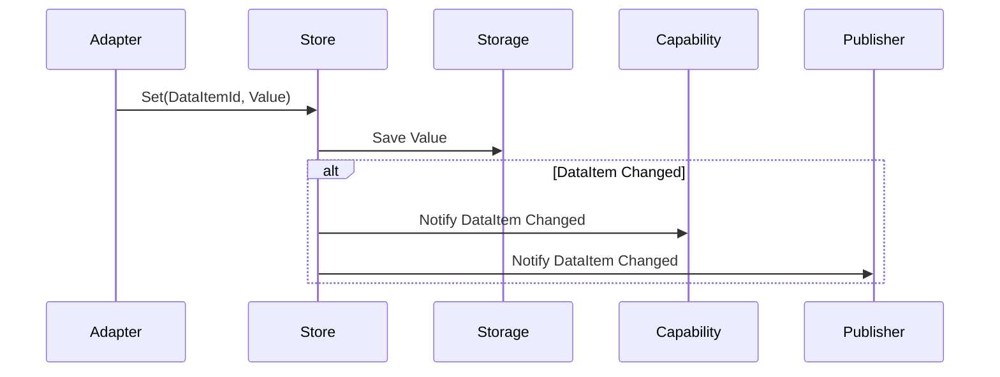
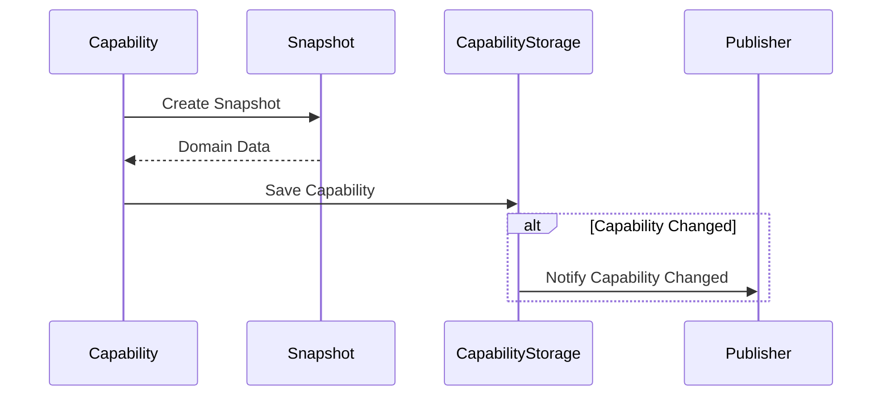
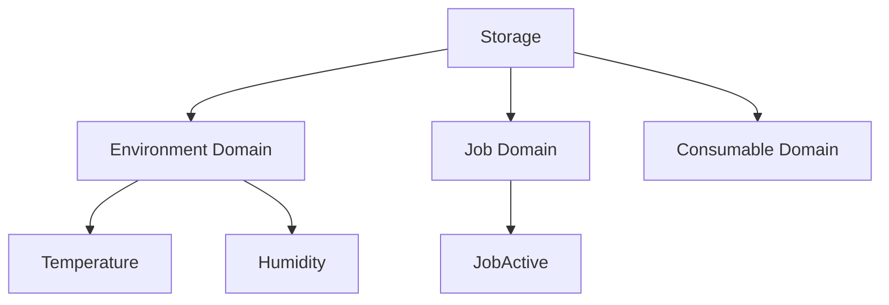
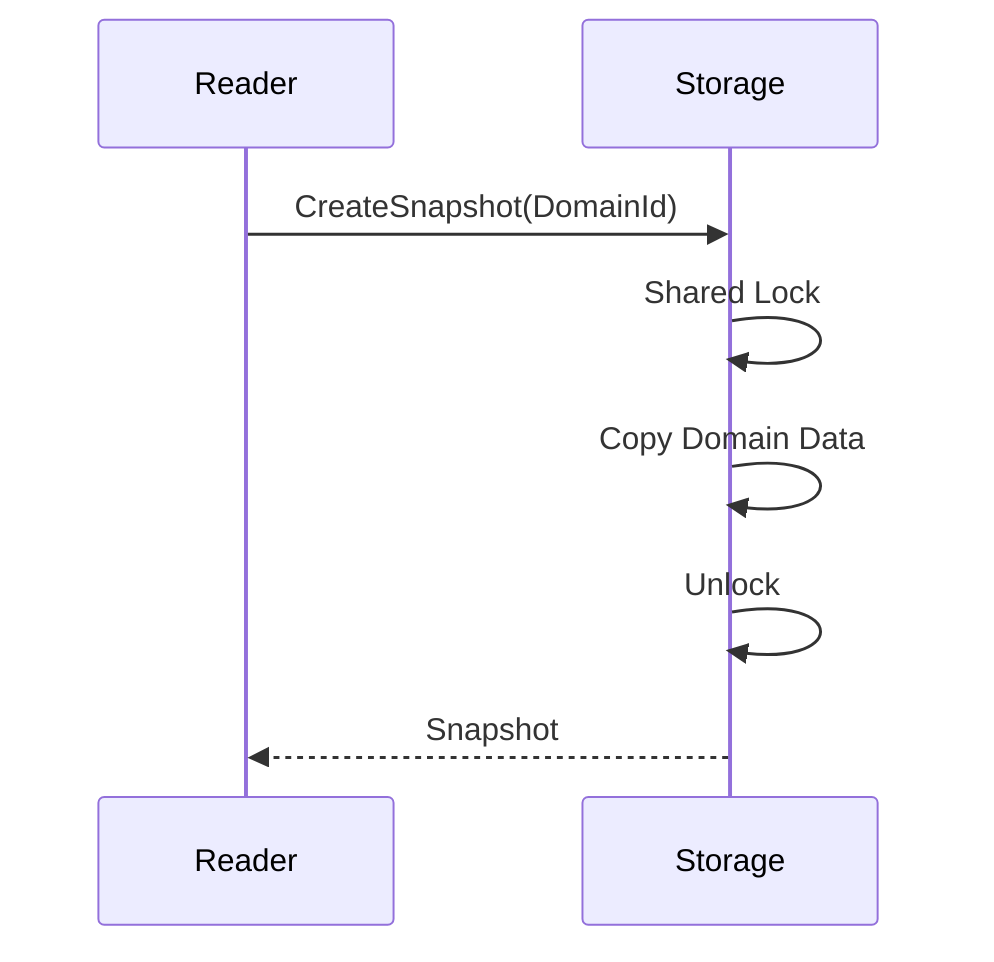
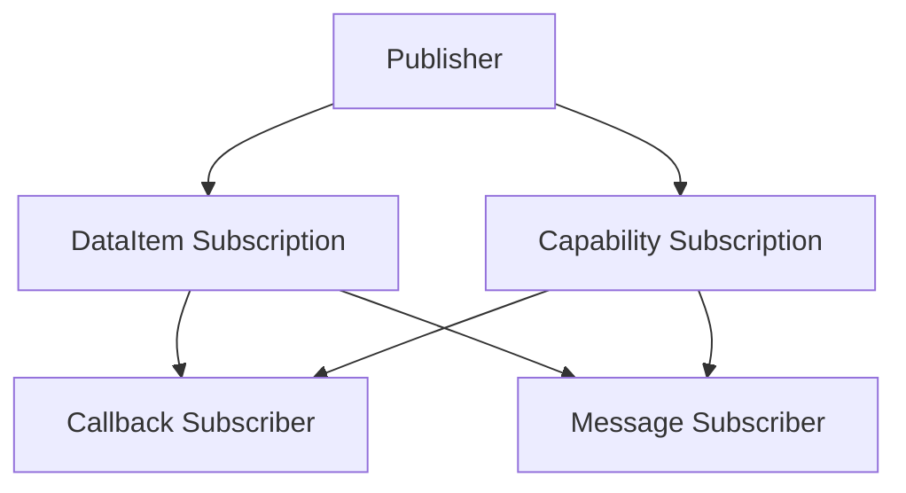
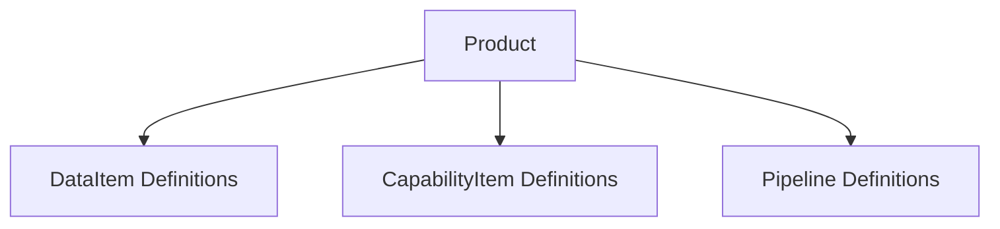
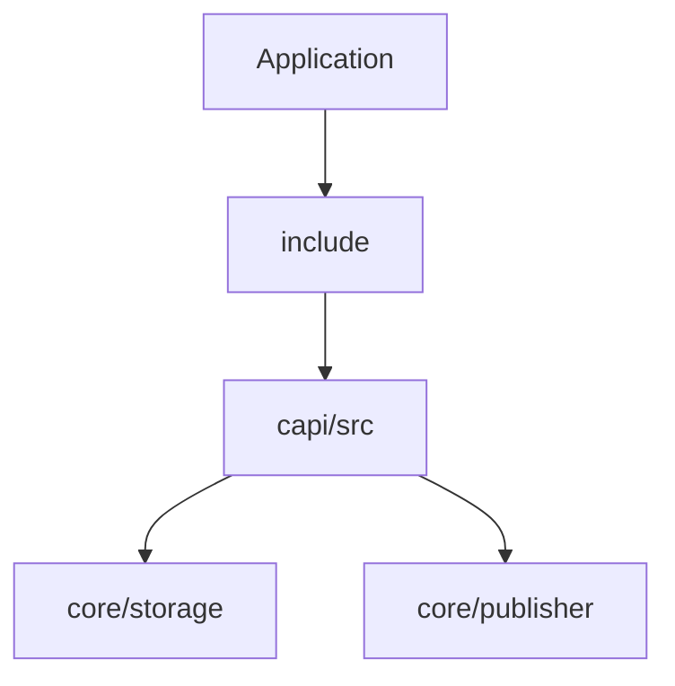
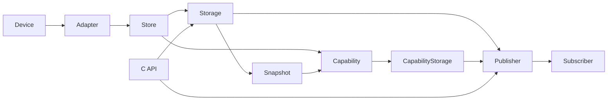

# RIManager vNext

## Dependencies



---

## Runtime Pipeline



---

## Store Processing



---

## Capability Processing



---

## Storage Structure



---

## Snapshot Structure



---

## Subscription Structure



---

## Product Structure



---

## C API Structure



---

## Overall Architecture



---

## Dependency Rules

```text
Allowed

products -> core
capi     -> core
test     -> core
test     -> products


Forbidden

core     -> products
core     -> capi
products -> capi
```

---

## Design Principles

```text
Core
  - ロジックのみ
  - 製品知識を持たない

Product
  - DataItem定義
  - CapabilityItem定義
  - Pipeline定義

Storage
  - 実データ保持
  - Domain管理
  - Snapshot生成

Store
  - DataItem変更管理

Capability
  - Capability生成
  - Capability差分管理

Publisher
  - DataItem通知
  - Capability通知

Subscriber
  - DataItemId購読
  - CapabilityId購読

CAPI
  - 公開APIのみ

Error
  - 特別扱いしない
  - Product定義の一種
```