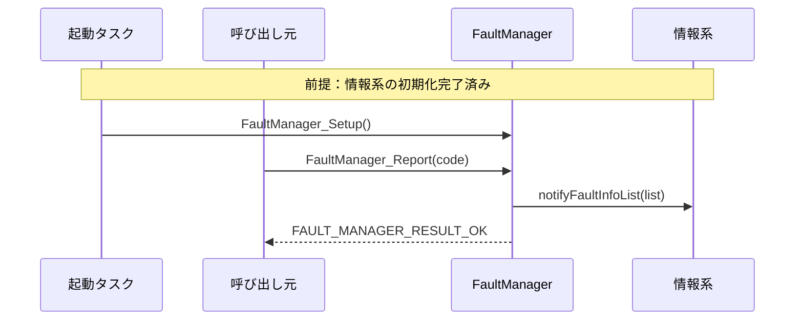
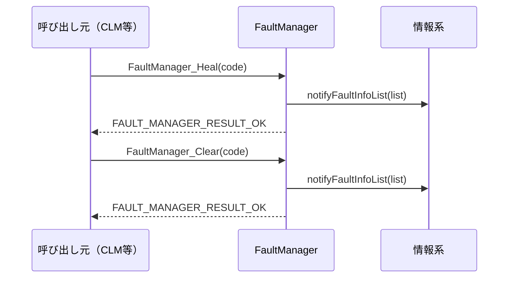

## CONFIDENTIAL
---

| ドキュメント名 | 異常管理部（FM）設計書 |
|---|---|
| バージョン | - |
| 対応要件 | FM_要件定義.md |

---

## 更新履歴

| バージョン | 更新日 | 更新者 | 内容 |
|---|---|---|---|
| 0.01 | 2026/07/16 | - | 新規作成 |

---

## 目次

9. 機能概要
   - 9.1 システム構造における位置づけ
   - 9.2 内部処理モデル
   - 9.3 責務
   - 9.4 非責務
10. IF仕様
11. コンフィグレーション仕様
12. 呼び出しシーケンス
13. 組み込み手順
    - 13.1 ファイル構造
    - 13.2 接続手順
    - 13.3 呼び出し側の責務

---

## 9. 機能概要

### 9.1 システム構造における位置づけ

周辺との関係については、構成図_高橋.drawio を参照。

### 9.2 内部処理モデル

本モジュールは要求駆動モデルとする。処理の流れについては、構成図_高橋.drawio を参照。
公開APIは内部mutexで排他制御される。

### 9.3 責務

- 異常コードの状態遷移管理（NONE → ACTIVE → HEALED → NONE）
- 状態遷移のたびに情報系へ異常情報リストを通知
- 根本原因フィルタ・重複チェック・異常情報数の上限制御

### 9.4 非責務

- 機能禁止の判断（FLMの責務）
- クリア条件の判断（CLMの責務）
- UI表示・機械停止

---

## 10. IF仕様

### 定数

| 定数名 | 値 | 定義場所 | 説明 |
|---|---|---|---|
| `FAULT_INFO_LIST_MAX` | 20 | `FaultManager_FrameSetting.h` | 異常情報リストの最大件数 |
| `FAULT_DERIVED_MAX` | 5 | `FaultManager_Config.h` | 1つの根本原因コードに対する派生コードの最大件数 |

### 公開型（FaultManager.h）

異常コードの状態（ACTIVE / HEALED の2値）
```c
typedef enum {
    FAULT_STATE_ACTIVE = 0, // 発生中
    FAULT_STATE_HEALED      // ヒーリング済み・未クリア
} FaultState;
```

異常コードと状態を対にした1エントリ
```c
typedef struct {
    FaultCode  code;  // 異常コード
    FaultState state; // 状態
} FaultInfo;
```

異常情報リスト（内部保持・情報系への通知引数）
```c
typedef struct {
    FaultInfo entries[FAULT_INFO_LIST_MAX]; // エントリ配列
    uint8_t   count;                        // 有効件数
} FaultInfoList;
```

API戻り値型
```c
typedef enum {
    FAULT_MANAGER_RESULT_OK            = 0, // 正常完了（フィルタ抑制・重複・no-opを含む）
    FAULT_MANAGER_RESULT_INVALID_PARAM      // 引数不正（NULLなど）
} FaultManager_Result;
```

### CFG型（FaultManager_Config.h）

自動クリアテーブル、即HEALED遷移テーブル共通の型
```c
typedef struct {
    FaultCode *codes; /**< 対象コード配列 */
    uint32_t count;   /**< 有効件数 */
} FaultCodeList;
```

根本原因フィルタルール（1件）
```c
typedef struct {
    FaultCode rootCode;                          // 根本原因コード
    FaultCode derivedCodes[FAULT_DERIVED_MAX];   // 派生コード配列
    uint8_t   derivedCount;                      // 有効件数
} FaultFilterRule;
```

根本原因フィルタテーブル
```c
typedef struct {
    FaultFilterRule rules[FAULT_INFO_LIST_MAX]; // ルール配列
    uint8_t         count;                      // 有効件数
} FaultFilterRuleList;
```

異常情報リスト更新通知コールバック（必須）
```c
typedef void (*FaultManager_NotifyFaultInfoListFunc)(const FaultInfoList* list);
```

上限超過時ハンドラ（任意）
```c
typedef bool (*FaultManager_HandleOverFlowFunc)(
    FaultCode code,                     // 発生異常コード
    const FaultInfoList* currentList,   // 現在の異常情報リスト
    FaultCode* outRemovalCode           // リストから削除する異常コード
);
```

フレームに注入するコンフィグレーション構造体
```c
typedef struct {
    FaultManager_NotifyFaultInfoListFunc notifyFaultInfoList; // 必須
    FaultManager_HandleOverFlowFunc      handleOverflow;      // 任意・NULLで黙示無視
    FaultCodeList                        autoClearTable;      // 自動クリアテーブル
    FaultFilterRuleList                  rootCauseFilterTable; // 根本原因フィルタテーブル
    FaultCodeList                        autoHealTable;       // 即HEALED遷移テーブル
} FaultManager_Config;
```

### 外部公開関数

#### FaultManager_Setup

| 項目 | 内容 |
|---|---|
| 構文 | `void FaultManager_Setup(void);` |
| 同期性 | 同期 |
| 再入性 | Non-reentrant |
| 入力パラメータ | なし |
| 出力パラメータ | なし |
| 戻り値 | なし |
| 機能説明 | 製品固有コンフィグで FaultManager を初期化する。製品コードからの初期化はこちらを使うこと。 |
| 注意事項 | ・起動シーケンス上の単一コンテキストから呼ぶこと。<br>・情報系の初期化完了後に呼ぶこと。 |

---

#### FaultManager_Initialize

| 項目 | 内容 |
|---|---|
| 構文 | `FaultManager_Result FaultManager_Initialize(const FaultManager_Config* config);` |
| 同期性 | 同期 |
| 再入性 | Non-reentrant |
| 入力パラメータ | config: `const FaultManager_Config*`　製品が用意したコンフィグへのポインタ（NULL不可） |
| 出力パラメータ | なし |
| 戻り値 | `FAULT_MANAGER_RESULT_OK`：初期化成功<br>`FAULT_MANAGER_RESULT_INVALID_PARAM`：config または notifyFaultInfoList が NULL |
| 機能説明 | 任意のコンフィグで FaultManager を初期化する。製品コードは `FaultManager_Setup()` を使うこと。直接呼び出しはテストコード専用。 |
| 注意事項 | ・CFGの有効期間は呼び出し元が保証すること。 |

---

#### FaultManager_Report

| 項目 | 内容 |
|---|---|
| 構文 | `FaultManager_Result FaultManager_Report(FaultCode code);` |
| 同期性 | 同期 |
| 再入性 | Reentrant（内部mutex制御） |
| 入力パラメータ | code: `FaultCode`　レポートする異常コード |
| 出力パラメータ | なし |
| 戻り値 | `FAULT_MANAGER_RESULT_OK`：正常完了（フィルタ抑制・重複・上限超過を含む）<br>`FAULT_MANAGER_RESULT_INVALID_PARAM`：未初期化状態での呼び出し |
| 機能説明 | 指定した異常コードを ACTIVE としてリストに登録し、情報系へ通知する。根本原因フィルタ・重複・上限超過は黙示無視して OK を返す。 |
| 注意事項 | ・コールバック内から本APIを呼んではならない。 |

---

#### FaultManager_Heal

| 項目 | 内容 |
|---|---|
| 構文 | `FaultManager_Result FaultManager_Heal(FaultCode code);` |
| 同期性 | 同期 |
| 再入性 | Reentrant（内部mutex制御） |
| 入力パラメータ | code: `FaultCode`　ヒーリングする異常コード |
| 出力パラメータ | なし |
| 戻り値 | `FAULT_MANAGER_RESULT_OK`：正常完了（コード不在のno-opを含む）<br>`FAULT_MANAGER_RESULT_INVALID_PARAM`：未初期化状態での呼び出し |
| 機能説明 | 指定コードを HEALED に更新する。自動クリアテーブルに登録されている場合はリストから削除する。いずれの場合も情報系へ通知する。 |
| 注意事項 | ・コールバック内から本APIを呼んではならない。 |

---

#### FaultManager_Clear

| 項目 | 内容 |
|---|---|
| 構文 | `FaultManager_Result FaultManager_Clear(FaultCode code);` |
| 同期性 | 同期 |
| 再入性 | Reentrant（内部mutex制御） |
| 入力パラメータ | code: `FaultCode`　クリアする異常コード |
| 出力パラメータ | なし |
| 戻り値 | `FAULT_MANAGER_RESULT_OK`：正常完了（no-opを含む）<br>`FAULT_MANAGER_RESULT_INVALID_PARAM`：未初期化状態での呼び出し |
| 機能説明 | 指定コードをリストから削除し、情報系へ通知する。コード不在の場合はno-op。 |
| 注意事項 | ・コールバック内から本APIを呼んではならない。 |

---

## 11. コンフィグレーション仕様

`FaultManager_Config` を `static const` として `src/FaultManager_Config.c` に定義し、`FaultManager_Initialize` に渡す。

### フィールド一覧
下表の"任意"項目が NULL の場合は no-op とする。
| フィールド | 必須/任意 | 機能内容 |
|---|---|---|
| `notifyFaultInfoList` | 必須 | Report/Heal/Clear による異常情報リスト変更時の通知コールバック |
| `handleOverflow` | 任意 | Report時に異常情報リストが上限到達した場合の削除対象決定 |
| `autoClearTable` | 任意 | 登録するとHeal時に異常コードを自動削除 |
| `rootCauseFilterTable` | 任意 | 根本原因の異常コードを登録すると派生異常を無視 |
| `autoHealTable` | 任意 | 登録するとReport時に異常コードを自動Heal |

### 記述例

```c
static void OnFaultListChanged(const FaultInfoList* list) { /* 情報系に通知 */ }

static const FaultManager_Config s_config = {
    .notifyFaultInfoList  = OnFaultListChanged,
    .handleOverflow       = NULL,
    .autoClearTable       = { .count = 0U },
    .rootCauseFilterTable = { .count = 0U },
    .autoHealTable        = { .count = 0U },
};

void FaultManager_Setup(void) { FaultManager_Initialize(&s_config); }
```

---

## 12. 呼び出しシーケンス

### 起動から異常報告まで



### ヒーリングとクリア



---

## 13. 組み込み手順

### 13.1 ファイル構造

```
FaultManager/
├── include/                    ← 外部公開のAPI
│   ├── FaultManager.h              # 公開ヘッダ（ランタイムAPI）、FaultCode.h をインクルード
│   └── FaultManager_Setup.h        # 初期化API
├── frame/                      ← 変更禁止（フレームワーク本体）
│   ├── FaultManager.c
│   ├── FaultManager_Config.h       # CFG型定義（フレームワークが製品に求めるテーブル、関数ポインタ）
│   ├── FaultManager_Internal.h     # 内部定義
│   ├── FaultInfoStore.c
│   └── FaultInfoStore.h
├── src/                        ← 製品ごとに用意
│   ├── FaultCode.h                     # 製品固有の異常コード定義
│   ├── FaultManager_FrameSetting.h     # フレームワーク内部リソースの設定値
│   └── FaultManager_Config.c           # 利用者がフレームワークへ与える設定、実装（テーブル、関数ポインタ）
└── tests/
    ├── test_FaultManager.c
    └── test_FaultInfoStore.c
```

### FaultCode.h は利用者が実装

```c
typedef enum {
    /* 製品固有の異常コードをここに追記 */
    FAULT_CODE_MAX  /* 番兵値（必須） */
} FaultCode;
```

### 13.2 接続手順

1. **FaultCode.h の用意**：製品固有の異常コードを定義し `FAULT_CODE_MAX` を末尾に置く。
2. **通知コールバックの実装**：`FaultManager_NotifyFaultInfoListFunc` に準拠した関数を情報系に実装する。
3. **CFGの定義**：`src/FaultManager_Config.c` の `s_config` にコールバックを登録する。
4. **初期化の呼び出し**：起動シーケンスから `FaultManager_Setup()` を呼ぶ。情報系の初期化後に呼ぶこと。

### 13.3 呼び出し側の責務

- `notifyFaultInfoList` はノンブロッキングで実装すること。
- コールバック内から `FaultManager` のAPIを呼んではならない。
- `list` が指す内容はコールバック呼出中のみ有効。保持が必要な場合はコピーすること。
- `FaultManager_Setup()` 前に他のAPIを呼んではならない。
- 全APIはスレッドセーフ（内部mutex制御済み）。呼び出し元は排他を意識しなくてよい。