# RIManager-Implementation

ReactiveInfoManager (RIManager) の実装リポジトリです。

本リポジトリは以下の方針で構成されています。

- core = 製品非依存の共通ロジック
- products = 製品固有の定義・構成
- Runtime は RIMDataId を共通識別子として利用
- Product は名前ベースの定義モデルとして表現
- Snapshot を入力に Capability を生成
- Product 固有情報は ProductProvider に集約

---

# Architecture Overview

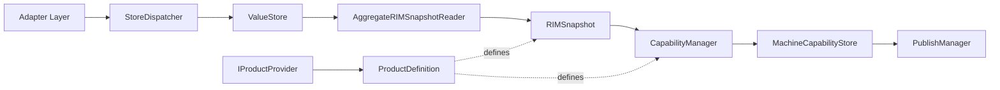

---

# Repository Structure

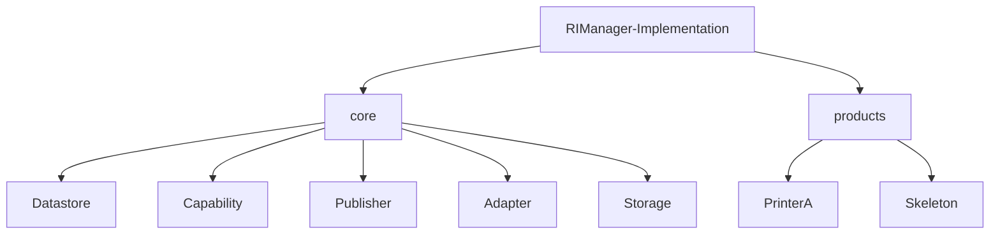

---

# Runtime Architecture

RIM内部は一意識別子として `RIMDataId` を利用する。

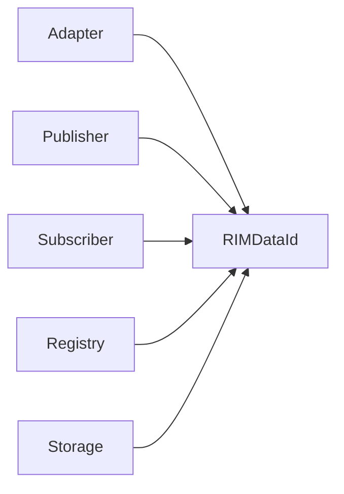

例:

```cpp
SetValue(RIMDataId id, Value value);

Publish(RIMDataId id, Value value);

Subscribe(RIMDataId id);
```

---

# Core Responsibility

core 配下には製品知識を持たない共通ロジックのみを配置します。

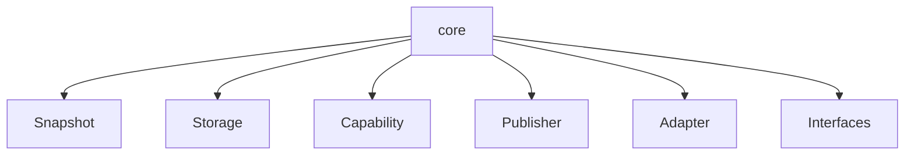

例:

```text
IDataDefinitionProvider
IProductProvider

Storage

RIMSnapshot
AggregateRIMSnapshotReader

CapabilityManager
MachineCapabilityStore

PublishManager

ProfileAwareDataDefinitionRegistry
```

---

# Product Responsibility

products 配下には製品固有情報のみを配置します。

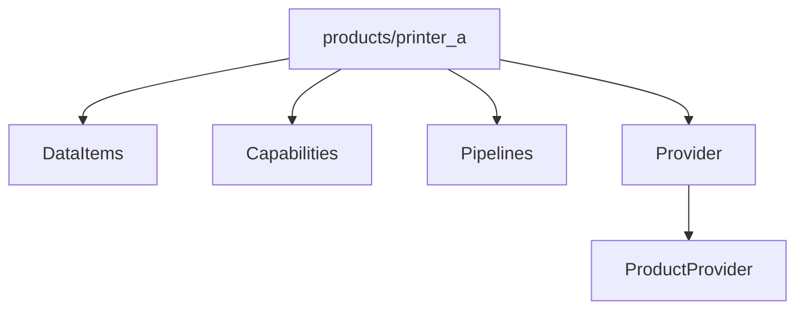

---

# Product Definition Model

Product は以下の定義で構成される。

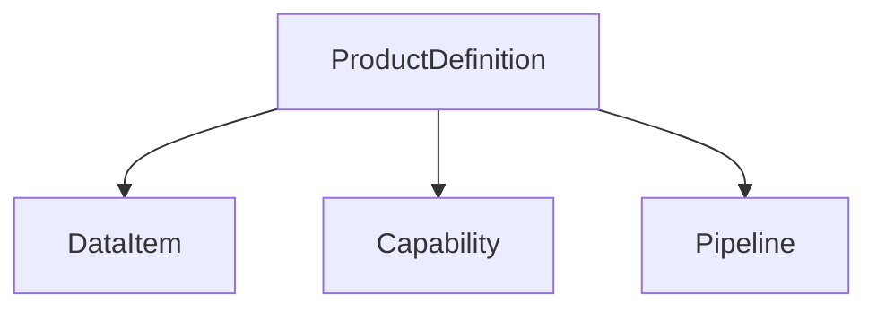

---

# DataItem

製品が管理する情報を定義する。

```cpp
struct DataItemDefinition
{
    std::string_view name;
    std::string_view domain;
    ValueType valueType;
};
```

例:

```text
TemperatureSensorA
HumiditySensor
UpperDoorOpen
TonerLevel
JobActive
```

---

# Capability

製品機能を定義する。

Capability は必要な DataItem を宣言する。


例:

```cpp
requiredDataItems =
{
    "UpperDoorOpen",
    "TonerLevel"
};
```

---

# Pipeline

Capability の組み合わせを定義する。


例:

```text
OperationalPipeline
 ├ PrintReady
 ├ ScanEnabled
 └ CopyEnabled
```

---

# Product Provider

製品構成の入口。

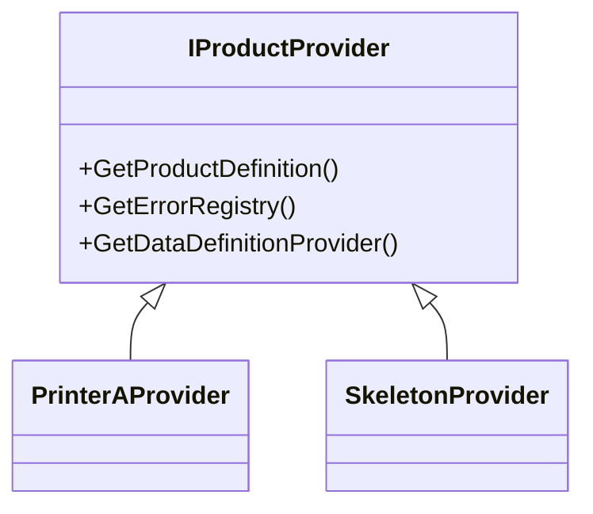

---

# Data Definition Layer

Runtime が利用する定義情報。

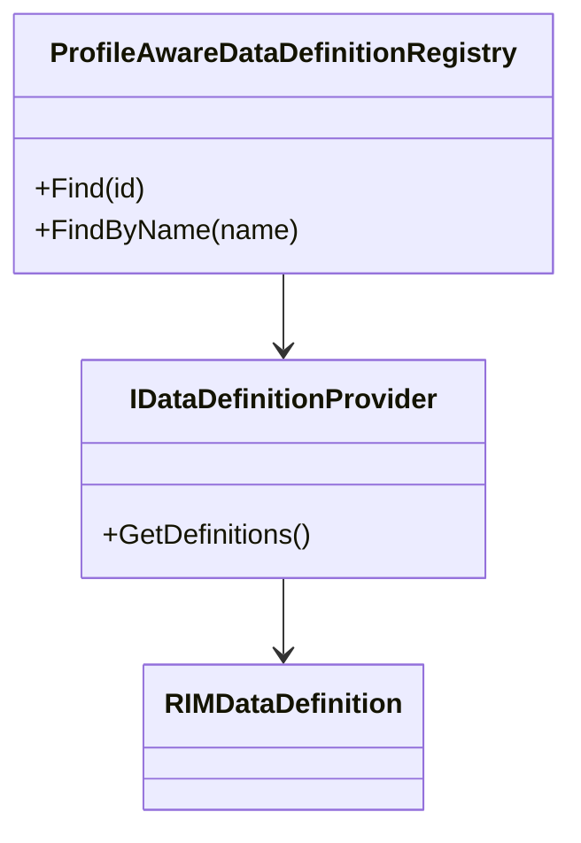

---

# RIMDataDefinition

```cpp
struct RIMDataDefinition
{
    RIMDataId id;
    DataDomain domain;
    ValueType valueType;
    const char* name;
};
```

Runtime が利用するメタ情報。

---

# Definition Lookup

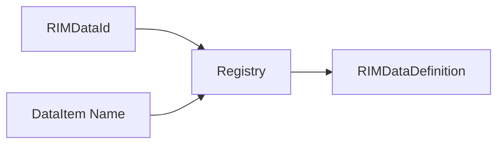

現在は以下の検索が可能。

```cpp
Find(RIMDataId id);

FindByName(std::string_view name);
```

---

# Data Flow

Adapter から Storage へ値を流し込む。

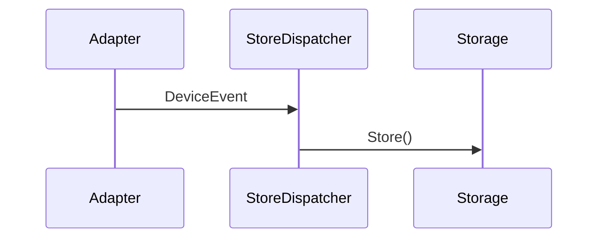

---

# Snapshot Flow

Storage から Snapshot を構築する。

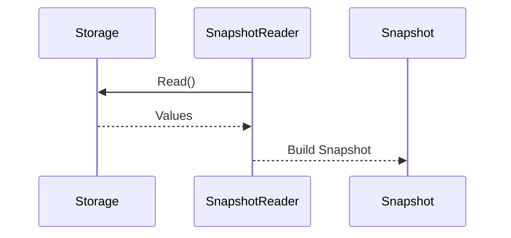

---

# Capability Flow

Snapshot を入力として Capability を生成する。

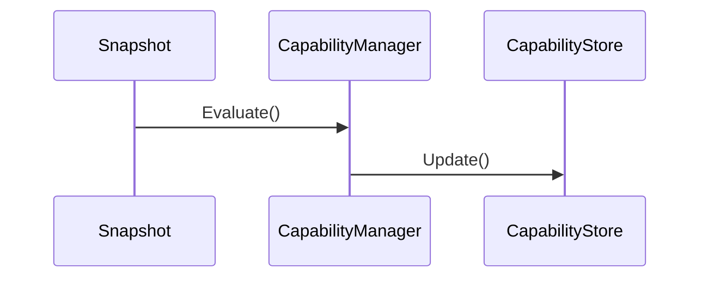

---

# Current Product Structure

```text
products/
├── printer_a
│   ├── DataItem
│   ├── Capability
│   ├── Pipeline
│   ├── PrinterAProductDefinition.hpp
│   ├── Provider
│   │   └── PrinterAProvider.*
│   └── Factory
│
└── skeleton
```

---

# Identification Model

RIM は名前とIDを使い分ける。

## Product Definition

人間が扱う識別子。

```text
TemperatureSensorA
HumiditySensor
PrintReady
OperationalPipeline
```

用途:

```text
DataItem定義
Capability定義
Pipeline定義
```

---

## Runtime

システム内部識別子。

```cpp
RIMDataId
```

用途:

```text
Adapter
Publisher
Subscriber
Storage
Registry
```

---

# Current Design Direction

ProductDefinition は宣言的な製品定義モデルとして利用する。

```text
ProductDefinition
 ├ DataItem
 ├ Capability
 └ Pipeline
```

Runtime は引き続き `RIMDataId` を使用する。

```text
Adapter
Publisher
Subscriber
Storage
Registry
```

そのため、

```text
Product = 名前ベース

Runtime = IDベース
```

という責務分離を維持する。

---

# Current Status

```text
✅ Core / Products 分離
✅ ProductProvider 導入
✅ ProductDefinition 導入
✅ DataItemDefinition 導入
✅ CapabilityDefinition 導入
✅ PipelineDefinition 導入
✅ ProfileAwareDataDefinitionRegistry::FindByName() 追加
✅ Snapshot中心設計
✅ Capability生成パイプライン整備
✅ Runtime識別子の統一(RIMDataId)
✅ Product定義の名前ベース化
✅ 140 Tests Passed
```
