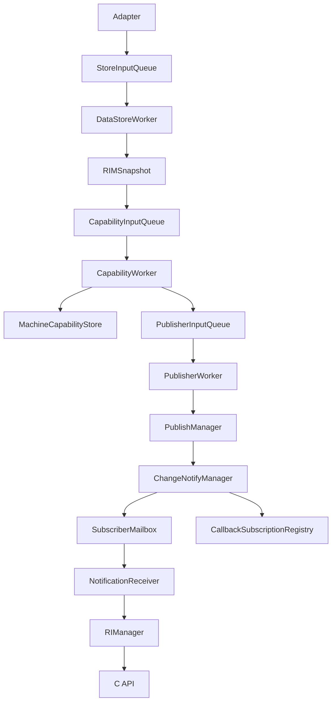
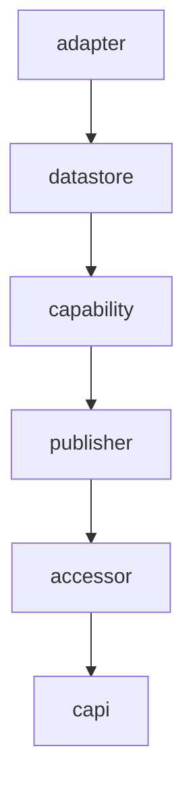
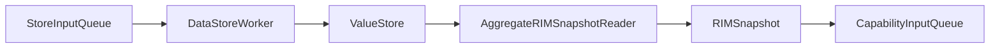
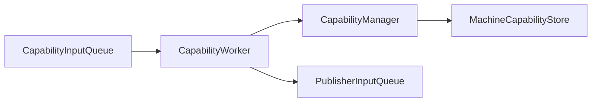
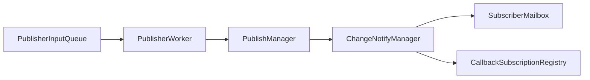
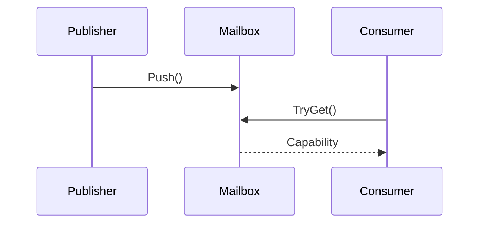
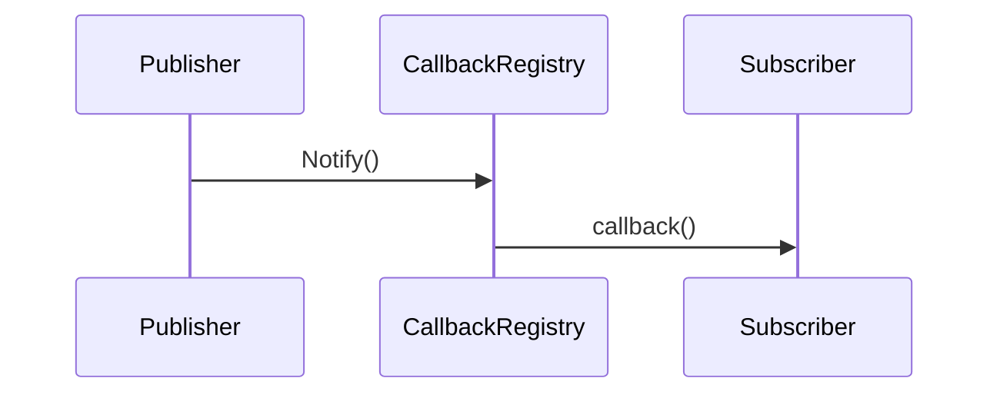
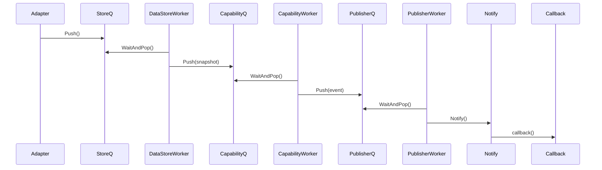

# RIManager Implementation

## 概要

RIManager (Reactive Information Manager) は、機器固有のセンサーデータを収集し、Capability として利用可能な情報へ変換・通知するライブラリです。

現在の実装は V3 アーキテクチャとして以下をサポートしています。

- Queue ベースのイベント伝搬
- Worker による非同期処理
- Mailbox 通知
- Callback 通知
- Thread 実行モデル
- Adapter → Callback の End-to-End テスト

---

# 全体アーキテクチャ



---

# レイヤ構成



---

# ディレクトリ構成

`framework`(機種共通) と `devices`(機種可変) の2軸で構成する。
各ルート配下でレイヤー接頭辞(adapter/datastore/capability/...)を維持しており、
`#include "<layer>/<file>.hpp"` は複数インクルードルート探索で解決される。

```text
RIManager-Implementation/

├── include/
│   └── rim_api.h                 … 公開C API(共通契約)
│
├── framework/                    … 機種共通(パイプライン機構・抽象IF・共通型・Capability構造体)
│   ├── inc/{adapter,adapter/rule,datastore,capability,publisher,accessor}/
│   └── src/{adapter,datastore,capability,publisher,accessor,capi}/
│
├── devices/                      … 機種可変
│   ├── _skeleton/                … 新機種テンプレート(ビルド対象外。README参照)
│   ├── printer_a/                … PrinterA 固有(具象 Adapter / Rule / Provider / RuleSet)
│   │   ├── inc/{adapter,adapter/rule,datastore,capability}/
│   │   └── src/{adapter,datastore,capability}/
│   └── registry/                 … 機種選択の配線(AdapterFactory / MachineProfileFactory / MachineProfile)
│       ├── inc/{adapter,datastore}/
│       └── src/{adapter,datastore}/
│
└── test/
    ├── unit/  integration/  e2e/  thread/
    ├── mock/  support/
```

## framework / devices の分離方針

- **framework**: 全機種で不変。Queue/Worker/Store 等のパイプライン、共通データ型、
  抽象IF(`IDataDefinitionProvider` / `ISensorAdapter` / `ISensorRule` / `ICapabilityRuleSet`)、
  Capability の**構造体型**(公開契約)。
- **devices**: 機種で変わる具象。Provider(データ/センサ定義)、具象 Adapter/Rule、
  Capability の**判定 Rule**(閾値)。機種は `devices/<machine>/` に閉じる。
- **Capability 判定の注入**: `CapabilityManager`(framework) は `ICapabilityRuleSet` を
  コンストラクタ注入で受け取り、具象 Rule には依存しない。機種側は
  `<Machine>CapabilityRuleSet`(例 `PrinterACapabilityRuleSet`) を実装して差し込む。

---

# Adapter Layer

センサーデータを内部イベントへ変換します。

## 主なクラス

```text
PrinterAdapter

AdapterDispatcher

TemperatureSensorAAdapter
TemperatureSensorBAdapter

HumiditySensorAdapter

DoorSensorAdapter
```

---

## Adapterフロー


---

# Datastore Layer

正規化データ保存と Snapshot 生成を担当します。

## 主なクラス

```text
StoreInputQueue

ValueStore

AggregateRIMSnapshotReader

DataStoreWorker

RIMSnapshot
```

---

## フロー



---

# Capability Layer

Snapshot を Capability に変換します。

## 主なクラス

```text
CapabilityInputQueue

CapabilityWorker

CapabilityManager

MachineCapabilityStore
```

---

## フロー



---

## 実装済み Capability

```text
EnvironmentCapability

ErrorCapability

PrintReadyCapability
```

---

# Publisher Layer

Capability 変更通知を担当します。

## 主なクラス

```text
PublisherInputQueue

PublisherWorker

PublishManager

CapabilityDiffChecker

ChangeNotifyManager

SubscriptionRegistry

SubscriberMailbox

CallbackSubscriptionRegistry
```

---

## フロー



---

# Accessor Layer

通知済み Capability を利用者へ公開します。

## NotificationReceiver

Mailbox 経由の通知を取得します。

```cpp
TryGetEnvironment()

TryGetError()

TryGetPrintReady()
```

---

## RIManager

ライブラリ内部の統一窓口です。

```cpp
TryGetEnvironment()

TryGetError()

TryGetPrintReady()
```

---

## フロー


---

# 通知モデル

## Mailbox通知



---

## Callback通知



---

# Queue / Worker モデル

## Queue

```text
StoreInputQueue

CapabilityInputQueue

PublisherInputQueue
```

各 Queue は以下を提供します。

```cpp
Push()

TryPop()

WaitAndPop()

Shutdown()
```

---

## Worker

```text
DataStoreWorker

CapabilityWorker

PublisherWorker
```

各 Worker は以下を提供します。

```cpp
Run()

Stop()

ExecuteOnce()
```

---

## Thread実行モデル


---

# End-To-End Flow

現在のスレッド構成で検証済みのフローです。



---

# C API

公開ヘッダ

```text
include/rim_api.h
```

---

## ライフサイクル

```c
RIManager_Create()

RIManager_Destroy()
```

---

## Capability取得

```c
RIManager_GetEnvironment()

RIManager_GetError()

RIManager_GetPrintReady()
```

---

# テスト構成

## Unit Test

```text
adapter

datastore

capability

publisher

accessor

capi
```

---

## Integration Test

```text
Adapter → DataStore

Snapshot → Capability

Capability → Publisher

Publisher → NotificationReceiver
```

---

## End-To-End Test

```text
Adapter → Callback

Sensor → Capability

Capability → Notification
```

---

## Thread Test

```text
AdapterToCallbackThreadTest
```

---

# 品質状況

```text
Build       : Success

Link        : Success

Unit Test   : Success

Integration : Success

E2E Test    : Success

Thread Test : Success
```

---

# テスト実績

```text
54 Tests

54 Passed

0 Failed
```

---

# 今後の拡張候補

## 通知

```text
ErrorCallback

PrintReadyCallback
```

追加

---

## Subscription整理

```cpp
enum class SubscriptionType
{
    Environment,
    Error,
    PrintReady
};
```

導入

---

## Capability追加

```text
ConsumableCapability

JobCapability

MaintenanceCapability

NetworkCapability
```

---

# 設計方針

- レイヤードアーキテクチャ
- Queue / Worker モデル
- 非同期イベント駆動設計
- Capability中心設計
- Mailbox通知
- Callback通知
- 将来の拡張性を重視
- テストファースト
- 機種依存情報とCapabilityの分離