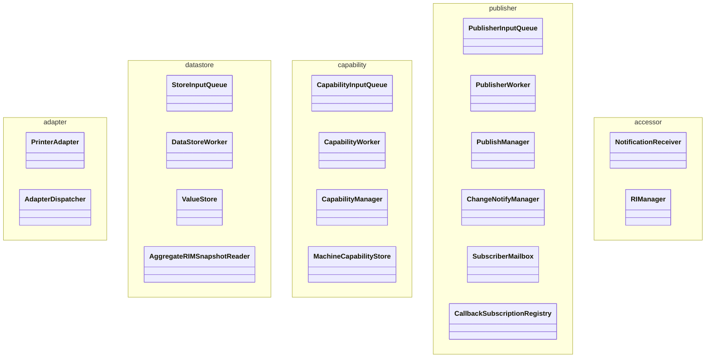

# クラス図（V2）

```mermaid
classDiagram

class PrinterAdapter
{
    +Initialize()
    +Poll()
    +Shutdown()
}

class AdapterDispatcher
{
    +Dispatch(DeviceEvent)
}

class StoreInputQueue
{
    +Push(RIMDataItem)
    +TryPop(RIMDataItem)
}

class DataStoreWorker
{
    +ExecuteOnce()
}

class ValueStore

class AggregateRIMSnapshotReader
{
    +Read() RIMSnapshot
}

class CapabilityInputQueue
{
    +Push(RIMSnapshot)
    +TryPop(RIMSnapshot)
}

class CapabilityWorker
{
    +ExecuteOnce()
}

class CapabilityManager
{
    +Evaluate(RIMSnapshot)
}

class MachineCapabilityStore

class PublisherInputQueue
{
    +Push(PublisherInput)
    +TryPop(PublisherInput)
}

class PublisherWorker
{
    +ExecuteOnce()
}

class PublishManager
{
    +HasEnvironmentChanged()
    +HasErrorChanged()
    +HasPrintReadyChanged()
}

class ChangeNotifyManager
{
    +Notify(EnvironmentCapability)
    +Notify(ErrorCapability)
    +Notify(PrintReadyCapability)
}

class SubscriptionRegistry

class SubscriberMailbox

class CallbackSubscriptionRegistry
{
    +SubscribeEnvironment()
    +NotifyEnvironment()
}

class NotificationReceiver

class RIManager

PrinterAdapter --> AdapterDispatcher

AdapterDispatcher --> StoreInputQueue

StoreInputQueue --> DataStoreWorker

DataStoreWorker --> ValueStore

DataStoreWorker --> AggregateRIMSnapshotReader

DataStoreWorker --> CapabilityInputQueue

CapabilityInputQueue --> CapabilityWorker

CapabilityWorker --> CapabilityManager

CapabilityManager --> MachineCapabilityStore

CapabilityWorker --> PublisherInputQueue

PublisherInputQueue --> PublisherWorker

PublisherWorker --> PublishManager

PublishManager --> MachineCapabilityStore

PublishManager --> ChangeNotifyManager

ChangeNotifyManager --> SubscriptionRegistry

ChangeNotifyManager --> SubscriberMailbox

ChangeNotifyManager --> CallbackSubscriptionRegistry

SubscriberMailbox --> NotificationReceiver

NotificationReceiver --> RIManager
```

---

# レイヤクラス図



---

