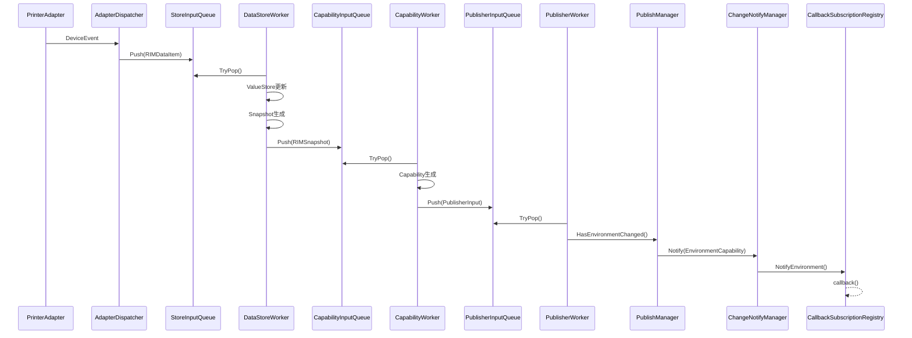
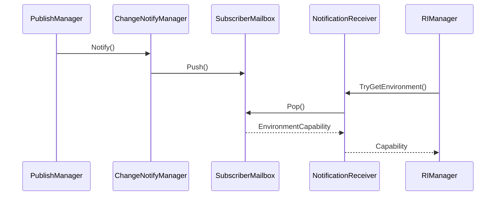
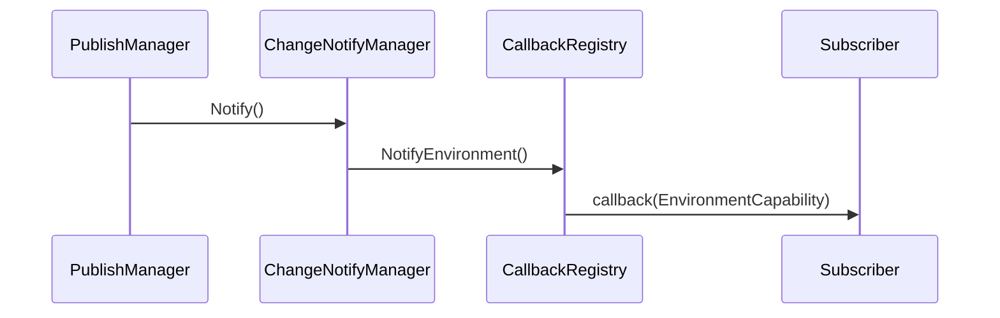
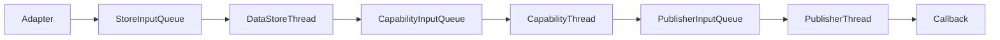

# シーケンス図（Adapter → Callback）

V2で実装済みの E2E フローです。



---

# シーケンス図（Mailbox通知）



---

# シーケンス図（Callback通知）



---

# 将来のスレッド化後の想定図



現在は各 Thread の代わりに

```cpp
ExecuteOnce()
```

を順番に呼び出しており、

```cpp
dataStoreWorker.ExecuteOnce();

capabilityWorker.ExecuteOnce();

publisherWorker.ExecuteOnce();
```

が将来の

```cpp
DataStoreThread
CapabilityThread
PublisherThread
```

へ対応する構造になっています。