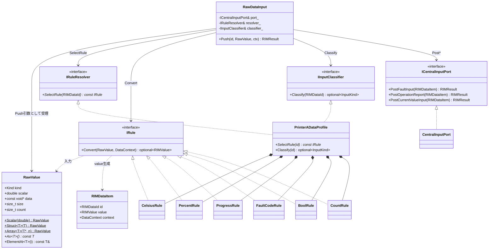

# RIM_AdapterLayer クラス図 (RIM_new)

## 全体クラス図

## 依存の向き(要点)

- `RawDataInput`(framework) は **抽象IFのみ**に依存:
  `IRuleResolver` / `IRule` / `IInputClassifier` / `ICentralInputPort`。
- 具象(機種可変)は devices 側: `PrinterADataProfile` が Resolver+Classifier を実装し Rule を所有。
- 送出先の具象 `CentralInputPort`(L2) は framework だが、Adapter は `ICentralInputPort` 抽象越しに使う
  → **Adapter 単体テストではモックに差し替え可能**。
