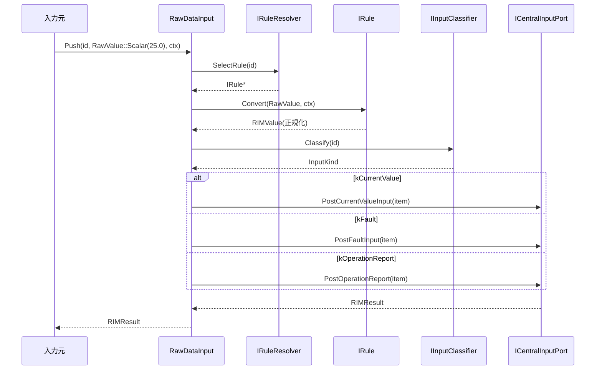
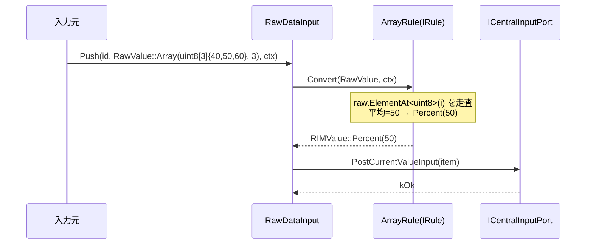
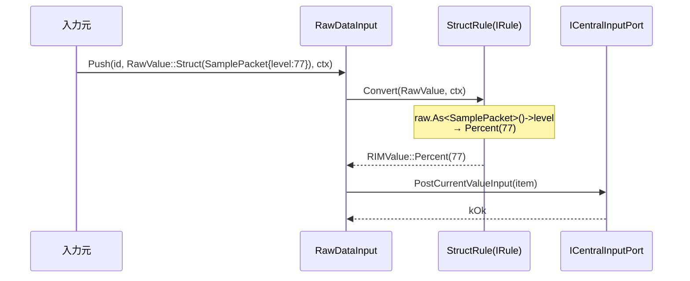
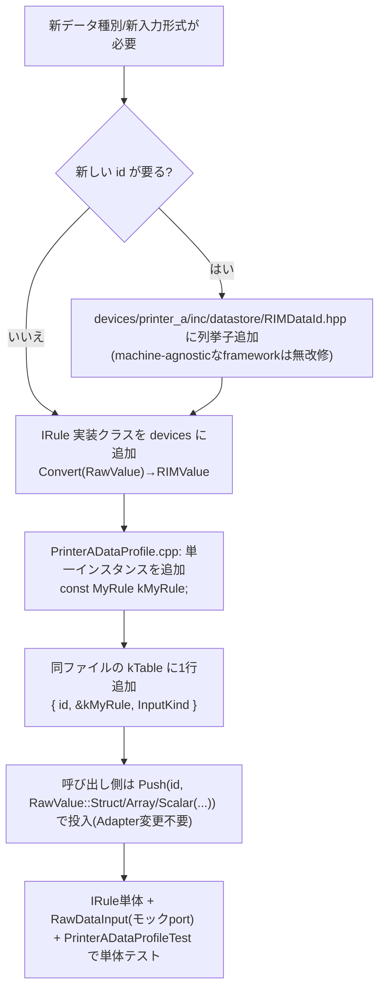
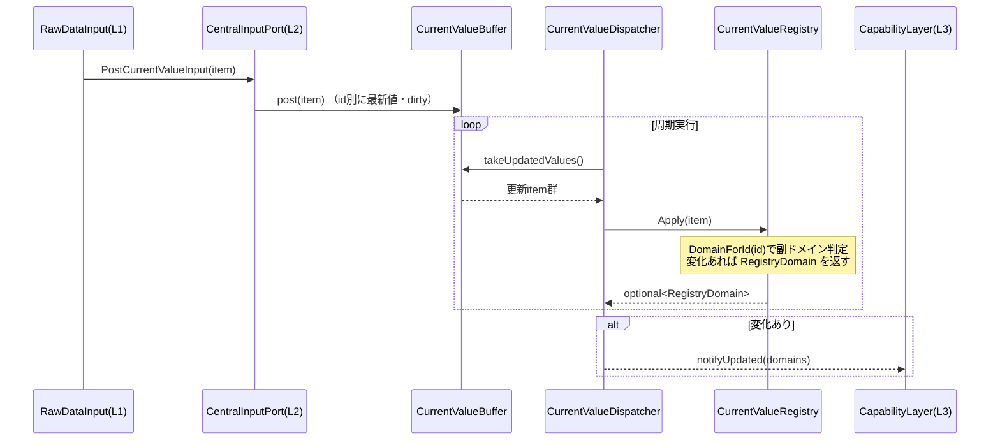

# RIM_AdapterLayer シーケンス図 (RIM_new)

## 1. in → out の経路(スカラ)

## 2. in → out の経路(配列)

## 3. in → out の経路(構造体)

> RawValue はバイト列を**参照**するだけ(コピーしない)。Rule が同期的に `RIMValue`(値)へ
> 正規化するため、Push 呼び出しから抜ける前に参照は解決される(ダングリングしない)。

## 4. 新規ルールを追加する流れ(開発手順)

- 変更は **id追加 + Rule追加 + `kTable` 1行追記** に局所化(旧: SelectRule/Classify 2箇所への別々の追記)。
- `kTable` の行数は `static_assert` で `RIMDataId` の総数と自動照合されるため、
  行の追加漏れはビルドエラーになる。framework(共通機構)は不変。

## 5. DataStore で新しいデータを管理する流れ(最新値系の例)

**新データを L2 に足す開発手順(最新値系)**:
1. `CurrentValueRegistry.cpp` の `kDomainTable`(テーブル駆動)に `id → 副ドメイン` を1行追加。
2. `CurrentValueRegistry.MakeSnapshot` と `Snapshot.hpp` の副Snapshot にフィールド追加。
3. 新副ドメインなら `RegistryDomain.hpp` にビット追加 + `MachineRegistry.Capture` の
   `kDomainCurrentAll` に含める。
4. L3 の `ICapabilityBuilder` が新フィールドを参照して判定。

> Adapter 側(§4)と DataStore 側(本節)は**独立して**変更できる。境界は `RIMDataItem`(id/value/context)。
