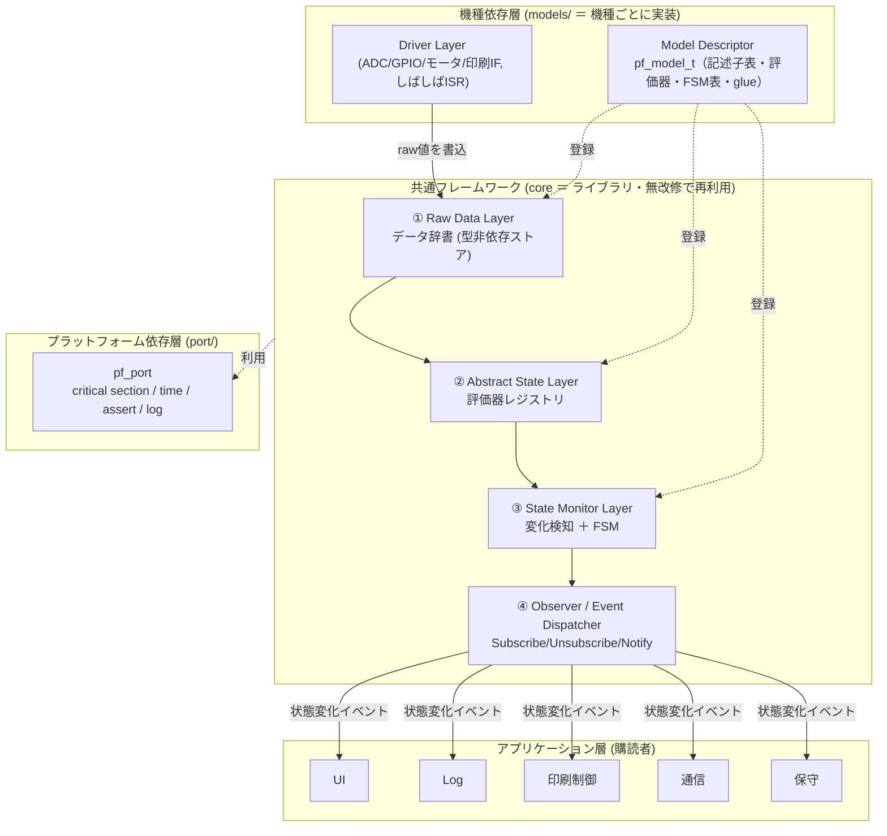
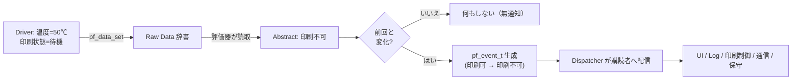
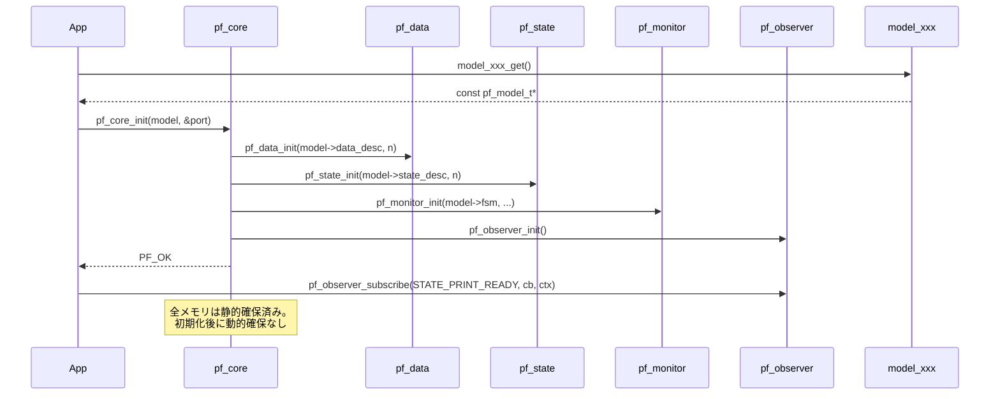
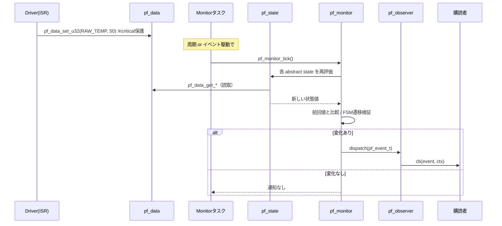
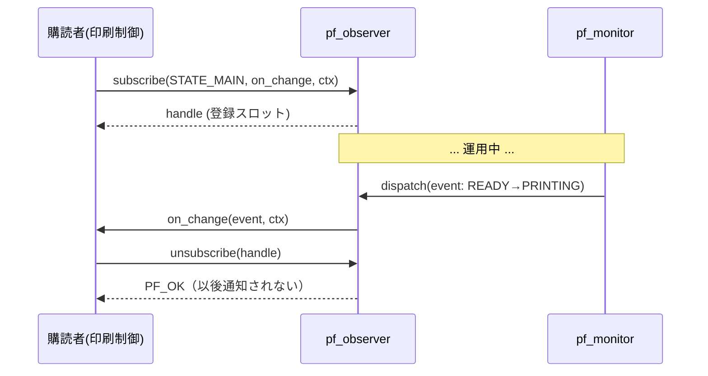
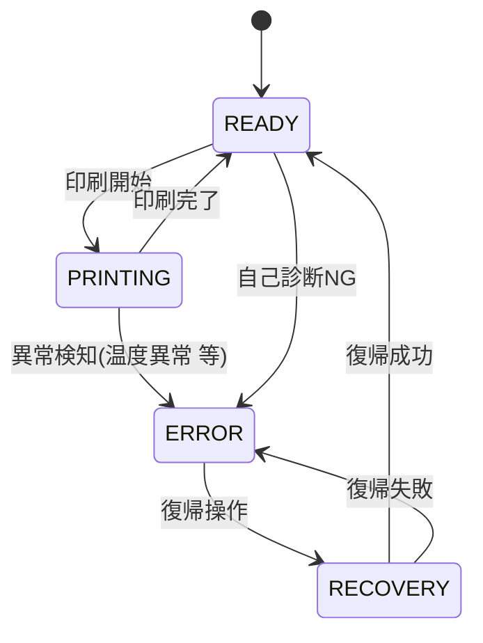
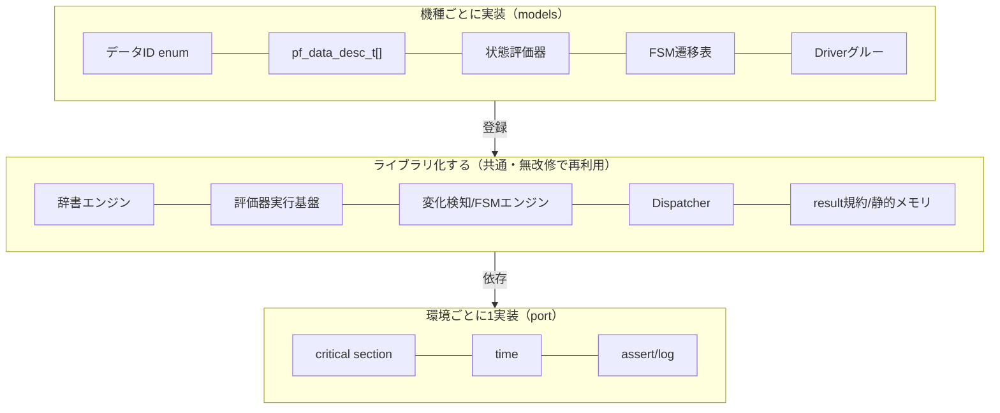

# printer-fw 基本設計書

| 項目 | 内容 |
|------|------|
| プロジェクト | printer-fw（印刷機 組込み共通フレームワーク） |
| 版 | v1.1（2026-07-01 初版 / 2026-07-02 C++実装へ移行） |
| 対象 | 印刷機の組込みソフトウェア。複数機種への流用を前提とした共通ライブラリ |
| 言語 | 組込み向けイディオマティック **C++（C++17）**。各レイヤをクラス化・カプセル化するが、
例外・RTTI・動的確保・STLコンテナは使用しない（`-fno-exceptions -fno-rtti`、全静的確保）。
公開APIは全て `extern "C"` で **C ABI 互換**を維持し、C からも呼び出せる |
| 文書の位置づけ | 「概要・設計方針」を示す上位設計。API詳細は [detailed-design.md](detailed-design.md) を参照 |

---

## 0. 本書の目的と読み方

本書は printer-fw の**アーキテクチャと設計方針**を示す。「なぜこの構造か」を理解するための文書であり、
実装に必要なシグネチャ・手順は詳細設計書（IF仕様書）に分離している。

- **設計を最優先**する方針のもと、コードに先行して本書・図・詳細設計書を確定する。
- 最終目標は「**この設計書群だけを見れば、別機種へ容易に展開できる**」こと。

---

## 1. アーキテクチャ概要

### 1.1 設計の狙い

印刷機はモデルごとにセンサー数・エラー種別・状態数・ドライバ構成が異なる。
従来は機種ごとに「データ取得 → 状態判定 → 各モジュールへの通知」の配線を作り直しており、
保守・テストが機種ごとに分断していた。printer-fw はこれを次の構造で解く。

1. **生データを型非依存の辞書（Data Dictionary）で一元管理**し、追加を「記述子1行」に縮約する。
2. **生データ→意味のある状態への変換を「評価器（純関数）」として登録制**にし、状態追加をコア無改修にする。
3. **状態の変化のみを検知して中央ディスパッチャから通知**し、購読側（UI/ログ/制御/通信/保守）を疎結合にする。
4. **共通(core) / プラットフォーム(port) / 機種依存(models) の3層に分離**し、機種追加を `pf_model_t` 1実装に縮約する。

### 1.2 全体構成（レイヤ図）



### 1.3 レイヤ責務一覧（提案する最終構成）

要件のレイヤ案（Driver→Raw→Abstract→Monitor→Observer→App）を踏襲しつつ、
**Port層**（プラットフォーム抽象）と**Model記述子**（機種依存の登録口）を明示的に足した。

| # | レイヤ | 帰属 | 責務 | 知ってよい下位 | 上位を知るか |
|---|--------|------|------|---------------|:----:|
| 0 | Driver | models | HW I/O。生値を Raw Data Layer に書き込むだけ | Raw | × |
| 1 | Raw Data Layer | core | 型非依存の生データ保持・get/set。意味は持たない | port | × |
| 2 | Abstract State Layer | core+model | 複数の生データ→意味のある状態へ変換（評価器を実行） | Raw, port | × |
| 3 | State Monitor Layer | core+model | 抽象状態を再評価し、**変化したものだけ**抽出。FSMで遷移検証 | Abstract, port | × |
| 4 | Observer/Dispatcher | core | 変化イベントを購読者へ配信。Subscribe/Unsubscribe/Notify | Monitor出力, port | × |
| 5 | Application Modules | app | 通知を受けて UI/ログ/制御/通信/保守を実行 | Observer | × |
| — | Port | port | mutex/時間/assert/log をHW・OSに合わせて提供 | （最下層） | × |
| — | Model Descriptor | models | 上記の機種依存データ（ID・記述子・評価器・FSM・glue）を**登録** | core API | × |

> **依存方向は常に上位→下位の一方向**。下位は上位を知らない（循環なし）。Model は登録APIを通じて
> core にデータを「与える」だけで、core は特定機種を知らない（依存性逆転）。

---

## 2. 各モジュール責務（詳細）

### 2.1 ① Raw Data Layer ＝ データ辞書（`pf_data`）

ドライバが取得した生値を**型に依存しないインターフェース**で一元管理する。

- **辞書方式**: 各データは一意の **ID（enum）** で識別する。値は **タグ付き表現**（`pf_value_t` = `pf_type_t` + 共用体）で保持。
- **対応型**: `bool / u8 / u16 / u32 / i32 / f32 / f64 / enum / 構造体 / 配列 / 可変長(blob)`。
  - スカラはタグ付き共用体、構造体・配列・可変長は **blob（先頭ポインタ＋サイズ）** として汎用APIで授受。
- **記述子駆動**: モデルが `pf_data_desc_t[]`（id, type, 要素サイズ, 要素数, 任意の変化εなど）を与え、
  core はそれに基づき**静的に**ストレージを確保する（malloc 不使用）。
- **アクセス**: ID→インデックス変換は O(1)。型別の便宜API（`pf_data_set_u32` 等）と汎用API（`pf_data_set(id, void*, size)`）を提供。
- **意味は持たない**: 「温度50℃」は保持するが「異常かどうか」は判断しない（それは Abstract 層の責務）。

### 2.2 ② Abstract State Layer ＝ 評価器レジストリ（`pf_state`）

生データを**意味のある状態**へ変換する。「温度50℃＋待機 → 印刷不可」「温度50℃＋印刷中 → 温度異常エラー」。

- **評価器**: 各抽象状態は `pf_state_eval_fn(const pf_data_handle, void* out_value)` という**純関数**で算出される。
  入力は Raw（読み取り専用ハンドル）、出力は状態値（enum またはスカラ）。副作用なし＝テスト容易。
- **登録制**: モデルが `pf_state_desc_t[]`（state_id, 値型, 評価器, 依存する raw id 群（任意のヒント））を登録。
  状態を増やす＝記述子と評価関数を足すだけ。**Abstract 層のコードは無改修**（開放/閉鎖原則）。
- **データ駆動の簡易ルールも併用可**: 単純なしきい値判定はテーブル（範囲→状態）で表現でき、複雑判定は評価関数を使う。

### 2.3 ③ State Monitor Layer ＝ 変化検知（＋FSM）（`pf_monitor`）

抽象状態を**常時監視し、変化したときだけ**イベント化する。

- **スナップショット比較**: 前回の抽象状態値を保持し、`pf_monitor_tick()` で全（または対象）状態を再評価して差分を取る。
  変化が無ければ**通知しない**。
- **ヒステリシス/デバウンス（任意）**: チャタリング抑制のため、状態ごとに「N回連続一致で確定」やεを設定可能。
- **FSM（主系状態）**: 印刷ライフサイクル（READY→PRINTING→ERROR→RECOVERY 等）は遷移表で**許可された遷移のみ**を通す。
  不正遷移は弾き、`pf_port` の log/assert に回す。非ライフサイクルの状態は単純差分でよい（ハイブリッド）。
- **出力**: 変化イベント `pf_event_t`（state_id, 旧値, 新値, timestamp）を生成し、Dispatcher に渡す。

### 2.4 ④ Observer / Event Dispatcher（`pf_observer`）

Observer パターンを中央集約で実装する。

- **最小IF**: `Subscribe` / `Unsubscribe` / `Notify`（内部）。購読者はコールバック＋任意の `void* ctx` を登録。
- **購読対象は Abstract State**（Raw ではない）。「特定 state_id」または「全イベント」を購読できる。
- **静的テーブル**: 購読者数の上限はコンパイル時定数（`PF_OBSERVER_MAX`）。malloc 不使用。
- **配信**: Monitor からの変化イベントを、その state を購読する登録者にのみ `O(購読者数)` で配信。
- **規約**: コールバックは Monitor の実行コンテキストで同期呼び出しされる → **短く保ち、重い処理は購読側で遅延**する。

### 2.5 Model Descriptor（`pf_model`）＝ 機種依存の登録口

1機種 = 1つの `pf_model_t`。`model_xxx_get()` が記述子の集合（data/state/fsm/driverバインド）を返す。
core はこれを `pf_core_init(model)` で受け取り、各レイヤを構成する。**core は特定機種を一切知らない**。

### 2.6 Port（`pf_port`）＝ プラットフォーム抽象

`critical_enter/exit`（ISＲ・タスク間排他）、`time_now`（タイムスタンプ）、`assert_fail`、`log` を関数群で抽象化。
bare-metal / FreeRTOS など環境ごとに1実装。core はこの IF だけに依存し、特定 RTOS に縛られない。

---

## 3. データフロー / イベントフロー

### 3.1 データフロー（Raw → Abstract → 変化 → 通知）



### 3.2 イベントフロー（変化時のみ発火）

- イベントは **「抽象状態の変化」** という単一種類に正規化される（中央イベントバス）。
- 1回の `tick` で複数状態が変化した場合、状態ごとに個別イベントが発火する（順序は記述子の登録順）。
- 変化が無いサイクルでは**イベントゼロ**＝CPU/帯域を消費しない。

---

## 4. シーケンス

### 4.1 初期化シーケンス



### 4.2 更新シーケンス（ランタイム1サイクル）



### 4.3 Observer 通知シーケンス（購読・解除・配信）



### 4.4 状態遷移（主系 FSM の例）



> FSM は「許可された遷移」のみを通す。例えば `ERROR → PRINTING` を直接は許さず、必ず `RECOVERY` を経由させる。

---

## 5. 各種方針

### 5.1 エラー処理方針

2系統を**明確に分離**する。

| 種別 | 表現 | 例 | 用途 |
|------|------|----|------|
| **API実行結果** | `pf_result_t`（enum 戻り値） | `PF_OK / PF_ERR_INVALID_ARG / PF_ERR_NOT_FOUND / PF_ERR_NO_SPACE / PF_ERR_TYPE_MISMATCH / PF_ERR_NOT_INIT` | 関数呼び出しの成否 |
| **機器の状態としての異常** | Abstract State（例: `温度異常エラー`） | 温度異常・用紙切れ | 業務的なエラー状態。Observerで配信 |

- 戻り値規約: **すべての公開関数は `pf_result_t` を返す**（値取得は out 引数）。`PF_OK==0`。
- プログラミングエラー（NULL・範囲外・未初期化）は `pf_port` の **assert フック**で検出（リリース時は無効化可能）。
- ISR から呼べる API は限定（主に `pf_data_set_*`）。ISR 安全性は各 API のドキュメントに明記する。

### 5.2 スレッドセーフ方針

- 想定構成: **Driver/ISR がデータを書き、Monitor タスクが読み・評価・通知**する（生産者/消費者）。
- 共有データ（Raw 辞書のセル）への書込／読出は `pf_port_critical_enter/exit` で保護する（短いクリティカルセクション）。
- 整合性の既定方針: **評価器は必要な値だけを短い critical で読む**（局所整合）。複数値の原子的整合が必要な状態は、
  その評価器の中で `critical_enter/exit` を張り、必要分のみを一括読みする。**全 Raw の一括スナップショットは任意（既定オフ）**で、
  コスト（毎tickの全コピー）を避ける。
- 観測者テーブルの増減（subscribe/unsubscribe）も `critical` で保護する。配信中の購読変更の扱いは API 詳細（detailed-design §7）に規約化。
- Observer コールバックは Monitor コンテキストで同期実行 → コールバック内で重い処理・ブロッキングを禁止（規約）。
- ロックは最小限・短時間。優先度逆転を避けるため、port 実装側で適切なミューテックス/割込み禁止を選ぶ。

### 5.3 メモリ管理方針

- **全静的確保**。core は `malloc/free` を一切使わない（組込み・リアルタイム適性）。
- ストレージサイズは **モデル記述子の要素数から初期化時に決定**（または `pf_config.h` のコンパイル時上限）。
  - 例: `PF_DATA_MAX`, `PF_STATE_MAX`, `PF_OBSERVER_MAX`, `PF_RAW_POOL_BYTES`（blob 用固定プール）。
- 可変長/構造体データは**固定サイズのブロックプール**から割当てる（フラグメンテーションなし）。
- 所有権: Raw セルの実体は core 内の静的バッファが所有。利用側はハンドル/コピーで授受。

### 5.4 機種依存分離方針（どこまで共通化するか）



- **境界の原則**: 「機種で変わるもの＝models」「環境で変わるもの＝port」「変わらない仕組み＝core」。
- 機種追加でユーザが書くのは **models/model_xxx.c（＋ ids ヘッダ）のみ**。core/port は触らない。

### 5.5 API 設計方針

- **opaque ハンドル**: 内部構造体は公開しない（`pf_data.h` は前方宣言のみ）。情報隠蔽でABI/実装変更に強くする。
- **稠密ID規約（O(1)保証）**: data/state の ID は **0..N-1 の連番**を基本とし、`index == id` の直接添字で O(1) アクセスを保証する。
  初期化時に「ID が範囲内・重複なし」を検証する（不正は `PF_ERR_INVALID_ARG`）。疎な ID が必要な機種のみ、init 時に索引表を構築する。
  なお `0xFFFF` は「全状態購読」の番兵（`PF_STATE_ANY`）として**予約**し、有効 ID には使わない。
- **戻り値は `pf_result_t`、出力は out 引数**。getter は `pf_xxx_get(id, T* out)`。
- **名前空間**: 全公開シンボルに `pf_`／マクロに `PF_` を接頭。衝突回避と一覧性。
- **C ABI 互換**: 公開ヘッダは `#ifdef __cplusplus extern "C" {}` で囲み、実装がC++でも C から呼び出せる。
  公開ヘッダ自身は純Cとして解釈可能な構文のみで書く（`pf_value_t` 等の構造体はPOD/集成体）。
- **コールバック**: 必ず `void* ctx` を伴わせ、状態を持ち回れるようにする（グローバル不要でテスト容易）。
- **初期化明示**: 暗黙のグローバル初期化に頼らず `pf_core_init()` を必須化（多重初期化は弾く）。
- **内部はクラスでカプセル化（実装詳細・非公開）**: 各レイヤの実体は `data_dictionary` / `state_registry` /
  `monitor_engine` / `observer_dispatcher` / `core_context` としてクラス化し、モジュールごとに単一インスタンス
  （シングルトン、静的記憶域・`namespace { ... }` に隠蔽）を持つ。公開 `extern "C"` 関数は、対応するクラスの
  メソッドへ1行で委譲するだけの薄いラッパーとする。これにより、公開APIの互換性を保ったまま実装をカプセル化する。
- **例外・RTTI不使用**: コンストラクタは失敗しない（フィールドはデフォルト初期化のみ）。初期化の成否は
  `init()` メソッドの戻り値（`pf_result_t`）で表現し、例外は投げない。動的多態は使わず（仮想関数なし）、
  関数ポインタ（`pf_state_eval_fn` 等）で振る舞いを注入する（既存の設計方針を維持）。

### 5.6 命名規則

| 対象 | 規則 | 例 |
|------|------|----|
| 公開関数（`extern "C"`） | `pf_<module>_<verb>` snake_case | `pf_data_set_u32`, `pf_observer_subscribe` |
| 型 | `pf_<name>_t` | `pf_value_t`, `pf_event_t`, `pf_result_t` |
| enum 定数 | `PF_<GROUP>_<NAME>` 大文字 | `PF_TYPE_U32`, `PF_OK`, `PF_ERR_NOT_FOUND` |
| マクロ/設定 | `PF_<NAME>` | `PF_OBSERVER_MAX` |
| 機種側ID | `<MODEL>_RAW_*` / `<MODEL>_STATE_*` | `SAMPLE_RAW_TEMP`, `SAMPLE_STATE_MAIN` |
| 内部クラス（非公開） | snake_case（既存のC由来の規約を維持） | `data_dictionary`, `monitor_engine` |
| クラスのメソッド | snake_case（公開関数と対応する接尾辞） | `set_u32()`, `subscribe()` |
| クラスの private メンバ | 末尾アンダースコア | `count_`, `desc_[]`, `init_` |
| ファイル(core) | `pf_<module>.{h,cpp}` | `pf_monitor.cpp` |
| ファイル(機種) | `model_<name>.{h,cpp}` | `model_sample.cpp` |
| 内部専用ヘッダ | `pf_<name>.hpp`（非公開・インストール対象外） | `pf_priv.hpp` |

### 5.7 ライブラリ構成 / ディレクトリ構成

```
printer-fw/
├── include/printer_fw/      公開ヘッダ（ライブラリAPI。利用者はここだけ include）
│   ├── pf_types.h           値型 pf_value_t / pf_type_t / 共通typedef
│   ├── pf_result.h          pf_result_t（結果コード）
│   ├── pf_port.h            プラットフォーム抽象IF
│   ├── pf_data.h            ① Raw Data Layer（データ辞書）
│   ├── pf_state.h           ② Abstract State Layer（評価器登録）
│   ├── pf_fsm.h             FSMエンジン（Monitorが利用）
│   ├── pf_monitor.h         ③ State Monitor Layer
│   ├── pf_observer.h        ④ Observer / Dispatcher
│   ├── pf_model.h           機種記述子 pf_model_t
│   ├── pf_config.h          コンパイル時上限（PF_*_MAX 等）
│   └── printer_fw.h         まとめ include（利用者向け単一エントリ）
├── src/                     コア実装（機種非依存・C++実装。各レイヤはクラス化）
│   ├── pf_priv.hpp          非公開の内部橋渡し（他.cppからのみ利用。インストール対象外）
│   ├── pf_core.cpp          core_context クラス：初期化・全体オーケストレーション
│   ├── pf_data.cpp          data_dictionary クラス：辞書エンジン
│   ├── pf_state.cpp         state_registry クラス：評価器レジストリ
│   ├── pf_fsm.cpp           FSMエンジン（状態を持たないため関数のまま）
│   ├── pf_monitor.cpp       monitor_engine クラス：変化検知
│   ├── pf_observer.cpp      observer_dispatcher クラス：Dispatcher
│   ├── pf_result.cpp        結果コード→文字列
│   └── pf_log.cpp           ログ出力
├── port/                    プラットフォーム依存サンプル（C++実装）
│   ├── pf_port_baremetal.cpp  割込み禁止ベースの critical section 等
│   ├── pf_port_freertos.cpp   ミューテックス/タスク向け（スタブ）
│   └── pf_port_linux.cpp      Linux(POSIX)：pthread mutex・clock_gettime・stdoutログ
├── models/                  機種依存サンプル（分離の実例）
│   └── model_sample/
│       ├── model_sample_ids.h   データID・状態ID enum
│       ├── model_sample.h       model_sample_get() 宣言
│       └── model_sample.cpp     記述子表・評価器・FSM表・Driverグルー
├── examples/app_demo.cpp    最小デモ（購読→raw更新→変化→通知）
├── tests/                   ユニットテスト（Catch2/GoogleTest等へも移植容易）
├── docs/                    本設計書群＋draw.io
└── CMakeLists.txt           ビルド構成（C++17）
```

---

## 6. 代替アーキテクチャ比較（要件: 改善案・代替案の提示）

各論点で2案以上を比較し、採用案と却下理由を明示する。

### 6.1 Raw データの保持方式

| 案 | 概要 | 長所 | 短所 | 判定 |
|----|------|------|------|:----:|
| **A. データ辞書** | ID＋タグ付き値の汎用ストア | 追加が記述子1行・型非依存・横断走査が容易 | 1件あたり数バイトのタグ/間接コスト | ✅ 採用 |
| B. 全部入り構造体 | `typedef struct { float temp; ... }` | アクセス最速・型安全 | 機種ごとに構造体改変→流用性が低い | ❌ |
| C. 型別ストア | 型ごとに配列を分ける | 型安全・密 | データ追加でAPI増殖・横断管理が煩雑 | ❌ |

> 採用根拠: 本FWの最重要要件は「機種差の吸収」と「データ追加容易性」。多少のメモリ/間接コストより**拡張性**を優先。
> 速度が要る箇所は型別便宜API（`pf_data_get_u32`）でインデックス直アクセスでき、実質 O(1)。

### 6.2 状態判定の方式

| 案 | 概要 | 長所 | 短所 | 判定 |
|----|------|------|------|:----:|
| **A. 評価器登録（純関数）** | 状態ごとに評価関数を登録 | 任意ロジック可・テスト容易・コア無改修 | 関数ポインタ間接 | ✅ 採用 |
| B. ハードコード if/else | コアに判定を直書き | 単純 | 状態追加でコア改修・機種分岐が氾濫 | ❌ |
| C. 完全データ駆動ルール表 | しきい値表のみ | データだけで追加 | 複雑な複合条件を表現しきれない | △ 併用 |

> 採用根拠: 「温度＋印刷状態 → 状態」のような**複合判定**が必要。純関数評価器を主とし、単純しきい値は表で補助（ハイブリッド）。

### 6.3 通知方式

| 案 | 概要 | 長所 | 短所 | 判定 |
|----|------|------|------|:----:|
| **A. 中央イベントバス** | 変化を1種のイベントに正規化し中央配信 | 購読管理が1か所・静的テーブル1つ・組込み向き | 全イベントが1経路 | ✅ 採用 |
| B. subject毎Observerリスト | 状態ごとに観測者リスト | 局所的 | リスト多数で管理分散・メモリ断片化 | ❌ |

> 採用根拠: 全イベントは Monitor から生まれる単一源泉。中央集約が最も単純で、静的1テーブルで完結し組込みに適合。

### 6.4 全体アーキテクチャ様式

| 案 | 概要 | 判定 | 理由 |
|----|------|:----:|------|
| **レイヤード＋Blackboard(辞書)＋Observer** | 本採用 | ✅ | 責務分離・拡張性・組込み適性のバランス最良 |
| 純イベント駆動（全部メッセージ） | 全層をイベントで疎結合 | ❌ | 組込みでキュー/順序管理が重く、決定性が落ちる |
| 純データ辞書（Blackboard のみ） | 各モジュールがポーリング | ❌ | 「変化時のみ通知」要件に反し、CPUを浪費 |

### 6.5 将来拡張への含み（非ゴールだが設計で阻害しない）

- **イベントキュー化**: Observer 配信を「即時同期」から「キュー経由の非同期」に差し替えられるよう、Dispatcher を IF 化しておく。
- **複数モデル同時** / **状態の階層化** / **ロギング用の全イベント購読** などは現構造の延長で追加可能。

### 6.6 実装言語（2026-07-02 追記）

| 案 | 概要 | 判定 | 理由 |
|----|------|:----:|------|
| 純C（C99/C11） | 全ファイルC・staticグローバルで状態保持（初版） | — | 最もシンプル・組込み実績豊富。ただし今回の要求（実装をC++化）は満たさない |
| **組込み向けイディオマティックC++（採用）** | 各レイヤをクラス化・カプセル化。例外/RTTI/動的確保/STLコンテナ不使用。公開APIは`extern "C"`でC ABI維持 | ✅ | クラスによる責務のカプセル化でC版の設計思想（1レイヤ1責務・静的確保・決定的動作）をそのまま維持しつつC++化。C資産との相互運用も両立 |
| モダンC++（STL/例外許容） | `std::function`によるObserver、`std::array/vector`、例外によるエラー通知 | ❌ | 表現力は高いが、ヒープ確保・例外の遅延不確定性が組込み・リアルタイム制約と衝突する恐れ |

> 採用根拠: 「実装をC++に変更」という要求と、既存の組込み制約（全静的確保・決定的動作・C資産との相互運用）を両立するため、
> 例外/RTTI/動的確保を禁じた「組込み向けC++サブセット」を採用。クラス化はカプセル化の手段として使うが、
> ポリモーフィズム（仮想関数）は導入せず、既存の関数ポインタ注入方式（`pf_state_eval_fn` 等）を維持する。

### 6.7 過剰設計の抑止（未使用時ゼロコスト）

FSM・デバウンス・BLOBプールは要件由来（状態機械・チャタリング・可変長）だが、単純機種では不要なことがある。
これらは**使わなければコストゼロ**になるよう設計する：

- FSM 不使用: `pf_monitor_cfg_t.fsm_count = 0` → 遷移検証は走らない。
- デバウンス不要: `debounce_n = 0/1` → 即時確定（カウンタ配列も未使用）。
- 可変長不要: `PF_RAW_POOL_BYTES = 0` → BLOBプールを確保しない（RAM消費なし）。

→ 最小機種は「辞書＋評価器＋変化検知＋Observer」だけで動き、YAGNI に反しない。

---

## 7. 拡張シナリオ（既存コード修正を最小化）

| やりたいこと | 触る場所 | core改修 |
|--------------|----------|:--------:|
| データ追加（新センサー） | `model_xxx_ids.h` にID追加 ＋ `pf_data_desc_t[]` に1行 | 不要 |
| 状態追加 | 評価器を1つ書き `pf_state_desc_t[]` に登録 | 不要 |
| Observer追加 | 購読側で `pf_observer_subscribe` | 不要 |
| モジュール追加 | アプリ層に購読者を追加 | 不要 |
| Driver追加 | model の glue でHW読取→`pf_data_set_*` | 不要 |
| 新機種展開 | `models/model_yyy/` を1式実装し `pf_core_init` に渡す | 不要 |

詳細手順は [detailed-design.md](detailed-design.md) の「拡張手順」を参照。

---

## 8. 想定する制約・非機能

- **メモリ**: 全静的。フットプリントは記述子数に比例。最小構成で数KB級を想定（実測は機種記述子次第）。
- **リアルタイム性**: データアクセス O(1)、tick は O(状態数)、通知は O(購読者数) で**有界・決定的**。動的確保なし。
- **移植性**: HW/OS依存は port に隔離。エンディアン依存は blob 授受時に利用側責務（必要なら port で変換ヘルパ）。
- **テスト容易性**: 評価器は純関数で単体テスト容易。core は port をスタブ注入してホストでテスト可能
  （現状は自己完結の CHECK マクロで実装。Catch2/GoogleTest や `engineering/ceedling/` の Unity/ceedling へも移植容易）。

---

## 9. 関連文書

- [detailed-design.md](detailed-design.md) — 詳細設計（IF仕様・データ構造・拡張手順）
- [diagrams/printer-fw.drawio](diagrams/printer-fw.drawio) — draw.io 図（編集可能）
- [self-review.md](self-review.md) — 自己レビューと反映ログ
