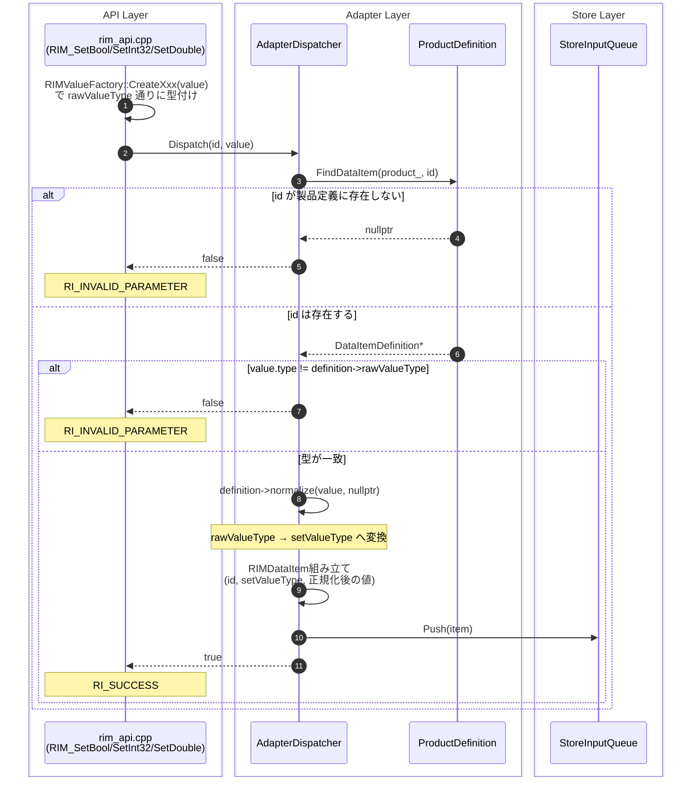
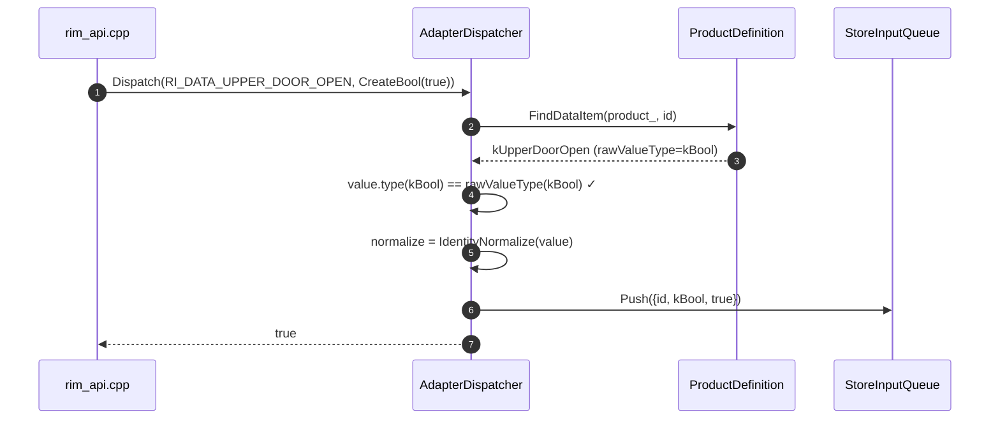
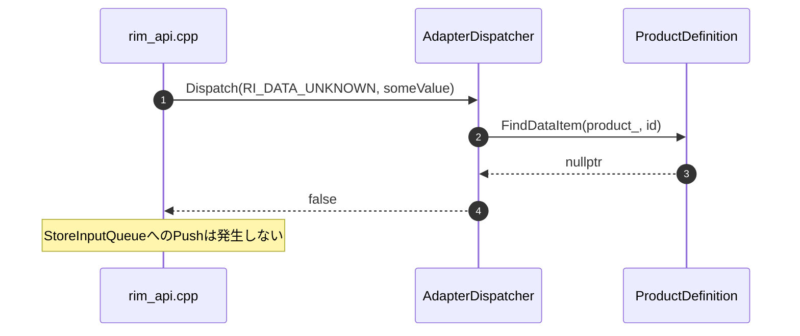
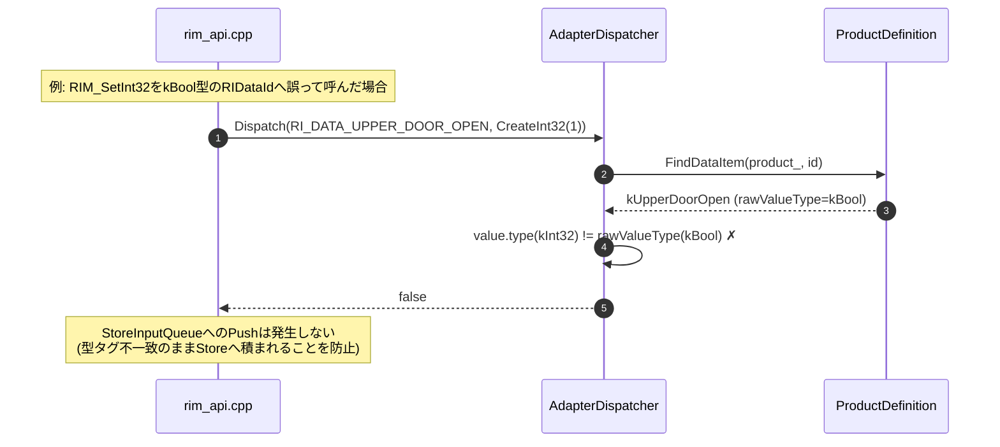

# Adapterレイヤ シーケンス図

対象: `AdapterDispatcher::Dispatch(RIDataId id, const RIMValue& value)`

`core/adapter/src/AdapterDispatcher.cpp`の実装に基づく。

---

## 1. 全体シーケンス(正常系・異常系まとめ)

---

## 2. 正常系(単独)

---

## 3. 異常系1: 未登録の RIDataId

---

## 4. 異常系2: 型不一致

