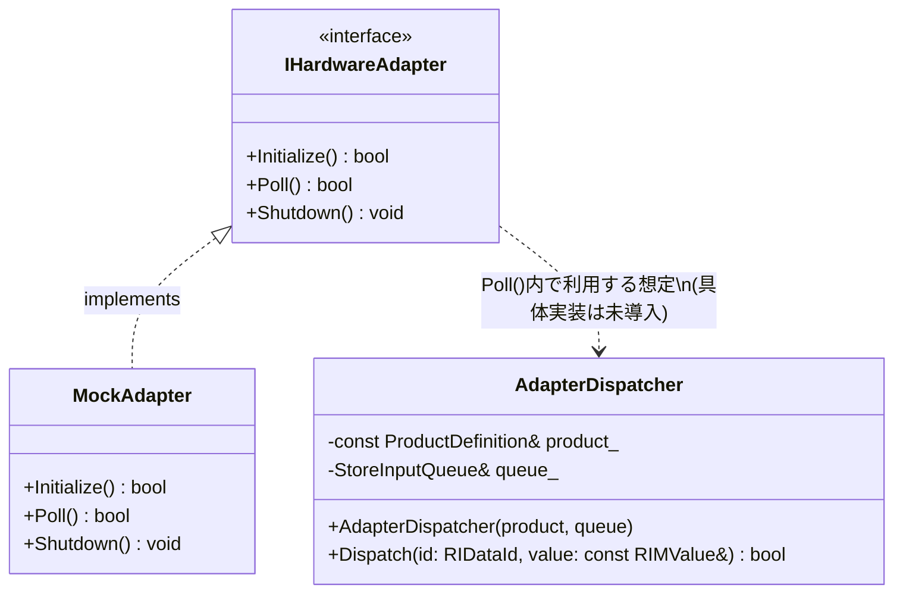
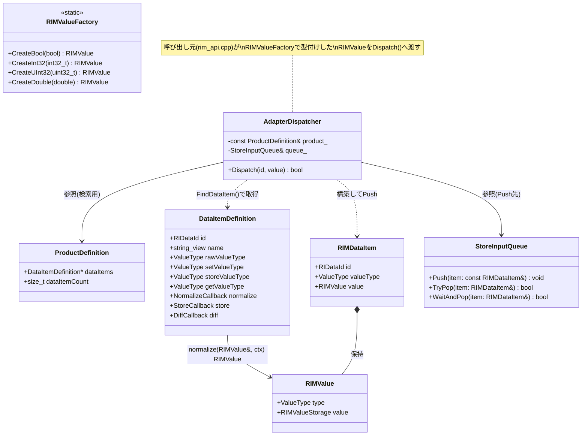
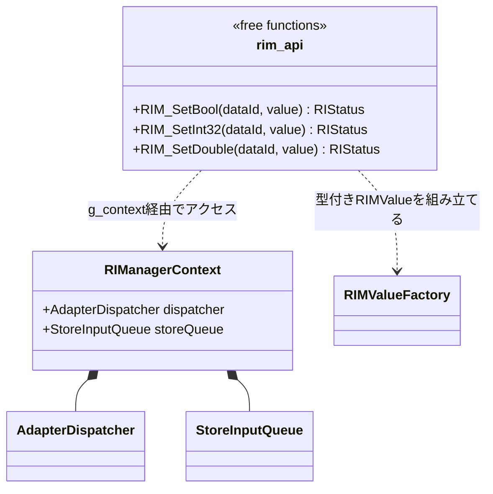

# Adapterレイヤ クラス図

対象: `core/adapter` および直接の依存先。

---

## 1. Adapterレイヤ本体

`MockAdapter`以外に`IHardwareAdapter`を実装する具体クラスは現状リポジトリに存在しない
(旧`PrinterAdapter`は`Dispatch()`シグネチャ変更に伴い削除済み)。

---

## 2. 依存関係を含む全体図

---

## 3. 呼び出し元(参考: API Layer)

