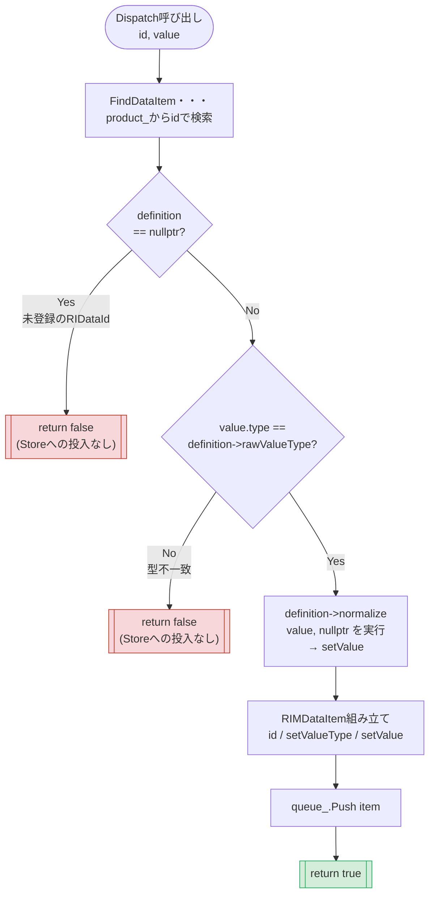
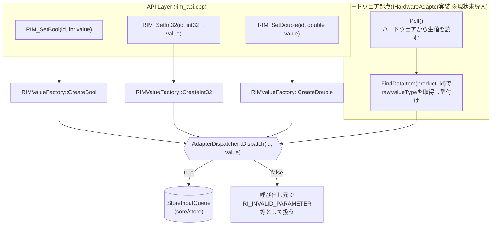

# Adapterレイヤ フローチャート

対象: `AdapterDispatcher::Dispatch(RIDataId id, const RIMValue& value)`

---

## 1. `Dispatch()` 内部処理フロー

---

## 2. Adapterレイヤ全体の入口(呼び出し元別)

**ポイント**: `rim_api.cpp`側は「どの`RIM_SetXxx`が呼ばれたか」で型が確定しているため、`RIMValueFactory`で
直接型付けして渡す。一方ハードウェア起点の入力は生値の型が不定なため、`Dispatch()`を呼ぶ前に
`FindDataItem()`で`rawValueType`を引いて型付けする必要がある(このロジックはAdapterDispatcher側ではなく、
各`IHardwareAdapter`実装側に置く設計。`03_詳細設計書.md` 3章参照)。
