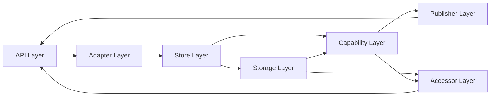
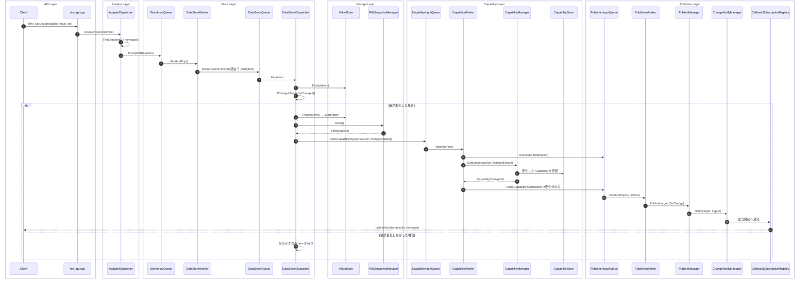
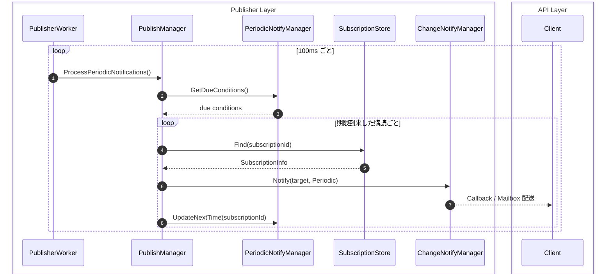
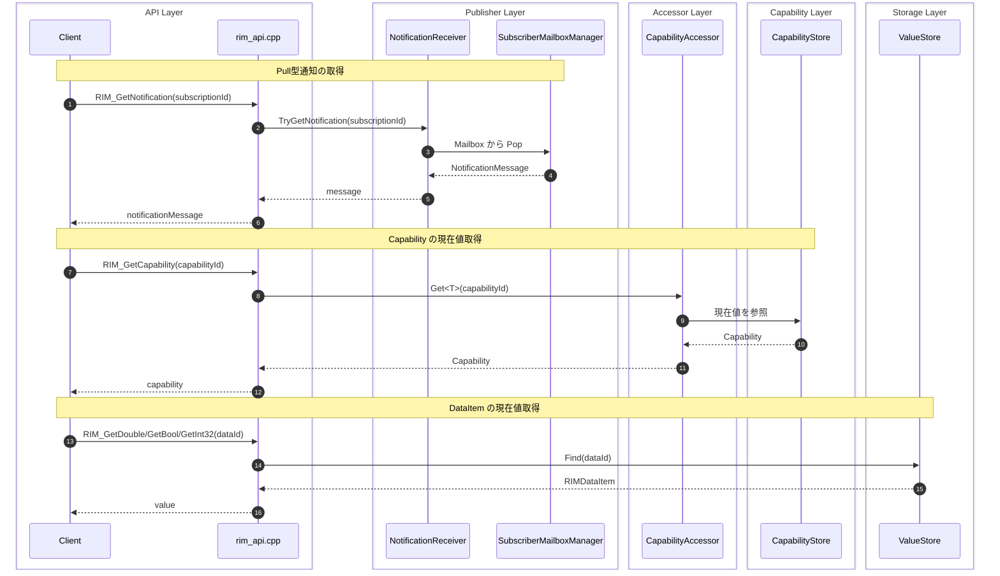

# レイヤ構成付き シーケンス図

本ドキュメントは、`products/common/rim_api.cpp` を起点とする実行時フローを、
実際のフォルダ構成(= レイヤ)ごとに色分けした Mermaid シーケンス図としてまとめたものです。

ソースコード (refactor/0808-migration ブランチ時点) を実際に追跡して作成しています。
`docs/internal/architecture.md` / `sequence.md` / `RIManager_SequenceDiagram.md` は
設計方針ドキュメントであり、クラス名が現状の実装と一部食い違っています。
本ドキュメントは実装追従を優先し、両者を突き合わせる際の橋渡しとして使ってください。

---

## レイヤとフォルダの対応

| レイヤ | フォルダ | 主なコンポーネント |
| --- | --- | --- |
| API Layer | `products/common/rim_api.cpp`, `include/rim_api.h` | `RIM_SetXXX` / `RIM_GetXXX` / `RIM_Subscribe` / `RIM_GetNotification` |
| Adapter Layer | `core/adapter` | `AdapterDispatcher` |
| Store Layer | `core/store` | `StoreInputQueue`, `DataStoreWorker`, `RouteProvider`, `DataStoreQueue`, `DataStoreDispatcher` |
| Storage Layer | `core/storage` | `ValueStore`, `RIMSnapshotManager`(`IRIMSnapshotReader`) |
| Capability Layer | `core/capability` | `CapabilityInputQueue`, `CapabilityWorker`, `CapabilityManager`, `CapabilityStore` |
| Publisher Layer | `core/publisher` | `PublisherInputQueue`, `PublisherWorker`, `PublishManager`, `ChangeNotifyManager`, `SubscriptionStore`, `SubscriberMailboxManager`, `CallbackSubscriptionRegistry`, `NotificationReceiver` |
| Accessor Layer | `core/storage/accessor` | `CapabilityAccessor` |

レイヤ間の依存方向は次の通りです(`RoutePipeline` が Store〜Capability を束ねる構成):



---

## 1. Set 系 API 〜 通知配送(Push / Callback)までの全体シーケンス

`RIM_SetDouble()` などの Set 系 API が呼ばれてから、
Callback 購読者に通知が届くまでの一連の流れです。



---

## 2. 定期通知(Periodic)シーケンス

`PublisherWorker` はキューを 100ms タイムアウトで待ちつつ、
毎ループ `PublishManager.ProcessPeriodicNotifications()` を呼び出します。



---

## 3. 状態取得(Pull / Current State)シーケンス

Mailbox による Pull 型通知取得、Capability の現在値取得、Value の直接取得の 3 経路です。



---

## 参照した実装ファイル

```text
products/common/rim_api.cpp
core/adapter/src/AdapterDispatcher.cpp
core/store/src/DataStoreWorker.cpp
core/store/src/DataStoreDispatcher.cpp
core/store/src/RouteProvider.cpp
core/common/src/RoutePipeline.cpp (products/common/RoutePipeline.cpp)
core/capability/src/CapabilityWorker.cpp
core/publisher/src/PublisherWorker.cpp
core/publisher/src/PublishManager.cpp
```
