# RIManager Implementation

ReactiveInfoManager (RIManager) の実装リポジトリです。

RIManager は Device の生データを Canonical Data に正規化し、Canonical Data・Snapshot・Capability・Notification を提供するライブラリです。

---

# Design Principles

本リポジトリは以下の原則に基づいて設計されています。

- `core` は製品非依存の共通ロジック
- `products` は製品固有定義のみを保持する
- Runtime の共通識別子は `RIDataId`
- Product は宣言的な `ProductDefinition` として記述する
- Data 定義の唯一の正本は `DataItemDefinition`
- Core は Product の知識を持たない
- Canonical Data を Single Source of Truth とする
- Capability は現在状態として保持する
- Notification は状態変化を外部へ通知する
- Capability は Canonical Data から導出される
- Data と Capability は独立して通知可能
- Capability は Snapshot を入力として生成する
- Data 変更起点の部分再評価へ移行可能な構造を維持する

---

# Architecture Overview

```mermaid
flowchart LR

    Adapter["Adapter"]

    DataStoreWorker["DataStoreWorker"]
    ValueStore["ValueStore"]

    SnapshotReader["AggregateRIMSnapshotReader"]
    Snapshot["RIMSnapshot"]

    CapabilityWorker["CapabilityWorker"]
    CapabilityManager["CapabilityManager"]
    CapabilityStore["CapabilityStore"]

    PublisherWorker["PublisherWorker"]
    PublishManager["PublishManager"]

    ProductProvider["IProductProvider"]
    ProductProfile["ProductProfile"]
    ProductDefinition["ProductDefinition"]

    Adapter --> DataStoreWorker
    DataStoreWorker --> ValueStore

    ValueStore --> SnapshotReader
    SnapshotReader --> Snapshot

    Snapshot --> CapabilityWorker
    CapabilityWorker --> CapabilityManager
    CapabilityManager --> CapabilityStore

    CapabilityWorker --> PublisherWorker
    PublisherWorker --> PublishManager

    ProductProvider --> ProductProfile
    ProductProfile --> ProductDefinition

    ProductDefinition -.defines.-> CapabilityManager
    ProductDefinition -.defines.-> SnapshotReader
```

---

# Repository Structure

```text
RIManager
├─ include
├─ core
├─ products
├─ test
├─ samples
└─ docs
```

---

# Public API

公開ヘッダは `include` 配下のみ。

```text
include
├─ rim_api.h
├─ rim_types.h
├─ rim_version.h
├─ rim_data_id.h
└─ rim_capability_id.h
```

---

# Core

`core` 配下には製品知識を持たない共通実装のみを配置する。

```text
core
├─ adapter
├─ capability
├─ common
├─ notification
├─ publisher
├─ snapshot
├─ storage
├─ worker
└─ store
```

## 責務

```text
Adapter
Storage
Snapshot
Capability
Notification
Publisher
Worker
Common Interface
```

## 主な構成

```text
ValueStore

RIMSnapshot
AggregateRIMSnapshotReader

CapabilityManager
CapabilityStore

PublishManager

DataStoreWorker
CapabilityWorker
PublisherWorker
```

---

# Products

`products` 配下には製品固有定義のみを配置する。

```text
products
├─ common
├─ printer_a
└─ skeleton
```

## 責務

```text
Domain 定義
DataItem 定義
Capability 定義
Pipeline 定義
ProductProfile
ProductDefinition
```

---

# Product Model

Product は宣言的な構成定義である。

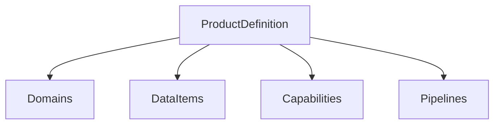

---

# ProductProfile

製品構成の入口。

```cpp
struct ProductProfile
{
    const ProductDefinition& definition;
};
```

## 役割

```text
ProductDefinition へのアクセス入口
```

---

# Product Provider

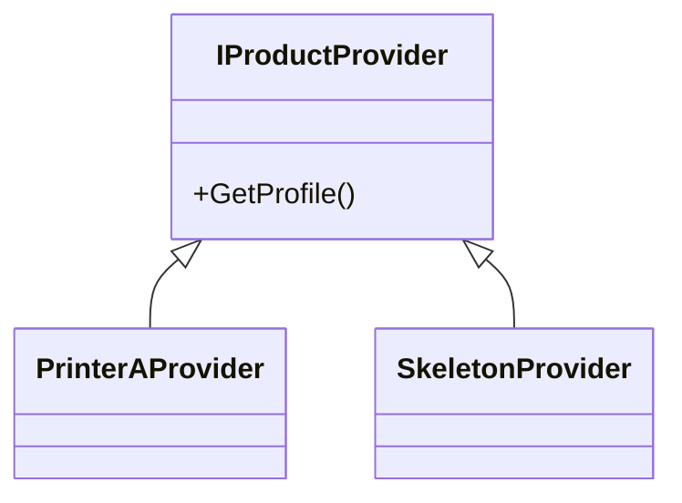

製品固有情報は Provider 経由で取得する。

---

# ProductDefinition

製品全体の宣言的構成情報。

```cpp
struct ProductDefinition
{
    const DomainDefinition* domains;
    std::size_t domainCount;

    const DataItemDefinition* dataItems;
    std::size_t dataItemCount;

    const CapabilityItemDefinition* capabilities;
    std::size_t capabilityCount;

    const PipelineDefinition* pipelines;
    std::size_t pipelineCount;
};
```

## 役割

```text
製品に存在する要素を宣言する

- Domain
- DataItem
- Capability
- Pipeline
```

---

# DataItemDefinition

RIManager における Canonical Data Model。

```cpp
struct DataItemDefinition
{
    RIDataId id;

    std::string_view name;

    std::string_view domain;

    ValueType valueType;
};
```

## 例

```text
TemperatureSensorA
TemperatureSensorB
HumiditySensor

UpperDoorOpen
RightDoorOpen
LeftDoorOpen

JobActive
JobId

StapleLevel
ErrorList
```

---

# Runtime Identification Model

Runtime では `RIDataId` を唯一の識別子として利用する。

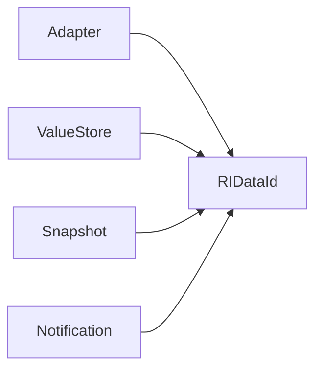

---

# Adapter Responsibility

Adapter は Device 固有データを Canonical Data に正規化する。

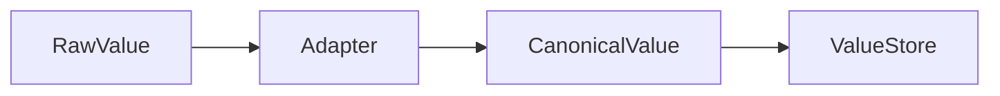

## 例

```text
300.15 Kelvin
 ↓
Adapter
 ↓
27.0 Celsius
```

---

# Storage Responsibility

Storage は Canonical Data の保管と型検証を担当する。

## 責務

```text
Store
Lookup
Type Validation
Snapshot Generation
Snapshot Management
```

---

# Type Validation Policy

型生成責任と型検証責任を分離する。

```text
Adapter
 └ 正しい型を生成する責任

Storage
 └ 型を検証する責任
```

Storage は最後の防壁として機能する。

---

# Data Flow

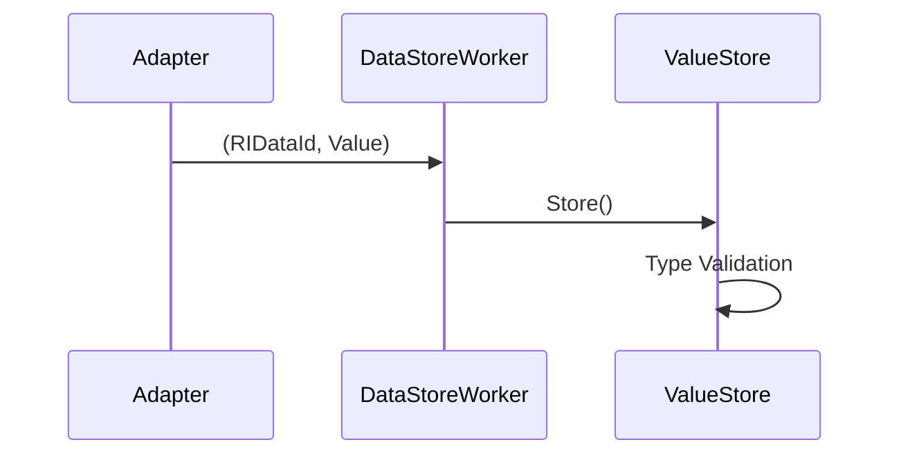

---

# Snapshot Flow

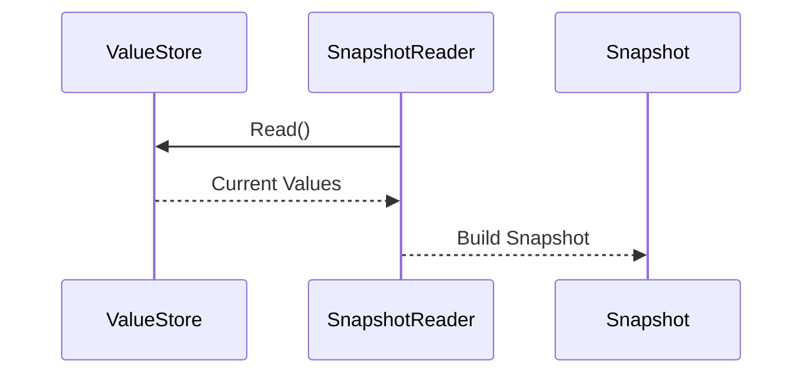

---

# Capability

Capability は製品機能を表す現在状態である。

```text
Environment
PrintReady
Consumable
Job
```

Capability は Snapshot から生成される。

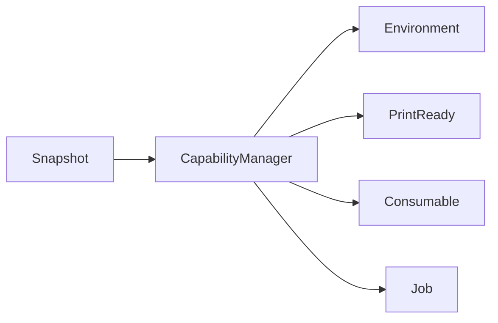

---

# Capability Store

Capability の保持領域。

```cpp
CapabilityStore
```

CapabilityManager は差分検出後に CapabilityStore を更新する。

---

# Capability Flow

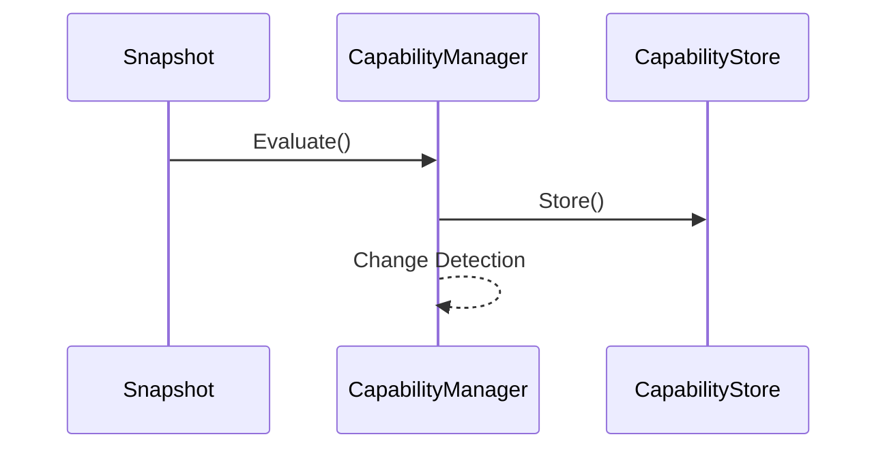

---

# Capability Evaluation Strategy

## 現在

現在は変更 Data に依存する Capability のみを再評価する。

```text
Changed DataId
    ↓
Dependency Lookup
    ↓
Evaluate Capabilities
    ↓
Detect Changes
    ↓
Notify
```

CapabilityManager は ProductDefinition の依存マップを利用して影響 Capability を特定する。

### 利点

```text
不要な再評価を回避
Capability 数増加時も拡張しやすい
通知量を削減可能
```

---

## 将来構想

```text
Dependency Metadata
    ↓
Incremental Evaluation
    ↓
Graph Optimization
```

例

```text
UpperDoorOpen
    ↓
PrintReady

TemperatureSensorA
    ↓
Environment
```

---

# CapabilityInput

Capability 再評価要求。

```cpp
struct CapabilityInput
{
    RIMSnapshot snapshot;

    RIDataId changedDataId;
};
```

## 用途

```text
Snapshot
 └ Capability生成

changedDataId
 └ Data Notification生成

changedDataId
 └ Dependency Lookup
```

---

# Notification

RIManager は Data Notification と Capability Notification を提供する。

---

## Data Notification

Canonical Data 更新通知。

```cpp
RI_TARGET_DATA
```

例

```text
TemperatureSensorA Changed
UpperDoorOpen Changed
ErrorList Changed
```

---

## Capability Notification

Capability 状態変更通知。

```cpp
RI_TARGET_CAPABILITY
```

例

```text
Environment Changed
PrintReady Changed
Consumable Changed
Job Changed
```

---

# Notification Flow

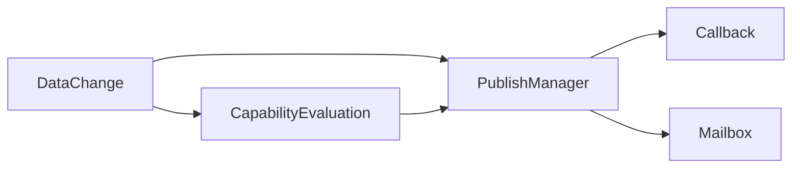

---

# Runtime Processing Flow

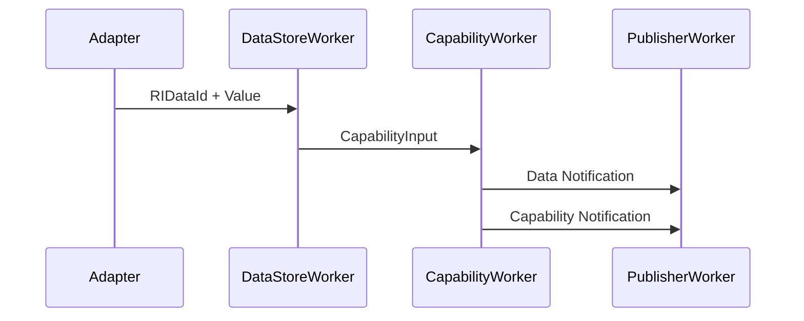

---

# C API

## Lifecycle

```cpp
RIM_Create()
RIM_Start()

RIM_Stop()
RIM_Destroy()
```

## Value API

```cpp
RIM_SetBool()
RIM_SetInt32()
RIM_SetDouble()
RIM_SetBinary()

RIM_GetBool()
RIM_GetInt32()
RIM_GetDouble()
RIM_GetBinary()
```

## ErrorList API

```cpp
RIM_SetErrorList()
RIM_GetErrorList()
```

## Capability API

```cpp
RIM_GetCapability()
```

## Subscription API

```cpp
RIM_Subscribe()
RIM_SubscribeCapability()

RIM_GetNotification()
RIM_GetMailboxCount()

RIM_Unsubscribe()
```

---

# Testing

```text
Unit Test
Integration Test
End-to-End Test
Performance Test
```

## Current Coverage

```text
Canonical Data

✓ Store / Read
✓ Type Validation
✓ Snapshot Build

Capability

✓ Environment
✓ PrintReady
✓ Consumable
✓ Job
✓ Change Detection

Notification

✓ Data Notification
✓ Capability Notification
✓ Callback
✓ Mailbox

ErrorList

✓ SetErrorList
✓ GetErrorList
✓ Deep Copy
✓ Ownership Safety
✓ Callback Notification
✓ Mailbox Notification
✓ End-to-End Notification

Performance

✓ Throughput
✓ Callback Latency
✓ Capability Evaluation
✓ Snapshot Generation
```

---

# Performance Snapshot

```text
Capability Evaluation

10000 Evaluations
Average : 0.61 us
Throughput : 1.6M Eval/sec

Snapshot Build

10000 Builds
Total : 2149 us

Callback Latency

Min : 37 us
Avg : 49 us
P95 : 95 us
P99 : 100 us
```

---

# Current Status

```text
✅ Core / Products Separation
✅ Public API
✅ ProductProfile
✅ ProductProvider
✅ ProductDefinition
✅ DomainDefinition
✅ DataItemDefinition
✅ CapabilityItemDefinition
✅ PipelineDefinition

✅ Runtime Identifier Unification (RIDataId)

✅ Canonical Data Storage
✅ Type Validation

✅ Snapshot Pipeline

✅ CapabilityStore
✅ Dependency Based Capability Evaluation
✅ Capability Change Detection

✅ Data Notification
✅ Capability Notification

✅ Callback Delivery
✅ Mailbox Delivery

✅ ErrorList API
✅ ErrorList Notification
✅ ErrorList End-to-End Test

✅ Functional Tests Green
✅ End-to-End Tests Green
✅ Performance Tests Green

✅ 172 Functional Tests Passed
✅ 6 Performance Tests Passed

⬜ Capability Dependency Metadata Optimization
⬜ Incremental Evaluation Graph
⬜ Notification Batching
⬜ Dependency Visualization
⬜ Advanced Performance Benchmark
```