# RIManager Architecture

ReactiveInfoManager (RIManager) は、製品固有定義と実行エンジンを明確に分離した Capability ベースの情報管理システムである。

RIManager は Device の生データを Canonical Data に正規化し、Canonical Data・Snapshot・Capability・Notification を提供する。

---

# Design Principles

RIManager は以下の責務分離を採用する。

```text
core
    = 実行エンジン (How)

products
    = 製品定義 (What)

products/common
    = 共通ルールライブラリ
```

設計上の基本方針は以下の通り。

```text
core
    は製品を知らない

products
    は製品仕様を宣言する

Runtime
    は RIDataId を唯一の識別子として扱う

DataItemDefinition
    を Canonical Data Model とする

DataItemDefinition
    を唯一のデータ定義ソースとする

Capability
    は Canonical Data から生成する

Notification
    は Data と Capability の両方を扱う

ErrorList
    は Capability ではなく Data として扱う
```

---

# Layer Structure

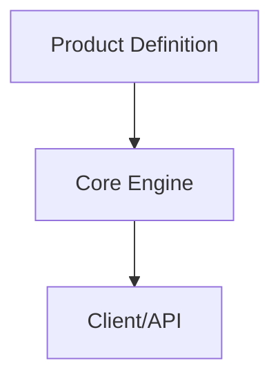

---

# Repository Structure

```text
RIManager
├─ include
│  ├─ rim_api.h
│  ├─ rim_types.h
│  ├─ rim_data_id.h
│  ├─ rim_capability_id.h
│  └─ rim_version.h
│
├─ core
│  ├─ adapter
│  ├─ capability
│  ├─ common
│  ├─ datastore
│  ├─ publisher
│  ├─ snapshot
│  ├─ storage
│  └─ worker
│
├─ products
│  ├─ common
│  ├─ printer_a
│  └─ skeleton
│
├─ test
│  ├─ unit
│  ├─ integration
│  ├─ e2e
│  └─ performance
│
└─ docs
```

---

# Responsibility Separation

## core

core は製品知識を持たない。

持たないべきもの:

```text
PrinterA
ScannerX

TemperatureSensorA
TemperatureSensorB
HumiditySensor

UpperDoorOpen
RightDoorOpen
LeftDoorOpen

Environment
PrintReady
Consumable
Job
```

責務:

```text
入力処理

データ保存

Snapshot生成

Capability生成

差分検出

通知

購読管理
```

主な構成:

```text
StoreDispatcher

ValueStore

AggregateRIMSnapshotReader
RIMSnapshot

CapabilityManager
CapabilityStore

PublishManager
ChangeNotifyManager

SubscriptionStore
```

---

## products

products は製品仕様を保持する。

責務:

```text
どんなDomainが存在するか

どんなDataItemが存在するか

どんなCapabilityが存在するか

どんなPipelineが存在するか

どんな依存関係が存在するか

どんな正規化が必要か
```

---

## products/common

製品横断で再利用可能な定義や処理を配置する。

例:

```cpp
IdentityNormalize()
```

将来候補:

```cpp
PercentNormalize()

KelvinToCelsiusNormalize()

CelsiusToKelvinNormalize()
```

---

# Product Boundary

core と products の境界は ProductProfile である。

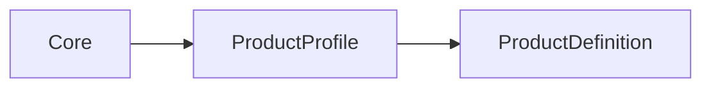

```cpp
struct ProductProfile
{
    const ProductDefinition& definition;
};
```

core は ProductProfile 経由でのみ製品情報へアクセスする。

---

# Product Provider

製品構成の入口。

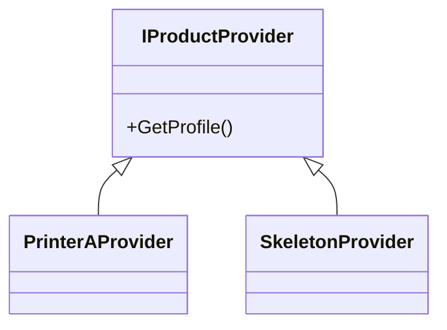

---

# ProductDefinition

製品仕様の中心となる宣言モデル。

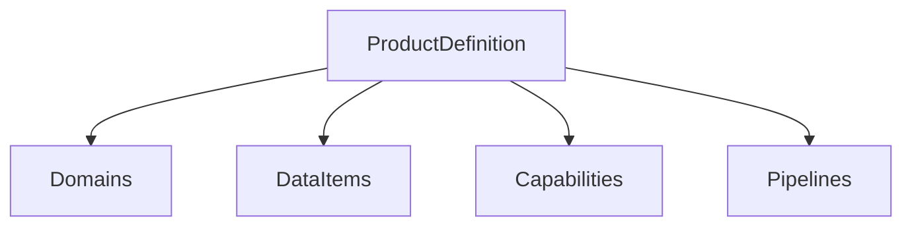

```cpp
struct ProductDefinition
{
    const DomainDefinition* domains;
    std::size_t domainCount;

    const DataItemDefinition* dataItems;
    std::size_t dataItemCount;

    const CapabilityItemDefinition* capabilities;
    std::size_t capabilityCount;

    const PipelineDefinition* pipelines;
    std::size_t pipelineCount;
};
```

ProductDefinition は

```text
製品に何が存在するか
```

のみを定義する。

---

# DataItemDefinition

RIManager における Canonical Data Model。

```cpp
struct DataItemDefinition
{
    RIDataId id;

    std::string_view name;

    std::string_view domain;

    ValueType valueType;
};
```

例:

```text
TemperatureSensorA
TemperatureSensorB
HumiditySensor

UpperDoorOpen
RightDoorOpen
LeftDoorOpen

JobActive
JobId

StapleLevel

ErrorList
```

---

# Data Model

DataItem はシステム内部で扱う正規化後データを定義する。

```text
DataItem
 ├ ID
 ├ Name
 ├ Domain
 └ ValueType
```

現在の設計では

```text
DataItemDefinition
```

が唯一のデータ定義ソースである。

削除済み:

```text
RIMDataDefinition

IDataDefinitionProvider

ProfileAwareDataDefinitionRegistry
```

---

# Runtime Identifier

Runtime では `RIDataId` を利用する。

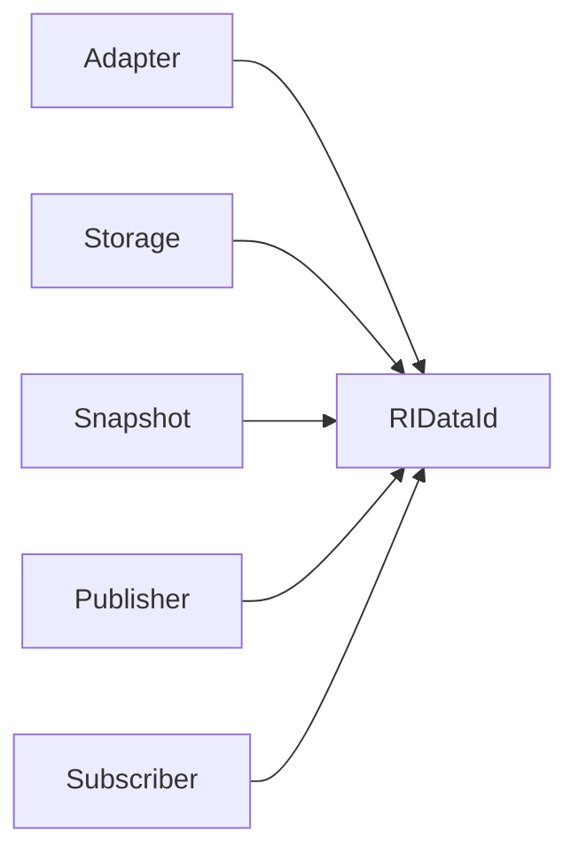

例:

```cpp
SetValue(
    RIDataId id,
    Value value);

FindValue(
    RIDataId id);
```

---

# Sensor Definition

Adapter 入力と Canonical Data の橋渡しを行う。


責務:

```text
Physical Sensor
    ↓
Canonical DataItem
```

現在は製品側で SensorDefinition を管理する。

---

# Normalize Function

正規化処理は products 側に配置する。

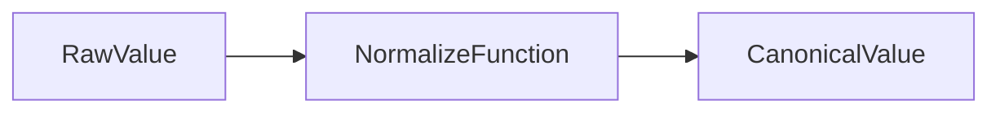

例:

```cpp
IdentityNormalize()
```

---

# Adapter Responsibility

Adapter の責務。

```text
入力受信
↓
正規化
↓
Store投入
```

入力:

```text
Raw Device Data
```

出力:

```text
RIDataId
Canonical Value
```

---

# Adapter Architecture

Rule レイヤは採用しない。

削除済み:

```text
TemperatureSensorARule
TemperatureSensorBRule
HumiditySensorRule
DoorSensorRule

ISensorRule
IdentityRule
```

目標構造:

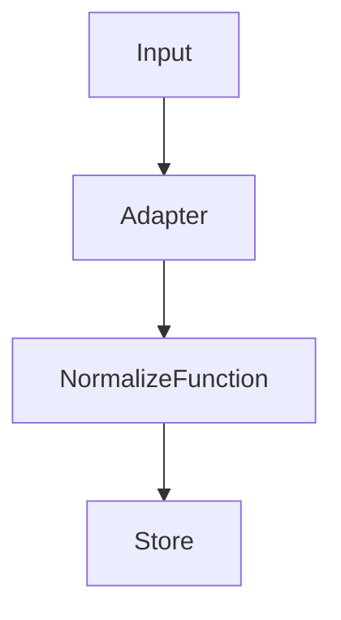

---

# Storage Responsibility

Storage は Canonical Data の保存と検証を担当する。

責務:

```text
Store

Lookup

Type Validation

Snapshot Generation

Snapshot Management
```

---

# Definition Lookup

Storage は ProductDefinition を参照して検索する。

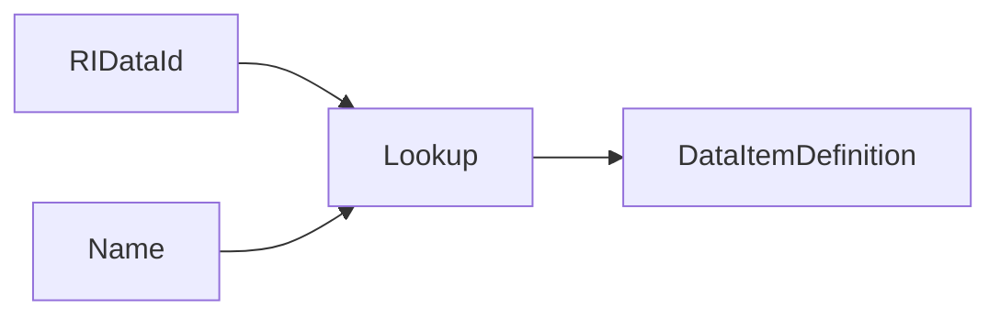

---

# Type Validation Policy

型生成責任と型検証責任を分離する。

```text
Adapter
 └ 正しい型を生成する責任

Storage
 └ 型を検証する責任
```

検証例:

```cpp
definition->valueType
```

と

```cpp
value.GetType()
```

を比較する。

Storage は最後の防壁として機能する。

---

# Runtime Flow

現在の実行パイプライン。

```text
Adapter
    ↓

StoreDispatcher
    ↓

ValueStore
    ↓

AggregateRIMSnapshotReader
    ↓

CapabilityInput
{
    snapshot,
    changedDataId
}

    ↓

CapabilityWorker

    ├ Data Notification
    └ Capability Evaluation

    ↓

PublisherWorker
    ↓

PublishManager
    ↓

ChangeNotifyManager
```

---

# Runtime Architecture

```mermaid
flowchart LR

    Adapter

    StoreInputQueue

    DataStoreWorker

    ValueStore

    AggregateRIMSnapshotReader

    CapabilityInputQueue

    CapabilityWorker

    CapabilityManager

    CapabilityStore

    PublisherInputQueue

    PublisherWorker

    PublishManager

    ChangeNotifyManager

    SubscriptionStore

    SubscriberMailboxManager

    SubscriberMailbox

    NotificationReceiver

    CallbackSubscriptionRegistry

    Adapter
        --> StoreInputQueue

    StoreInputQueue
        --> DataStoreWorker

    DataStoreWorker
        --> ValueStore

    DataStoreWorker
        --> AggregateRIMSnapshotReader

    DataStoreWorker
        --> CapabilityInputQueue

    CapabilityInputQueue
        --> CapabilityWorker

    CapabilityWorker
        --> CapabilityManager

    CapabilityManager
        --> CapabilityStore

    CapabilityWorker
        --> PublisherInputQueue

    PublisherInputQueue
        --> PublisherWorker

    PublisherWorker
        --> PublishManager

    PublishManager
        --> ChangeNotifyManager

    ChangeNotifyManager
        --> SubscriptionStore

    ChangeNotifyManager
        --> SubscriberMailboxManager

    ChangeNotifyManager
        --> CallbackSubscriptionRegistry

    SubscriberMailboxManager
        --> SubscriberMailbox

    SubscriberMailbox
        --> NotificationReceiver
```

---

# CapabilityInput

Capability 再評価要求。

```cpp
struct CapabilityInput
{
    RIMSnapshot snapshot;

    RIDataId changedDataId;
};
```

現在:

```text
snapshot
    → Capability評価

changedDataId
    → Data Notification生成
```

将来:

```text
changedDataId
    ↓
Affected Capability Lookup
    ↓
Partial Capability Evaluation
```

---

# Data Flow

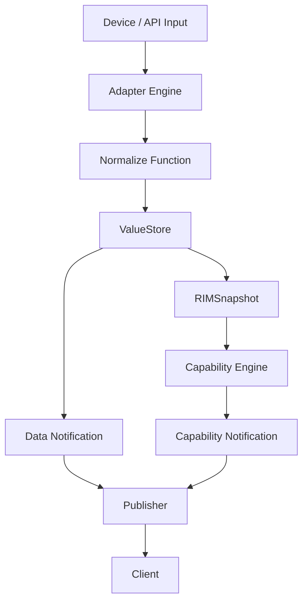

---

# Snapshot Flow

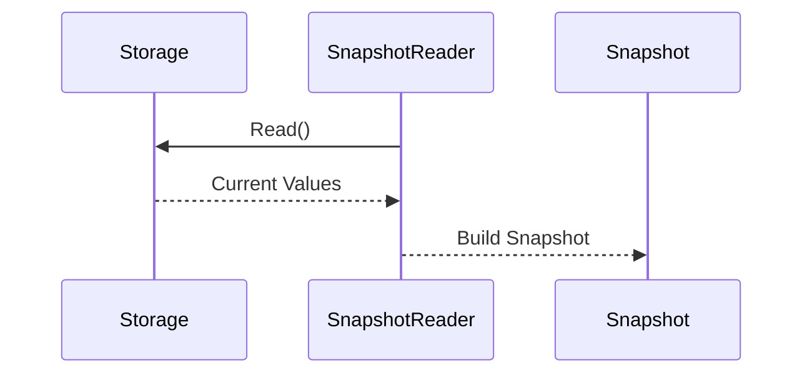

---

# Capability Flow

現在の実装は Snapshot 全体を入力として Capability を評価する。

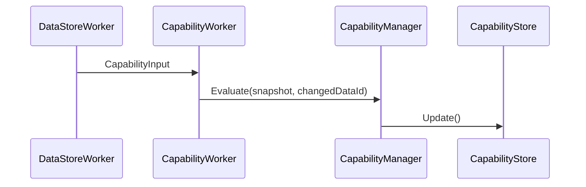

---

# Notification

RIManager は Data Notification と Capability Notification を提供する。

---

## Data Notification

Canonical Data の変更通知。

```cpp
RI_TARGET_DATA
```

例:

```text
TemperatureSensorA

HumiditySensor

UpperDoorOpen

JobId

StapleLevel

ErrorList
```

---

## Capability Notification

Capability 状態変更通知。

```cpp
RI_TARGET_CAPABILITY
```

例:

```text
Environment

PrintReady

Consumable

Job
```

---

# ErrorList

ErrorList は Capability ではなく Data として扱う。

API:

```cpp
RIM_SetErrorList()

RIM_GetErrorList()
```

通知対象:

```cpp
RI_TARGET_DATA
```

End-to-End 経路:

```text
RIM_SetErrorList
    ↓
Store
    ↓
Publish
    ↓
Callback
    ↓
Mailbox
    ↓
RIM_GetErrorList
```

E2E テスト実施済み:

```text
EndToEndCApiErrorListNotificationTest
```

---

# Subscription Model

通知には Callback と Mailbox の両方を提供する。

## Callback

```text
Push Model
```

```cpp
RI_METHOD_CALLBACK
```

---

## Mailbox

```text
Pull Model
```

```cpp
RI_METHOD_MAILBOX
```

---

# Current Capability Evaluation Strategy

現在:

```text
Data Changed
    ↓
Snapshot Build
    ↓
Evaluate All Capabilities
    ↓
Detect Changes
    ↓
Notify
```

利点:

```text
単純

正しさを保証しやすい

依存関係管理不要
```

欠点:

```text
影響しないCapabilityも再評価

Capability数増加で効率低下

Dependency情報を活用していない
```

---

# Future Architecture

将来的には ProductDefinition に依存関係を定義し、

```text
ChangedDataId
    ↓
AffectedCapabilities
    ↓
Evaluate Only Affected Capabilities
    ↓
Notify
```

へ移行する。

例:

```text
UpperDoorOpen
    ↓
Environment

PrintReady
```

---

# Adapter Design Guideline

## Bad

```cpp
TemperatureSensorAAdapter

HumiditySensorAdapter

DoorSensorAdapter
```

理由:

```text
Product知識を持っている
```

---

## Good

```cpp
IAdapter

AdapterDispatcher

AdapterEngine
```

理由:

```text
Productを知らない
```

---

# Placement Rules

## Rule 1

```text
製品固有か？
```

YES

```text
products
```

NO

```text
core
```

---

## Rule 2

```text
DataItem を定義しているか？
```

YES

```text
products
```

NO

```text
core
```

---

## Rule 3

```text
定義か？

実行か？
```

定義

```text
products
```

実行

```text
core
```

---

# Testing Status

## Functional / Unit / Integration / E2E

```text
172 Tests Passed
```

カバー範囲:

```text
Value Store

Snapshot

Capability

Capability Change Detection

Data Notification

Capability Notification

Callback Notification

Mailbox Notification

ErrorList API

ErrorList Notification

ErrorList End-to-End

Subscription

Publisher

Product Definition Validation
```

---

## Performance Tests

```text
6 Tests Passed
```

結果:

```text
Capability Evaluation

10000 Evaluations
Total : 6113 us
Average : 0.61 us
Rate : 1.6M Eval/sec

Snapshot Build

10000 Builds
Total : 2149 us

Callback Latency

Min : 37 us
Avg : 49 us
P95 : 95 us
P99 : 100 us
Max : 100 us

Notification Delivery

10000 Injected
5895 Delivered
58.95%
```

---

# Current Status

```text
✅ Core / Products 分離
✅ ProductProfile 導入
✅ ProductProvider 導入
✅ ProductDefinition 導入
✅ DomainDefinition 導入
✅ DataItemDefinition 導入
✅ CapabilityDefinition 導入
✅ PipelineDefinition 導入

✅ DataItemDefinition を唯一のデータ定義へ統一

✅ Runtime Identifier 統一 (RIDataId)

✅ Adapter 正規化設計
✅ Storage 型検証設計

✅ ProductDefinition Lookup API

✅ Rule レイヤ削除
✅ ProfileAwareDataDefinitionRegistry 削除
✅ IDataDefinitionProvider 削除
✅ RIMDataDefinition 削除

✅ NotificationMailboxReader 導入
✅ SubscriptionStore 導入

✅ Data Notification
✅ Capability Notification

✅ Callback Subscription
✅ Mailbox Subscription

✅ ErrorList API
✅ ErrorList Callback Notification
✅ ErrorList Mailbox Notification
✅ ErrorList End-to-End Test

✅ ChangedDataId 伝搬
✅ CapabilityInput 導入

✅ Functional Tests Green
✅ End-to-End Tests Green
✅ Performance Tests Green

✅ 172 Functional Tests Passed
✅ 6 Performance Tests Passed

⬜ Capability Dependency Metadata

⬜ ChangedDataId → Capability Reverse Lookup

⬜ Partial Capability Evaluation

⬜ Dependency Driven Capability Generation

⬜ Notification Batching

⬜ Advanced Benchmark Suite
```

# Summary

```text
core
    = How

products
    = What

products/common
    = Shared Rules

DataItemDefinition
    = Canonical Data Model

ProductDefinition
    = Product Specification

RIDataId
    = Runtime Identifier

CapabilityInput
    = Snapshot + ChangedDataId

Notification
    = Data + Capability

ErrorList
    = Data
```