# RIManager Architecture

ReactiveInfoManager (RIManager) は、製品定義と実行エンジンを明確に分離した Capability ベースの情報管理システムである。

RIManager は Device の生データを Canonical Data に正規化し、Canonical Data・Snapshot・Capability・Notification を提供する。

---

# Design Principles

RIManager は以下の責務分離を採用する。

```text
core
    = 実行エンジン (How)

products
    = 製品定義 (What)

products/common
    = 共通ルールライブラリ
```

基本方針:

```text
core
    は製品を知らない

products
    は製品仕様を宣言する

Runtime
    は RIDataId を唯一の識別子として扱う

DataItemDefinition
    を Canonical Data Model とする

Capability
    は Canonical Data から生成する

Notification
    は Data と Capability の両方を通知可能とする

ErrorList
    は Data として扱う
```

---

# High Level Architecture

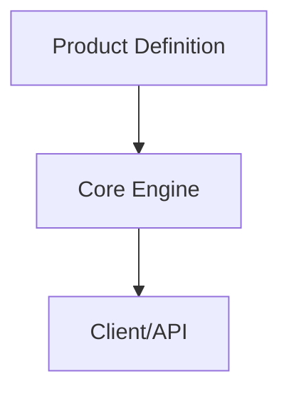

---

# Repository Structure

```text
RIManager
├─ include
├─ core
│  ├─ adapter
│  ├─ capability
│  ├─ common
│  ├─ publisher
│  ├─ storage
│  ├─ store
│  ├─ snapshot
│  └─ worker
│
├─ products
│  ├─ common
│  ├─ printer_a
│  └─ skeleton
│
├─ test
│  ├─ unit
│  ├─ integration
│  ├─ e2e
│  └─ performance
│
└─ docs
```

---

# Responsibility Separation

## core

core は製品知識を持たない。

持たないべきもの:

```text
PrinterA
TemperatureSensorA
TemperatureSensorB
HumiditySensor
Door
Consumable
Job
```

責務:

```text
入力処理

データ保存

Snapshot生成

Capability生成

Notification配送

Subscription管理
```

---

## products

products は製品仕様を保持する。

責務:

```text
どんなDomainが存在するか

どんなDataItemが存在するか

どんなCapabilityが存在するか

どんなPipelineが存在するか

どんな正規化が必要か

どのCapabilityが
何のDataに依存するか
```

---

## products/common

共通ルールライブラリ。

例:

```cpp
IdentityNormalize()
```

将来候補:

```cpp
PercentNormalize()

KelvinToCelsiusNormalize()

CelsiusToKelvinNormalize()
```

---

# Product Boundary

core と products の境界は ProductProfile。

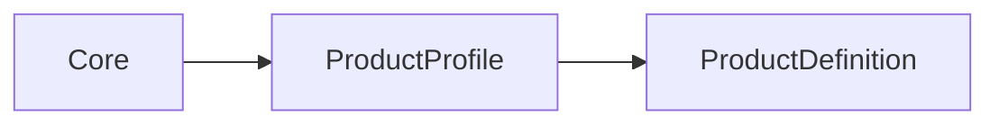

```cpp
struct ProductProfile
{
    const ProductDefinition& definition;
};
```

---

# Product Provider

製品構成の入口。

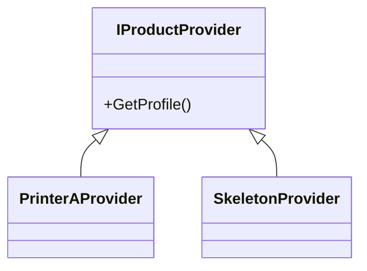

---

# ProductDefinition

製品仕様の中心となる宣言モデル。

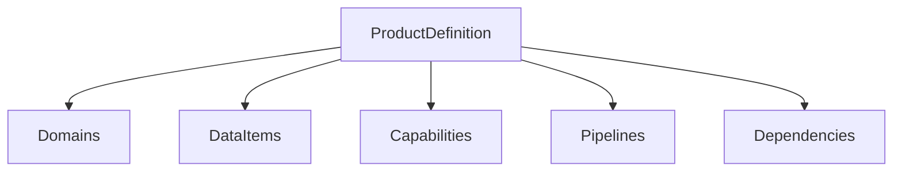

```cpp
struct ProductDefinition
{
    const DomainDefinition* domains;
    std::size_t domainCount;

    const DataItemDefinition* dataItems;
    std::size_t dataItemCount;

    const CapabilityItemDefinition* capabilities;
    std::size_t capabilityCount;

    const PipelineDefinition* pipelines;
    std::size_t pipelineCount;
};
```

---

# DataItemDefinition

RIManager における Canonical Data Model。

```cpp
struct DataItemDefinition
{
    RIDataId id;

    std::string_view name;

    std::string_view domain;

    ValueType valueType;
};
```

例:

```text
TemperatureSensorA
TemperatureSensorB
HumiditySensor

UpperDoorOpen
RightDoorOpen
LeftDoorOpen

JobActive
JobId

StapleLevel

ErrorList
```

---

# Runtime Identifier

Runtime の識別子は `RIDataId` に統一する。

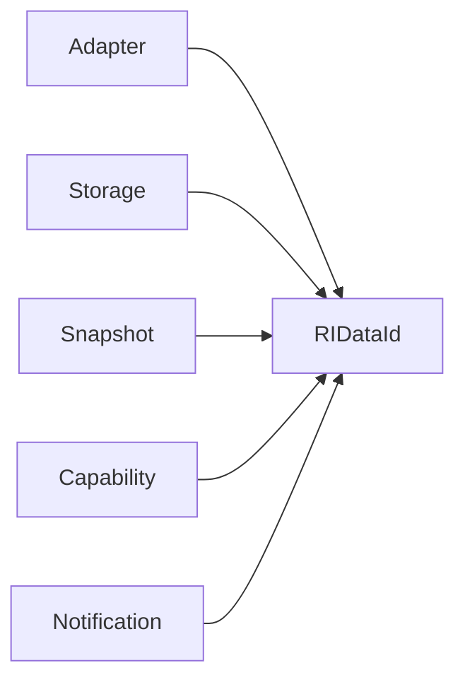

---

# Normalize Function

正規化処理は products 側に配置する。

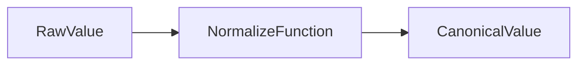

例:

```cpp
IdentityNormalize()
```

---

# Adapter Responsibility

Adapter の責務。

```text
入力受信
↓
正規化
↓
Store投入
```

入力:

```text
Raw Device Data
```

出力:

```text
RIDataId
Canonical Value
```

---

# Adapter Architecture

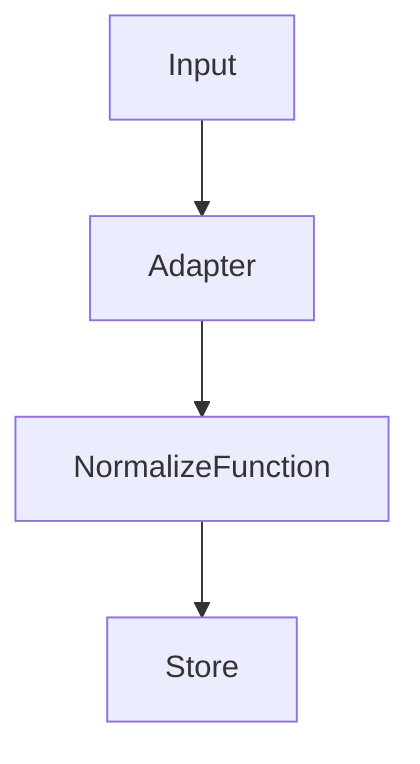

---

# Storage Responsibility

Storage は Canonical Data の保存と検証を担当する。

責務:

```text
Store

Lookup

Type Validation

Snapshot Generation

Snapshot Management
```

---

# Definition Lookup

Storage は ProductDefinition を参照して検索する。

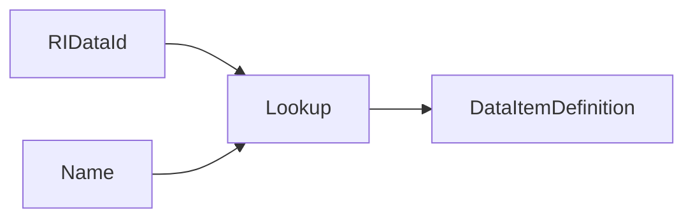

例:

```cpp
FindDataItem(
    product,
    RI_DATA_TEMPERATURE_SENSOR_A);

FindDataItem(
    product,
    "TemperatureSensorA");
```

---

# Type Validation Policy

型生成責任と型検証責任を分離する。

```text
Adapter
 └ 正しい型を生成する責任

Storage
 └ 型を検証する責任
```

Storage は最後の防壁として機能する。

---

# Runtime Architecture

```mermaid
flowchart LR

    Adapter

    StoreInputQueue

    DataStoreWorker

    ValueStore

    AggregateRIMSnapshotReader

    CapabilityInputQueue

    CapabilityWorker

    CapabilityManager

    CapabilityStore

    PublisherInputQueue

    PublisherWorker

    PublishManager

    ChangeNotifyManager

    SubscriptionStore

    SubscriberMailboxManager

    SubscriberMailbox

    NotificationReceiver

    CallbackSubscriptionRegistry

    Adapter
        --> StoreInputQueue

    StoreInputQueue
        --> DataStoreWorker

    DataStoreWorker
        --> ValueStore

    DataStoreWorker
        --> AggregateRIMSnapshotReader

    DataStoreWorker
        --> CapabilityInputQueue

    CapabilityInputQueue
        --> CapabilityWorker

    CapabilityWorker
        --> CapabilityManager

    CapabilityManager
        --> CapabilityStore

    CapabilityWorker
        --> PublisherInputQueue

    PublisherInputQueue
        --> PublisherWorker

    PublisherWorker
        --> PublishManager

    PublishManager
        --> ChangeNotifyManager

    ChangeNotifyManager
        --> SubscriptionStore

    ChangeNotifyManager
        --> SubscriberMailboxManager

    ChangeNotifyManager
        --> CallbackSubscriptionRegistry

    SubscriberMailboxManager
        --> SubscriberMailbox

    SubscriberMailbox
        --> NotificationReceiver
```

---

# Runtime Processing Flow

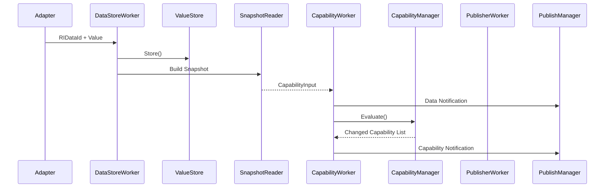

---

# CapabilityInput

Capability 再評価要求。

```cpp
struct CapabilityInput
{
    RIMSnapshot snapshot;

    RIDataId changedDataId;
};
```

現在の用途:

```text
snapshot
    → Capability評価

changedDataId
    → Data Notification生成

changedDataId
    → Dependency Lookup
```

---

# Capability Evaluation Strategy

現在の実装:

```text
Changed DataId
    ↓
Lookup Affected Capabilities
    ↓
Evaluate Affected Capabilities
    ↓
Detect Changes
    ↓
Notify
```

例:

```text
TemperatureSensorA
    ↓
Environment

UpperDoorOpen
    ↓
PrintReady

StapleLevel
    ↓
Consumable

JobId
    ↓
Job
```

利点:

```text
不要な再評価を回避

Capability数増加時の性能劣化を抑制

通知量を削減可能
```

---

# Notification

RIManager は Data Notification と Capability Notification を提供する。

---

## Data Notification

Canonical Data の変更通知。

```cpp
RI_TARGET_DATA
```

対象:

```text
TemperatureSensorA
TemperatureSensorB
HumiditySensor

UpperDoorOpen
RightDoorOpen
LeftDoorOpen

JobActive
JobId

StapleLevel

ErrorList
```

---

## Capability Notification

Capability 状態変更通知。

```cpp
RI_TARGET_CAPABILITY
```

対象:

```text
Environment
PrintReady
Consumable
Job
```

---

# ErrorList Flow

ErrorList は Capability ではなく Data として扱う。

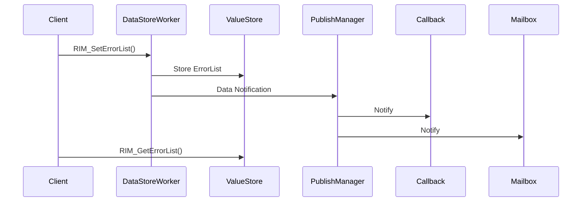

---

# Subscription Model

通知には Callback と Mailbox を提供する。

---

## Callback

```text
Push Model
```

```cpp
RI_METHOD_CALLBACK
```

---

## Mailbox

```text
Pull Model
```

```cpp
RI_METHOD_MAILBOX
```

---

# Layer Responsibilities

## DataStoreWorker

```text
Store

Snapshot生成

CapabilityInput生成
```

---

## CapabilityManager

```text
Dependency Lookup

Capability評価

Capability更新
```

---

## CapabilityStore

```text
Capability保持
```

---

## CapabilityWorker

```text
Data Notification生成

Capability Notification生成
```

---

## PublisherWorker

```text
Publish要求処理
```

---

## PublishManager

```text
Notification実行
```

---

## ChangeNotifyManager

```text
購読条件検索

Mailbox配送

Callback配送
```

---

## SubscriptionStore

```text
購読情報保持
```

---

## SubscriberMailboxManager

```text
Mailbox管理
```

---

## CallbackSubscriptionRegistry

```text
Callback管理
```

---

## NotificationReceiver

```text
Mailbox読取
```

---

# Testing

## Functional Tests

```text
172 Tests Passed
```

カバー範囲:

```text
Value Store

Snapshot

Capability

Dependency Evaluation

Data Notification

Capability Notification

Callback

Mailbox

ErrorList

ErrorList Notification

ErrorList End-to-End
```

---

## Performance Tests

```text
6 Tests Passed
```

### 結果

```text
Capability Evaluation

10000 Evaluations
Total : 6113 us
Average : 0.61 us
Rate : 1.6M Eval/sec

Snapshot Build

10000 Builds
Total : 2149 us

Callback Latency

Min : 37 us
Avg : 49 us
P95 : 95 us
P99 : 100 us
Max : 100 us
```

---

# Placement Rules

## Rule 1

```text
製品固有か？
```

YES

```text
products
```

NO

```text
core
```

---

## Rule 2

```text
定義か？
実行か？
```

定義

```text
products
```

実行

```text
core
```

---

## Rule 3

```text
DataItem を定義しているか？
```

YES

```text
products
```

NO

```text
core
```

---

# Current Status

```text
✅ Core / Products Separation
✅ ProductProfile
✅ ProductProvider
✅ ProductDefinition
✅ DomainDefinition
✅ DataItemDefinition
✅ CapabilityDefinition
✅ PipelineDefinition

✅ Canonical Data Model

✅ Runtime Identifier Unification (RIDataId)

✅ Adapter Normalization

✅ Type Validation

✅ Snapshot Pipeline

✅ Dependency-Based Capability Evaluation

✅ Capability Store

✅ Data Notification
✅ Capability Notification

✅ Callback Subscription
✅ Mailbox Subscription

✅ ErrorList API
✅ ErrorList Notification
✅ ErrorList End-to-End Test

✅ Functional Tests Green
✅ End-to-End Tests Green
✅ Performance Tests Green

✅ 172 Functional Tests Passed
✅ 6 Performance Tests Passed

⬜ Dependency Metadata Visualization

⬜ Notification Batching

⬜ Advanced Benchmark Suite
```

# Summary

```text
core
    = How

products
    = What

products/common
    = Shared Rules

ProductDefinition
    = Product Specification

DataItemDefinition
    = Canonical Data Model

RIDataId
    = Runtime Identifier

CapabilityInput
    = Snapshot + ChangedDataId

Notification
    = Data + Capability

ErrorList
    = Data
```