# RIManager Main Sequence

## End-to-End Runtime Sequence

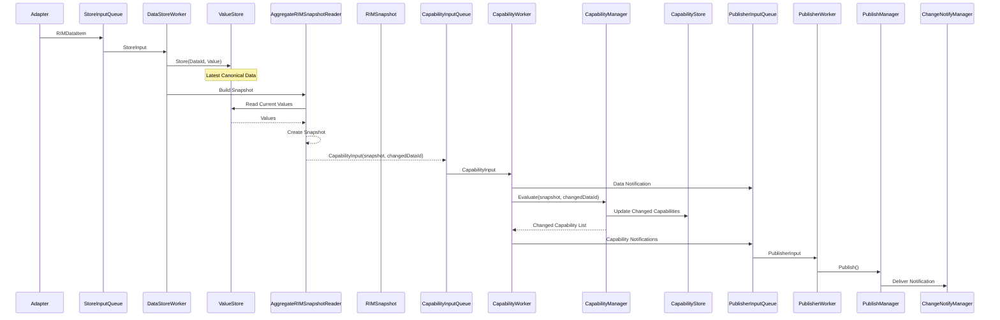

---

# Runtime Processing Sequence

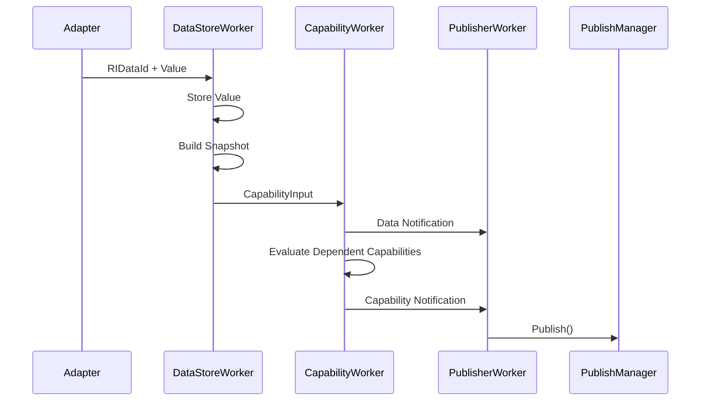

---

# RIManager Module

## Architecture Overview

```mermaid
flowchart LR

    Adapter

    StoreInputQueue

    DataStoreWorker

    ValueStore

    AggregateRIMSnapshotReader

    CapabilityInputQueue

    CapabilityWorker

    CapabilityManager

    CapabilityStore

    PublisherInputQueue

    PublisherWorker

    PublishManager

    ChangeNotifyManager

    SubscriptionStore

    SubscriberMailboxManager

    SubscriberMailbox

    NotificationReceiver

    CallbackSubscriptionRegistry

    Adapter
        --> StoreInputQueue

    StoreInputQueue
        --> DataStoreWorker

    DataStoreWorker
        --> ValueStore

    DataStoreWorker
        --> AggregateRIMSnapshotReader

    DataStoreWorker
        --> CapabilityInputQueue

    CapabilityInputQueue
        --> CapabilityWorker

    CapabilityWorker
        --> CapabilityManager

    CapabilityManager
        --> CapabilityStore

    CapabilityWorker
        --> PublisherInputQueue

    PublisherInputQueue
        --> PublisherWorker

    PublisherWorker
        --> PublishManager

    PublishManager
        --> ChangeNotifyManager

    ChangeNotifyManager
        --> SubscriptionStore

    ChangeNotifyManager
        --> SubscriberMailboxManager

    ChangeNotifyManager
        --> CallbackSubscriptionRegistry

    SubscriberMailboxManager
        --> SubscriberMailbox

    SubscriberMailbox
        --> NotificationReceiver
```

---

# Layer Structure

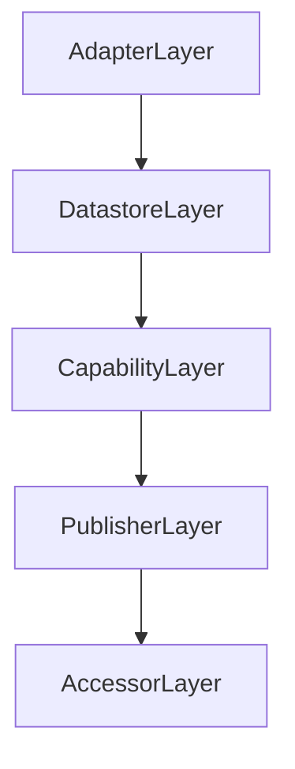

---

# Datastore Layer

## Responsibility

```text
Canonical Data 保持

Snapshot生成

Capability再評価要求生成

ChangedDataId伝搬
```

## Components

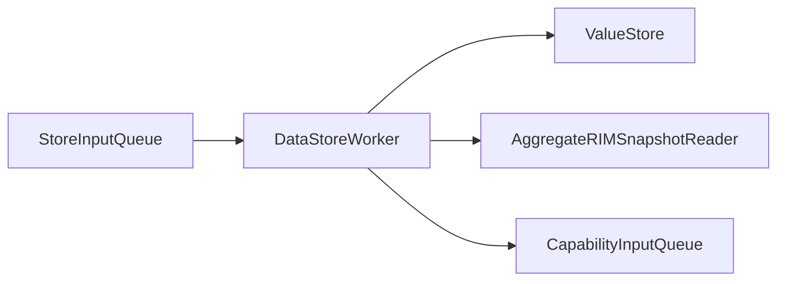

---

# Capability Layer

## Responsibility

```text
Snapshot評価

Capability生成

影響Capability判定

Data Notification生成

Capability Notification生成
```

## CapabilityInput

```cpp
struct CapabilityInput
{
    RIMSnapshot snapshot;

    RIDataId changedDataId;
};
```

## Current Usage

```text
snapshot
    → Capability生成

changedDataId
    → Data Notification生成

changedDataId
    → Capability Dependency Lookup
```

## Components

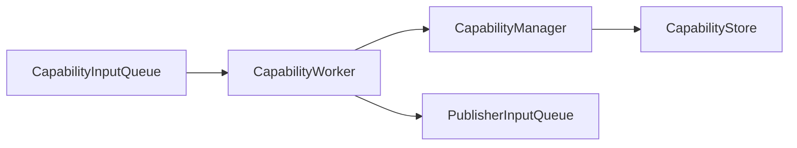

---

# Publisher Layer

## Responsibility

```text
Notification配送

Subscription管理

Mailbox通知

Callback通知

Periodic通知
```

## Components

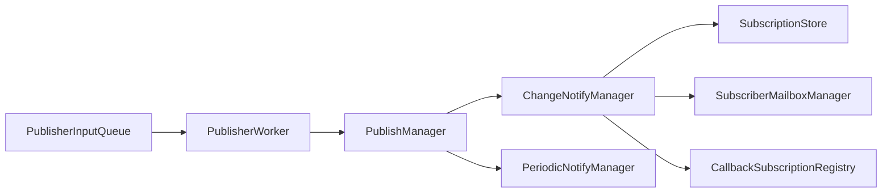

---

# Accessor Layer

## Responsibility

```text
Capability取得

Notification取得

Snapshot取得
```

## Components

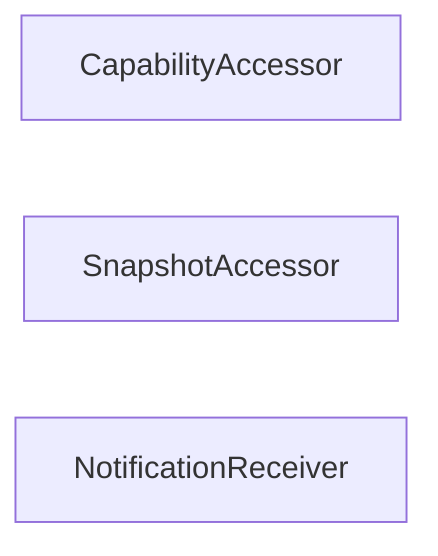

---

# Data Notification Flow

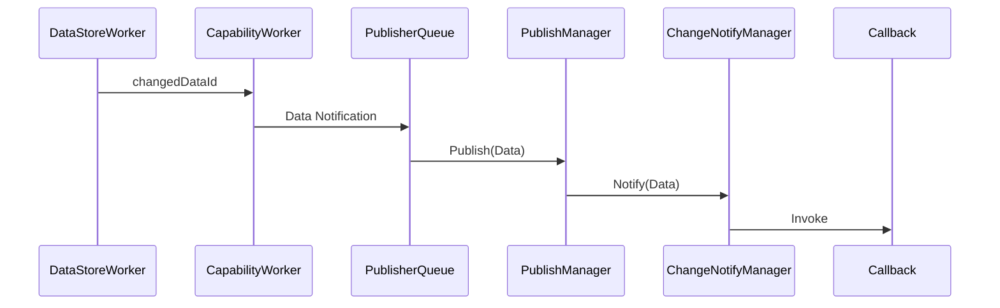

---

# Capability Notification Flow

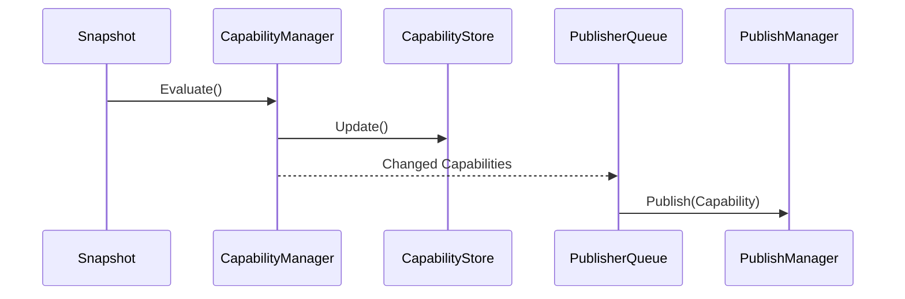

---

# ErrorList Flow

ErrorList は Data として扱われる。

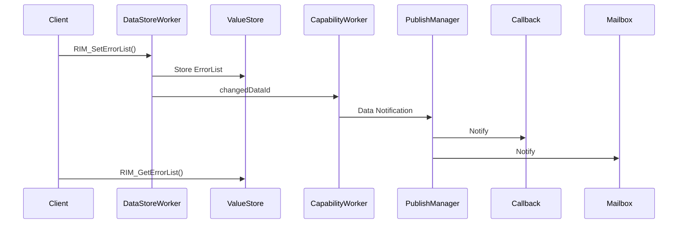

---

# Notification Model

RIManager は 2 種類の通知を提供する。

---

## Data Notification

```cpp
RI_TARGET_DATA
```

対象:

```text
TemperatureSensorA
TemperatureSensorB
HumiditySensor

UpperDoorOpen
RightDoorOpen
LeftDoorOpen

JobActive
JobId

StapleLevel

ErrorList
```

---

## Capability Notification

```cpp
RI_TARGET_CAPABILITY
```

対象:

```text
Environment
PrintReady
Consumable
Job
```

---

# Current Capability Evaluation Strategy

現在の実装は Data Dependency ベースである。

```text
Changed DataId
    ↓
Lookup Affected Capabilities
    ↓
Evaluate Affected Capabilities
    ↓
Detect Changes
    ↓
Notify
```

例:

```text
TemperatureSensorA
    ↓
Environment

UpperDoorOpen
    ↓
PrintReady

StapleLevel
    ↓
Consumable

JobId
    ↓
Job
```

## 利点

```text
不要な再評価を回避

Capability数増加時も拡張しやすい

通知量を削減できる
```

---

# Future Direction

```text
Capability Dependency Metadata
    ↓
Dependency Graph
    ↓
Incremental Evaluation
    ↓
Notification Optimization
```

例:

```text
UpperDoorOpen
    ↓
PrintReady

TemperatureSensorA
    ↓
Environment
```

---

# Module Responsibilities

## ValueStore

```text
RIDataId → Value保持
```

---

## AggregateRIMSnapshotReader

```text
ValueStore → Snapshot生成
```

---

## DataStoreWorker

```text
Store

Snapshot生成

CapabilityInput生成
```

---

## CapabilityManager

```text
Snapshot評価

Dependency Lookup

Capability生成
```

---

## CapabilityStore

```text
Capability保持
```

---

## CapabilityWorker

```text
Data Notification生成

Capability評価

Capability Notification生成
```

---

## PublisherWorker

```text
PublisherInput解釈
```

---

## PublishManager

```text
通知実行
```

---

## ChangeNotifyManager

```text
購読条件検索

Mailbox通知

Callback通知
```

---

## SubscriptionStore

```text
購読条件保持

通知先検索
```

---

## SubscriberMailboxManager

```text
Mailbox管理
```

---

## SubscriberMailbox

```text
Pull型通知キュー
```

---

## CallbackSubscriptionRegistry

```text
Push型通知購読管理
```

---

## NotificationReceiver

```text
Mailbox読取
```

---

# Testing Status

## Functional Tests

```text
172 Tests Passed
```

### Coverage

```text
Data Storage

Snapshot Generation

Capability Evaluation

Capability Change Detection

Data Notification

Capability Notification

Callback Delivery

Mailbox Delivery

ErrorList API

ErrorList Notification

End-to-End Notification
```

---

## Performance Tests

```text
6 Tests Passed
```

### Results

```text
Capability Evaluation

10000 Evaluations
Total : 6113 us
Average : 0.61 us
Rate : 1.6M Eval/sec

Snapshot Build

10000 Builds
Total : 2149 us

Callback Latency

Min : 37 us
Avg : 49 us
P95 : 95 us
P99 : 100 us
Max : 100 us

Notification Delivery

10000 Injected
5895 Delivered
58.95%
```

---

# Current Status

```text
✅ Data Notification

✅ Capability Notification

✅ Callback Subscription

✅ Mailbox Subscription

✅ Periodic Notification

✅ ChangedDataId Propagation

✅ Dependency-Based Capability Evaluation

✅ Capability Store

✅ ErrorList API

✅ ErrorList Callback Notification

✅ ErrorList Mailbox Notification

✅ ErrorList End-to-End Test

✅ Core / Products Separation

✅ Functional Tests Green

✅ Performance Tests Green

✅ 172 Functional Tests Passed

✅ 6 Performance Tests Passed

⬜ Dependency Graph Optimization

⬜ Notification Batching

⬜ Capability Evaluation Visualization

⬜ Advanced Benchmark Suite
```