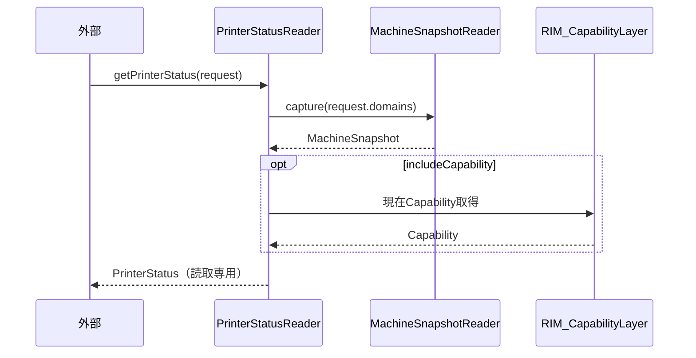

# Accessor Layer 仕様設計書

## 1. 概要

Accessor Layerは、RIM_DatastoreLayerの現在値およびRIM_CapabilityLayerの現在状態（Capability）を、
外部から任意タイミングで参照可能にする参照専用Layerである。

本Layerは**Pull（要求に応じた参照提供）**を担い、状態変化の**通知（Push）は行わない**。
通知はRIM_PublisherLayerの責務である。

---

## 2. 用語

| 用語 | 説明 |
|------|------|
| PrinterStatus | 外部が参照する製品状態のスナップショット的表現 |
| 現在値 | RIM_DatastoreLayerが保持する観測事実の最新値 |
| 現在Capability | RIM_CapabilityLayerが最後に生成したCapability |

---

## 3. 位置づけ

```mermaid
flowchart TD
    DS[RIM_DatastoreLayer] -. 現在値参照 .-> Acc[Accessor Layer（参照専用）]
    Cap[RIM_CapabilityLayer] -. 現在Cap参照 .-> Acc
    Ext[外部（UI/診断/保守ツール等）] -->|getPrinterStatus()| Acc
```

Accessor LayerはRIM_PublisherLayer（Push）と対を成し、外部が「今の状態を知りたい」
任意のタイミングで参照するための入口を提供する。

---

## 4. 目的

- DataStore / Capability の現在値を外部から取得可能にする
- 任意タイミングでの参照を提供する
- 配信（Push）とは独立した参照経路を提供する

---

## 5. 責務

- RIM_DatastoreLayerの現在値の参照提供
- RIM_CapabilityLayerの現在状態の参照提供
- 参照要求に対する読み取り専用データの返却


---

## 6. 非責務

- 状態変化の通知（それはRIM_PublisherLayer）
- 状態の保持（正本はDataStore / 現在CapはCapabilityが保持）
- 状態の解釈・判断
- データの更新

> drawio注記「ステータスが必要なところで定義してもらうため保持しない」に準拠し、
> Accessor Layerは自前で状態を保持せず、都度DataStore/Capabilityから取得して返す。

---

## 7. コンポーネント構成

Accessor Layerは以下のコンポーネントで構成される。

- PrinterStatusReader

```mermaid
flowchart LR
    subgraph AccessorLayer
        PSR[PrinterStatusReader]
    end
    PSR -->|capture(request)| MSR[MachineSnapshotReader（DataStore）]
    PSR -->|現在Cap取得| Cap[RIM_CapabilityLayer]
    Ext[外部] -->|getPrinterStatus| PSR
```

### 7.1 PrinterStatusReader

外部からの参照要求に応じ、DataStoreの現在値（MachineSnapshotReader経由）および
RIM_CapabilityLayerの現在状態を取得して返す。

#### 7.1.1 提供IF
| IF | 内容 |
|----|------|
| getPrinterStatus(request) | 指定範囲の現在値／現在Capabilityを読み取り専用で返す |

#### 7.1.2 非責務
- 状態保持を行わない
- 通知を行わない

---

## 8. データモデル

```text
struct PrinterStatusRequest {
    RegistryDomainSet domains;      // 参照したい範囲（任意）
    bool includeCapability;         // 現在Capを含めるか
}

struct PrinterStatus {
    optional<MachineSnapshot> data;       // DataStore現在値（読取専用）
    optional<Capability>      capability; // 現在Capability（読取専用）
}
```

PrinterStatusは読み取り専用・取得時点整合とする。

---

## 9. 処理フロー



---

## 10. 設計方針

### 10.1 Pull方式
Accessor Layerは要求に応じて返すPull方式である。能動的な配信は行わない。

### 10.2 状態非保持
Accessor Layerは状態を保持せず、正本（DataStore）と現在Cap（Capability）から都度取得する。
これにより二重管理による不整合を避ける。

### 10.3 Publisherとの分離
「変化を届ける」＝Publisher（Push）、「今を尋ねる」＝Accessor（Pull）と役割を分離する。

---

## 11. 制約事項

- Accessor LayerはRIM_DatastoreLayer内部を直接参照せず、MachineSnapshotReader経由で取得する
- Accessor Layerは状態を保持しない
- Accessor Layerは通知を行わない

---

## 12. 非機能要件

- 参照は読み取り専用・取得時点整合であること
- 参照処理がDataStore/Capabilityの更新処理を阻害しないこと
- コンポーネント単位でテスト可能であること
