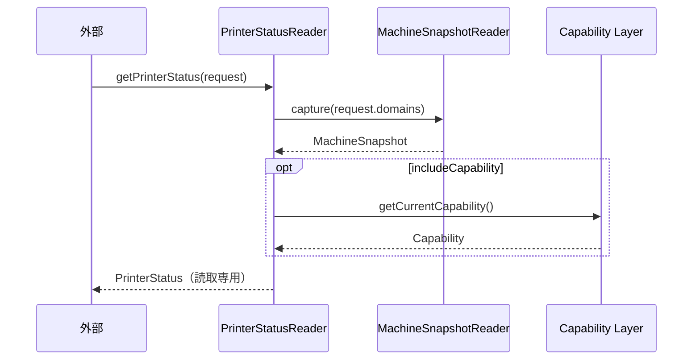

# Accessor Layer 詳細設計書

本書は `AccessorLayer仕様設計書.md` を親とし、PrinterStatusReaderの内部構造・
インターフェース・排他・処理アルゴリズムを定義する。

---

## 1. 構成

```mermaid
flowchart LR
    Ext[外部（UI/診断/保守）]
    subgraph AccessorLayer
        PSR[PrinterStatusReader]
    end
    MSR[MachineSnapshotReader（DataStore）]
    CapRef[Capability 現在状態参照IF]

    Ext -->|getPrinterStatus(request)| PSR
    PSR -->|capture(domains)| MSR
    PSR -->|現在Cap取得| CapRef
```

Accessor Layerは状態を保持せず、都度DataStore（MachineSnapshotReader）と
Capability Layer（現在状態参照）から取得して合成し返す。

---

## 2. データモデル

```cpp
struct PrinterStatusRequest {
    RegistryDomainSet domains;        // DataStore参照範囲（空=既定範囲）
    bool              includeCapability = false;
};

struct PrinterStatus {
    std::optional<MachineSnapshot> data;        // DataStore現在値（読取専用・不変）
    std::optional<Capability>      capability;  // 現在Capability（読取専用）
    Timestamp                      capturedAt;  // 取得時刻
};
```

- `PrinterStatus` は取得時点整合の読み取り専用スナップショットとする。

---

## 3. PrinterStatusReader

### 3.1 依存
- `IMachineSnapshotReader`（DataStore Layer）
- Capability Layerの現在状態参照IF（**確定**：`std::shared_ptr<const CapabilitySet> getCurrentCapability()`。
  不変オブジェクトのatomic shared_ptr取得のため**別スレッドから安全に読める**。
  Capability詳細 §1.2/§3.1 参照。起動時の初期フル評価により常に値が存在する）

### 3.2 提供IF
```cpp
PrinterStatus getPrinterStatus(const PrinterStatusRequest& request) const;
```

### 3.3 処理アルゴリズム
```text
1. request.domains から SnapshotRequest を構築
2. MachineSnapshotReader.capture(request) で現在値を取得
3. request.includeCapability が真なら Capability Layer から現在Capを取得
4. PrinterStatus に詰めて返す（capturedAt を付与）
```

### 3.4 排他
- Accessor自身はロックを持たない。
- 現在値の整合はMachineSnapshotReader（Registry単位ロック・短時間コピー）に委ねる。
- 現在Capの取得はCapability Layerの参照IFに委ねる（Capabilityは不変オブジェクト前提）。

---

## 4. シーケンス



---

## 5. エラー処理

| 事象 | 挙動 |
|------|------|
| capture失敗 | data を空optionalで返す（もしくはエラー通知。方針は§7で確定） |
| 現在Cap未生成 | capability を空optionalで返す |

---

## 6. 非機能・原則の対応

| 要件 | 担保 |
|------|------|
| 読取専用・取得時点整合 | MachineSnapshotのコピー + 不変Capability |
| 更新処理を阻害しない | 短時間ロックのcaptureのみ・自前状態なし |
| Publisherとの分離 | Pull専用・通知なし |

---

## 7. 次段（未確定）

- capture失敗時の返却方針（空 vs エラー）
  ※「未要求」と「取得失敗」をoptionalだけでは区別できない点に注意（レビューM-7）。
  captureのResult化と合わせて確定する
- 既定参照範囲（domains省略時）の定義
- dataとcapabilityは**取得時点が異なる**（dataは今のRegistry、capabilityは最後のnotify時点）。
  相互整合を保証しない旨のPrinterStatus契約明記（レビューM-10）

（確定済み：getCurrentCapability＝atomic shared_ptr方式・§3.1）
