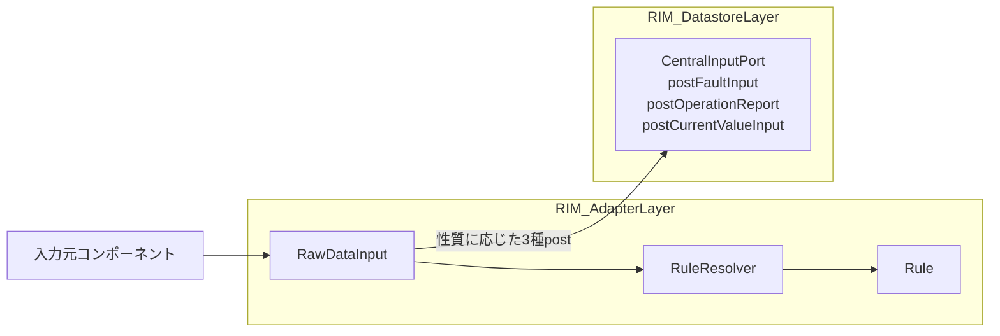
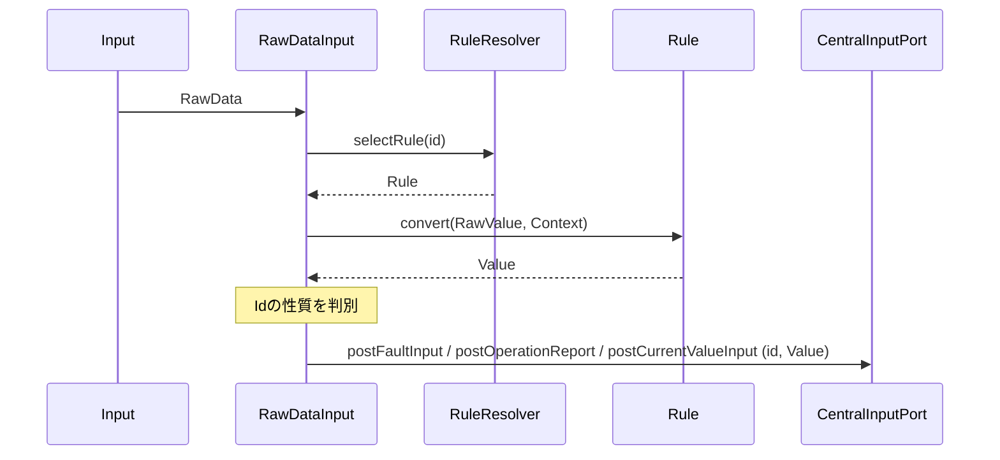

# 1. 概要

RIM_AdapterLayerは外部コンポーネントから入力されるデータをシステム内部で利用可能な形式へ正規化し、RIM_DatastoreLayerへ受け渡す責務を持つ。

本Layerは外部仕様とシステム内部仕様の境界として機能し、後続Layerから外部仕様の差異を隠蔽する。

---

# 2. 背景

外部コンポーネントごとに以下の差異が存在する。

- データ形式の違い
- 単位やスケールの違い
- データ表現の違い

これらの差異を後続Layerで扱う場合、RIM_DatastoreLayerやRIM_CapabilityLayerが外部仕様へ依存することになる。

そのため、本システムでは外部仕様との差異をRIM_AdapterLayerで吸収し、後続Layerでは統一された内部形式のみを扱う構成を採用する。

---

# 3. 目的

RIM_AdapterLayerの目的は以下である。

- 外部仕様をシステム内部仕様へ変換する
- 後続Layerを外部仕様から独立させる
- データ正規化処理を集約する
- データ種別追加時の変更影響を局所化する

---

# 4. 責務

RIM_AdapterLayerは以下の責務を持つ。

- 外部入力の受理
- 正規化処理の選択
- データ正規化
- 入力性質の判別（Fault / OperationReport / CurrentValue）
- RIM_DatastoreLayerへのデータ送信（性質に応じた3種postの選択）

> **入力性質の判別（GAP-1）**：RIM_DatastoreLayerの入口はCentralInputPortの3種post
> （postFaultInput / postOperationReport / postCurrentValueInput）である。
> RIM_AdapterLayerは識別子（Id）が意味する性質に応じて呼び出すpostを選択する。
> DataStore側はpost種別とIdの分類の一致を検証する（RIM_DatastoreLayer §6.1）。

---

# 5. 非責務

RIM_AdapterLayerは以下を責務としない。

- データの意味解釈
- 状態判定
- ビジネスロジック
- アラーム判定
- 異常値補正
- データ保持
- 状態管理

これらはRIM_CapabilityLayerまたはRIM_DatastoreLayerの責務とする。

---

# 6. コンポーネント構成

RIM_AdapterLayerは以下のコンポーネントにより構成される。

- RawDataInput
- RuleResolver
- Rule群

RIM_DatastoreLayerは以下のインターフェースを提供する。

- CentralInputPort（postFaultInput / postOperationReport / postCurrentValueInput）

RIM_AdapterLayerはRIM_DatastoreLayerが提供するCentralInputPortの3種postを介してデータを送信する。
呼び出すpostは入力性質（Fault / OperationReport / CurrentValue）に応じて選択する。

RuleResolverは識別子に応じて適用するRuleを決定する責務を持つ。

---

# 7. データモデル

## 7.1 用語定義

| 用語 | 説明 |
|--------|--------|
| 識別子 | データ種別を識別するための識別子 |
| データ種別 | 温度、圧力などの論理的なデータ分類単位 |
| RawValue | 入力元コンポーネントから受信した未変換データ |
| Value | Ruleによる正規化後の標準データ |
| Context | 正規化処理に利用する補助情報 |

## 7.2 識別子

識別子はシステムが公開する論理識別子である。

入力元コンポーネントは識別子を使用してデータ種別を表現する。

例：

| データ種別 | 識別子 |
|------------|---------|
| 温度 | Temperature |
| 圧力 | Pressure |

識別子は以下の用途で利用される。

- Rule選択
- DataStoreにおけるデータ識別

RIM_DatastoreLayerでは識別子をキーとしてデータを管理する。

## 7.3 Context

Contextはデータ変換時に利用する補助情報である。

Contextはデータ本体には含まれず、Ruleによる正規化処理時のみ利用される。

例：

- 単位
- センサ種別
- スケール係数

---

# 8. 処理フロー

---

# 9. 設計方針

## 9.1 責務分離方針

外部仕様との差異はRIM_AdapterLayerで吸収する。

RIM_DatastoreLayer以降では外部仕様を意識せず、統一されたデータ表現のみを扱う。

## 9.2 データ正規化方針

すべての入力データは識別子、RawValueおよびContextとして受理される。

RuleはRawValueをValueへ変換する。

後続LayerはValueのみを扱う。

後続Layerは入力元固有フォーマットを扱わない。

## 9.3 拡張方針

新たなデータ種別追加時は対応するRuleを追加することで対応する。

既存コンポーネントの変更を最小化する。

---

# 10. 設計判断

## 10.1 入力方式

### 10.1.1 候補

- Push方式
- Pull方式

### 10.1.2 採用

Push方式

### 10.1.3 理由

- 入力データ発生時に即時処理できる
- RIM_AdapterLayerが入力元の状態を管理する必要がない
- RIM_AdapterLayerがポーリング処理を持たずに済む

### 10.1.4 制約

- 入力元からのPush入力を前提とする
- RIM_AdapterLayerから入力元へデータ取得要求は行わない

## 10.2 正規化方式

### 10.2.1 候補

- switch/ifによる集中管理方式
- Rule方式

### 10.2.2 採用

Rule方式

### 10.2.3 理由

- データ種別追加時の変更影響を局所化できる
- Rule単位でテスト可能
- 責務分離を維持しやすい
- 識別子ごとの差異をRuleへ集約できる

## 10.3 Layer間連携方式

### 10.3.1 候補

- DataStore直接呼び出し方式
- キューイング方式

### 10.3.2 採用

キューイング方式

### 10.3.3 理由

- RIM_AdapterLayerとRIM_DatastoreLayerを疎結合化できる
- 入力処理と保存処理を分離できる
- 将来的な拡張に対応しやすい

---

# 11. 制約事項

## 11.1 アーキテクチャ制約

- RIM_AdapterLayerはDataStore内部状態へアクセスしない
- RIM_AdapterLayerはRIM_CapabilityLayerへ依存しない
- RuleはRIM_DatastoreLayerへ依存しない

## 11.2 機能制約

- RIM_AdapterLayerは意味解釈を行わない
- RIM_AdapterLayerは状態を保持しない
- Ruleは状態を保持しない
- Ruleはビジネスロジックを持たない

---

# 12. 非機能要件

- 処理は軽量であること
- Rule単位で単体テスト可能であること
- データ種別追加時の変更影響を局所化できること
- 障害時に影響範囲がRIM_AdapterLayer内で限定されること

---

# 13. 将来拡張

## 13.1 データ種別拡張

- Rule追加によるデータ種別拡張

## 13.2 Context拡張

- Context属性追加

## 13.3 Rule選択方式拡張

- Rule選択条件の拡張

## 13.4 入力元拡張

- データ入力元の追加

## 13.5 観測時刻情報への対応

現時点では観測時刻(timestamp)は本Layerの責務対象外とする。

ただし、観測時刻管理が必要となった場合は、RIM_AdapterLayerでの付与方式を検討する。