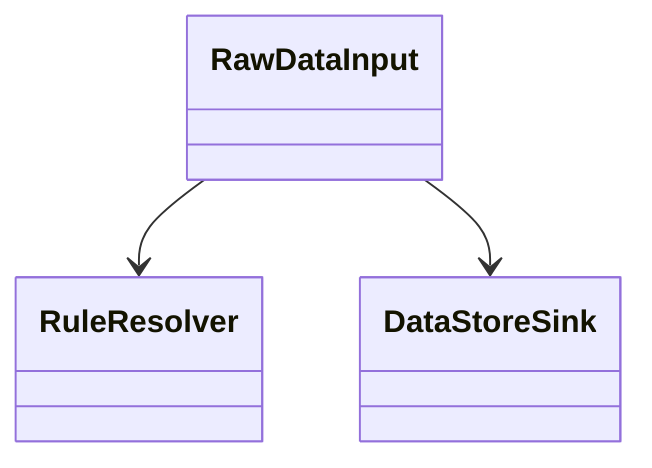
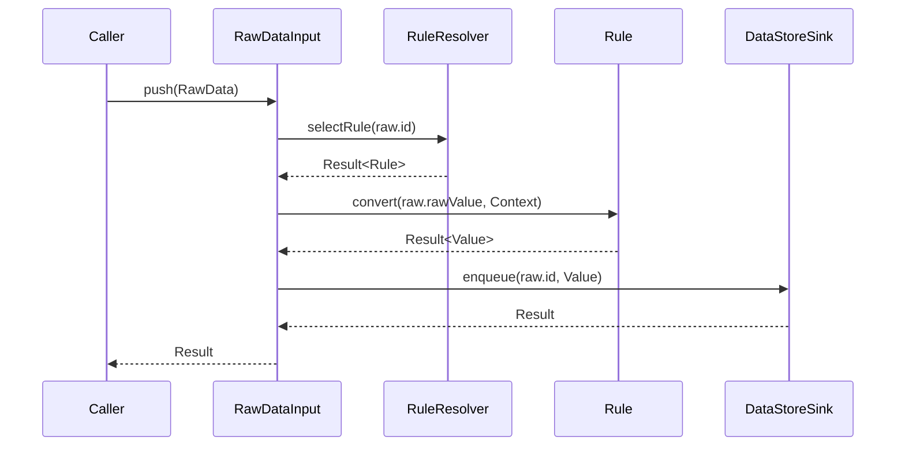

# 1. 概要

RawDataInputはAdapter Layerの入力エントリポイントである。

本コンポーネントは入力元コンポーネントから渡されたRawDataを受け取り、Rule選択、値変換およびDataStoreへの送信処理を実行する。

RawDataInput自身はRule選択や値変換の詳細ロジックを保持せず、各コンポーネントを適切な順序で呼び出し、処理全体を制御する責務を持つ。

---

# 2. 目的

本コンポーネントの目的は、入力データの受付からDataStoreへの送信要求までの処理を一元管理することである。

入力処理の起点を明確にし、Adapter Layer内部の処理フローを統制する。

---

# 3. 背景・採用理由

Adapter Layerは外部仕様との差異を吸収し、後続Layerへ統一されたデータ形式を提供する責務を持つ。

RawDataInputはその入口として機能し、入力受付からDataStore送信までの処理フローを統括する。

また、Rule選択、値変換およびDataStore送信を個別コンポーネントへ分離することで、責務分離およびテスト容易性を向上させる。

RawDataInputは識別子とRuleの対応を管理しない。

適用するRuleの決定はRuleResolverへ委譲し、RawDataInputは処理制御に専念する。

---

# 4. 責務

RawDataInputは以下の責務を持つ。

- RawDataの受付
- RuleResolverの呼び出し
- Ruleの実行
- DataStoreSinkへの送信
- 処理結果の返却
- 各コンポーネントの実行順序制御
- 下位コンポーネントの実行結果の集約

---

# 5. 非責務

RawDataInputは以下を責務としない。

- Rule選択ロジックの実装
- データ変換ロジックの実装
- DataStoreへの保存処理
- データ保持
- 状態管理
- RawDataの妥当性検証

これらは他コンポーネントまたは他Layerの責務とする。

RawDataInputはRawDataが契約を満たしていることを前提とする。

必須項目の妥当性検証は入力元コンポーネントの責務とする。

---

# 6. 保持データ

RawDataInputは状態を保持しない。

処理に必要な情報は引数として受け取り、処理完了後に保持しない。

---

# 7. 依存関係

## 7.1 利用するコンポーネント

- RuleResolver
- DataStoreSink

RuleResolverは識別子に対応するRuleを取得するために利用する。

DataStoreSinkは正規化済みデータの送信先として利用する。

DataStoreSinkは投入成功のみを保証する。

DataStoreへの反映結果は保証対象外であり、反映処理はDataStore Layerの責務とする。

## 7.2 利用されるコンポーネント

RawDataInputはRawDataを生成する上位コンポーネントから利用される。

入力元の実装には依存しない。



---

# 8. データモデル

## 8.1 RawData

RawDataは入力元コンポーネントとRawDataInput間で受け渡される契約データである。

RawDataは以下の情報を保持する。

- id
- rawValue
- Context

### 8.1.1 id

データ種別を識別するための識別子である。

idは必須項目である。

idは空文字であってはならない。

### 8.1.2 rawValue

入力された未変換データである。

rawValueは必須項目である。

Ruleによる変換処理の対象となる。

変換後の値はValueとして利用される。

### 8.1.3 Context

Contextは値の解釈および変換に利用する補助情報である。

Contextは省略可能である。

例：

- 単位
- センサ種別
- スケール係数

## 8.2 ErrorCode

- RuleNotFound
- ConvertError
- QueueError

## 8.3 Result

処理結果を表す共通型である。

成功または失敗を表現する。

## 8.4 Result<T>

値を伴う処理結果を表す共通型である。

---

# 9. 提供IF

## 9.1 push

### IF

```
Result push(RawData raw)
```

### 説明

入力されたRawDataを受け取り、正規化処理を実施した後、DataStoreへ送信する。

本IFの成功はDataStoreへの保存完了を意味しない。

DataStoreSinkへの投入成功のみを保証する。

---

# 10. 処理フロー



## 10.1 成功条件

- Rule取得成功
- 値変換成功
- DataStoreSinkへの投入成功

---

# 11. エラー処理

## 11.1 エラー種別

| エラーコード | 発生元 | 内容 |
|-------------|--------|------|
| RuleNotFound | RuleResolver | 設計不備によるRule未定義 |
| ConvertError | Rule | 値変換失敗 |
| QueueError | DataStoreSink | キュー格納失敗 |

## 11.2 挙動

エラー発生時は処理を中断する。

再試行制御は呼び出し元または上位コンポーネントの責務とする。

---

# 12. 制約事項

## 12.1 アーキテクチャ制約

- RawDataInputは状態を保持しない
- RawDataInputはDataStore内部へ直接アクセスしない
- RawDataInputは入力元コンポーネントの実装へ依存しない

## 12.2 機能制約

- RawDataInput内部の処理は同期的に実行する
- Rule選択ロジックを保持しない
- データ変換ロジックを保持しない

---

# 13. 非機能要件

- 単体テスト可能であること
- モック利用可能であること
- 異常系の挙動が一貫していること
- 状態を持たないこと

---

# 14. 将来拡張

## 14.1 入力元追加

新たな入力元コンポーネントを追加可能とする。

## 14.2 入力検証強化

RawDataの妥当性検証を追加可能とする。

## 14.3 エラーハンドリング強化

障害分類やリトライ制御を追加可能とする。

## 14.4 メトリクス取得

処理件数やエラー件数などの監視情報取得を追加可能とする。
