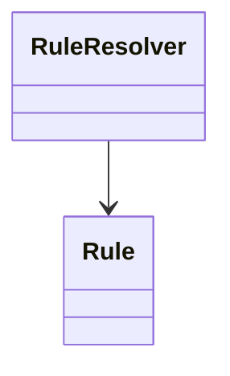
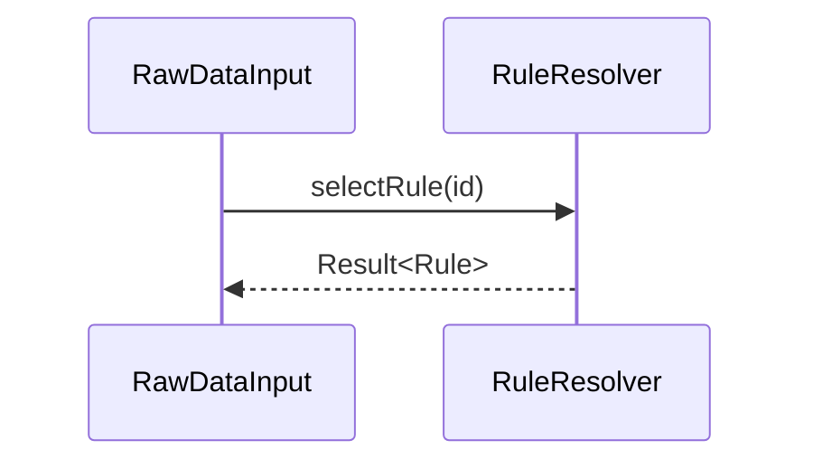
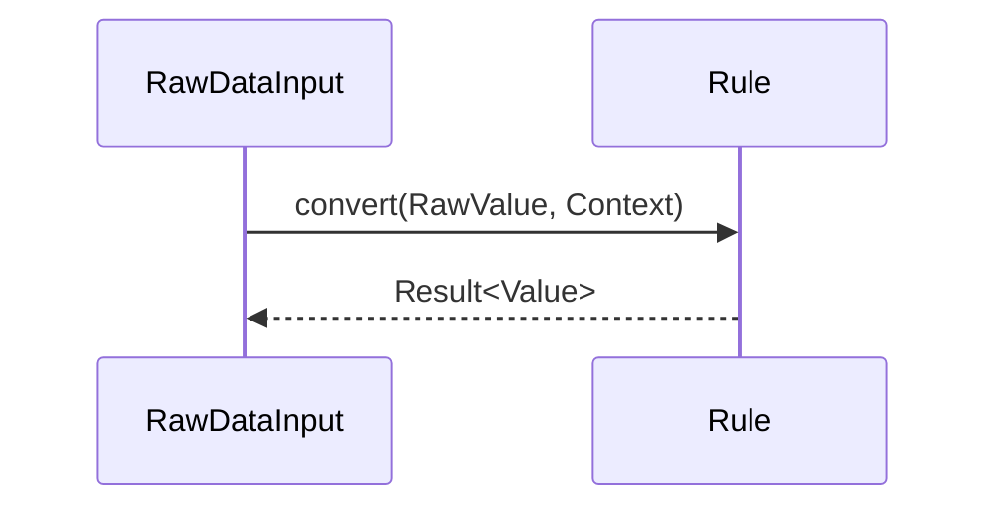

# 1. 概要

Rule関連コンポーネントは、入力データの識別子に応じた正規化処理を選択し、システム内部で利用可能な形式へ変換する責務を持つ。

本設計では以下のコンポーネントを対象とする。

- RuleResolver
- Rule

RuleResolverは適用するRuleを決定し、Ruleは実際の変換処理を実行する。

---

# 2. 目的

本コンポーネント群の目的は、データ種別ごとの正規化処理をコンポーネント単位で分離し、追加・変更時の変更影響を局所化することである。

また、RawDataInputから変換ロジックを分離することで責務分離およびテスト容易性を向上させる。

---

# 3. 背景・採用理由

入力データの変換方式はデータ種別ごとに異なる。

例えば以下のような差異が存在する。

- 単位変換
- スケール変換
- 型変換
- フォーマット変換

これらを単一コンポーネントで実装した場合、データ種別追加のたびにコード変更が発生する。

そのため本システムではRule方式を採用し、変換処理をRule単位で分離する。

RuleResolverは識別子に対応するRuleを決定する責務を持ち、Rule自体は変換処理のみに専念する。

Rule未定義は設計不備として扱い、通常運用では発生しないことを前提とする。

---

# 4. 責務

## 4.1 RuleResolver

RuleResolverは以下の責務を持つ。

- 識別子に対応するRuleの取得
- Rule未定義時のエラー返却

## 4.2 Rule

Ruleは以下の責務を持つ。

- RawValueからValueへの変換
- データ変換処理の実行
- Contextの参照
- 変換結果の返却

---

# 5. 非責務

## 5.1 RuleResolver

RuleResolverは以下を責務としない。

- データ変換処理
- データ保持
- DataStoreアクセス
- ビジネスロジック

## 5.2 Rule

Ruleは以下を責務としない。

- Rule選択
- DataStoreアクセス
- アラーム判定
- 状態判定
- ビジネスロジック
- 業務上の意味解釈
- 状態管理

---

# 6. 保持データ

## 6.1 RuleResolver

RuleResolverは識別子からRuleを取得する責務を持つ。

識別子とRuleの対応関係の管理方法は本設計では規定しない。

例：

| 識別子 | Rule |
|----------|----------|
| Temperature | TemperatureRule |
| Pressure | PressureRule |

## 6.2 Rule

Ruleは状態を保持しない。

変換処理に必要な情報は引数として受け取る。

Ruleの生成およびライフサイクル管理は本設計の対象外とする。

---

# 7. 依存関係

## 7.1 RuleResolver

RuleResolverはRuleへ依存する。



## 7.2 Rule

Ruleは他コンポーネントへ依存しない。

---

# 8. データモデル

## 8.1 RawValue

RawValueは入力元コンポーネントから渡される正規化前のデータである。

RuleはRawValueをValueへ変換する。

## 8.2 Value

ValueはRuleによる変換後の値であり、後続Layerで利用する標準表現である。

ValueはRIM_AdapterLayerから後続Layerへ受け渡される。

## 8.3 Context

Contextは変換処理に利用する補助情報である。

Ruleは必要な属性のみ参照する。

Contextは省略可能である。

RuleはContextの内容を変更しない。

例：

- 単位
- センサ種別
- スケール係数

## 8.4 ErrorCode

本設計では以下を利用する。

- RuleNotFound
- ConvertError

ErrorCodeはRIM_AdapterLayer共通契約として扱う。

## 8.5 Result<T>

Result<T>は値を伴う処理結果を表す。

RuleResolverおよびRuleの戻り値として利用する。

Result<T>はRIM_AdapterLayer共通契約として扱う。

---

# 9. 提供IF

## 9.1 RuleResolver

### 9.1.1 selectRule

#### IF

```
Result<Rule> selectRule(string id)
```

#### 説明

識別子に対応するRuleを取得する。

対応するRuleが存在しない場合はRuleNotFoundを返却する。

---

## 9.2 Rule

Ruleは共通インターフェースとして定義する。

各データ種別は個別Ruleとして実装する。

例：

- TemperatureRule
- PressureRule

### 9.2.1 convert

#### IF

```
Result<Value> convert(RawValue value, Context context)
```

#### 説明

入力されたRawValueを正規化し、Valueとして返却する。

変換に失敗した場合はConvertErrorを返却する。

---

# 10. 処理フロー

## 10.1 Rule取得



## 10.2 データ変換



---

# 11. エラー処理

## 11.1 エラー種別

| エラーコード | 発生元 | 内容 |
|-------------|--------|------|
| RuleNotFound | RuleResolver | 設計不備によるRule未定義（通常発生しない） |
| ConvertError | Rule | データ変換失敗 |

## 11.2 挙動

RuleResolverは識別子に対応するRuleが存在しない場合、RuleNotFoundを返却する。

RuleNotFoundは設計不備を表す異常状態であり、通常運用では発生しないことを前提とする。

ただし実行時の異常検出を目的として、当該エラーは返却可能とする。

Ruleは変換処理に失敗した場合、ConvertErrorを返却する。

エラー発生時は処理を継続せず、呼び出し元へ結果を返却する。

---

# 12. 制約事項

## 12.1 アーキテクチャ制約

- RuleResolverはRule選択のみを行う
- Ruleは変換処理のみを行う
- RuleはRIM_DatastoreLayerへ依存しない
- RuleはRIM_CapabilityLayerへ依存しない

## 12.2 機能制約

- RuleResolverは識別子完全一致でRuleを選択する
- Ruleは状態を保持しない
- Ruleはビジネスロジックを持たない
- Ruleは状態判定を行わない
- Ruleは業務上の意味解釈を行わない

---

# 13. 非機能要件

- Rule単位で単体テスト可能であること
- RuleResolver単体でテスト可能であること
- データ種別追加時に既存Ruleへ影響しないこと
- 状態を持たないこと

---

# 14. 将来拡張

## 14.1 Rule追加

新たなデータ種別追加時は対応するRuleを追加する。

## 14.2 Context拡張

新たな変換条件をContextへ追加可能とする。

## 14.3 Rule選択条件拡張

将来的に複数条件によるRule選択へ対応可能とする。

例：

- 識別子
- センサ種別
- プロトコル種別

## 14.4 Rule管理方式変更

識別子とRuleの対応管理方式を変更可能とする。

例：

- 固定テーブル
- 設定ファイル
- Registry方式
