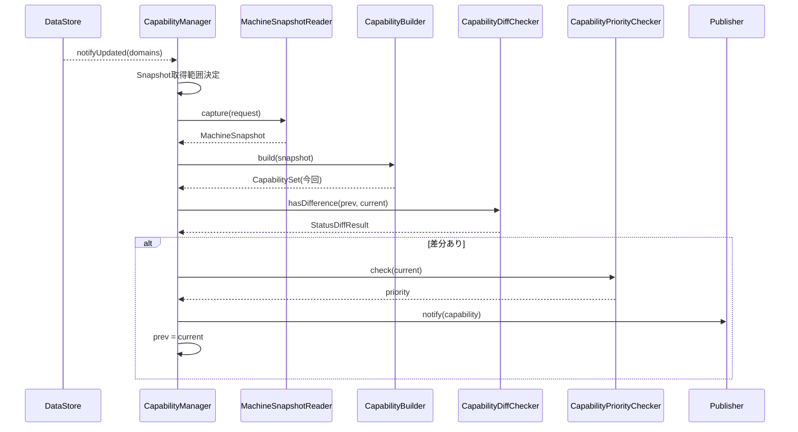

# Capability Layer 詳細設計書（L3）

本書は `CapabilityLayer仕様設計書.md` を親とし、各クラスの内部アルゴリズム・
判定式構成・データ型・排他・シーケンスを定義する。

---

## 1. 構成とスレッドモデル

```mermaid
flowchart TB
    DS[DataStore Layer]

    subgraph CapabilityLayer
        CM[CapabilityManager]
        CB[CapabilityBuilder]
        CD[CapabilityDiffChecker]
        CP[CapabilityPriorityChecker]
        PREV[前回Publish済Capability]
    end

    Pub[Publisher Layer]

    DS -. notifyUpdated(domains) .-> CM
    CM -->|capture(request)| DS
    CM --> CB
    CM --> CD
    CM --> CP
    CD --- PREV
    CM -->|notify(capability)| Pub
```

### 1.1 スレッドモデル
- Capability Layerは専用スレッドで動作し、DataStore処理スレッドから独立する。
- `onRegistryUpdated(domains)` は通知契機を受けるのみ（軽量）。実処理は本スレッドで直列実行。
- 直列実行のため、前回Capability保持に追加ロックは不要（単一スレッド更新）。

### 1.2 排他
- Registryは直接ロックしない。参照はMachineSnapshotReaderのcapture（Registry単位短時間ロック）に委ねる。
- 前回Publish済Capabilityは本層スレッドのみが更新するため内部ロック不要。

---

## 2. データモデル

```cpp
enum class CapabilityKind { Error, Job, Env, Maint, Health, Safety, Consumable, Print };
enum class CapabilityPriority { Low, Normal, High, Critical };

// 個別Capabilityの値（種別ごとに型を持つバリアント）
struct CapabilityValue { /* 種別依存 */ };

struct CapabilitySet {
    std::array<std::optional<CapabilityValue>, 8> values;  // Kindごと
};

// Publisherへ渡す単位
struct Capability {
    CapabilitySet           set;             // Capability全体
    CapabilityPriority      priority;        // publish優先度
    FlagSet<CapabilityKind> changedKinds;    // 変更のあったCap
    FlagSet<RegistryDomain> changedDomains;  // 変更ドメイン
    FlagSet<CapabilityKind> explicitEvents;  // 明示イベント対象(Error/Job等)
};

struct StatusDiffResult {
    bool                    hasDifference;
    FlagSet<CapabilityKind> changed;
};
```

---

## 3. CapabilityManager

### 3.1 提供IF
```cpp
void onRegistryUpdated(const RegistryDomainSet& domains);  // IRegistryUpdateNotifier実装
```

### 3.2 内部処理
```text
onRegistryUpdated(domains):
  1. Snapshot取得範囲を決定（§3.3）
  2. MachineSnapshotReader.capture(request) → MachineSnapshot
  3. CapabilityBuilder.build(snapshot) → CapabilitySet（今回）
  4. CapabilityDiffChecker.hasDifference(prev, current) → StatusDiffResult
  5. 差分なし → 終了（Publishしない）
  6. CapabilityPriorityChecker.check(current) → priority
  7. Capability を構築（changedKinds/changedDomains/explicitEvents 設定）
     - Error/Job に変化 → explicitEvents に追加
  8. IPublisher.notify(capability)
  9. 前回Publish済Capabilityを current で更新
```

### 3.3 Snapshot取得範囲決定
- 更新された `RegistryDomainSet` から、影響を受けるCapabilityの依存ドメインを逆引きし、
  必要最小限のドメインのみを `SnapshotRequest.domains` に含める。
- 依存表（Capability → RegistryDomain）は静的に定義する（基本設計 §4.2）。

### 3.4 非責務
- Registry更新・直接参照、Snapshotの実コピー、判定式の詳細ロジック、実配信は行わない。

---

## 4. CapabilityBuilder

### 4.1 提供IF
```cpp
CapabilitySet build(const MachineSnapshot& snapshot) const;
```

### 4.2 判定式構成
- Capability種別ごとに判定クラス（Evaluator）を持つ。

```cpp
struct ICapabilityEvaluator {
    virtual std::optional<CapabilityValue> eval(const MachineSnapshot&) const = 0;
};
// ErrorEvaluator, JobEvaluator, EnvEvaluator, MaintEvaluator,
// HealthEvaluator, SafetyEvaluator, ConsumableEvaluator, PrintEvaluator
```

- buildはsnapshotに含まれるドメインに対応するEvaluatorのみ実行し、CapabilitySetを組む。
- **Thresholdの閾値跨ぎ判定は各Evaluator内で行う**（連続値→状態化）。
- **PrintEvaluatorはsnapshot（DataStore値）にのみ依存**し、他Capを参照しない。
  複数Capを合成した総合判断が要る場合はFacade側で行う（本層でCap相互参照しない）。

---

## 5. CapabilityDiffChecker

### 5.1 提供IF
```cpp
StatusDiffResult hasDifference(const CapabilitySet& prev, const CapabilitySet& current) const;
```

### 5.2 アルゴリズム
- Kindごとに prev/current を比較し、差分のあるKindを `changed` に集約する。
- いずれか差分があれば `hasDifference = true`。
- これは **意味的差分**（Capが変化したか）であり、配信的差分（Publisher）とは別。

---

## 6. CapabilityPriorityChecker

### 6.1 提供IF
```cpp
CapabilityPriority check(const CapabilitySet& current) const;
```

### 6.2 アルゴリズム（例）
| 条件 | 優先度 |
|------|--------|
| SafetyCap 異常 / ErrorCap 重大 | Critical |
| ErrorCap 発生 / Consumable 枯渇 | High |
| Job進捗更新 等 | Normal |
| Env等の軽微変化 | Low |

- 判定結果はPublisher LayerのRate Limit/配信優先に用いられる。

---

## 7. シーケンス



---

## 8. 異常処理

| 事象 | 挙動（基本設計 §10準拠） |
|------|--------------------------|
| Snapshot取得失敗 | Capability生成を中止・ログ出力・prev更新しない |
| 軽微な不整合Snapshot | 可能な範囲でCapability生成 |
| 重大な不整合Snapshot | 生成中止・ログ出力 |

---

## 9. 非機能・原則の対応

| 要件 | 担保 |
|------|------|
| Registryを直接ロックしない | captureのみ経由 |
| 再現性 | snapshotから再計算可能なCapability |
| 責務分離 | Manager(制御)/Builder(生成)/Diff(意味的差分)/Priority(優先度) |
| テスト容易性 | Evaluator単位・各クラス独立、Reader/Publisherモック可 |

---

## 10. 次段（未確定）

- 各Evaluatorの判定式（閾値・条件）の具体定義
- CapabilityValueの種別ごとスキーマ
- Capability → RegistryDomain 依存表の正式定義
- PriorityChecker判定条件の確定
- getCurrentCapability（Accessor向け現在状態参照IF）の提供
