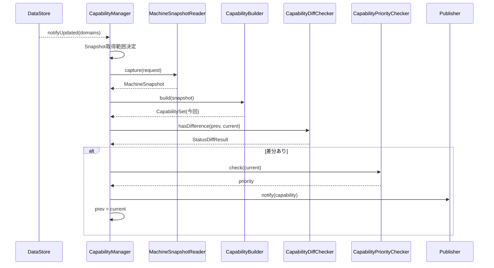

# RIM_CapabilityLayer 詳細設計書（L3）

本書は `RIM_CapabilityLayer仕様設計書.md` を親とし、各クラスの内部アルゴリズム・
判定式構成・データ型・排他・シーケンスを定義する。

---

## 1. 構成とスレッドモデル

```mermaid
flowchart TB
    DS[RIM_DatastoreLayer]

    subgraph RIM_CapabilityLayer
        CM[CapabilityManager]
        CB[CapabilityBuilder]
        CD[CapabilityDiffChecker]
        CP[CapabilityPriorityChecker]
        PREV[前回Publish済Capability]
    end

    Pub[RIM_PublisherLayer]

    DS -. notifyUpdated(domains) .-> CM
    CM -->|capture(request)| DS
    CM --> CB
    CM --> CD
    CM --> CP
    CD --- PREV
    CM -->|notify(capability)| Pub
```

### 1.1 スレッドモデルと通知受理機構（H-1対応）

- RIM_CapabilityLayerは専用スレッドで動作し、DataStore処理スレッドから独立する。
- `onRegistryUpdated(domains)` は**3つのDispatcherスレッドから並行に呼ばれる**前提とし、
  以下の **pendingドメイン集合方式** で受理する。

```cpp
class CapabilityManager {
    RegistryDomainSet pending_;        // 未処理ドメインの集合（OR合流）
    std::mutex        pendingMutex_;
    std::condition_variable wake_;
public:
    // Dispatcherスレッドから呼ばれる（非ブロッキング・軽量）
    void onRegistryUpdated(const RegistryDomainSet& domains) {
        { std::lock_guard lk(pendingMutex_); pending_ |= domains; }
        wake_.notify_one();
    }
    // Capability専用スレッドのループ
    void run() {
        while (!stopRequested()) {
            RegistryDomainSet domains;
            { std::unique_lock lk(pendingMutex_);
              wake_.wait_for(lk, fullReevalPeriod_, [&]{ return !pending_.empty() || stopRequested(); });
              domains = std::exchange(pending_, {}); }
            if (domains.empty()) domains = AllDomains;   // 周期フル再評価（セーフティネット）
            process(domains);                            // §3.2
        }
    }
};
```

**この方式の保証**：
- 通知は**キューではなく集合へのOR合流**であるため、溢れ・喪失が構造的に発生しない
  （同一ドメインの多重通知は自然に合流し、処理は常に最新Registry状態のcaptureで行われる）。
- 処理中に届いた通知は `pending_` に蓄積され、次周回で必ず処理される。
- `wait_for` のタイムアウト（`fullReevalPeriod_`・低頻度、cfg）により、
  万一の通知欠落があっても**周期フル再評価**で回復する（レベルトリガの救済）。

### 1.2 排他

- Registryは直接ロックしない。参照はMachineSnapshotReaderのcapture（Registry単位短時間ロック）に委ねる。
- 前回Publish済Capabilityは **不変オブジェクト + atomicなshared_ptr差し替え** で保持する（H-7対応）。
  更新は本層スレッドのみが行い、**Accessor Layer等の他スレッドはatomic loadで安全に読める**。

```cpp
std::shared_ptr<const CapabilitySet> prev_;   // std::atomic_load/storeで読み書き

// 本層スレッド：Publish後に差し替え
std::atomic_store(&prev_, std::make_shared<const CapabilitySet>(merged));

// 他スレッド（Accessor）：現在状態の取得
std::shared_ptr<const CapabilitySet> getCurrentCapability() const {
    return std::atomic_load(&prev_);
}
```

---

## 2. データモデル

```cpp
enum class CapabilityKind { Error, Job, Env, Maint, Health, Safety, Consumable, Print };
enum class CapabilityPriority { Low, Normal, High, Critical };

// 個別Capabilityの値（種別ごとに型を持つバリアント）
struct CapabilityValue { /* 種別依存 */ };

struct CapabilitySet {
    std::array<std::optional<CapabilityValue>, 8> values;  // Kindごと
};

// Publisherへ渡す単位
struct Capability {
    CapabilitySet           set;             // Capability全体
    CapabilityPriority      priority;        // publish優先度
    FlagSet<CapabilityKind> changedKinds;    // 変更のあったCap
    FlagSet<RegistryDomain> changedDomains;  // 変更ドメイン
    FlagSet<CapabilityKind> explicitEvents;  // 明示イベント対象(Error/Job等)
};

struct StatusDiffResult {
    bool                    hasDifference;
    FlagSet<CapabilityKind> changed;
};
```

---

## 3. CapabilityManager

### 3.1 提供IF
```cpp
void onRegistryUpdated(const RegistryDomainSet& domains);          // IRegistryUpdateNotifier実装
std::shared_ptr<const CapabilitySet> getCurrentCapability() const; // Accessor向け現在状態参照（H-7）
```

### 3.2 内部処理（process）
```text
process(domains):
  1. Snapshot取得範囲を決定（§3.3）
  2. MachineSnapshotReader.capture(request) → MachineSnapshot
  3. CapabilityBuilder.build(snapshot) → 部分CapabilitySet（評価したKindのみ値あり）
  4. 【マージ】merged = prevのコピーに、部分Setの値ありKindのみを上書き（H-3対応・§3.4）
  5. CapabilityDiffChecker.hasDifference(prev, merged) → StatusDiffResult
     （比較は常に完全Set同士。未評価Kindはprev値を引き継ぐため偽差分は生じない）
  6. 差分なし → 終了（Publishしない）
  7. CapabilityPriorityChecker.check(merged) → priority
  8. Capability を構築（set=merged【完全Set】, changedKinds/changedDomains/explicitEvents 設定）
     - Error/Job に変化 → explicitEvents に追加
  9. IPublisher.notify(capability)
 10. prev を merged でatomicに差し替え（§1.2）
```

### 3.3 Snapshot取得範囲決定
- 更新された `RegistryDomainSet` から、影響を受けるCapability群を逆引きし、
  **それらのCapabilityの依存ドメインの和集合（依存クロージャ）** を `SnapshotRequest.domains` に含める。
  （変更ドメインだけでは複数ドメイン依存のCap（PrintCap等）が評価不能になるため、
  「影響Capの依存全部」を取得することが必須である）
- 依存表（Capability → RegistryDomain）は静的に定義する（基本設計 §4.2）。

### 3.4 CapabilitySetマージ規則（H-3対応・正式契約）

| 規則 | 内容 |
|------|------|
| 部分評価 | buildは要求ドメインに対応するEvaluatorのみ実行し、未評価Kindは nullopt |
| マージ | `merged[k] = current[k].has_value() ? current[k] : prev[k]`（未評価=前回値維持） |
| 差分判定 | 常に完全Set（prev vs merged）で比較する。nullopt との比較は行わない |
| prev更新 | 完全Setである merged のみを保存する。**部分Setでprevを上書きしない** |
| 下流受け渡し | Publisher / Accessor へは常に完全Setを渡す。部分Setは本層内部表現に留める |
| 評価不能 | Snapshot不整合等で評価できなかったKindは「未評価」と同じくprev値を維持し、ログ出力する |

### 3.4 非責務
- Registry更新・直接参照、Snapshotの実コピー、判定式の詳細ロジック、実配信は行わない。

---

## 4. CapabilityBuilder

### 4.1 提供IF
```cpp
CapabilitySet build(const MachineSnapshot& snapshot) const;
```

### 4.2 判定式構成
- Capability種別ごとに判定クラス（Evaluator）を持つ。

```cpp
struct ICapabilityEvaluator {
    virtual std::optional<CapabilityValue> eval(const MachineSnapshot&) const = 0;
};
// ErrorEvaluator, JobEvaluator, EnvEvaluator, MaintEvaluator,
// HealthEvaluator, SafetyEvaluator, ConsumableEvaluator, PrintEvaluator
```

- buildはsnapshotに含まれるドメインに対応するEvaluatorのみ実行し、CapabilitySetを組む。
- **Thresholdの閾値跨ぎ判定は各Evaluator内で行う**（連続値→状態化）。
- **PrintEvaluatorはsnapshot（DataStore値）にのみ依存**し、他Capを参照しない。
  複数Capを合成した総合判断が要る場合はFacade側で行う（本層でCap相互参照しない）。

---

## 5. CapabilityDiffChecker

### 5.1 提供IF
```cpp
StatusDiffResult hasDifference(const CapabilitySet& prev, const CapabilitySet& current) const;
```

### 5.2 アルゴリズム
- Kindごとに prev/current を比較し、差分のあるKindを `changed` に集約する。
- いずれか差分があれば `hasDifference = true`。
- これは **意味的差分**（Capが変化したか）であり、配信的差分（Publisher）とは別。

---

## 6. CapabilityPriorityChecker

### 6.1 提供IF
```cpp
CapabilityPriority check(const CapabilitySet& current) const;
```

### 6.2 アルゴリズム（例）
| 条件 | 優先度 |
|------|--------|
| SafetyCap 異常 / ErrorCap 重大 | Critical |
| ErrorCap 発生 / Consumable 枯渇 | High |
| Job進捗更新 等 | Normal |
| Env等の軽微変化 | Low |

- 判定結果はRIM_PublisherLayerのRate Limit/配信優先に用いられる。

---

## 7. シーケンス



---

## 8. 異常処理

| 事象 | 挙動（基本設計 §10準拠） |
|------|--------------------------|
| Snapshot取得失敗 | Capability生成を中止・ログ出力・prev更新しない |
| 軽微な不整合Snapshot | 可能な範囲でCapability生成 |
| 重大な不整合Snapshot | 生成中止・ログ出力 |

---

## 9. 非機能・原則の対応

| 要件 | 担保 |
|------|------|
| Registryを直接ロックしない | captureのみ経由 |
| 再現性 | snapshotから再計算可能なCapability |
| 責務分離 | Manager(制御)/Builder(生成)/Diff(意味的差分)/Priority(優先度) |
| テスト容易性 | Evaluator単位・各クラス独立、Reader/Publisherモック可 |

---

## 10. 次段（未確定）

- 各Evaluatorの判定式（閾値・条件）の具体定義
- CapabilityValueの種別ごとスキーマ
- Capability → RegistryDomain 依存表の正式定義
- PriorityChecker判定条件の確定
- 周期フル再評価の周期値（fullReevalPeriod_）のcfg定義

（確定済み：通知受理機構=pendingドメイン集合方式(§1.1)、CapabilitySetマージ規則(§3.4)、
getCurrentCapability=atomic shared_ptr方式(§1.2/§3.1)）
