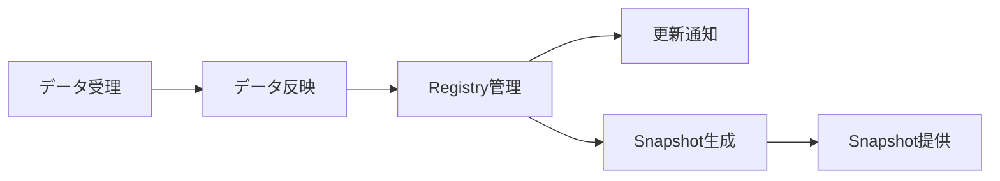
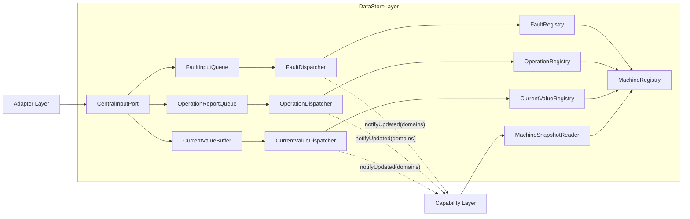
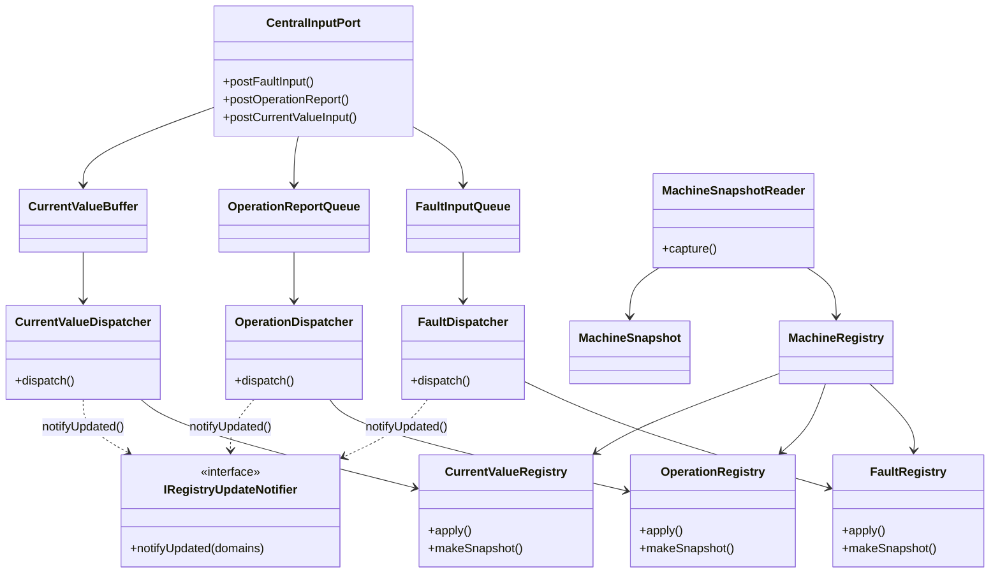
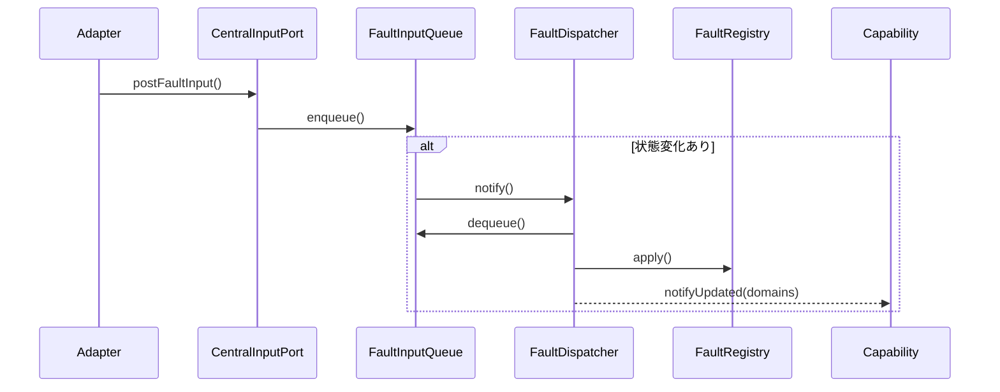
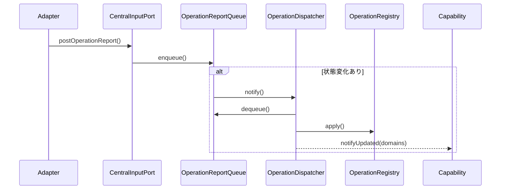
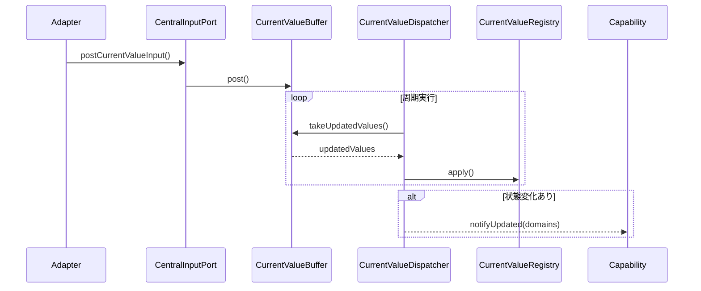
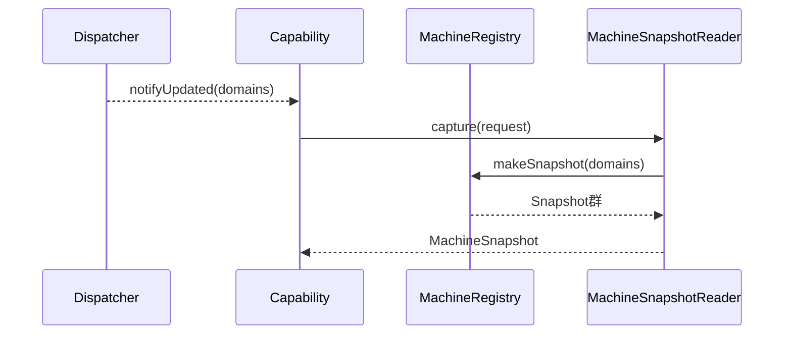

# DataStore Layer 仕様設計書

## 1. 概要

DataStore Layerはシステム内のデータを集約して管理するLayerである。

本LayerはAdapter Layerから入力されたデータを一元管理し、Capability Layerへ整合したSnapshotを提供する。

本Layerはシステム全体のデータ管理責務を担い、後続Layerから内部データ管理方式およびデータ保持構造を隠蔽する。

---

## 2. 用語
| 用語 | 説明 |
|--------|--------|
| DataEntryItem | DataStore Layer内部で利用する標準データモデル |
| Data | Mediator外部から入力される情報。 |
| State | Dataを解釈した結果。Dataから再計算可能なものである。Capability Layerにて用いられる。 |
| DataId | データ種別識別子。DataStore Layerにおいては保存先特定を主目的として利用する。 |
| Context | データに付与される補足情報 |
| Registry | システム内のデータを集約して管理するコンポーネント |
| RegistryDomain | Registry内の保存領域を示すドメイン。例えばRegistry内の温度湿度関係データのドメインといったように指定可能。 |
| RegistryDomainSet | RegistryDomainの複数指定版 |
| FaultInput | 異常系の入力。Error、Warningなど緊急性が高く、すぐにでも処理する必要がある入力。 |
| OperationReport | 動作報告系の入力。動作報告は順序を守る必要があるため、欠落や処理順序の入れ替えなどが起きてはいけない入力。 |
| CurrentValue | 最新値系の入力。ドライバから上がってくるセンサの値など最新値が欲しい入力。 |
| Snapshot | ある時点のRegistry状態を読み取り専用で表現したデータ |

---

## 3. 背景

システム内では複数の機能が共通データを利用する。

例

```text
Temperature

Humidity

Safety

JobInformation

CurrentFault
```

各機能が個別にデータを保持した場合、以下の問題が発生する。

- データの重複
- データ不整合
- 変更影響範囲の拡大
- 障害解析性の低下

また、Capability Layerは複数のDataを組み合わせて状態判定を行うため、システム全体として整合したデータ提供機構が必要となる。

---

## 4. 目的

DataStore Layerの目的は以下である。

- システム内データの一元管理
- データ整合性の維持
- 状態再現性および障害解析性の向上

---

## 5. 責務

DataStore Layerは以下の責務を持つ。


- データ保持
- データ更新
- 最新値集約
- 現在情報管理
- Snapshot提供
- 更新通知




DataStore Layerは以下を責務としない。

- 状態判定
- ビジネスロジック
- 閾値判定
- アラーム判定
- 状態遷移制御
- 外部機器制御
- Capability実行

これらはCapability Layerまたは上位Layerの責務とする。

---

## 6. クラス構成


DataStore Layerは以下のコンポーネントで構成される。

- CentralInputPort

- FaultInputQueue
- OperationReportQueue
- CurrentValueBuffer
- 
- FaultDispatcher
- OperationDispatcher
- CurrentValueDispatcher

- MachineRegistry
- FaultRegistry
- OperationRegistry
- CurrentValueRegistry
- 
- MachineSnapshotReader




クラス構造図


### 6.1 CentralInputPort(中央入力ポート)

Adapterが中央へ報告する入口としてICentralInputPortを提供する。  

- Adapterから3種のキューごとに設けられたpost()関数を経由してDataEntryItemを受け取る
- 呼ばれたpost関数の種類とRawData.Idが意味するデータの分類があっていることを確認する。
  - 例：postFaultInputは異常系のIdしか受け付けない。
- Value型とRawData.Idの定義があっていることを確認する。
  - 例：温度センサを示すIdの場合、温度センサとして格納することを決めているデータ型しかValueとして受け入れるべきではない。
- 問題なければQueue / Bufferへ入れる。

#### 6.1.1 属性  
特筆すべき点はない。

#### 6.1.2 提供IF  
- bool postFaultInput()
- bool postOperationReport()
- bool postCurrentValueInput()
---

### 6.2 FaultInputQueue
```
using FaultInputQueue = IQueue<DataEntryItem>;
```
異常系のDataEntryItemを受理するQueueである。
 
- FIFOで保持し、高優先度で処理する。  
- 動作報告系や最新値系のDataEntryItemを入れない。  
- 受理時にFaultDispatcherへ通知を行う。

#### 6.2.1 属性  
一般的なQueueを踏襲する。

#### 6.2.2 提供IF  
一般的なQueueを踏襲する。

---

### 6.3 OperationReportQueue
```
using OperationReportQueue = IQueue<DataEntryItem>;
```

動作報告系のDataEntryItemを受理するQueueである。  
  
- FIFOで保持する。   
- 異常系や最新値系のDataEntryItemを入れない。  
- 受理時にOperationDispatcherへ通知を行う。

#### 6.3.1 属性  
一般的なQueueを踏襲する。

#### 6.3.2 提供IF  
一般的なQueueを踏襲する。
---

### 6.4 CurrentValueBuffer

最新値系のDataEntryItemを受理するBufferである。

- Idごとに最新値を上書き保持する。  
- キューへの格納とキューからの取得の競合を内部で吸収する。  
- 異常系や動作報告系のDataEntryItemを入れない。
- 受理時にCurrentValueDispatcherへ通知を行わない。

#### 6.4.1 属性
```疑似コード
struct slot {
    DataEntryItem data;
    bool dirty = false;
}
```
- ID分のDataEntryItemとdirtyフラグを収めるコンテナが必要である。

```
mutex mutex_;
```
- ミューテックスが必要である。


#### 6.4.2 提供IF
```
bool post(const DataEntryItem& item);
```
- バッファにデータを格納するためのポスト関数を提供する。
```
std:vector(DataEntryItem) takeUpdatedValues();
```
- dirtyフラグの立っているバッファからデータを取り出して、dirtyフラグを落とすIF関数を提供する。
- 周期内で同一IDが複数更新されていても取り出すのは最新の1件のみである。
- dirtyフラグの確認とクリアは同じロック内で行う必要がある。

---

### 6.5 FaultDispatcher

FaultInputQueueからの通知を受け、FaultInputをFaultRepositryの該当箇所へ反映する。
更新が発生した場合Capability Layerが実装するIRegistryUpdateNotifierを利用して変更ドメインを通知する。

#### 6.5.1 属性  
本クラスにおける属性記述は詳細処理に立ち入るためここでは記載しない。

#### 6.5.2 提供IF  
```
dispatch()
```

---

### 6.6 OperationDispatcher

OperationReportQueueからの通知を受け、OperationReportをOperationRepositryの該当箇所へ反映する。
更新が発生した場合Capability Layerが実装するIRegistryUpdateNotifierを利用して変更ドメインを通知する。

#### 6.4.1 属性  
本クラスにおける属性記述は詳細処理に立ち入るためここでは記載しない。

#### 6.4.2 提供IF  
```
dispatch()
```

---

### 6.7 CurrentValueDispatcher

周期起動し、CurrentValueBufferから更新値を取り出してCurrentValueRegistryへ反映する。
更新が発生した場合Capability Layerが実装するIRegistryUpdateNotifierを利用して変更ドメインを通知する。

#### 6.7.1 属性  
本クラスにおける属性記述は詳細処理に立ち入るためここでは記載しない。

#### 6.7.2 提供IF  
```
dispatch()
```


---
### 6.8 MachineRegistry

MachineRegistryは下記を集約するファサードである。
- FaultRegistry
- OperationRegistry
- CurrentValueRegistry

MachineSnapshotReaderは
MachineRegistryを介して
各Registryへアクセスする。


#### 6.4.1 属性

#### 6.4.2 提供IF
---
### 6.9 FaultRegistry

現在発生中の異常系を保持する。

#### 6.9.1 属性
```
mutable std::mutex mutex_;
```
ドメイン単位でミューテックスを確保する。

#### 6.9.2 提供IF
```
void apply(const DataEntryItem &item);
```

DataEntryItem.context内のFaultStateに応じて、発生中のFaultを操作する。
- Rased
  新規エラーの登録  
- Cleared
  エラーのクリア
- AllCleared
  全エラークリア
- UpdatedHeal
  登録済エラーの異常状態を回復状態に更新
- UpdatedActive
  登録済みエラーの異常状態を発生状態に更新

```
FaultSnapshot makeSnapshot();
```

FaultSnapshotを返す。

---

### 6.9 OperationRegistry

現在の動作報告を保持する

#### 6.9.1 属性
```
mutable std::mutex mutex_;
```

ドメイン単位でミューテックスを確保する。

#### 6.9.2 提供IF
```
void apply(const DataEntryItem &item)
```

Idに応じて動作報告を反映する。

```
OperationSnapshot makeSnapshot()
```

OperationSnapshotを返す。　

---
### 6.10 CurrentValueRegistry

最新値系の現在値を保持する。

#### 6.10.1 属性
```
mutable std::mutex mutex_;
```

ドメイン単位でミューテックスを確保する。


#### 6.10.2 提供IF
```
RegistryDomain apply(const DataEntryItem &item)
```

Idに応じて保存先へ最新値を反映する。

```
CurrentValueSnapshot makeSnapshot()
```

CurrentValueSnapshotを返す。
---

### 6.11 MachineSnapshotReader

外部からの要求に応じて指定されたドメインのSnapshotを生成する。  
MachineSnapshotReaderはRegistryの内部実装を隠蔽する。  
Capability LayerはMachineSnapshotReader経由でのみ現在状態を取得できる。
Registry全体の提供は行わない。  
Capability Layerに対してIMachineSnapshotReaderを提供する。  
Capability LayerはDataStore Layerの処理スレッドから独立して実行されることを想定する。

#### 6.11.3 データモデル
```
struct SnapshotRequest{
    RegistryDomainSet domains;
}
```
複数のドメインを指定して、リクエストするためのデータ型。

```
struct CurrentValueSnapshot {
    std::optional<EnvironmentSnapshot>

}

struct MachineSnapshot{
    std::optional<FaultSnapshot> fault;
    std::optional<OperationSnapshot> operation;
    std::optional<CurrentValueSnapshot> currentValue;
}
```

要求に対して返されるSnapshotのデータ型。  
snapshotは以下を保証する。
- 読み取り専用
- 生成後不変
- 単一時点整合性

#### 6.11.4 属性
本クラスにおける属性記述は詳細処理に立ち入るためここでは記載しない。

#### 6.11.5 提供IF
```
MachineSnapshot capture(const SnapshotRequest& request)
```
リクエストに応じたドメインのSnapshotを取得する。


---

## 7. DataStore Layerデータモデル

### 7.1 DataEntryItem

DataStore Layer内部で利用する標準データモデルである。

DataEntryItemはコンポーネント間で受け渡される共通データ形式として利用される。

Contextはkeyと値の組の集合で構成される。

Contextに利用可能なkeyはData種別ごとに定義する。
- FaultState:異常系で用いられるkey。
  Rased,Cleared,AllCleared,UpdatedHeal,UpdatedActiveの5種類の値をとる。
  FaultReposityへのapply()時にそれぞれ個別の挙動を行う。
  詳細はFaultRepositry章にて記載。

```
struct DataEntryItem{
    DataId id;
    DataValue vlue;
    DataContext context;
}
```

---

## 8. 処理モデル
### 8.1 FaultInput処理


#### 8.2 OperationReport処理



### 8.3 CurrentValue処理


### 8.4 Snapshot取得処理



### 8.5 整合性モデル


DataStore Layerは以下を保証する。

・Registryの排他制御
・Snapshotの読み取り専用性
・生成後不変性
・ドメインごとの整合性
・Registry内部状態の隠蔽

Capability LayerはRegistryを直接参照しない。

更新通知は変更契機のみを通知し、実際のデータ取得はMachineSnapshotReaderを介して行う。

---

## 9. 設計方針

### 9.1 DataとStateの分離

DataStore LayerはDataのみを管理する。

StateはCapability Layerが生成する。

```text
DataStore Layer
    Data管理

Capability Layer
    State管理
```

---

### 9.2 Single Source of Truth

システム内データの正本はDataStore Layerのみが管理する。

---

### 9.3 Snapshot方式

Capability Layerは内部コンポーネントを直接参照しない。

Capability LayerはSnapshotのみを利用する。

---


### 9.4 現在値管理と現在情報管理の分離

DataStore Layerでは現在値管理と現在情報管理を分離する。
Snapshotは以下Registryから生成される。

```text
CurrentValueRegistry
    現在値管理

OperationRegistry
    現在動作情報管理

FaultRegistry
    現在異常情報管理
```
---

### 9.5 ドメイン整合方式

Capability Layerへ提供するsnapshotは生成時点でのドメインごとのデータを対象としている。

下記Registryに対してCapabilityは取得したいドメインを要求する。

```text

- FaultRegistry
- OperationRegistry
- CurrentValueRegistry

```

---

## 10. 制約事項

### 10.1 アーキテクチャ制約

- DataStore LayerはState判定を行わない
- SnapshotはCapability Layerが取得する
- Capability LayerはSnapshot以外を参照しない
- DataStore Layerは唯一のデータ正本である
- Adapter LayerはDataStore Layer内部状態へアクセスしない
- DispatcherはCapability Layerへ更新通知のみを行う
- 更新通知にはRegistryDomainSetを利用する

---

### 10.2 機能制約

- DataStore LayerはDataのみを管理する
- Stateは保持しない
- Snapshotは読み取り専用とする
- RegistryはStateを管理しない

---

## 11. 非機能要件

- システム全体整合性を維持できること
- Capability評価の再現性を保証できること
- 単一時点整合性を保証できること
- 責務分離を維持できること
- コンポーネント単位でテスト可能であること
- 障害解析可能であること
- 将来的なデータ種別追加に対応できること
- CurrentValueの高頻度更新に対してSnapshot生成頻度を抑制できること
- DataStore LayerがCapability Layerの処理時間に依存しないこと
- 更新通知による差分監視が行えること

