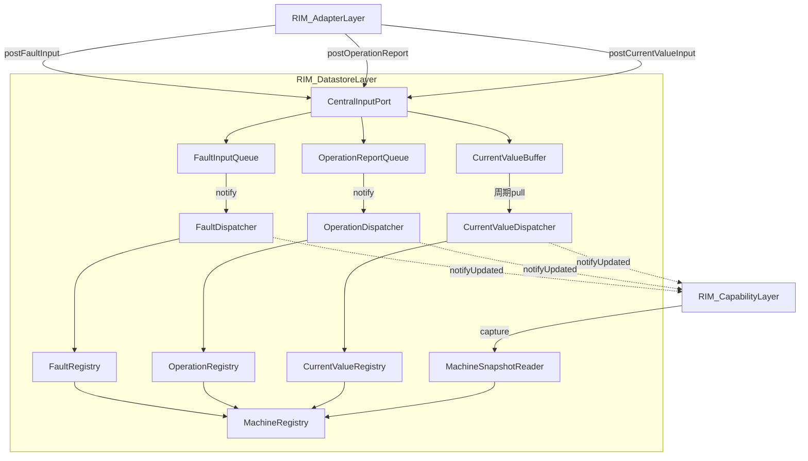
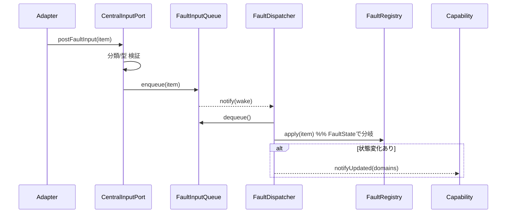
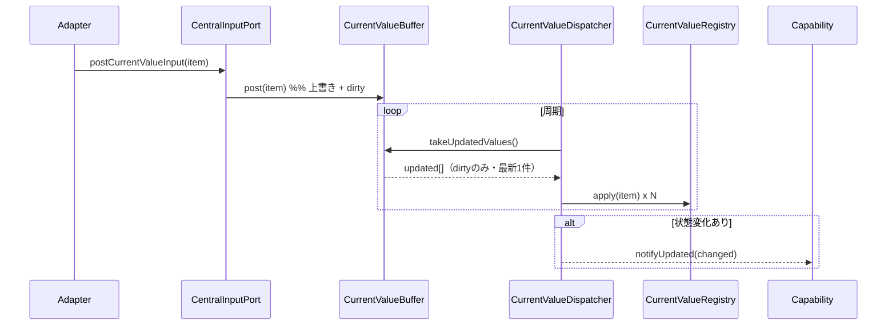
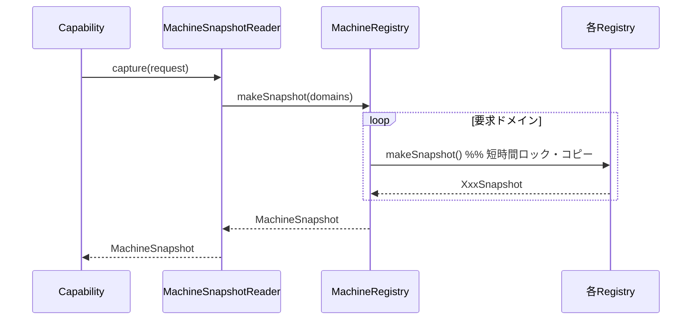

# RIM_DatastoreLayer 詳細設計書（L2）

本書は `RIM_DatastoreLayer仕様設計書.md`（③基本設計・2026-07-07）を親とし、
各コンポーネントの内部データ構造・インターフェース・排他制御・スレッドモデル・
処理アルゴリズムを定義する。用語・構成は基本設計に準拠する。

> 旧②世代（単一Queue / 7 Store / SnapshotProvider・SnapshotTrigger）は廃止済み
> （`ex/_deprecated_旧世代/`）。本書は3レーン + MachineRegistry + Pull型Snapshot構成を詳細化する。

---

## 1. 全体構成とスレッドモデル

### 1.1 コンポーネント全体



### 1.2 スレッドモデル

| 実行主体 | 駆動 | 対象 |
|---------|------|------|
| Adapter呼び出しスレッド | 同期 | CentralInputPort.post*（Queue/Bufferへの投入まで） |
| FaultDispatcherスレッド | イベント駆動（Queue通知でwake） | FaultInputQueue → FaultRegistry |
| OperationDispatcherスレッド | イベント駆動（Queue通知でwake） | OperationReportQueue → OperationRegistry |
| CurrentValueDispatcherスレッド | 周期駆動（タイマ） | CurrentValueBuffer → CurrentValueRegistry |
| RIM_CapabilityLayerスレッド | notifyUpdated契機 | MachineSnapshotReader.capture |

**設計原則**：投入（post）は呼び出し側スレッドで即時完了し、Registry反映は各Dispatcher
スレッドへ非同期に移す。これによりAdapter/入力元はDataStore内部の反映時間に依存しない。

### 1.3 排他制御の配置

| 資源 | ロック | 保持者 |
|------|-------|--------|
| FaultInputQueue / OperationReportQueue | Queue内部mutex | Queue |
| CurrentValueBuffer（slot群 + dirty） | Buffer内部mutex | CurrentValueBuffer |
| 各Registry | ドメイン単位mutex | 各Registry |

- Dispatcherは自前のロックを持たず、Queue/Buffer/Registryのロックに委ねる。
- MachineSnapshotReaderは各Registryの `makeSnapshot()` を通してのみロックに触れる（短時間コピー）。
- 複数Registryにまたがる同時ロックは取得しない（デッドロック回避／Store間は弱整合）。

---

## 2. 共通データモデル

### 2.1 DataEntryItem

```cpp
struct DataEntryItem {
    DataId       id;       // データ種別識別子（保存先特定に使用）
    DataValue    value;    // 正規化済み値（Adapterが変換済み）
    DataContext  context;  // 補足情報（key-valueの集合）
};
```

- `DataValue` は種別ごとに定めた型のバリアント（例：温度=Celsius型）。
- `DataContext` は `key -> 値` の集合。利用可能keyは種別ごとに定義する。

### 2.2 DataContext の代表key

| key | 対象 | 値 |
|-----|------|----|
| FaultState | 異常系 | Raised / Cleared / AllCleared / UpdatedHeal / UpdatedActive |
| （拡張） | — | 種別ごとに追加定義 |

### 2.3 RegistryDomain / RegistryDomainSet

```cpp
enum class RegistryDomain { /* Fault系, Operation系, CurrentValue系のドメイン */ };
using RegistryDomainSet = FlagSet<RegistryDomain>;   // 複数ドメインの集合
```

- 更新通知（notifyUpdated）とSnapshot要求（SnapshotRequest）の両方で使用する。

### 2.4 Snapshotデータ型

```cpp
struct FaultSnapshot     { /* 発生中Faultの読取専用ビュー */ };
struct OperationSnapshot { /* 現在の動作報告の読取専用ビュー */ };
struct CurrentValueSnapshot {
    std::optional<EnvironmentSnapshot> environment;
    // 他CurrentValue系ドメインを追加
};

struct MachineSnapshot {
    std::optional<FaultSnapshot>        fault;
    std::optional<OperationSnapshot>    operation;
    std::optional<CurrentValueSnapshot> currentValue;
};
```

**Snapshotの保証**：読み取り専用・生成後不変・単一時点整合（同一Registry内）。

---

## 3. CentralInputPort

### 3.1 責務
Adapterからの3系統の投入を受け付け、post種別とIdの分類の一致を検証し、
対応するQueue/Bufferへ振り分ける。

### 3.2 内部データ
- 3つの投入先への参照（FaultInputQueue / OperationReportQueue / CurrentValueBuffer）
- Id→分類の対応表（IdClassifier）。検証に使用。

### 3.3 提供IF

```cpp
bool postFaultInput(const DataEntryItem& item);
bool postOperationReport(const DataEntryItem& item);
bool postCurrentValueInput(const DataEntryItem& item);
```

### 3.4 処理（各post共通）
1. `item.id` の分類を IdClassifier で取得する。
2. 呼び出されたpost種別と分類が一致するか検証する。
   - 不一致（例：postFaultInputに動作報告Idが来た）→ `false` を返し投入しない（設計不備）。
3. `item.value` の型が `item.id` の定義型と一致するか検証する。
4. 問題なければ対応するQueue/Bufferへ投入する。
   - Fault/Operation：`enqueue(item)`（Queueが受理時にDispatcherへ通知）
   - CurrentValue：`buffer.post(item)`（通知は行わない）
5. 投入成否を `bool` で返す。

### 3.5 非責務
- 値の意味解釈・状態判定は行わない（分類/型の整合検証のみ）。

---

## 4. 入力保持コンポーネント

### 4.1 FaultInputQueue / OperationReportQueue

```cpp
using FaultInputQueue     = IQueue<DataEntryItem>;
using OperationReportQueue = IQueue<DataEntryItem>;
```

| 項目 | FaultInputQueue | OperationReportQueue |
|------|-----------------|----------------------|
| 順序 | FIFO | FIFO（順序保証・欠落不可） |
| 優先 | 高優先で処理 | 通常 |
| 受理時通知 | FaultDispatcherへnotify | OperationDispatcherへnotify |
| 排他 | 内部mutex | 内部mutex |
| **喪失契約** | **喪失不可（§10.1）** | **喪失不可（§10.1）** |

- 提供IF：`enqueue(item)` / `dequeue()`（一般的なthread-safe FIFO）。
- `enqueue` 成功時に対応Dispatcherの待機を解除（condition variable等）。
- `dequeue()` は**停止要求（stop token）で解除可能**であること（ライフサイクル設計書参照）。

> **喪失不可の理由（H-2）**：FaultRegistryは差分イベント（Raised/Cleared等）から状態を
> 再構成する方式であり、1件の欠落が恒久的な状態不整合となる（CurrentValueと異なり
> 自己修復しない）。OperationReportも順序・欠落禁止が要求される。
> よって両Queueは容量・監視・再同期（§10.1）で喪失不可を担保する。

### 4.2 CurrentValueBuffer

最新値系を **Idごとに上書き保持** するバッファ。周期取り出し方式。

```cpp
struct Slot {
    DataEntryItem data;
    bool          dirty = false;
};

class CurrentValueBuffer {
    std::unordered_map<DataId, Slot> slots_;   // ID分のslot
    std::mutex mutex_;
public:
    bool post(const DataEntryItem& item);                  // 上書き + dirty=true
    std::vector<DataEntryItem> takeUpdatedValues();        // dirtyのみ取り出し + clear
};
```

- `post`：`slots_[id].data = item; slots_[id].dirty = true;`（mutex内）。
  同一Idが周期内に複数回来ても最新1件のみ保持。
- `takeUpdatedValues`：dirtyなslotのdataを収集し、**同一ロック内でdirtyをクリア**して返す。
  周期内に同一Idが複数更新されても取り出しは最新1件。
- 受理（post）時に **Dispatcherへ通知しない**（周期pullで吸い上げる）。

---

## 5. Dispatcher群

### 5.1 共通事項
- 更新を該当Registryへ `apply()` で反映する。
- 反映により状態変化が生じたドメインを収集し、`IRegistryUpdateNotifier.notifyUpdated(domains)`
  でRIM_CapabilityLayerへ通知する（**変更契機のみ通知。データは渡さない**）。
- 自前ロックは持たない。

### 5.2 FaultDispatcher / OperationDispatcher（イベント駆動）

```cpp
void dispatch() {   // Dispatcher専用スレッドのループ
    while (!stopRequested()) {
        auto item = queue.dequeue(stopToken);   // 空ならブロック（停止要求で解除）
        if (!item) break;                       // 停止
        std::optional<RegistryDomain> d = registry.apply(*item);
        if (d) notifier.notifyUpdated({ *d });  // 変化なし(nullopt)なら通知しない
    }
}
```

- FaultDispatcherは高優先で処理する。
- 状態変化がなければ通知しない（`alt 状態変化あり`）。

### 5.3 CurrentValueDispatcher（周期駆動）

```cpp
void dispatch() {   // タイマ周期で起動
    auto updated = buffer.takeUpdatedValues();
    RegistryDomainSet changed;
    for (auto& item : updated) {
        std::optional<RegistryDomain> d = registry.apply(item);
        if (d) changed.add(*d);   // 変化なし(nullopt)は加えない
    }
    if (!changed.empty()) notifier.notifyUpdated(changed);
}
```

- 高頻度なCurrentValue更新を周期でまとめて反映し、Snapshot生成頻度を抑制する。

---

## 6. Registry群

### 6.1 共通事項
- ドメイン単位mutexで排他する。
- `apply()` で反映、`makeSnapshot()` で読取専用スナップショットを返す。
- State（意味）は保持しない。観測事実のみ。

### 6.2 FaultRegistry

現在発生中の異常系を保持する。`DataContext.FaultState` に応じ挙動を分岐する。

```cpp
class FaultRegistry {
    mutable std::mutex mutex_;
    /* 発生中Faultの集合（Id -> 状態） */
public:
    std::optional<RegistryDomain> apply(const DataEntryItem& item); // 変化なし=nullopt
    FaultSnapshot  makeSnapshot() const;
};
```

`apply` の FaultState 別挙動：

| FaultState | 挙動 |
|-----------|------|
| Raised | 新規エラーを登録する |
| Cleared | 該当エラーをクリアする |
| AllCleared | 全エラーをクリアする |
| UpdatedHeal | 登録済みエラーの状態を「回復」に更新する |
| UpdatedActive | 登録済みエラーの状態を「発生」に更新する |

- 変化があった場合、対応する `RegistryDomain` を返す。変化がなければ `nullopt` を返す（Dispatcherが通知判定に使用）。

### 6.3 OperationRegistry

現在の動作報告を保持する。

```cpp
class OperationRegistry {
    mutable std::mutex mutex_;
public:
    std::optional<RegistryDomain> apply(const DataEntryItem& item); // Idに応じ反映。変化なし=nullopt
    OperationSnapshot makeSnapshot() const;
};
```

- 順序保証された入力（OperationReportQueueがFIFO）を前提に反映する。

### 6.4 CurrentValueRegistry

最新値系の現在値を保持する。

```cpp
class CurrentValueRegistry {
    mutable std::mutex mutex_;
public:
    std::optional<RegistryDomain> apply(const DataEntryItem& item); // Idに応じ最新値を反映。変化なし=nullopt
    CurrentValueSnapshot makeSnapshot() const;
};
```

### 6.5 MachineRegistry（ファサード）

FaultRegistry / OperationRegistry / CurrentValueRegistry を集約する。

```cpp
class MachineRegistry {
    FaultRegistry&        fault_;
    OperationRegistry&    operation_;
    CurrentValueRegistry& currentValue_;
public:
    // domain指定に応じ各RegistryのmakeSnapshotを呼び出し集約
    MachineSnapshot makeSnapshot(const RegistryDomainSet& domains) const;
};
```

- 外部（MachineSnapshotReader）はMachineRegistryを介してのみ各Registryへアクセスする。
- Registry全体の生参照は提供しない。

---

## 7. MachineSnapshotReader

RIM_CapabilityLayerに対し `IMachineSnapshotReader` を提供する。

```cpp
struct SnapshotRequest { RegistryDomainSet domains; };

class MachineSnapshotReader /* : IMachineSnapshotReader */ {
    const MachineRegistry& registry_;
public:
    MachineSnapshot capture(const SnapshotRequest& request) const;
};
```

### 7.1 capture 処理
1. `request.domains` に含まれるドメインについてのみ、対応Registryの `makeSnapshot()` を呼ぶ。
2. 各 `makeSnapshot()` はドメイン単位mutexを**短時間**保持してコピーを作る。
3. 取得できたものを `MachineSnapshot`（optional）に詰めて返す。

### 7.2 整合性
- 各Registry内：強整合（単一時点コピー）。
- Registry間：弱整合（同時刻性は保証しない）。Capability評価は各ドメインの整合スナップショットで行う。

### 7.3 制約
- RIM_CapabilityLayerはDataStore処理スレッドから独立して実行される前提。
- captureは書き込みと競合しても、makeSnapshotのコピー中のみ短時間ロックするため入力を長時間阻害しない。

---

## 8. 更新通知 IRegistryUpdateNotifier

```cpp
struct IRegistryUpdateNotifier {
    virtual void notifyUpdated(const RegistryDomainSet& domains) = 0;
};
```

- **RIM_CapabilityLayerが実装**し、RIM_DatastoreLayer（各Dispatcher）が呼び出す。
- 通知は「どのドメインが変化したか」の契機のみ。実データはcaptureで取りに来る（Pull型）。

**層間契約（H-1対応・確定）**：
- `notifyUpdated` は **3つのDispatcherスレッドから並行に呼ばれ得る**。実装はスレッドセーフであること。
- 実装は **pendingドメイン集合へのOR合流 + wake** とする（Capability詳細 §1.1）。
  キューイングではないため通知の溢れ・喪失は構造的に発生しない。
- `notifyUpdated` は非ブロッキング・O(1)で戻ること（Dispatcherを長時間止めない）。
- 通知欠落への最終救済として、Capability側が低頻度の周期フル再評価を行う（同 §1.1）。

---

## 9. シーケンス

### 9.1 FaultInput（イベント駆動）



### 9.2 CurrentValue（周期駆動）



### 9.3 Snapshot取得（Pull）



---

## 10. エラー処理

### 10.1 喪失不可レーンの容量超過と再同期（H-2対応）

Fault / OperationReport は喪失不可データである。以下の多段防御で担保する。

**(1) 予防：サイジングとブロッキングpost**
- 両Queueは最悪バースト（Fault嵐・cfgで定義）を収容できる容量とする。
- `postFaultInput` / `postOperationReport` は容量超過時に**即時エラーを返さず、
  短時間（cfg上限）のブロッキング待機**を行う（Fault消費は高優先スレッドのため通常は即空きが出る）。

**(2) 検知：ウォーターマーク監視**
- Queue使用率がハイウォーターマーク（cfg）を超えた時点で警告ログを出す。
- 上限待機タイムアウトまで空かず投入に失敗した場合、**喪失発生**として扱い(3)へ移行する。

**(3) 回復：フル再同期プロトコル**
- 喪失発生時、RIM_DatastoreLayerは該当レーンを**Degraded状態**とし、以下を実行する。
  - Fault：FaultRegistryへ `AllCleared` を適用 → 入力元へ**現況再送要求**
    （Adapter経由の resync 要求IF。入力元は発生中Faultを全件再Raiseする）→ 完了で復帰。
  - Operation：入力元へ現況スナップショットの再送を要求し、OperationRegistryを再構築する。
- 再同期IFの具体形（Adapter⇔入力元間の契約）は次段で定義するが、
  **「喪失＝検知して再同期する」ことを層間契約として必須とする**（黙って続行しない）。

### 10.2 その他

| 事象 | 発生元 | 挙動 |
|------|--------|------|
| 分類/型不一致 | CentralInputPort | `false` 返却・投入せず・ログ（設計不備） |
| CurrentValueBuffer | — | 上書き方式のため容量超過なし（自己修復型） |
| 未定義Id | Registry.apply | 反映せず・ログ |
| makeSnapshot中の異常 | Registry/Reader | 呼び出し元へ通知・Readerはリカバリしない |

- Dispatcherは反映失敗時にリカバリを行わず、影響をRIM_DatastoreLayer内に限定する。

---

## 11. 非機能・設計原則の対応

| 要件（基本設計 §11） | 本詳細での担保 |
|---------------------|---------------|
| 単一時点整合性 | Registry単位のmakeSnapshotコピー |
| CurrentValue高頻度に対するSnapshot抑制 | Buffer上書き + Dispatcher周期反映 |
| Capability処理時間に非依存 | post即時完了 + 非同期Dispatcher + Pull型capture |
| 差分監視 | apply戻り値のドメイン + notifyUpdated |
| 責務分離 | 入力=Port/Queue、反映=Dispatcher/Registry、参照=Reader |
| テスト容易性 | 各コンポーネントを独立IFで分離、Notifierはモック可能 |

---

## 12. 次段（未確定・L2で詰める項目）

- `DataValue` / 各ドメインの具体スキーマ（Env等）の型定義
- RegistryDomainの正式な列挙とId→Domain対応表
- Queue容量（最悪バースト定義）・ウォーターマーク・post待機上限・CurrentValueDispatcher周期・Fault優先度の具体値（cfg化）
- 再同期IF（Adapter⇔入力元の現況再送要求）の具体契約（§10.1）

（確定済み：notifyUpdated＝pendingドメイン集合方式（§8・Capability詳細§1.1）、
apply戻り値＝std::optional<RegistryDomain>、起動/停止＝ライフサイクル設計書）
