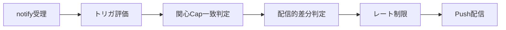
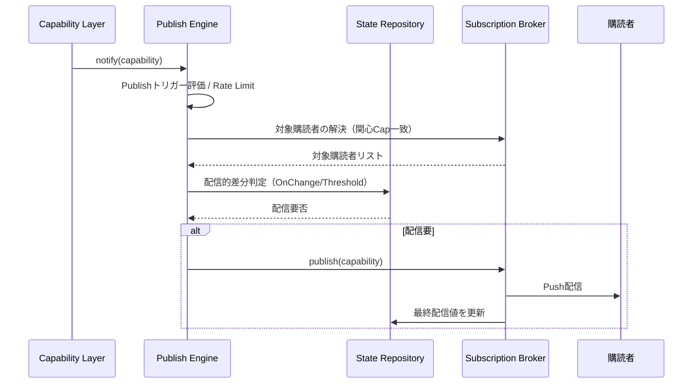

# Publisher Layer 仕様設計書

## 1. 概要

Publisher Layerは、Capability Layerが生成したCapability（製品状態）を、
登録済みの外部購読者（Subscriber）へ配信する責務を持つ配信専用Layerである。

本Layerは配信のタイミング制御・購読管理・フィルタリング・レート制限のみを担い、
状態の解釈・判断・入力源との連携は行わない。

本設計は、drawioにおける以下3要素を正式なコンポーネントとして定義する。

- ① State Repository（最終配信値・配信的差分管理）
- ② Publish Engine（配信管理）
- ③ Subscription Broker（購読管理・配信）

---

## 2. 用語

| 用語 | 説明 |
|------|------|
| Capability | Capability Layerが生成する製品状態。配信対象データ。 |
| Subscriber | Publisher Layerに登録された外部購読者（UI/Logger/診断/リモート監視等） |
| Subscription | 購読者と関心Capability（関心対象）の対応関係 |
| 配信的差分 | ある購読者へ「前回配信した値」と今回の差。Publisher Layerが管理する。 |
| 意味的差分 | Capabilityそのものが前回と変化したか。**Capability Layerが管理する（本Layerの責務外）**。 |
| Publishトリガー | 配信を起動する契機（OnChange / Periodic / Threshold / Event / Initial） |

---

## 3. 位置づけ

```mermaid
flowchart TD
    Cap[Capability Layer] -->|IPublisher.notify(capability)| Pub[Publisher Layer]
    Pub -->|Publish| Sub[外部購読者ゾーン]
    Cap -. 参照提供 .-> Acc[Accessor Layer（参照専用）]
```

Publisher LayerはCapability Layerの下流に位置し、外部購読者ゾーンへ配信する。
Accessor Layer（参照専用・Pull）とは対を成し、Publisherは**Push**を担当する。

---

## 4. 目的

- Capabilityの変化を、関心を持つ購読者へ確実に届ける
- 配信タイミング（周期・変化・イベント）を一元制御する
- 高頻度更新に対しレート制限で配信量を抑制する
- 購読者の増減をCapability Layerから隠蔽する

---

## 5. 責務

Publisher Layerは以下の責務を持つ。

- 外部購読者の登録 / 解除
- CapabilityのPush配信
- 配信タイミング制御（Publishトリガーの評価）
- フィルタリング（関心Cap一致判定）
- レート制限（Rate Limit）
- 購読者ごとの最終配信値・配信的差分の管理
- 内部周期に基づく配信の実行



---

## 6. 非責務

Publisher Layerは以下を責務としない。

- 状態の解釈・意味付け（Capability Layer）
- 閾値跨ぎ（Threshold）の**判定**（Capability Layerが判定し、結果を受け取るのみ）
- 意味的差分の判定（Capability Layer）
- 入力源との直接連携
- 購読者の業務処理の代行
- 状態の永続保持（配信済み値の保持は行うが、システム状態の正本は持たない）
- 生存確認（Heartbeat）の生成 … **外部タスクの責務（本Layerでは行わない）**

---

## 7. コンポーネント構成

```mermaid
flowchart LR
    subgraph PublisherLayer
        PE[② Publish Engine]
        SR[① State Repository]
        SB[③ Subscription Broker]
    end
    Cap[Capability Layer] -->|notify(capability)| PE
    PE --> SR
    SR --> SB
    SB -->|Publish| Sub[購読者]
    SB -->|subscribe/unsubscribe| SB
```

### 7.1 ② Publish Engine（配信管理）

Capabilityごとにタスクを生成し、配信全体を管理する中核コンポーネント。

- `IPublisher.notify(capability)` を受理する
- Publishトリガーを評価し、配信要否を決定する
- レート制限を適用する
- Capabilityごとにタスクを持つ（変更を非同期に扱う）

#### 7.1.1 提供IF
| IF | 内容 |
|----|------|
| notify(Capability capability) | Capability Layerから生成済Capabilityを受け取り、配信処理を起動する |

### 7.2 ① State Repository（最終配信値・配信的差分管理）

購読者ごとの「最後に配信した値」を保持し、配信的差分（OnChange/Threshold用）を判定する。

- 購読者×Capability単位で最終配信値を保持する
- 今回値と最終配信値を比較し、配信要否（配信的差分の有無）を返す
- **意味的差分（Capが変わったか）は保持・判定しない**（それはCapability Layer）

> 補足：drawio注記「前回値は保持しない（L3が変更項目を知る）」は
> **意味的差分**に関する記述である。本Layerが保持するのは
> **購読者ごとの配信的差分**であり、両者は別物である（整合ギャップ分析 GAP-3/4 で分離を確定）。

### 7.3 ③ Subscription Broker（購読管理・配信）

購読者の登録/解除と、関心Cap一致に基づく実配信を行う。

- 購読者を登録順に管理する
- 購読者ごとの関心Capability（Subscription）を保持する
- 関心Cap一致判定を行い、一致する購読者へ配信する

#### 7.3.1 提供IF
| IF | 内容 |
|----|------|
| subscribe(Subscriber, SubscriptionSet) | 購読者と関心対象を登録する |
| unsubscribe(Subscriber) | 購読者を解除する |

---

## 8. Publishトリガー

配信を起動する契機を以下に定義する。

| トリガー | 契機 | 判定の所在 |
|---------|------|-----------|
| OnChange | 前回配信値と差分あり | State Repository（配信的差分） |
| Periodic | 一定周期（例：100ms） | Publish Engine（内部周期） |
| Threshold | 連続値が閾値を跨ぐ | **判定はCapability Layer**、通知を受けて配信 |
| Event | 明示イベント（Error発生・Job完了等） | Capability Layerが明示イベントとして通知 |
| Initial | 購読開始時の初回配信 | Subscription Broker（subscribe時） |

**Rate Limitとの関係（契約）**：
- Event配信および優先度Critical/HighはRate Limit適用除外とする（エラー等の重要通知は間引かない）。
- Rate Limit抑制時はトレーリングエッジ配信（間隔満了後の遅延送出）により
  **最終状態の到達を保証**する（バースト最後の変化が届かないままにならない）。

**Heartbeat**（生存通知）は本Layerで生成しない。周期通知を受けて生存確認を行う
別タスクが外部に存在すべきである（drawio注記に準拠し、本設計では廃止）。

---

## 9. データモデル

```text
struct Subscriber {
    SubscriberId id;
    // 配信先ハンドル（実装依存）
}

struct SubscriptionSet {
    Set<CapabilityKind> interested;   // 関心Capability
    // レート制限やフィルタ条件（任意）
}

struct DeliveryRecord {
    SubscriberId subscriber;
    CapabilityKind kind;
    Value lastDelivered;              // 最終配信値（配信的差分用）
    Timestamp lastDeliveredAt;
}
```

---

## 10. 処理フロー



---

## 11. 設計方針

### 11.1 Push方式
Publisher Layerは購読者へPushで配信する。購読者からのPull参照はAccessor Layerが担う。

### 11.2 Capabilityごとのタスク
Publish EngineはCapabilityごとにタスクを持ち、変更を非同期に扱う。
タスク数は構成（cfg）から決まる。

### 11.3 差分管理の分離（GAP-3/4）
- **意味的差分**（Capが変わったか）＝ Capability Layer（CapabilityDiffChecker）
- **配信的差分**（購読者へ前回何を配信したか）＝ Publisher Layer（State Repository）

### 11.4 判定と配信の分離
閾値跨ぎ（Threshold）や意味付けは判断であり、Capability Layerで行う。
関心Cap一致は配信にのみ関わるため、Publisher Layer（Subscription Broker）で行う。

---

## 12. 制約事項

- Publisher LayerはCapability Layerからのnotifyのみを入力とする
- Publisher LayerはDataStore Layerを直接参照しない
- Publisher Layerは状態判定・閾値判定を行わない
- Publisher Layerは購読者の業務処理へ立ち入らない

---

## 13. 非機能要件

- 高頻度なnotifyに対しレート制限で配信量を抑制できること
- 購読者の増減がCapability Layerへ影響しないこと
- 配信順序が購読者登録順で安定すること
- コンポーネント単位でテスト可能であること

---

## 14. 将来拡張

- 購読者ごとのフィルタ条件の高度化
- 配信失敗時のリトライ/バックプレッシャ制御
- 配信メトリクス（件数・遅延）の取得
