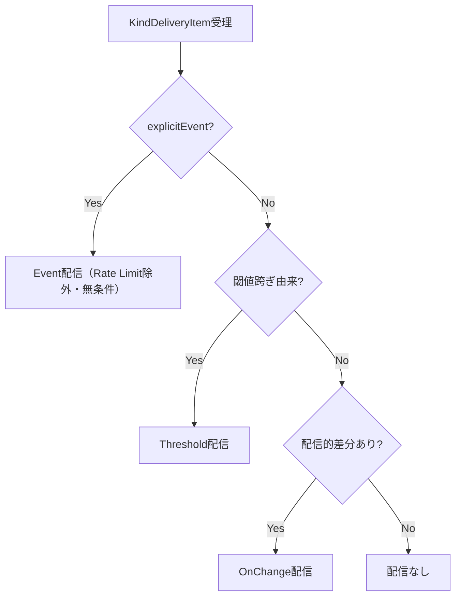
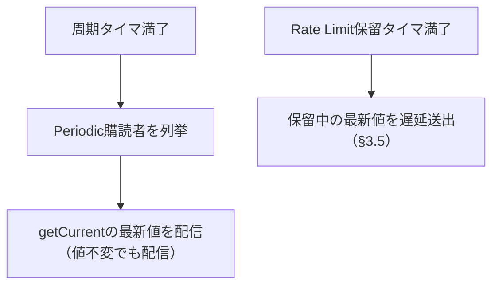
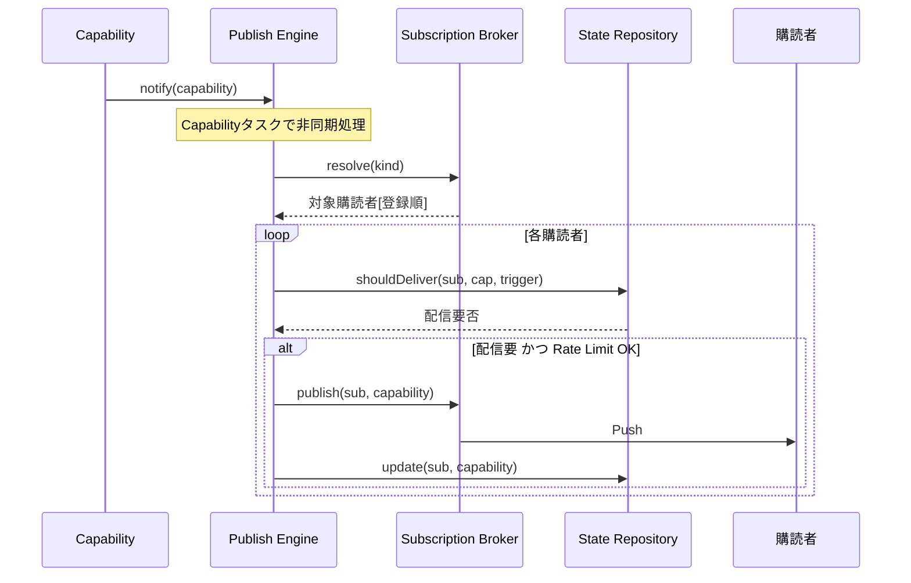

# RIM_PublisherLayer 詳細設計書（L4）

本書は `RIM_PublisherLayer仕様設計書.md` を親とし、各コンポーネントの内部データ構造・
インターフェース・排他制御・スレッドモデル・処理アルゴリズムを定義する。

---

## 1. 全体構成とスレッドモデル

```mermaid
flowchart TB
    Cap[RIM_CapabilityLayer]

    subgraph RIM_PublisherLayer
        PE[Publish Engine]
        SR[State Repository]
        SB[Subscription Broker]
    end

    Sub[外部購読者]

    Cap -->|notify(capability)| PE
    PE -->|対象解決| SB
    PE -->|配信的差分判定| SR
    PE -->|publish| SB
    SB -->|Push| Sub
    SB -->|最終配信値更新| SR
    Sub -.->|subscribe/unsubscribe| SB
```

### 1.1 スレッドモデル

| 実行主体 | 駆動 | 対象 |
|---------|------|------|
| RIM_CapabilityLayerスレッド | notify呼び出し | Publish Engineの受理（キュー投入まで） |
| Publish Engineタスク（Capabilityごと） | イベント/周期 | トリガ評価・差分判定・配信起動 |
| Subscription Brokerスレッド | subscribe/unsubscribe要求 | 購読者テーブル更新 |

- `notify` は受理して即戻る（RIM_CapabilityLayerを長時間ブロックしない）。
- 配信処理はPublish Engineの各Capabilityタスクで非同期に実行する。
- Rate Limitはタスク単位で適用する。

### 1.2 排他制御

| 資源 | ロック | 保持者 |
|------|-------|--------|
| 購読者テーブル（Subscriber×関心Cap） | Broker内部mutex（読み多め→RWロック可） | Subscription Broker |
| 配信記録（DeliveryRecord） | 購読者×Cap単位mutex | State Repository |
| 受理キュー | キュー内部mutex | Publish Engine |

---

## 2. データモデル

```cpp
using SubscriberId = /* 一意ID */;
enum class CapabilityKind { Error, Job, Env, Maint, Health, Safety, Consumable, Print };

struct Subscriber {
    SubscriberId id;
    // 配信先ハンドル（コールバック/キュー等・実装依存）
};

struct SubscriptionSet {
    FlagSet<CapabilityKind> interested;   // 関心Capability
    RateLimitPolicy         rate;         // 最小配信間隔等（任意）
};

struct DeliveryRecord {
    SubscriberId  subscriber;
    CapabilityKind kind;
    Value         lastDelivered;          // 最終配信値（配信的差分の基準）
    Timestamp     lastDeliveredAt;        // Rate Limit / Periodic判定に使用
};

enum class PublishTrigger { OnChange, Periodic, Threshold, Event, Initial };
```

---

## 3. Publish Engine（②配信管理）

### 3.1 責務
`notify(capability)` を受理し、Capabilityごとのタスクで配信要否を決定して配信を起動する。

### 3.2 内部構造とデマルチ（H-4対応）

RIM_CapabilityLayerからのnotifyは**8種を内包する集約Capability**（完全CapabilitySet +
changedKinds + explicitEvents）である。一方、配信処理は**Kind単位のタスク**で行う。
両者の橋渡しとして、受理時に**デマルチ（Kind別分解）**を行う。

```cpp
// タスク入力型（notify引数の集約Capabilityとは別の型）
struct KindDeliveryItem {
    CapabilityKind     kind;
    CapabilityValue    value;          // 完全Setから抽出した当該Kindの値
    CapabilityPriority priority;       // 集約Capability由来
    bool               explicitEvent;  // kind ∈ explicitEvents（Event配信対象）
};
```

- Kindごとの受理キュー / タスク（タスク数はcfgから決定）。
- Rate Limitポリシ（Kind種別ごと）。

### 3.3 提供IF
```cpp
void notify(const Capability& capability);   // IPublisher実装（受理・デマルチのみで即戻る）
```

### 3.4 処理アルゴリズム

**受理（notify・呼び出しスレッド）**：
```text
1. capability.changedKinds の各Kindについて KindDeliveryItem を生成
   （value=set[kind], priority, explicitEvent=kind∈explicitEvents）
2. 各Kindの受理キューへ投入して即戻る
```

**Kindタスク**：
```text
1. 受理キューから KindDeliveryItem を取り出す
2. Publishトリガーを決定する（§6・notify駆動パス）
3. Subscription Brokerへ対象購読者を要求（resolve(kind)・関心Cap一致）
4. 各対象購読者について State Repository で配信的差分を判定
5. Rate Limit を適用（§3.5）
6. 配信対象を Subscription Broker.publish() へ渡す
```

- 優先度Critical/Highは他タスクに優先して処理する（優先度は CapabilityPriorityChecker 由来）。

### 3.5 Rate Limit（H-5対応：トレーリングエッジ配信・Event除外）

| 規則 | 内容 |
|------|------|
| 適用単位 | 購読者×Kind |
| 抑制 | lastDeliveredAt から最小間隔未満の場合、即時送出しない |
| **トレーリングエッジ** | 抑制時は当該(購読者,Kind)に**保留中フラグ+最新値**を記録し、**間隔満了タイマで遅延送出**する。これにより「バースト最後の変化が永久に届かない」ことを防ぐ（最終状態の到達保証） |
| 保留の上書き | 保留中に新しい値が来たら保留値を最新に置き換える（送るのは常に最新1件） |
| **適用除外** | `explicitEvent=true`（Event配信）および priority=Critical/High は **Rate Limit適用除外**（即時送出） |

---

## 4. State Repository（①最終配信値・配信的差分）

### 4.1 責務
購読者×Capability単位の最終配信値を保持し、配信的差分を判定する。

### 4.2 内部構造
```cpp
class StateRepository {
    // key = (SubscriberId, CapabilityKind)
    std::unordered_map<Key, DeliveryRecord> records_;
    std::mutex mutex_;   // 実装によりkeyシャーディング可
public:
    bool shouldDeliver(SubscriberId, const Capability&, PublishTrigger);
    void update(SubscriberId, const Capability&);   // 送出成功後に最終配信値更新
};
```

### 4.3 shouldDeliver 判定
| トリガー | 判定 |
|---------|------|
| OnChange | lastDelivered と今回値が異なれば配信 |
| Threshold | RIM_CapabilityLayerが閾値跨ぎと判定済み → 配信（本層は再判定しない） |
| Periodic | 前回配信から周期経過で配信（値不変でも可） |
| Event | 無条件配信（明示イベント） |
| Initial | 記録が無い（初回）→ 配信 |

- **意味的差分（Capが変わったか）はRIM_CapabilityLayerの領域**。本層は購読者ごとの
  「前回配信値との差（配信的差分）」のみを見る。

### 4.4 update
配信成功後にのみ `lastDelivered` / `lastDeliveredAt` を更新する（送出失敗時は更新しない）。

### 4.5 removeSubscriber（M-9対応）
```cpp
void removeSubscriber(SubscriberId);
```
unsubscribe時にBrokerから呼ばれ、当該Subscriberの全DeliveryRecordを削除する。
これにより再subscribe時はInitial判定（記録なし=初回）が正しく機能し、レコードリークも防ぐ。

---

## 5. Subscription Broker（③購読管理・配信）

### 5.1 責務
購読者の登録/解除、関心Cap一致による対象解決、実配信（Push）。

### 5.2 内部構造
```cpp
class SubscriptionBroker {
    // 登録順を保持（配信順の安定化）
    std::vector<Subscriber> order_;
    std::unordered_map<SubscriberId, SubscriptionSet> subs_;
    std::shared_mutex mutex_;
public:
    void subscribe(const Subscriber&, const SubscriptionSet&);
    void unsubscribe(SubscriberId);   // StateRepositoryの当該DeliveryRecordも削除する（§4.5）
    std::vector<SubscriberId> resolve(CapabilityKind);   // 関心Cap一致（登録順）
    void publish(SubscriberId, const Capability&);       // Push送出
};
```

### 5.3 配信順序
`order_` により購読者登録順で配信する（決定的順序）。

### 5.4 publish
購読先ハンドルへ非ブロッキングに送出する。送出結果をPublish Engineへ返し、
成功時のみ State Repository.update を行う。

---

## 6. Publishトリガー決定（2パス構成・M-5対応）

トリガーは**notify駆動パス**と**タイマ駆動パス**の2系統に分離する。

### 6.1 notify駆動パス（KindDeliveryItem受理時）



- 同時成立時の優先： **Event > Threshold > OnChange**（上位1つのトリガ種別として配信）。

### 6.2 タイマ駆動パス（Periodic・notifyと独立）



- Periodicは**notifyが来なくても**周期で配信する（値不変でも配信する契約）。
  配信値はStateRepositoryの保留最新値、なければ最後にnotifyされた値を用いる。
- Initialは subscribe 時に、RIM_CapabilityLayerの getCurrentCapability() から現在Capを取得して初回配信する
  （起動時の初期フル評価により現在Capは常に存在する。ライフサイクル設計書 Phase 3 参照）。
- Heartbeatは本層に存在しない（外部タスクの責務）。

---

## 7. シーケンス（notify→配信）



---

## 8. エラー処理

| 事象 | 挙動 |
|------|------|
| 購読者送出失敗 | 当該購読者のみスキップ、State Repository更新せず、次周期で再送機会 |
| 受理キュー溢れ | 優先度低のCapabilityを間引く/最新優先（cfg方針）。ログ出力 |
| 未登録購読者への配信 | resolve結果に含めない（発生しない前提） |

---

## 9. 非機能・設計原則の対応

| 要件 | 担保 |
|------|------|
| notifyでCapabilityを長時間ブロックしない | 受理即戻り + 非同期タスク |
| 高頻度notifyの抑制 | Rate Limit（購読者×Cap単位） |
| 配信順序の安定 | Subscription Brokerの登録順配信 |
| 差分の責務分離 | 配信的差分=本層 / 意味的差分=Capability |
| テスト容易性 | 3コンポーネント独立、購読先はモック可 |

---

## 10. 次段（未確定）

- RateLimitPolicyの具体値（最小間隔・バースト許容）のcfg定義
- 受理キュー溢れ時の間引き方針の確定
  ※間引きを行う場合、changedKinds/explicitEvents のエッジ情報は**後続レコードへORマージして保存必須**
  （エッジ情報を黙って破棄してはならない）（レビューM-8）
- 購読先ハンドルの抽象（コールバック / メッセージキュー）の確定
- 送出失敗時の再試行ポリシ（回数・間隔）の確定

（確定済み：デマルチ=KindDeliveryItem方式(§3.2/§3.4)、Rate Limitトレーリングエッジ+Event/Critical除外(§3.5)、
トリガ2パス分離(§6)、Initial=getCurrentCapability経由(§6.2)、unsubscribe時レコード削除(§4.5)）
