# 1. 概要

## 1.1 目的

DataStore Layerはシステム内データの正本（Single Source of Truth）を管理するレイヤである。

本レイヤはAdapter Layerから入力されたデータを一元管理し、Capability Layerへ整合したシステム状態を提供する。

Capability LayerはDataStore Layer内部のStoreやRepositoryを直接参照せず、DataStore Layerが生成するSystemSnapshotのみを利用して状態判定およびCapability評価を行う。

これにより、システム内における以下の責務を明確に分離する。

```text
DataStore Layer
    データ管理

Capability Layer
    状態判定
```

DataStore Layerの役割は「システムの事実を管理すること」であり、「システム状態を判断すること」ではない。

状態判定はCapability Layerが担当する。

---

## 1.2 レイヤの位置付け

DataStore LayerはAdapter LayerとCapability Layerの中間に配置される。

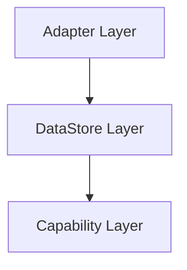

Adapter Layerは外部システムや機器から取得したデータをDataStore Layerへ提供する。

DataStore Layerは受信データを管理し、Capability LayerへSystemSnapshotとして提供する。

Capability LayerはSystemSnapshotのみを利用して評価を実施する。

---

## 1.3 適用範囲

本書では以下を定義する。

- DataStore Layerの責務
- DataStore Layerの非責務
- 設計原則
- データモデル
- アーキテクチャ構成
- コンポーネント責務
- データフロー
- Snapshot生成方針
- 排他制御方針
- 設計判断

各コンポーネントの詳細なインタフェース、内部データ構造、排他実装方式についてはL2詳細設計書で定義する。

---

# 2. 背景

## 2.1 システムが抱える課題

本システムでは複数の機能が共通データを利用する。

例えば以下のようなデータが存在する。

```text
Temperature

Humidity

Safety

JobInformation

CurrentError
```

これらのデータは複数の機能から参照される。

各機能が独自にデータを保持した場合、以下の問題が発生する。

- データの正本が不明確になる
- 同一データが複数箇所で管理される
- 更新漏れによる不整合が発生する
- 変更影響範囲が拡大する

---

## 2.2 データ管理と状態判定の混在

一般的なシステムでは、データ保持と状態判定が同一コンポーネントに存在しやすい。

例

```text
温度受信

↓

温度保持

↓

異常判定

↓

アラーム生成
```

この構造では、

```text
データ管理責務

状態判定責務
```

が混在する。

結果として、

- 責務境界が不明確になる
- 状態判定仕様変更がデータ管理へ波及する
- テスト容易性が低下する

という問題が発生する。

---

## 2.3 システム状態整合性の課題

Capabilityは単一データではなく、複数データの組み合わせによって動作する。

例

```text
Temperature

Safety

CurrentJobInformation

CurrentError
```

Capabilityが各データを個別取得すると、取得タイミング差によって実際には存在しない状態を観測する可能性がある。

例

```text
t1 Temperature取得

t2 Error発生

t3 CurrentError取得
```

Capabilityが観測する状態は、

```text
Temperature
    更新前

CurrentError
    更新後
```

となる可能性がある。

この状態は実際にはシステム内に存在していない。

この問題は以下を引き起こす。

- Capability評価結果の非決定化
- 評価結果の再現性低下
- 障害解析性低下

---

## 2.4 解決方針

これらの課題を解決するため、本システムではDataStore Layerを導入する。

DataStore Layerは以下を実現する。

```text
データ正本管理

DataとStateの分離

Snapshot方式

System全体整合性保証
```

Capability LayerにはSystemSnapshotのみを提供し、DataStore Layer内部構造への依存を排除する。

---

## 2.5 次章との関係

本章では解決すべき課題を整理した。

次章では、それらの課題を解決するためにDataStore Layerが達成すべき目的を定義する。

---

# 3. 目的

前章で示した課題を解決するため、DataStore Layerは以下の目的を持つ。

---

## 3.1 システムデータの一元管理

システム内データをDataStore Layerへ集約する。

これにより、

```text
どのデータが正本か
```

を常に明確化する。

---

## 3.2 データ整合性の維持

データ更新経路をDataStore Layerへ集約する。

複数箇所から独立してデータ更新を行う構造を排除することで整合性を維持する。

---

## 3.3 DataとStateの責務分離

DataStore LayerはDataのみを管理する。

StateはCapability Layerが導出する。

これにより、

```text
事実

と

解釈
```

を分離する。

---

## 3.4 Capability Layerへの統一インタフェース提供

Capability LayerはSystemSnapshotのみを利用する。

これにより、

- テスト容易性向上
- レイヤ分離
- 実装依存の低減

を実現する。

---

## 3.5 システム状態整合性の保証

Capability Layerが利用するデータは単一時点の整合性を持つ必要がある。

DataStore LayerはSystemSnapshotによってシステム全体状態を提供する。

---

## 3.6 次章との関係

本章ではDataStore Layerの目的を定義した。

次章では、これらの目的を実現するために採用する設計原則を定義する。

---

# 4. 設計原則

本章ではDataStore Layerの設計における基本原則を定義する。

全コンポーネントは本章の原則に従って設計する。

---

## 4.1 Single Source of Truth

システム内データの正本はDataStore Layerのみが保持する。

他レイヤは独自の正本を持たない。

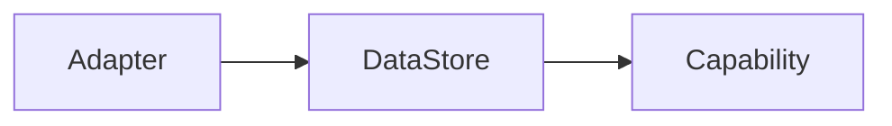

これにより、

- データ所有権明確化
- 更新経路統一
- 整合性維持

を実現する。

---

## 4.2 DataとStateの分離

DataStore LayerはDataのみを管理する。

StateはCapability LayerがDataから導出する。

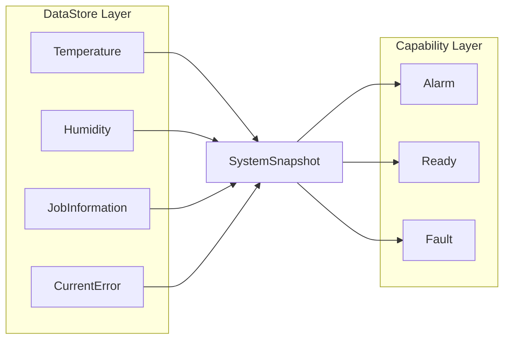

DataStore Layerは事実を管理する。

Capability Layerは事実を解釈する。

---

## 4.3 Snapshot方式

Capability LayerはStoreおよびRepositoryを直接参照してはならない。

Capability LayerへはSystemSnapshotのみを提供する。

---

### 解決したい課題

```text
レイヤ分離

整合性保証

Store構造隠蔽

テスト容易性向上
```

---

### 非採用案

Store直接参照方式。

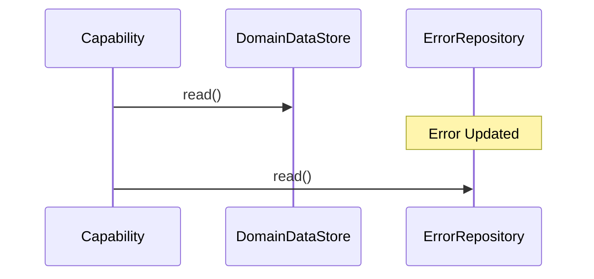

この場合、

Capabilityは実際には存在しない状態を観測する可能性がある。

---

### 採用案

Snapshot方式。

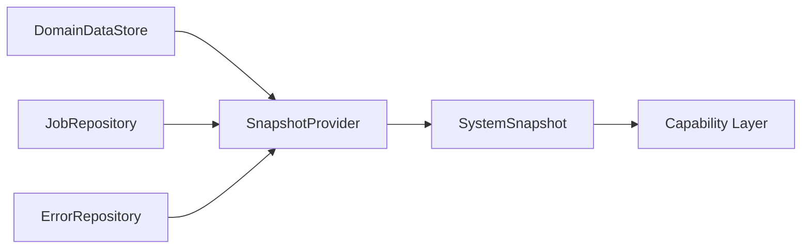

SystemSnapshotはCapabilityへ整合した状態を提供する。

詳細な設計判断については「18.4 Snapshot方式」を参照する。

---

## 4.4 責務分離

DataStore Layer内部では責務を明確に分離する。

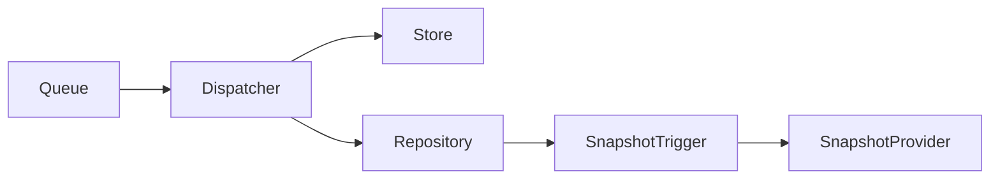

各コンポーネントの責務は以下とする。

```text
Queue
    保持

Dispatcher
    更新先決定

Store
    現在値管理

Repository
    現在情報管理

SnapshotTrigger
    Snapshotライフサイクル管理

SnapshotProvider
    Snapshot生成
```

責務重複を避けることで保守性および拡張性を向上させる。

詳細は第11章で定義する。

---

## 4.5 System全体整合性保証

Capability Layerが評価する対象はStore単体ではなくシステム全体状態である。

そのためDataStore LayerはStore単位整合ではなくSystem全体整合を保証する。

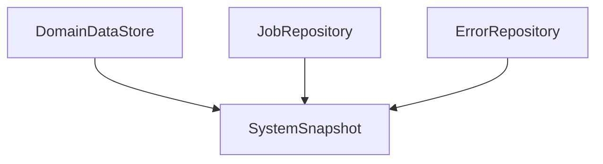

DataStore Layerが保証するものは、

```text
SystemSnapshot生成時点の
単一時点整合性
```

である。

DataStore Layerは常に最新状態であることまでは保証しない。

保証対象は整合性であり、リアルタイム性ではない。

詳細な設計判断については「18.5 Snapshot整合性方式」を参照する。

---

## 4.6 設計原則の関係

DataStore Layerの設計原則は互いに独立していない。

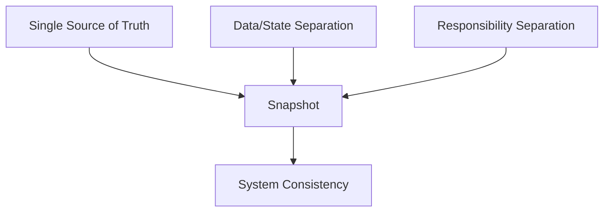

これらの原則を組み合わせることでDataStore Layerのアーキテクチャを構成する。

---

## 4.7 次章との関係

本章ではDataStore Layerの設計原則を定義した。

次章では、その中核となるDataとStateの責務境界について詳細に定義する。

---
# 5. DataとState

本章ではDataStore LayerとCapability Layerの責務境界を定義する。

DataStore Layerの設計において最も重要な原則は「DataとStateの分離」である。

本章で定義する責務境界は、後続のアーキテクチャ設計、コンポーネント設計、および設計判断の前提となる。

DataStore Layerが扱う対象とCapability Layerが扱う対象を明確に分離することで、

- 責務の明確化
- 保守性向上
- テスト容易性向上
- 変更影響範囲の局所化

を実現する。

---

## 5.1 Dataの定義

Dataとはシステムが観測または受信した事実情報である。

Dataは評価や解釈を含まない。

DataStore Layerが管理するのは常に事実であり、意味付けされた状態ではない。

例として、以下はDataである。

```text
Temperature = 80

Humidity = 45

DoorOpen = true

Safety = Safe

JobInformation = Running

ErrorCode = E001
```

これらはシステムが観測または受信した事実であり、正しい・異常・危険といった解釈を含まない。

DataStore LayerはDataを保持し提供する責務のみを持つ。

Dataの意味を解釈してはならない。

---

## 5.2 Stateの定義

StateとはDataに対する解釈結果である。

Stateは複数のDataを入力として生成される場合がある。

StateはCapability Layerが導出する。

例として以下はStateである。

```text
Normal

Warning

Alarm

Fault

Ready

NotReady

MaintenanceRequired
```

例えば、

```text
Temperature = 80

CurrentError = None
```

というDataから、

```text
Warning
```

というStateが導出される可能性がある。

また、

```text
Safety = Safe

JobInformation = Running

CurrentError = None
```

というDataから、

```text
Ready
```

というStateが導出される可能性がある。

これらは事実ではなく、Capability Layerによる評価結果である。

---

## 5.3 DataとStateの違い

DataとStateの違いを以下に示す。

|項目|Data|State|
|---|---|---|
|意味|事実情報|解釈結果|
|管理レイヤ|DataStore Layer|Capability Layer|
|生成元|観測値または受信値|Dataの評価結果|
|変化要因|外部イベント|評価ロジック|
|責務|保持・提供|判定・評価|

例として、

```text
Temperature = 95
```

はDataである。

一方、

```text
OverHeat
```

はStateである。

「95℃であること」は事実だが、

「過熱状態であること」は評価結果である。

---

## 5.4 JobInformationの扱い

JobInformationは名称上Stateを含むが、本システムではStateとして扱わない。

JobInformationは外部システムまたはコンポーネントから通知される事実情報である。

例えば、

```text
Idle

Running

Paused

Completed
```

といった値は、Capability Layerが導出した評価結果ではない。

外部コンポーネントから通知される事実である。

そのためJobInformationはDataとして扱う。

※命名に関する注意  

JobInformationは名称上Stateを含むが、
本設計ではCapability Layerが導出するStateではない。

JobInformationは外部コンポーネントから通知される
事実情報(Data)として扱う。

以降の章で登場するCurrentJobInformationについても同様であり、
Capability LayerのStateではなく、
Jobに関する現在情報を表すDataである。


---

## 5.5 Errorの扱い

Errorについても同様である。

例えば、

```text
ErrorOccurred

ErrorCleared
```

などのイベントはDataである。

また、

```text
CurrentError
```

もDataとして扱う。

DataStore LayerはError情報を管理するが、

```text
Fault

Recovering

Critical
```

などの評価結果は管理しない。

これらはCapability Layerの責務である。

---

## 5.6 DataとStateの責務境界

DataStore LayerとCapability Layerの責務境界を以下に示す。

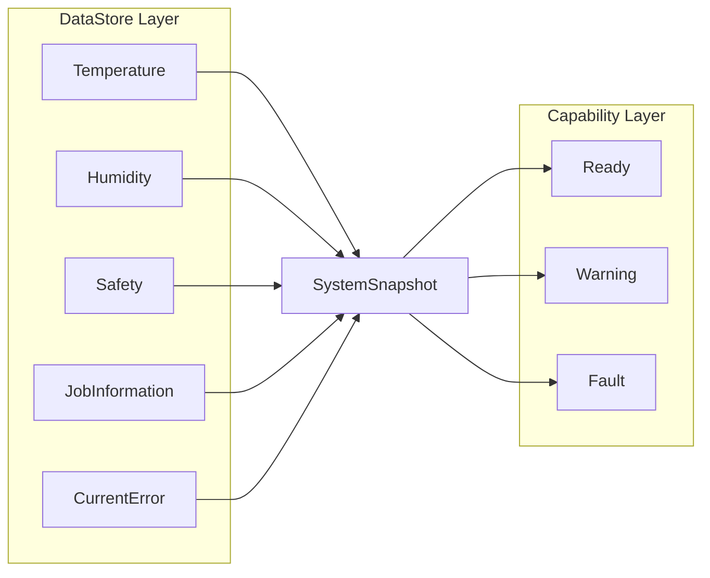

DataStore LayerはDataをSystemSnapshotとして提供する。

Capability LayerはSystemSnapshotを利用してStateを導出する。

---

## 5.7 DataStore LayerがStateを保持しない理由

DataStore LayerがStateを保持した場合、以下の問題が発生する。

### 問題1 責務混在

DataStore LayerがStateまで保持すると、

```text
Data管理責務

状態判定責務
```

が混在する。

結果としてコンポーネント責務が曖昧になる。

---

### 問題2 変更影響範囲拡大

例えば、

```text
Alarm判定条件変更
```

が発生した場合、

本来はCapability Layerのみの変更で済むはずである。

しかしDataStore LayerがStateを保持するとDataStore Layerも変更対象となる。

---

### 問題3 テスト容易性低下

Data管理と状態判定が混在すると、

```text
Data管理テスト

状態判定テスト
```

を分離できなくなる。

その結果、テスト規模が大きくなる。

---

### 問題4 Capability Layerの存在意義低下

State管理をDataStore Layerが担当すると、

Capability Layerとの責務境界が曖昧になる。

結果としてレイヤ構造そのものが崩れる。

---

## 5.8 DataStore Layerにおける禁止事項

DataとStateの責務境界を維持するため、DataStore Layerでは以下を禁止する。

### 状態判定

禁止例

```text
Temperature > 80

↓

Alarm = true
```

---

### 閾値判定

禁止例

```text
Humidity < 10

↓

DryCondition
```

---

### 業務判定

禁止例

```text
JobInformation = Completed

↓

JobFinished
```

---

### Capability生成

禁止例

```text
CurrentError

↓

FaultCapability
```

---

## 5.9 Capability Layerとの関係

Capability LayerはDataStore Layerの内部構造を意識してはならない。

Capability Layerが利用する情報は常にSystemSnapshotのみとする。

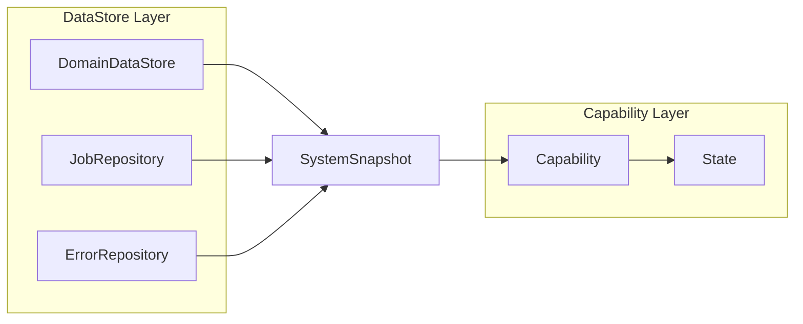

Capability LayerはStoreおよびRepositoryを直接参照してはならない。

これにより、

- Layer結合度低減
- テスト容易性向上
- 内部構造変更の影響局所化

を実現する。

---

## 5.10 DataからStateへの変換責務

DataからStateへの変換責務はCapability Layerが持つ。

DataStore Layerは変換処理を行わない。

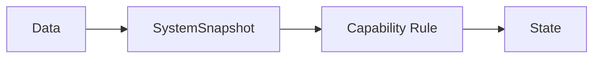

DataStore LayerはDataの正しさを保証する。

Capability LayerはStateの正しさを保証する。

責任分界点はSystemSnapshotである。

---

## 5.11 成立条件

本設計は以下を前提とする。

```text
DataStore Layerは事実のみを管理する

Capability LayerがStateを管理する

SystemSnapshotが唯一の受け渡し手段である

DataStore Layerは状態判定を行わない
```

これらの前提が崩れた場合、本章で定義した責務境界は成立しない。

---
# 6. 責務
DataStore LayerはDataのみを管理し、StateはCapability Layerが管理する。

本章では、その責務境界を実現するためにDataStore Layerが担う責務を定義する。

DataStore Layerはシステムデータの正本管理レイヤとして、以下の責務を持つ。

---

## 6.1 データ保持

Adapter Layerから入力されたDataを保持する。

保持対象はDataであり、Stateではない。

DataStore Layerはシステム内データの正本として機能する。

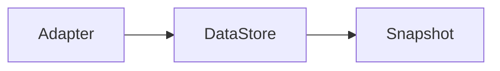

---

## 6.2 データ更新

入力されたDataを最新状態へ更新する。

DataStore Layerは更新内容の意味を解釈しない。

DataStore Layerの責務は更新されたDataを保持することであり、その意味を評価することではない。

---

## 6.3 データ提供

Capability Layerへデータを提供する。

ただし、StoreやRepositoryを直接公開しない。

Capability LayerへはSystemSnapshotのみを提供する。

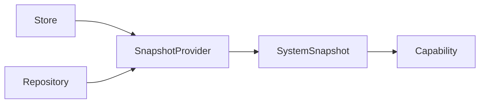

---

## 6.4 Job現在情報管理

Job関連イベントからCurrent Job Stateを構築し管理する。

JobRepositoryはイベント列を解釈し、CurrentJobInformationを管理する。

例。

```text
JobStarted

↓

Running

JobCompleted

↓

Completed
```

管理対象は状態情報そのものではなく、Jobに関するDataである。

---

## 6.5 Error現在情報管理

Error関連イベントからCurrent Error情報を構築し管理する。

例。

```text
ErrorOccurred

↓

CurrentError = E001

ErrorCleared

↓

CurrentError = None
```

ErrorRepositoryはError管理責務を持つ。

ただし、FaultやCriticalといったState判定は行わない。

---

## 6.6 Snapshot生成契機管理

SystemSnapshot生成契機を管理する。

DataStore Layerでは以下をSnapshot生成契機とする。

```text
周期契機

Event更新契機
```

SnapshotTriggerは契機管理責務を持つ。

Snapshot生成処理自体は行わない。

---

## 6.7 SystemSnapshot生成

SystemSnapshotを生成する。

Snapshot生成時はStoreおよびRepositoryから最新状態を取得し、システム全体状態を構築する。

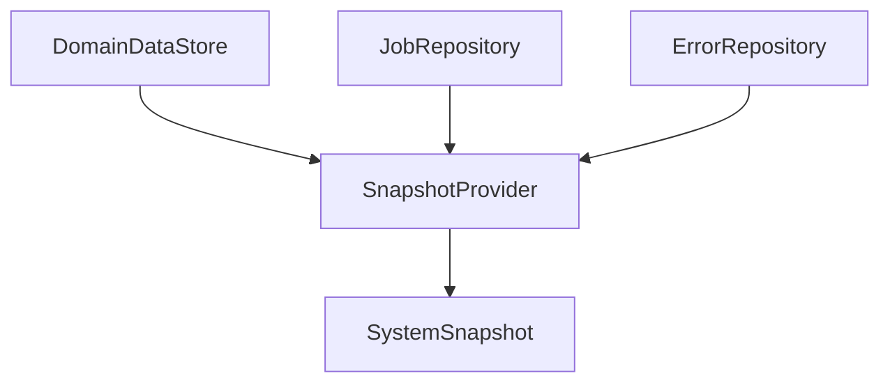

---

## 6.8 SystemSnapshot提供

生成されたSystemSnapshotをCapability Layerへ提供する。

Capability LayerはSystemSnapshotのみを利用する。

StoreやRepositoryへの直接依存は禁止する。

---

## 6.9 システム整合性維持

SystemSnapshot生成時にシステム全体整合性を保証する。

DataStore Layerが保証するのは、

```text
単一時点整合性
```

である。

リアルタイム性や常時最新状態は保証対象ではない。

---

## 6.10 次章との関係

本章ではDataStore Layerが担当する責務を定義した。

次章では責務境界を明確化するために、DataStore Layerが担当しない機能を定義する。

---

# 7. 非責務

本章ではDataStore Layerが担当しない機能を定義する。

責務だけではなく非責務を明確化することで、レイヤ境界およびコンポーネント境界を維持する。

---

## 7.1 状態判定

DataStore Layerは状態判定を行わない。

禁止例。

```text
Temperature > 80

↓

Alarm
```

AlarmはStateである。

State管理はCapability Layerの責務である。

---

## 7.2 閾値判定

DataStore Layerは閾値判定を行わない。

禁止例。

```text
Humidity < 10

↓

DryCondition
```

---

## 7.3 業務判定

DataStore Layerは業務判断を行わない。

禁止例。

```text
JobCompleted

↓

ProductionFinished
```

このような業務ルールはCapability LayerまたはDomain Layerが管理する。

---

## 7.4 状態遷移制御

DataStore Layerは状態遷移制御を行わない。

例。

```text
Ready

↓

Running

↓

Stopping
```

などの状態機械管理は責務外とする。

---

## 7.5 Capability実行

DataStore LayerはCapability実行を行わない。

Capability Layerへ評価要求を通知するのみとする。

---

## 7.6 外部機器制御

DataStore Layerは外部システムおよび外部機器を制御しない。

Data管理と制御責務を分離する。

---

## 7.7 HSM制御

DataStore LayerはHSM制御責務を持たない。

---

## 7.8 業務ログ管理

業務イベントログの管理責務は持たない。

診断ログは別途定義する。

---

## 7.9 次章との関係

本章ではDataStore Layerの非責務を定義した。

次章では責務境界を維持するために必要な制約事項を定義する。

---

# 8. 制約事項

本章では、責務境界を維持するためDataStore Layerへ適用する制約を定義する。

---

## 8.1 意味解釈禁止

DataStore Layerは保持データの意味を解釈してはならない。

DataStore LayerはData管理コンポーネントであり、State管理コンポーネントではない。

---

### 禁止例

```text
Temperature > 80

↓

Alarm = True
```

---

### 許可例

```text
Temperature = 85
```

を保持する。

---

## 8.2 Store制約

Storeは現在値管理のみを担当する。

Storeが実施してはならない処理を以下に示す。

```text
状態判定

業務判断

Capability依存

Repository参照
```

---

## 8.3 Repository制約

Repositoryは現在情報管理を担当する。

ただし状態判定は行わない。

Repositoryは以下を実施してはならない。

```text
Capability生成

Alarm判定

Warning判定

業務判断
```

---

## 8.4 Dispatcher制約

Dispatcherは更新先決定責務のみを持つ。

以下は禁止する。

```text
データ解釈

業務判断

State判定

DataStoreItem改変
```

---

## 8.5 SnapshotTrigger制約

SnapshotTriggerはSnapshot生成契機管理責務を持つ。

以下は禁止する。

```text
SystemSnapshot生成

Store参照

Repository参照

状態判定
```

---

## 8.6 SnapshotProvider制約

SnapshotProviderはSnapshot生成責務のみを持つ。

以下は禁止する。

```text
Snapshot生成契機判断

Capability判定

状態判定
```

---

## 8.7 Capability依存禁止

DataStore Layer内部コンポーネントはCapability Layerへ依存してはならない。

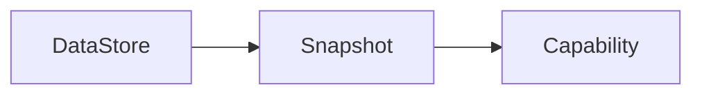

依存方向は常に一方向とする。

---

## 8.8 次章との関係

本章ではDataStore Layerに適用される制約を定義した。

次章では、これらの責務と制約を実現するために利用するデータモデルを定義する。

---

# 9. データモデル

本章ではDataStore Layer内部で利用するデータモデルを定義する。

Dataモデルの統一は、コンポーネント間の結合度低減および保守性向上を目的とする。

---

## 9.1 DataStoreItem

### 概要

DataStoreItemはDataStore Layer内部における共通データモデルである。

Queue、Dispatcher、Store、およびRepository間ではDataStoreItemを利用する。

---

### 解決したい課題

コンポーネントごとに異なるデータ形式を利用した場合、

```text
変換処理増加

IF差異発生

保守性低下

拡張コスト増加
```

が発生する。

---

### 採用理由

DataStoreItemを共通データモデルとして採用することで、

```text
IF統一

変換削減

拡張容易性向上
```

を実現する。

---

### 構造

```text
DataStoreItem

├ DataId
├ Value
└ Context
```

---

### DataId

データ種別を識別する。

DispatcherはDataIdを利用して更新先を決定する。

---

### Value

保持対象データ本体。

例。

```text
80

Running

E001
```

---

### Context

Dataに付随する補足情報。

例。

```text
Timestamp

Source

Metadata
```

Context定義責務はAdapter Layerが持つ。

DataStore LayerはContext構造に依存しない。

---

## 9.2 SystemSnapshot

### 概要

SystemSnapshotはCapability Layerへ公開される読み取り専用データである。

Capability LayerはSystemSnapshotのみを利用する。

---

### 解決したい課題

```text
整合性保証

責務分離

Store構造隠蔽

テスト容易性向上
```

---

### 構成


---

### 特性

SystemSnapshotは以下を満たす。

```text
読み取り専用

生成後不変

単一時点整合性保証
```

---

## 9.3 DataStoreItemとSystemSnapshotの役割の違い

両者の違いを以下に示す。

|項目|DataStoreItem|SystemSnapshot|
|---|---|---|
|用途|内部転送|Capability提供|
|利用範囲|DataStore内部|DataStore外部|
|粒度|単一Data|システム全体状態|
|可変性|可変|不変|

---

## 9.4 データモデル全体像

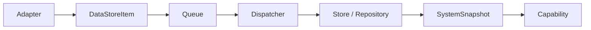

---

## 9.5 次章との関係

本章ではDataStore Layerで利用するデータモデルを定義した。

次章では、これらのデータモデルを利用して構成されるDataStore Layer全体アーキテクチャを定義する。

# 10. アーキテクチャ

前章ではDataStore Layerで利用するデータモデルを定義した。

本章では、それらのデータモデルを利用してDataStore Layerをどのような構造で構築するかを定義する。

DataStore Layerは単なるデータ格納領域ではない。

システムデータの管理責務を分離し、単一時点整合性を持つSystemSnapshotを生成することを目的としたアーキテクチャである。

---

## 10.1 アーキテクチャ概要

DataStore Layerは以下の責務分離構造を採用する。

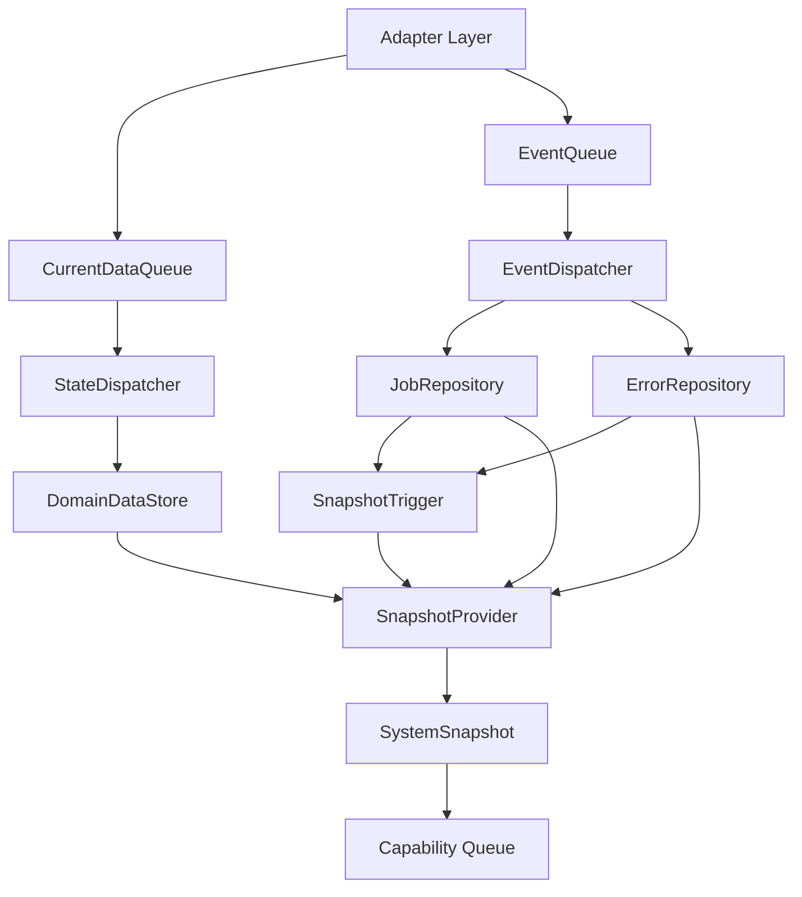

---

## 10.2 設計方針

本アーキテクチャは以下の方針を実現するために構成されている。

### データ流通経路の統一

全データはQueueを経由して処理される。

直接Store更新は禁止する。

---

### 更新責務の集約

更新先判定はDispatcherに集約する。

StoreおよびRepositoryは更新先判定を行わない。

---

### 現在情報管理責務の分離

現在値管理と現在情報管理を分離する。

```text
DomainDataStore
    現在値管理

Repository
    現在情報管理
```

---

### Snapshot責務の分離

Snapshot生成契機管理とSnapshot生成処理を分離する。

```text
SnapshotTrigger
    契機管理

SnapshotProvider
    Snapshot生成
```

---

## 10.3 Queue構成方針

### 背景

DataStore Layerには性質の異なるデータが入力される。

例。

```text
Temperature

Humidity

Consumable
```

これらは現在値データである。

一方、

```text
Error

JobInformation
```

はイベント性を持つデータである。

両者は更新特性が異なる。

---

### 採用方針

Queueを以下のように分離する。

```text
CurrentDataQueue

EventQueue
```

---

### 目的

```text
データ特性ごとの運用

将来最適化

責務明確化
```

---

## 10.4 Repository構成方針

### 背景

JobおよびErrorは単純な現在値保持ではない。

イベント列からCurrentJobInformationを構築する必要がある。

---

例。

```text
ErrorOccurred

↓

CurrentError = E001

ErrorCleared

↓

CurrentError = None
```

---

### 採用方針

```text
DomainDataStore

JobRepository

ErrorRepository
```

へ分離する。

---

### 理由

StoreとRepositoryでは責務が異なるため。

```text
Store
    現在値保持

Repository
    状態構築
```

---

## 10.5 Snapshot構成方針

Capability LayerにはStoreやRepositoryを公開しない。

SystemSnapshotのみを公開する。


---

### 目的

```text
レイヤ分離

単一時点整合性保証

Store構造隠蔽
```

---

## 10.6 Snapshot生成契機

Snapshot生成契機は2種類存在する。

### 周期契機

State系最新値をCapabilityへ反映するために利用する。

```text
Timer

↓

Snapshot生成
```

---

### Event契機

JobおよびErrorを即時反映するために利用する。

```text
Repository更新

↓

Snapshot生成
```

---

### 生成単位

いずれの場合も部分更新は行わない。

SystemSnapshotは常に全体再生成する。

---

## 10.7 次章との関係

本章ではDataStore Layer全体アーキテクチャを定義した。

次章では各コンポーネントの責務を定義する。

---

# 11. コンポーネント責務

本章では各コンポーネントの存在理由および責務を定義する。

責務定義の目的は、

```text
何をするか

何をしないか
```

を明確化することである。

---

## 11.1 CurrentDataQueue

### 存在理由

State系データ入力と内部処理を疎結合化するため。

---

### 責務

- DataStoreItem保持
- FIFO順序維持
- Dispatcherへの提供

---

### 非責務

- 状態判定
- 更新先決定
- Snapshot生成

---

## 11.2 EventQueue

### 存在理由

Event系データ入力と内部処理を疎結合化するため。

---

### 責務

- DataStoreItem保持
- FIFO順序維持
- Dispatcherへの提供

---

### 非責務

- Error判定
- Job判定
- Snapshot生成

---

## 11.3 StateDispatcher

### 存在理由

State系データの更新先判定責務を集約するため。

---

### 責務

- DataId判定
- DomainDataStore更新

---

### 非責務

- 状態判定
- Store管理
- Snapshot制御

---

## 11.4 EventDispatcher

### 存在理由

Event系データの更新先判定責務を集約するため。

---

### 責務

- DataId判定
- Repository更新

---

### 非責務

- Job状態生成
- Error意味解釈
- Snapshot生成

---

## 11.5 DomainDataStore

### 存在理由

現在値データの正本管理を行うため。

---

### 責務

- 現在値保持
- 最新値提供

---

### 非責務

- 状態判定
- Job管理
- Error管理

---

## 11.6 JobRepository

### 存在理由

Job関連イベントからCurrentJobInformationを構築するため。

---

### 責務

- Jobイベント管理
- CurrentJobInformation管理
- Job更新規則適用

---

### 非責務

- Capability判定
- Alarm判定

---

## 11.7 ErrorRepository

### 存在理由

Error関連イベントからCurrentErrorを構築するため。

---

### 責務

- Errorイベント管理
- CurrentError管理
- Error更新規則適用

---

### 非責務

- Fault判定
- Critical判定

---


### 存在理由

Snapshotライフサイクル管理責務を集約するため。

### 責務

#### Snapshot生成契機管理

以下の契機を管理する。

```text
周期契機

Repository更新契機
```
#### Snapshot生成要求

SnapshotProviderへSystemSnapshot生成要求を発行する。

#### Capability通知

SystemSnapshot生成完了後にCapability評価要求を通知する。

### 非責務
- SystemSnapshot生成

- Store読込

- Repository読込

- 状態判定


## 11.9 SnapshotProvider

### 存在理由

Snapshot生成責務を分離するため。

---

### 責務

- Store読込
- Repository読込
- SystemSnapshot生成

---

### 非責務

- 生成契機判断
- Capability通知
- 状態判定

---

## 11.10 SystemSnapshot

### 存在理由

Capability Layerへ整合した状態を提供するため。

---

### 責務

- システム状態保持
- 読み取り専用データ提供

---

### 非責務

- データ更新
- 状態判定

---

## 11.11 次章との関係

本章では各コンポーネントの責務を定義した。

次章では、それらの依存関係を定義する。

---

# 12. コンポーネント依存関係

本章ではDataStore Layer内部の依存関係を定義する。

依存関係管理の目的は、

- レイヤ境界維持
- 変更影響範囲縮小
- テスト容易性向上

である。

---

## 12.1 依存関係図

```mermaid
flowchart LR

SQ[CurrentDataQueue]

EQ[EventQueue]

SD[StateDispatcher]

ED[EventDispatcher]

DDS[DomainDataStore]

JR[JobRepository]

ER[ErrorRepository]

ST[SnapshotTrigger]

SP[SnapshotProvider]

SS[SystemSnapshot]

SQ --> SD

EQ --> ED

SD --> DDS

ED --> JR
ED --> ER

ST --> SP

SP --> DDS
SP --> JR
SP --> ER

SP --> SS
```

---

## 12.2 依存関係原則

### 一方向依存

依存方向は常に一方向とする。

循環依存は禁止する。

---

### 下位依存禁止

StoreおよびRepositoryは上位コンポーネントを参照してはならない。

---

### Capability依存禁止

DataStore Layer内部コンポーネントはCapability Layerへの依存を持たない。

---

## 12.3 禁止依存

以下の依存を禁止する。

```text
Capability → Store

Capability → Repository

Store → Dispatcher

Repository → Dispatcher

Repository → Queue

SnapshotProvider → Capability
```

---

## 12.4 依存関係の設計意図

本設計では、

```text
Queue

Dispatcher

Store/Repository

Snapshot

Capability
```

の順で責務を積み上げる。

逆方向依存を禁止することで、

各コンポーネントは自身の責務へ集中できる。

また内部構造変更の影響を局所化できる。

---

## 12.5 次章との関係

本章ではコンポーネント間依存関係を定義した。

次章では、それらのコンポーネントがどのように連携して動作するかをデータフローとして定義する。


# 13. データフロー

前章ではDataStore Layer内部の依存関係を定義した。

本章では、それらのコンポーネントがどのように連携し、データがどのように流れるかを定義する。

DataStore Layerでは、

```text
入力

↓

更新

↓

Snapshot生成

↓

Capability通知
```

という一連の流れを管理する。

本章では更新処理とSnapshot処理を分けて定義する。

---

# 13.1 全体データフロー

```mermaid
flowchart TD

Adapter[Adapter Layer]

SQ[CurrentDataQueue]
EQ[EventQueue]

SD[StateDispatcher]
ED[EventDispatcher]

DDS[DomainDataStore]

JR[JobRepository]
ER[ErrorRepository]

ST[SnapshotTrigger]

SP[SnapshotProvider]

SS[SystemSnapshot]

CQ[CapabilityQueue]

Adapter --> SQ
Adapter --> EQ

SQ --> SD
EQ --> ED

SD --> DDS

ED --> JR
ED --> ER

JR --> ST
ER --> ST

ST --> SP

DDS --> SP
JR --> SP
ER --> SP

SP --> SS

SS --> CQ
```

---

# 13.2 更新処理フロー

DataStore Layerに入力されたDataStoreItemは必ずQueueを経由する。

DispatcherはDataIdに基づいて更新先を決定する。

```mermaid
flowchart LR

Input[DataStoreItem]

Queue

Dispatcher

StoreRepository[Store / Repository]

Input --> Queue

Queue --> Dispatcher

Dispatcher --> StoreRepository
```

このフローにより、

```text
入力処理

更新先判定

現在情報管理
```

を分離する。

---

# 13.3 State系データフロー

State系データは最新値管理を目的とする。

例。

```text
Temperature

Humidity

Safety

Consumable
```

State系データ更新ではSnapshot生成を行わない。

```mermaid
flowchart LR

Input[Current Data]

SQ[CurrentDataQueue]

SD[StateDispatcher]

DDS[DomainDataStore]

Input --> SQ

SQ --> SD

SD --> DDS
```

---

## State系データでSnapshot生成を行わない理由

State系データは更新頻度が高い可能性がある。

例えば、

```text
Temperature

Humidity
```

などは短時間で繰り返し更新される。

更新毎にSnapshotを生成すると、

```text
Snapshot生成回数増加

CPU負荷増加

不要なCapability評価増加
```

が発生する。

そのためState系データ反映は周期契機で行う。

---

# 13.4 Event系データフロー

Event系データはイベント発生そのものに意味がある。

例。

```text
JobStarted

JobCompleted

ErrorOccurred

ErrorCleared
```

Event系データ更新では即時にSnapshot生成要求を行う。

```mermaid
flowchart LR

Input[Event Data]

EQ[EventQueue]

ED[EventDispatcher]

Repository

SnapshotTrigger

Input --> EQ

EQ --> ED

ED --> Repository

Repository --> SnapshotTrigger
```

---

## Event系データでSnapshot生成を行う理由

Event系データはCapability評価結果へ即時影響を与える。

例えば。

```text
CurrentError発生

↓

Fault判定
```

のようなケースでは、周期待ちによる反映遅延が望ましくない。

そのためRepository更新をSnapshot生成契機とする。

---

# 13.5 Snapshot生成フロー

Snapshot生成は以下の契機で起動する。

```text
周期契機

Event契機
```

Snapshot生成時は常にシステム全体状態を再構築する。

```mermaid
```mermaid
flowchart TD

Timer

Repository

Trigger

Provider

Snapshot

CapabilityQueue

Timer --> Trigger

Repository --> Trigger

Trigger --> Provider

Provider --> Snapshot

Trigger --> CapabilityQueue
```

---

# 13.6 Capability通知フロー

DataStore LayerはCapabilityを直接実行しない。

Snapshot生成完了後にCapability評価要求のみを通知する。

```mermaid
flowchart LR

Snapshot[SystemSnapshot]

Trigger[SnapshotTrigger]

CapabilityQueue

Snapshot --> Trigger

Trigger --> CapabilityQueue
```

---

# 13.7 フロー設計の意図

本設計には以下の意図がある。

---

## 更新責務の分離

```text
Queue

↓

Dispatcher

↓

Store / Repository
```

へ責務を分離することで保守性を向上する。

---

## Snapshot責務の分離

```text
Trigger

↓

Provider
```

へ責務を分離することで、

```text
契機管理

生成処理
```

を独立して変更できる。

---

## Capabilityとの疎結合化

Capability LayerはSystemSnapshotのみを利用する。

Store構造およびRepository構造に依存しない。

---

# 13.8 次章との関係

本章ではデータフローを定義した。

次章ではデータフローを時系列で表現した更新シーケンスを定義する。

---

# 14. 更新シーケンス

本章ではDataStore Layerの主要処理をシーケンスとして定義する。

データフローが責務の流れであるのに対し、本章は実行順序を定義する。

---

# 14.1 State系更新シーケンス

State系データ更新時のシーケンスを示す。

```mermaid
sequenceDiagram

participant Q as CurrentDataQueue

participant D as StateDispatcher

participant S as DomainDataStore

D->>Q: dequeue()

Q-->>D: DataStoreItem

D->>S: update()

S-->>D: success
```

---

## 特徴

State更新ではSnapshot生成を行わない。

理由は以下である。

```text
高頻度更新への対応

不要なSnapshot生成抑制

不要なCapability評価抑制
```

---

# 14.2 Event系更新シーケンス

Event系データ更新時のシーケンスを示す。

```mermaid
sequenceDiagram

participant Q as EventQueue

participant D as EventDispatcher

participant R as Repository

participant T as SnapshotTrigger

D->>Q: dequeue()

Q-->>D: DataStoreItem

D->>R: update()

R-->>D: success

R->>T: requestSnapshot()
```

---

## 特徴

Repository更新成功後にのみSnapshot生成要求を行う。

更新失敗時はSnapshot生成しない。

---

# 14.3 周期Snapshot生成シーケンス

State系データ反映のために周期的にSnapshot生成を実施する。

```mermaid
sequenceDiagram

participant Timer

participant Trigger

participant Provider

Timer->>Trigger: periodic event

Trigger->>Provider: generate()
```

---

# 14.4 Event契機Snapshot生成シーケンス

Repository更新を契機としたSnapshot生成を示す。

```mermaid
sequenceDiagram

participant Repository

participant Trigger

participant Provider

Repository->>Trigger: requestSnapshot()

Trigger->>Provider: generate()
```

---

# 14.5 Snapshot生成シーケンス

Snapshot生成処理の詳細シーケンスを示す。

```mermaid
sequenceDiagram

participant Trigger

participant Provider

participant DDS

participant JR

participant ER

participant SS

Trigger->>Provider: generate()

Provider->>DDS: read()

DDS-->>Provider: Current Data

Provider->>JR: read()

JR-->>Provider: job state

Provider->>ER: read()

ER-->>Provider: error state

Provider->>SS: create()
```

---

## Snapshot生成方針

Snapshot生成時は部分更新を行わない。

以下を常に取得する。

```text
DomainDataStore

JobRepository

ErrorRepository
```

その後SystemSnapshotを再構築する。

---

# 14.6 Capability通知シーケンス

Snapshot生成完了後、Capability評価要求を通知する。

```mermaid
sequenceDiagram

participant Trigger

participant Provider

participant SS

participant CQ as CapabilityQueue

Trigger->>Provider: generate()

Provider->>SS: create()

SS-->>Trigger: created

Trigger->>CQ: enqueue()
```

---

## 通知順序

必ず以下の順序を守る。

```text
Snapshot生成

↓

Capability通知
```

逆順は禁止する。

---

### 理由

先に通知すると、

```text
Capability評価時に

最新Snapshotが存在しない
```

可能性がある。

本システムではCapability評価対象は常にSystemSnapshotであるため、Snapshot生成完了後に通知する。

---

# 14.7 更新失敗時の挙動

更新失敗時はSnapshot生成要求を発行しない。

```mermaid
flowchart LR

Update

Fail

SnapshotSkip[Skip Snapshot]

Update --> Fail

Fail --> SnapshotSkip
```

---

## 理由

更新されていない状態に対して新しいSnapshotを生成しても意味がないため。

---

# 14.8 シーケンス設計の意図

本システムのシーケンスは以下を目的としている。

```text
更新責務分離

現在情報管理責務分離

Snapshot責務分離

Capabilityとの疎結合化

System全体整合性保証
```

---

# 14.9 次章との関係

本章では処理シーケンスを定義した。

次章ではDataStore Layerの中核設計であるSnapshot生成方針を定義する。

---

# 15. Snapshot生成方針

本章はDataStore Layerにおける中核設計である。

Capability Layerが利用するSystemSnapshotの生成方式、整合性保証、および設計判断を定義する。

DataStore Layerの設計価値の多くは本章で定義するSnapshot方式に依存する。

---

## 15.1 背景

Capability Layerは複数ドメインの情報を利用して状態判定を行う。

例。

```text
Temperature

Safety

CurrentJobInformation

CurrentError
```

これらは異なるStoreおよびRepositoryで管理される。

Capability Layerがそれぞれを直接取得した場合、取得タイミング差によって不整合状態を観測する可能性がある。

例えば以下のケースを考える。

```text
Temperature取得

↓

Error発生

↓

CurrentError取得
```

Capabilityは、

```text
Temperature
    更新前

CurrentError
    更新後
```

を観測する可能性がある。

しかしこの組み合わせは実際には存在していない。

---

## 15.2 解決したい課題

Snapshot方式は以下の課題を解決することを目的とする。

```text
システム全体整合性保証

Capability評価再現性確保

Store構造隠蔽

Layer分離

テスト容易性向上
```

---

## 15.3 Snapshotの役割

SystemSnapshotはCapability Layerへ提供する読み取り専用データである。

Capability LayerはSystemSnapshotのみを利用する。

StoreおよびRepositoryを直接参照してはならない。

```mermaid
flowchart LR

Store

Repository

Snapshot

Capability

Store --> Snapshot

Repository --> Snapshot

Snapshot --> Capability
```

---

## 15.4 次節との関係

次節ではSnapshot方式検討時に比較した候補案と採用理由を定義する。

# 15. Snapshot生成方針

## 15.4 Snapshot方式検討

Snapshot方式を採用するにあたり、Capability Layerへのデータ提供方式を検討した。

---

### 案1 Store直接参照方式

Capability LayerがStoreおよびRepositoryを直接参照する。

```mermaid
flowchart LR

CAP[Capability]

DDS[DomainDataStore]

JR[JobRepository]

ER[ErrorRepository]

CAP --> DDS
CAP --> JR
CAP --> ER
```

---

#### メリット

```text
構成が単純

Snapshot生成不要

追加メモリ不要

実装量が少ない
```

---

#### デメリット

```text
整合性保証困難

Store構造変更が波及する

Layer結合度増加

テスト容易性低下

Capabilityが内部構造に依存する
```

---

#### 問題例

```text
t1 Temperature取得

t2 Error更新

t3 CurrentError取得
```

の場合、

```text
Temperature
    更新前

CurrentError
    更新後
```

を観測する可能性がある。

この状態は実際には存在していない。

そのためCapability評価結果の再現性を保証できない。

---

### 案2 Snapshot方式

Capability LayerはSystemSnapshotのみを利用する。

```mermaid
flowchart LR

DDS[DomainDataStore]

JR[JobRepository]

ER[ErrorRepository]

SP[SnapshotProvider]

SS[SystemSnapshot]

CAP[Capability]

DDS --> SP
JR --> SP
ER --> SP

SP --> SS

SS --> CAP
```

---

#### メリット

```text
単一時点整合性保証

Layer分離

Store構造隠蔽

テスト容易性向上

評価再現性向上
```

---

#### デメリット

```text
Snapshot生成コスト発生

追加メモリ使用

構成が複雑になる
```

---

## 15.5 採用案

Snapshot方式を採用する。

---

## 15.6 採用理由

本システムでは以下を優先する。

```text
整合性

再現性

責務分離

保守性
```

Capability評価結果はシステム挙動へ直接影響する。

そのためCapabilityが観測するデータは常に整合した状態でなければならない。

Snapshot方式は生成コストを伴うが、整合性および責務分離という要求を最も満たすことができる。

詳細な設計判断については「18.4 Snapshot方式」を参照する。

---

## 15.7 Snapshot生成契機

Snapshot生成契機として以下を検討した。

---

### 案1 更新毎生成

全データ更新時にSnapshot生成。

#### メリット

```text
常に最新状態
```

#### デメリット

```text
生成回数増加

CPU負荷増加

Capability評価増加
```

---

### 案2 周期生成

一定周期でSnapshot生成。

#### メリット

```text
負荷制御容易
```

#### デメリット

```text
イベント反映遅延
```

---

### 案3 ハイブリッド方式

```text
State系
    周期生成

Event系
    更新契機生成
```

---

#### メリット

```text
最新値管理と即時性を両立できる

不要なSnapshot生成を抑制できる

ErrorやJobを即時反映できる
```

---

#### デメリット

```text
設計が複雑になる
```

---

## 15.8 採用案

ハイブリッド方式を採用する。

---

## 15.9 Snapshot生成ポリシー

### State系更新

```text
DomainDataStore更新

↓

Snapshot生成しない
```

---

### 周期契機

```text
Timer

↓

Snapshot生成
```

State系最新値反映を目的とする。

---

### Event系更新

```text
Repository更新

↓

Snapshot生成
```

Event即時反映を目的とする。

---

## 15.10 Snapshot単位

いかなる契機であっても部分Snapshotは生成しない。

Snapshotは常にシステム全体状態として再構築する。

```mermaid
flowchart TD

DDS[DomainDataStore]

JR[JobRepository]

ER[ErrorRepository]

SS[SystemSnapshot]

DDS --> SS
JR --> SS
ER --> SS
```

---

### 非採用案

部分更新方式。

例。

```text
Errorだけ更新

↓

ErrorだけSnapshot更新
```

---

### 非採用理由

部分更新方式では整合性保証が困難となる。

SystemSnapshotは常にシステム全体状態である必要がある。

---

## 15.11 Snapshot責務境界

```mermaid
flowchart LR

TRG[SnapshotTrigger]

PROV[SnapshotProvider]

SS[SystemSnapshot]

CAPQ[CapabilityQueue]

TRG --> PROV

PROV --> SS

SS --> TRG

TRG --> CAPQ
```

---

### SnapshotTrigger責務

```text
生成契機管理

生成要求発行

Capability通知
```

---

### SnapshotProvider責務

```text
Store読込

Repository読込

SystemSnapshot生成
```

---

## 15.12 Capability通知方針

Snapshot生成完了後にCapability評価要求を通知する。

順序は必ず以下とする。

```text
Snapshot生成

↓

Capability通知
```

逆順は禁止する。

---

### 理由

Capability評価時に最新Snapshotが存在することを保証するため。

---

## 15.13 Snapshot整合性保証

SystemSnapshotは以下を保証する。

```text
単一時点整合性

読み取り専用

生成後不変
```

Capability Layerは取得後の追加排他を意識する必要はない。

---

## 15.14 成立条件

本方式は以下を前提とする。

```text
Snapshot生成時間が性能要件を満たすこと

Snapshotサイズが許容範囲であること

更新頻度が処理能力を超えないこと
```

---

## 15.15 将来見直し条件

以下が発生した場合は見直しを行う。

```text
Snapshot生成時間増大

CPU使用率増加

メモリ消費増加

高頻度更新による遅延発生
```

検討候補。

```text
Version Snapshot

Double Buffer Snapshot

Copy-On-Write Snapshot
```

---

# 16. 排他制御方針

本章ではDataStore Layerにおける整合性保証方式を定義する。

Capability評価の再現性を維持するため、本レイヤでは排他制御が重要となる。

---

## 16.1 背景

DataStore Layerでは複数処理が並行して動作する。

```text
State更新

Event更新

Snapshot生成

Capability評価
```

排他が不十分な場合、Capabilityは実際には存在しなかった状態を観測する可能性がある。

---

## 16.2 解決したい課題

```text
単一時点整合性保証

Capability評価再現性保証

更新処理との競合制御

将来拡張への対応
```

---

## 16.3 問題例

更新前。

```text
Temperature = 79

CurrentError = None
```

更新後。

```text
Temperature = 81

CurrentError = E001
```

Snapshot生成途中で更新が割り込むと、

```text
Temperature = 81

CurrentError = None
```

という状態を観測する可能性がある。

この状態は実際には存在していない。

---

## 16.4 候補案

### 案1 Store単位整合方式

各Store単位で整合性を保証する。

---

#### メリット

```text
高性能

実装容易

排他範囲が狭い
```

---

#### デメリット

```text
システム全体整合性を保証できない

評価再現性を保証できない
```

---

### 案2 System全体整合方式

SystemSnapshot全体として整合性を保証する。

---

#### メリット

```text
評価再現性保証

単一時点整合性保証

設計意図が明確
```

---

#### デメリット

```text
生成コスト増加

排他制御が複雑化
```

---

## 16.5 採用案

System全体整合方式。

---

## 16.6 採用理由

Capability Layerが評価する対象は個別Storeではなくシステム全体である。

そのため整合性保証対象もシステム全体でなければならない。

Store単位整合方式では設計要求を満たせない。

---

## 16.7 排他責務境界

```mermaid
flowchart TD

Update[Data Update]

Snapshot[Snapshot Generation]

Capability[Capability Execution]

StoreLock[Store Lock]

GlobalConsistency[System Consistency]

NoLock[Read Only]

Update --> StoreLock

Snapshot --> GlobalConsistency

Capability --> NoLock
```

---

## 16.8 保証するもの

```text
SystemSnapshot生成時点の整合性

Capability評価再現性

Snapshot内部整合性
```

---

## 16.9 保証しないもの

```text
常時最新状態

リアルタイム性

データ到達保証
```

---

## 16.10 トレードオフ

得られるもの。

```text
整合性

再現性

障害解析性
```

失うもの。

```text
性能

実装容易性
```

---

## 16.11 成立条件

```text
Snapshot生成時間が性能要件内

更新競合が許容範囲内

システム負荷が許容範囲内
```

---

## 16.12 将来見直し条件

以下を監視対象とする。

```text
Snapshot生成時間

CPU使用率

競合待ち時間

メモリ消費量
```

性能要件を満たさなくなった場合は、

```text
Version Snapshot

Double Buffer Snapshot

Copy-On-Write Snapshot
```

を検討する。

---

## 16.13 次章との関係

本章では整合性保証方式を定義した。

次章では異常発生時の取り扱いを定義する。

---

# 17. 異常処理方針

本章ではDataStore Layerにおける異常処理方針を定義する。

目的は異常発生時に責務境界を維持しながら継続運用可能な設計とすることである。

---

## 17.1 基本方針

異常発生時は可能な限り影響範囲を局所化する。

単一コンポーネントの異常によってLayer全体を停止させない。

---

## 17.2 異常分類

### 回復可能異常

```text
QueueEmpty
```

---

### 入力異常

```text
RouteNotFound
```

---

### 更新異常

```text
UpdateFailed
```

---

### Snapshot異常

```text
SnapshotGenerationFailed
```

---

### リソース異常

```text
QueueOverflow

MemoryPressure
```

---

## 17.3 異常伝播方針

```mermaid
flowchart TD

RouteNotFound

UpdateFailed

SnapshotFailed

DiagnosticLog

RouteNotFound --> DiagnosticLog

UpdateFailed --> DiagnosticLog

SnapshotFailed --> DiagnosticLog
```

---

異常は上位へ伝播する前に診断情報として記録する。

---

## 17.4 RouteNotFound

### 発生条件

Dispatcherが更新先を決定できない。

---

### 原因例

```text
DataId未登録

設定不整合
```

---

### 対応

```text
ログ出力

データ破棄

処理継続
```

---

## 17.5 UpdateFailed

### 発生条件

StoreまたはRepository更新失敗。

---

### 対応

```text
Snapshot生成しない

ログ出力

処理継続
```

---

### 理由

更新されていない状態に対してSnapshot生成しても意味がないため。

---

## 17.6 SnapshotGenerationFailed

### 発生条件

SystemSnapshot生成失敗。

---

### 対応

```text
診断ログ出力

Capability通知しない

上位へ異常通知
```

---

### 理由

不完全なSnapshotをCapabilityへ提供してはならない。

---

## 17.7 QueueOverflow

### 発生条件

Queue容量超過。

---

### 対応方針

詳細はL2で定義する。

候補。

```text
Drop

BackPressure

Retry
```

---

## 17.8 Capabilityへの影響

|異常|Capability通知|
|------|------|
|QueueEmpty|通知なし|
|RouteNotFound|通知なし|
|UpdateFailed|通知なし|
|SnapshotGenerationFailed|通知なし|

Capabilityが参照するのは正常生成されたSystemSnapshotのみとする。

---

## 17.9 設計意図

本方針は以下を目的とする。

```text
障害局所化

誤判定防止

整合性維持

運用容易性向上
```

---

## 17.10 次章との関係

本章では異常処理方針を定義した。

次章では本レイヤにおける主要なアーキテクチャ判断と採用理由を定義する。

第18章は本仕様書において最重要の章である。

# 18. 設計判断

本章ではDataStore Layerにおける主要なアーキテクチャ判断を記録する。

本章の目的は採用案を記録することではない。

将来の設計変更、性能改善、機能追加、および障害解析時に、

```text
なぜ現在の構成を採用したのか

どの課題を解決するための判断だったのか

何を優先し

何を犠牲にしたのか

どの条件が崩れた場合に
見直すべきなのか
```

を追跡可能にすることを目的とする。

DataStore Layerにおいて、本章は最も重要な章である。

---

# 18.1 Queue分離方式

## 背景

DataStore Layerには異なる特性を持つデータが入力される。

例えば以下は現在値データである。

```text
Temperature

Humidity

Consumable

Safety
```

一方で以下はイベントデータである。

```text
JobStarted

JobCompleted

ErrorOccurred

ErrorCleared
```

両者は更新頻度、保持目的、処理特性が異なる。

そのため同一Queueで扱うべきか、特性ごとに分離するべきかを検討した。

---

## 解決したい課題

```text
異なる特性を持つデータを
どのように管理するか

将来的な性能最適化余地を
どの程度確保するか

運用監視をどの粒度で
実施するか
```

---

## 評価観点

```text
保守性

拡張性

性能

運用性

テスト容易性
```

---

## 候補案

### 案1 単一Queue方式

全データを共通Queueで管理する。

```mermaid
flowchart TD

Input[All Data]

Queue

Input --> Queue
```

---

### 案2 Queue分離方式

データ特性ごとにQueueを分離する。

```mermaid


flowchart TD

StateData[Current Data]

EventData[Event Data]

CurrentDataQueue

EventQueue

StateData --> CurrentDataQueue

EventData --> EventQueue
```

---

## 比較

### 単一Queue方式

#### メリット

```text
構成が単純

実装容易

監視対象が少ない

初期コストが低い
```

#### デメリット

```text
データ特性差を扱えない

Queue単位最適化が困難

性能問題切り分けが難しい

将来のCoalesce導入が難しい
```

---

### Queue分離方式

#### メリット

```text
データ特性に応じた運用が可能

Queue単位最適化が可能

監視粒度を分離できる

将来拡張に強い
```

#### デメリット

```text
構成が複雑になる

管理対象が増加する
```

---

## 採用案

Queue分離方式。

```text
CurrentDataQueue

EventQueue
```

---

## 採用理由

本システムでは初期実装容易性よりも長期保守性および拡張性を優先する。

State系データとEvent系データは更新特性が大きく異なる。

将来的な、

```text
CurrentDataQueue Coalesce

Back Pressure

Queue単位監視

Queue単位性能改善
```

に対応できるよう、Queue分離方式を採用する。

---

## トレードオフ

失うもの。

```text
構造の単純性

初期実装容易性
```

得るもの。

```text
運用性

拡張性

性能改善余地
```

---

## 成立条件

```text
StateとEventの分類基準が明確であること

Adapter Layerが
正しいQueueへ投入すること
```

---

## 非採用理由

単一Queue方式は小規模システムには適している。

しかし本システムではデータ増加および長期運用を前提とするため採用しない。

---

## 将来見直し条件

```text
Queue監視コスト増加

運用負荷増加

Queue利用率増加
```

---

# 18.2 Dispatcher採用

## 背景

DataStore Layer内部には複数の更新先が存在する。

```text
DomainDataStore

JobRepository

ErrorRepository
```

入力データはDataIdごとに異なる更新先へルーティングされる。

そのため更新先決定責務をどこへ配置するかを検討した。

---

## 解決したい課題

```text
更新先決定責務をどこへ配置するか

内部構造変更を
外部へ波及させない方法は何か

更新経路をどこで一元管理するか
```

---

## 評価観点

```text
保守性

変更容易性

責務分離

依存関係

テスト容易性
```

---

## 候補案

### 案1 Adapter直接更新方式

```mermaid
flowchart LR

Adapter

Store

Repository

Adapter --> Store

Adapter --> Repository
```

---

### 案2 Dispatcher経由方式

```mermaid
flowchart LR

Adapter

Dispatcher

Store

Repository

Adapter --> Dispatcher

Dispatcher --> Store

Dispatcher --> Repository
```

---

## 比較

### Adapter直接更新方式

#### メリット

```text
構成が単純

コンポーネント数が少ない

初期実装容易
```

#### デメリット

```text
更新先判断が分散する

内部構造変更が波及する

保守性が低い

テスト対象が分散する
```

---

### Dispatcher経由方式

#### メリット

```text
更新責務を集約できる

内部構造を隠蔽できる

依存関係を整理できる

変更影響を局所化できる
```

#### デメリット

```text
構成要素が増える

実装量が増える
```

---

## 採用案

Dispatcher経由方式。

---

## 採用理由

更新先決定責務を一箇所へ集約することを優先した。

DataStore Layerの内部構造をAdapter Layerへ露出しないことで、

```text
Store追加

Repository追加

更新先変更
```

の影響を局所化できる。

またDataIdと更新先の対応管理を集中化することで保守性を向上できる。

---

## トレードオフ

失うもの。

```text
構造の単純性

初期実装容易性
```

得るもの。

```text
責務の明確化

変更容易性

保守性

依存関係の整理
```

---

## 成立条件

```text
更新先決定責務をDispatcherへ集約すること

StoreおよびRepositoryが
DataIdを認識しないこと
```

---

## 非採用理由

Adapter直接更新方式では構造変更のたびに影響範囲が広がる。

アーキテクチャ境界を維持しにくいため採用しない。

---

## 将来見直し条件

```text
DataId増加

Dispatcher肥大化

ルーティング規則複雑化
```

---

# 18.3 Repository分離方式

## 背景

JobおよびErrorは単純な現在値保持だけでは管理できない。

例えばErrorでは、

```text
ErrorOccurred

↓

CurrentError = E001

ErrorCleared

↓

CurrentError = None
```

という更新規則が存在する。

Jobについても同様であり、イベント列からCurrentJobInformationを構築する必要がある。

---

## 解決したい課題

```text
現在値管理と現在情報管理を
どのように分離するか

更新規則をどこへ配置するか

仕様変更の影響範囲を
どう局所化するか
```

---

## 評価観点

```text
責務分離

保守性

拡張性

テスト容易性

変更影響範囲
```

---

## 候補案

### 案1 DomainDataStore統合方式

すべてのデータをDomainDataStoreで管理する。

```text
DomainDataStore

├ Temperature
├ Humidity
├ Job
└ Error
```

---

### 案2 Repository分離方式

用途ごとに保持先を分離する。

```text
DomainDataStore

JobRepository

ErrorRepository
```

---

## 比較

### DomainDataStore統合方式

#### メリット

```text
構成が単純

クラス数が少ない

保持先が一箇所になる
```

#### デメリット

```text
責務が集中する

Job仕様変更がStoreへ波及する

Error仕様変更がStoreへ波及する

変更影響範囲が大きくなる
```

---

### Repository分離方式

#### メリット

```text
責務を明確化できる

更新規則を閉じ込められる

テストが容易

変更影響を局所化できる
```

#### デメリット

```text
構成が複雑になる

管理対象が増える
```

---

## 採用案

Repository分離方式。

---

## 採用理由

本システムでは、

```text
Store
    現在値管理

Repository
    状態構築
```

として責務を分離することを優先した。

DomainDataStoreは単純な現在値管理のみを担当する。

JobおよびError固有の更新規則はRepositoryに閉じ込める。

これにより将来的な仕様変更時の影響範囲を最小化できる。

---

## トレードオフ

失うもの。

```text
構造の単純性

実装量
```

得るもの。

```text
責務分離

保守性

拡張性

テスト容易性
```

---

## 成立条件

```text
Job更新規則をJobRepositoryへ集約すること

Error更新規則をErrorRepositoryへ集約すること

Repositoryが単なる保持コンポーネントへ
退化しないこと
```

---

## 非採用理由

統合方式ではDomainDataStoreが肥大化する。

将来的に仕様変更が集中するため採用しない。

---

## 将来見直し条件

```text
Job管理が単純保持のみになった場合

Error管理が単純保持のみになった場合
```

---

# 18.4 Snapshot方式

## 背景

Capability Layerは複数のドメイン情報を利用して状態判定を行う。

例。

```text
Temperature

Safety

JobInformation

CurrentError
```

これらは異なるStoreおよびRepositoryで管理される。

そのためCapability Layerへどのようにデータを提供するかを検討した。

---

## 解決したい課題

```text
整合性保証

レイヤ分離

Store構造隠蔽

Capabilityテスト容易化
```

---

## 評価観点

```text
整合性

保守性

性能

結合度

テスト容易性
```

---

## 候補案

### 案1 Store直接参照方式

```text
Capability

↓

Store

Repository
```

---

### 案2 Snapshot方式

```text
Capability

↓

SystemSnapshot
```

---

## 比較

### Store直接参照方式

#### メリット

```text
構成が単純

Snapshot生成不要

追加メモリ不要
```

#### デメリット

```text
整合性保証が困難

結合度が高い

内部構造変更が波及する

テスト容易性が低い
```

---

#### 問題例

```text
Temperature取得

↓

Error発生

↓

CurrentError取得
```

の場合、

```text
Temperature
    更新前

CurrentError
    更新後
```

という状態を観測する可能性がある。

---

### Snapshot方式

#### メリット

```text
単一時点整合性保証

レイヤ分離

内部構造隠蔽

テスト容易性向上
```

#### デメリット

```text
生成コスト発生

メモリ消費増加
```

---

## 採用案

Snapshot方式。

---

## 採用理由

本システムでは性能よりも整合性および再現性を優先する。

Capability Layerはシステム状態を評価する責務を持つ。

そのためCapability LayerがStore構造へ依存することは望ましくない。

Snapshot方式を採用することで、

```text
整合性保証

レイヤ分離

内部構造隠蔽

テスト容易性
```

を同時に実現できる。

---

## トレードオフ

失うもの。

```text
生成コスト

メモリ使用量
```

得るもの。

```text
整合性

再現性

保守性

テスト容易性
```

---

## 成立条件

```text
Snapshot生成時間が性能要件を満たすこと

メモリ使用量が許容範囲内であること
```

---

## 非採用理由

Store直接参照方式ではCapability評価結果の再現性を保証できない。

---

## 将来見直し条件

```text
Snapshot生成時間増加

CPU使用率増加

メモリ使用量増加
```

---

# 18.5 Snapshot整合性方式

## 背景

Snapshot方式を採用した場合でも、

```text
どこまで整合性を保証するか
```

は別途決定する必要がある。

---

## 解決したい課題

```text
Capability評価の再現性を
どの粒度で保証するか

整合性と性能を
どうトレードオフするか
```

---

## 評価観点

```text
整合性

再現性

性能

実装複雑度

将来拡張性
```

---

## 候補案

### 案1 Store単位整合方式

各Storeごとの整合性のみ保証する。

---

### 案2 System全体整合方式

SystemSnapshot全体として整合性を保証する。

---

## 比較

### Store単位整合方式

#### メリット

```text
高性能

排他範囲が狭い

実装容易
```

#### デメリット

```text
Capability評価に必要な整合性を保証できない
```

---

#### 問題例

```text
Temperature
    更新後

CurrentError
    更新前
```

を許容してしまう。

---

### System全体整合方式

#### メリット

```text
単一時点整合性保証

評価再現性保証

障害解析容易
```

#### デメリット

```text
Snapshot生成コスト増加

排他制御が複雑になる
```

---

## 採用案

System全体整合方式。

---

## 採用理由

Capability Layerが評価する対象はStore単体ではなくシステム全体である。

そのためSnapshotもシステム全体を整合した状態として提供する必要がある。

---

## トレードオフ

失うもの。

```text
性能

実装容易性
```

得るもの。

```text
整合性

再現性

障害解析性
```

---

## 成立条件

```text
Snapshot生成時間が性能要件内であること

競合待ち時間が許容範囲内であること
```

---

## 非採用理由

Store単位整合方式ではCapability評価結果が取得タイミングに依存する。

これは本システムの要求を満たさない。

---

## 将来見直し条件

```text
Snapshot生成時間増加

CPU使用率増加

競合待ち増加

スループット不足
```

発生時は以下を検討する。

```text
Version Snapshot

Double Buffer Snapshot

Copy-On-Write Snapshot
```

# 19. 非機能要件

本章ではDataStore Layerに求める非機能要件を定義する。

本レイヤはシステムデータの正本管理およびCapability評価の情報基盤となるため、機能要件だけでなく保守性・拡張性・可観測性・障害解析性などの非機能要件を満たす必要がある。

本章で定義する要件は、L2設計および実装時の設計判断基準となる。

---

# 19.1 保守性

## 要求

DataStore Layerは責務単位でコンポーネントを分離し、変更影響範囲を局所化できなければならない。

---

## 背景

本レイヤはシステム全体のデータ集約点である。

仕様追加や変更要求が集中する可能性が高い。

責務分離が不十分な場合、

```text
変更影響範囲の拡大

複数機能の同時修正

退行不具合増加
```

が発生する。

---

## 設計方針

責務を以下へ分離する。

```text
Queue

Dispatcher

Store

Repository

SnapshotTrigger

SnapshotProvider
```

各コンポーネントは単一責務原則に従う。

---

## 成立条件

```text
責務重複を作らない

責務横断処理を作らない

依存方向を一方向とする
```

---

# 19.2 拡張性

## 要求

新規データ追加、新規Repository追加、および新規Store追加を既存機能への影響を最小限にして実施できなければならない。

---

## 背景

本システムでは将来的なデータ種別増加が想定される。

例えば。

```text
Sensor追加

Device追加

Job追加

Error追加
```

など。

---

## 設計方針

以下を前提とする。

```text
DataStoreItem共通化

Dispatcher集中管理

Repository分離

Snapshot方式
```

---

## 成立条件

```text
DataId管理ルールが維持されること

Store追加が既存Store変更を必要としないこと
```

---

# 19.3 テスト容易性

## 要求

各コンポーネントを独立して検証できること。

またCapability LayerをDataStore Layer内部構造から分離してテスト可能であること。

---

## 背景

CapabilityがStoreやRepositoryへ直接依存するとテスト構築コストが高くなる。

---

## 設計方針

Capability LayerはSystemSnapshotのみを利用する。

```mermaid
flowchart LR

Snapshot[Test Snapshot]

Capability

Snapshot --> Capability
```

---

## 効果

```text
Capability単体試験容易化

モック作成容易化

結合試験簡略化
```

---

# 19.4 整合性

## 要求

Capability Layerへ提供するデータは常に整合した状態でなければならない。

---

## 背景

Capability評価結果はシステム挙動へ直接影響する。

不整合な状態を入力すると誤判定の原因となる。

---

## 設計方針

DataStore Layerは以下を保証する。

```text
System全体整合性

単一時点整合性

SystemSnapshot不変性
```

---

## 非保証事項

以下は保証対象外とする。

```text
常時最新状態

リアルタイム性

即時伝搬
```

---

# 19.5 可観測性

## 要求

運用時にDataStore Layer内部状態を監視可能でなければならない。

---

## 背景

性能劣化や障害発生時には内部状態が観測できる必要がある。

観測不能なシステムは運用コストを増大させる。

---

## 監視対象

### Queue

```text
CurrentDataQueue長

EventQueue長

Queue利用率
```

---

### 更新処理

```text
更新件数

更新失敗件数

RouteNotFound件数
```

---

### Snapshot

```text
Snapshot生成回数

Snapshot生成時間

Snapshot生成失敗件数
```

---

### Repository

```text
Error更新件数

Job更新件数
```

---

## 設計方針

監視項目追加によって業務ロジックへ影響を与えない構造とする。

---

# 19.6 障害解析性

## 要求

障害発生時に原因追跡が可能でなければならない。

---

## 背景

DataStore Layerは全システムのデータ集約点である。

異常時には迅速な原因特定が求められる。

---

## 記録対象

### 入力情報

```text
DataId

Source

Timestamp
```

---

### 更新情報

```text
更新先

更新結果

失敗理由
```

---

### Snapshot情報

```text
生成時刻

生成契機

生成結果
```

---

## 効果

```text
障害解析時間短縮

再現性向上

運用品質向上
```

---

# 19.7 性能
具体的な性能目標値は
システム要求および運用要件に依存するため
本書では定義しない。

性能閾値および監視基準値は
L2詳細設計で定義する。
## 要求

DataStore Layerは要求される更新頻度およびSnapshot生成頻度を処理可能でなければならない。

---

## 背景

本レイヤはシステムデータ更新の集中点である。

性能不足はシステム全体へ波及する。

---

## 設計方針

以下を維持できる構成とする。

```text
Queue分離

Dispatcher集中管理

Snapshot全体生成
```

---

## 将来的な最適化候補

```text
CurrentDataQueue Coalesce

Version Snapshot

Double Buffer Snapshot

Copy-On-Write Snapshot
```

---

# 19.8 運用性

## 要求

コンポーネントごとの状態を個別に管理可能でなければならない。

---

## 背景

障害発生箇所の切り分けを容易にするため。

---

## 設計方針

以下を独立監視可能とする。

```text
CurrentDataQueue

EventQueue

Dispatcher

Repository

Snapshot
```

---

# 19.9 信頼性

## 要求

単一データ更新失敗によってLayer全体が停止してはならない。

---

## 設計方針

異常は局所化する。

```text
更新失敗

↓

ログ出力

↓

影響局所化

↓

継続運用
```

---

## 効果

```text
システム停止回避

障害影響最小化
```

---

# 19.10 非機能要件まとめ

DataStore Layerは以下を満たす。

|項目|要求|
|------|------|
|保守性|責務分離|
|拡張性|Store/Repository追加容易|
|テスト容易性|Snapshotベース試験|
|整合性|System全体整合|
|可観測性|内部状態監視可能|
|障害解析性|追跡可能|
|性能|更新処理継続可能|
|運用性|コンポーネント単位監視|
|信頼性|障害局所化|

---

# 19.11 次章との関係

本章ではDataStore Layerに求められる非機能要件を定義した。

次章では、本システムの将来的な拡張および改善候補を定義する。

---

# 20. 将来検討事項

本章では現時点では採用しないが、将来的な性能改善および機能拡張の候補を定義する。

本章に記載する内容は現時点の要求ではなく、設計判断見直し時の候補である。

---

# 20.1 Queue最適化

## 背景

State系データは高頻度更新される可能性がある。

今後負荷が増加した場合、Queue処理効率改善が必要になる可能性がある。

---

## 候補

### CurrentDataQueue Coalesce

同一DataId更新を統合する。

例。

```text
Temperature = 10

Temperature = 11

Temperature = 12

↓

Temperature = 12
```

のみ保持。

---

### Back Pressure

Queue飽和時に入力速度を制御する。

---

## 見直し条件

```text
Queue利用率増加

処理遅延増加
```

---

# 20.2 Snapshot最適化

## 背景

現行設計はSystemSnapshot全体再構築方式を採用する。

データ量増加時にはSnapshot生成コストが課題となる可能性がある。

---

## 候補

### Version Snapshot

```text
Version管理

差分取得
```

---

### Double Buffer Snapshot

```text
作成用Snapshot

公開用Snapshot
```

を分離する。

---

### Copy-On-Write Snapshot

変更箇所のみコピーする。

---

## 見直し条件

```text
Snapshot生成時間増加

CPU使用率増加

メモリ使用量増加
```

---

# 20.3 Repository拡張

## 背景

現行RepositoryはCurrent現在情報管理を目的とする。

将来的には履歴管理要求が発生する可能性がある。

---

## 候補

### JobHistoryRepository

```text
Job実行履歴

Job完了履歴
```

管理。

---

### ErrorHistoryRepository

```text
Error発生履歴

Error解除履歴
```

管理。

---

## 見直し条件

```text
監査要求

トレーサビリティ要求

解析要求
```

---

# 20.4 診断機能強化

## 背景

運用品質向上のためには内部情報可視化が重要である。

---

## 候補

### 性能統計

```text
更新件数

更新時間

平均処理時間
```

---

### Snapshot統計

```text
生成回数

生成時間

失敗件数
```

---

### Queue統計

```text
最大長

平均長

滞留時間
```

---

# 20.5 Event拡張

## 背景

現在はJobとErrorのみをEvent系データとして扱う。

将来的にはイベント種別追加の可能性がある。

---

## 候補

```text
Warning Event

Maintenance Event

System Event
```

---

## 成立条件

Repository責務を維持すること。

---

# 20.6 設計見直し方針

以下を満たした場合はL1設計判断自体の再評価を行う。

```text
性能要件変更

データ量増加

運用要件変更

リアルタイム要件追加
```

---

# 20.7 終わりに

本仕様書ではDataStore Layerの責務、設計原則、アーキテクチャ、データフロー、および主要設計判断を定義した。

L2詳細設計では、本仕様書で定義した責務境界および設計判断を前提として各コンポーネントの詳細仕様を定義する。

特に以下はDataStore Layerの中核設計として維持する。

```text
Single Source of Truth

DataとStateの分離

Snapshot方式

Repository分離

System全体整合方式
```

これらの原則は個別実装よりも優先されるアーキテクチャ原則である。


# 付録A. 用語集

本付録では、本仕様書で使用する主要用語を定義する。

用語の解釈に曖昧さが生じた場合は本付録の定義を優先する。

---

# A.1 Data

Dataとはシステムが観測または受信した事実情報である。

Dataは評価や解釈を含まない。

例。

```text
Temperature = 80

Humidity = 45

JobInformation = Running

CurrentError = E001
```

DataはDataStore Layerによって管理される。

---

# A.2 State

StateとはDataに対する解釈結果である。

StateはCapability Layerによって導出される。

例。

```text
Alarm

Warning

Fault

Ready

NotReady
```

StateはDataStore Layerでは管理しない。

---

# A.3 DataStoreItem

DataStore Layer内部で利用する標準データモデル。

Queue、Dispatcher、Store、Repository間の共通IFとして利用する。

構造。

```text
DataStoreItem

├ DataId
├ Value
└ Context
```

---

# A.4 DataId

DataStoreItemが表すデータ種別を識別するID。

DispatcherはDataIdを利用して更新先を決定する。

例。

```text
Temperature

Humidity

JobInformation

CurrentError
```

---

# A.5 Context

DataStoreItemに付与される補足情報。

例。

```text
Timestamp

Source

Metadata
```

Context定義責務はAdapter Layerが持つ。

---

# A.6 DomainDataStore

現在値データの正本管理コンポーネント。

以下のような最新値を管理する。

例。

```text
Temperature

Humidity

Safety

Consumable
```

DomainDataStoreは状態判定を行わない。

---

# A.7 Repository

イベントまたは更新規則から現在情報を構築・管理するコンポーネント。

例。

```text
JobRepository

ErrorRepository
```

RepositoryはCapability Layerが扱うStateを管理しない。

Repositoryが管理するのはDataである。

---

# A.8 JobInformation

外部コンポーネントから通知されるJobに関する事実情報。


例。

```text
Idle

Running

Paused

Completed
```

---

# A.9 CurrentJobInformation

JobRepositoryによって管理される現在のJob情報。

CurrentJobInformationはDataとして扱う。

---

# A.10 CurrentError

ErrorRepositoryによって管理される現在のError情報。

例。

```text
None

E001

E002
```

CurrentErrorはDataである。

FaultやCriticalなどの評価結果は含まない。

---

# A.11 CurrentDataQueue

現在値系データを処理するQueue。

主な入力例。

```text
Temperature

Humidity

Safety

Consumable
```

---

# A.12 EventQueue

イベント系データを処理するQueue。

主な入力例。

```text
JobStarted

JobCompleted

ErrorOccurred

ErrorCleared
```

---

# A.13 Dispatcher

DataIdに基づいて更新先を決定するコンポーネント。

更新先決定責務を集中管理する。

---

# A.14 Store

現在値を保持するコンポーネント。

特徴。

```text
現在値保持

状態判定なし

更新規則なし
```

本仕様では主にDomainDataStoreを指す。

---

# A.15 SnapshotTrigger

SystemSnapshotのライフサイクル管理を担当するコンポーネント。

責務。

```text
生成契機管理

生成要求発行

Capability通知
```

生成処理自体は行わない。

---

# A.16 SnapshotProvider

SystemSnapshot生成を担当するコンポーネント。

責務。

```text
Store読込

Repository読込

Snapshot生成
```

生成契機判断は行わない。

---

# A.17 SystemSnapshot

Capability Layerへ提供する読み取り専用データ。

特徴。

```text
生成後不変

読み取り専用

単一時点整合性保証
```

Capability LayerはSystemSnapshotのみを利用する。

---

# A.18 Capability

システム状態を評価する機能単位。

SystemSnapshotを入力として利用する。

CapabilityはDataStore Layer内部構造に依存しない。

---

# A.19 Capability Queue

Capability評価要求を保持するQueue。

DataStore LayerはCapabilityを直接実行しない。

SystemSnapshot生成完了後に評価要求を投入する。

---

# A.20 Single Source of Truth

システムデータの正本を一箇所に集約する設計原則。

本システムではDataStore Layerが唯一の正本管理レイヤとなる。

---

# A.21 System全体整合性

SystemSnapshotが単一時点のシステム状態を表現していること。

以下を同時に保証する。

```text
DomainDataStore

JobRepository

ErrorRepository
```

Capability Layerはこの整合した状態を前提として評価を行う。

---

# A.22 Snapshot方式

StoreおよびRepositoryから取得したデータをSystemSnapshotとして再構築し、Capabilityへ提供する方式。

Capability LayerはStoreやRepositoryを直接参照しない。

---

# A.23 ハイブリッドSnapshot方式

本システムで採用するSnapshot生成方式。

```text
State系更新
    Snapshot生成しない

周期契機
    Snapshot生成する

Event系更新
    Snapshot生成する
```

Snapshot生成時は常にSystem全体を再構築する。

---

# A.24 単一時点整合性

SystemSnapshotが生成された時点において、内部データが同一の論理時点を表していること。

Capability評価の再現性を保証するための前提条件である。
