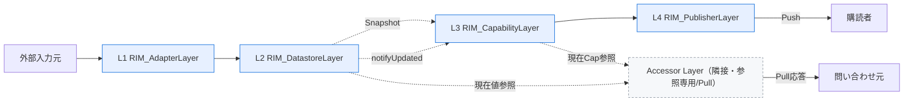

# ReactiveInfoManager（RIM）概要

## 1. 位置づけ

本書は、旧称「FSI」で設計してきた **入力〜保持〜判定〜配信の4レイヤ構成全体**を
**ReactiveInfoManager（略称 RIM）** と命名し、その全体像・レイヤ命名・実装方針を定義する
横断ドキュメントである。各レイヤの詳細は個別の仕様設計書／詳細設計書を参照する。

RIM は「外部からの観測情報（Info）を受理し、内部で整合を保って保持し、意味づけ（Capability）して、
必要な相手へ反応的（Reactive）に配信・提供する」ことを責務とする情報管理サブシステムである。

---

## 2. レイヤ構成（4レイヤ＋隣接1レイヤ）

RIM は以下の **4レイヤ**で構成する。命名は `RIM_` を接頭辞とする。

| レイヤ | 名称 | 旧称 | 主責務 |
|--------|------|------|--------|
| **L1** | **RIM_AdapterLayer** | Adapter Layer | 外部入力の受理・正規化・性質判別・後続層への送信 |
| **L2** | **RIM_DatastoreLayer** | DataStore Layer | データの一元保持・整合維持・Snapshot提供・更新通知 |
| **L3** | **RIM_CapabilityLayer** | Capability Layer | Snapshotを解釈し意味のある状態（Capability）を生成 |
| **L4** | **RIM_PublisherLayer** | Publisher Layer | 購読者へ Capability を **Push** 配信 |

さらに、RIM の **4構成の外側に隣接する参照専用レイヤ**として次を置く（RIMの4レイヤには含めない）。

| レイヤ | 名称 | 位置づけ |
|--------|------|----------|
| （隣接） | **Accessor Layer** | 参照専用・**Pull**。RIM_PublisherLayer（Push）と対を成し、外部が「今の状態を知りたい」時に L2/L3 から都度取得して返す。RIMの4レイヤ構成には数えない隣接レイヤとして維持する |

> 命名規約：文書見出し・図・散文中のレイヤ参照は `RIM_AdapterLayer` の形（`RIM_` 接頭辞・
> 空白なし）で表記する。`Accessor Layer` は RIM の4構成外のため接頭辞を付けず従来表記を維持する。

---

## 3. 実装方針（C-firstハイブリッド）

実装担当が **C言語専門**であることを最優先し、RIM は次の **C-firstハイブリッド**で実装する。
根拠と各構成要素での得失は [実装言語比較_C_vs_Cpp.md](実装言語比較_C_vs_Cpp.md) §0 を参照。

1. **IF部分はすべて `extern "C"`**。層間IF・公開APIをC ABIで提供し、
   **C言語の解釈でそのまま使用・実装できる**ようにする。
2. **内部実装は基本C**（タグ付きunion／`bool + out引数`／`has_xxx`フラグ／
   関数ポインタテーブル＋ctx／連番enum＋固定長配列／短時間mutex）。
3. **C++の仕組みを用いるのは次の2箇所のみ**：
   - **(a) 可変長Listの仕組み** … 固定容量・静的確保の可変長コンテナ（`rim::FixedVector<T,N>`）。
   - **(b) RIM_AdapterLayer の受理点の型の自由さ** … `RawValue` の型可変性をテンプレート／
     型安全unionで確保し、後続層へ渡す時点で正規化済み `DataValue`（C表現）へ落とす。
4. 例外・RTTI・STLコンテナ・動的確保・atomic `shared_ptr`・テンプレートメタプロは持ち込まない。
5. ビルドはC++でリンク（(a)(b)がC++のため）。Cからの利用時は `-lstdc++` を付す。

実体スケルトンは `rim/`（`rim/include/rim/*.h`＝extern "C"公開ヘッダ、`rim/src/*.cpp`＝C++実装）。

---

## 4. 関連ドキュメント

- L1: [Adapter/RIM_AdapterLayer仕様設計書](../Adapter/AdapterLayer仕様設計書.md)（ファイル名は従来、内容はRIM命名）
- L2: [DataStore/RIM_DatastoreLayer仕様設計書](../DataStore/DataStoreLayer仕様設計書.md)
- L3: [Capability/RIM_CapabilityLayer仕様設計書](../Capability/CapabilityLayer仕様設計書.md)
- L4: [Publisher/RIM_PublisherLayer仕様設計書](../Publisher/PublisherLayer仕様設計書.md)
- 隣接: [Accessor/Accessor Layer仕様設計書](../Accessor/AccessorLayer仕様設計書.md)
- 実装言語: [実装言語比較_C_vs_Cpp.md](実装言語比較_C_vs_Cpp.md)
- ライフサイクル: [システムライフサイクル設計書.md](システムライフサイクル設計書.md)

> ファイル名・フォルダ名（`Adapter/`, `AdapterLayer仕様設計書.md` 等）は git 履歴・
> HTML相互リンクの安定性のため従来のまま維持し、**文書内容のレイヤ名を RIM命名へ更新**した。
