# RIManager Main Sequence

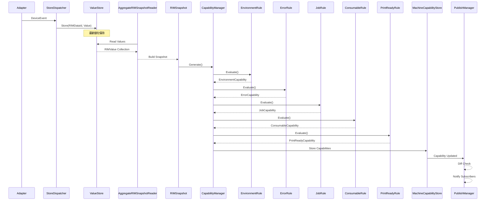

---

# Product起動時の構成シーケンス

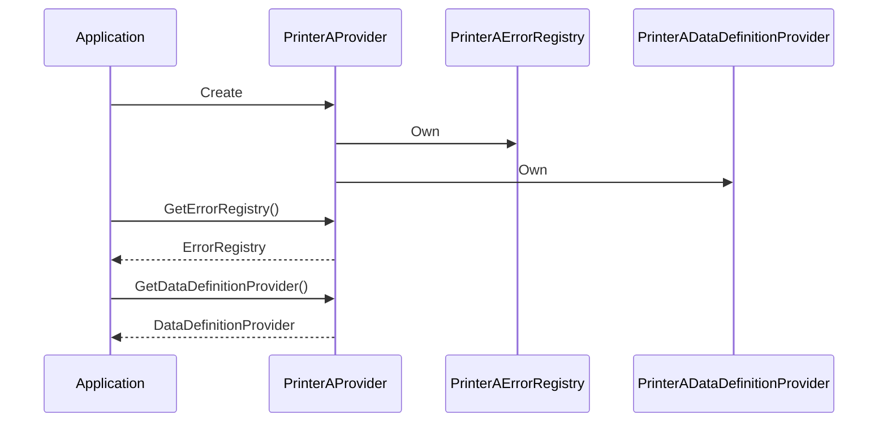

---

# Definitionアクセスシーケンス
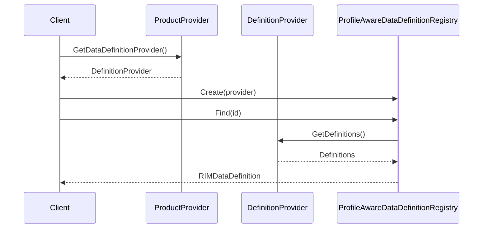

---

# RIManager Module

# RIManager モジュール構成図（現状）

## アーキテクチャ概要

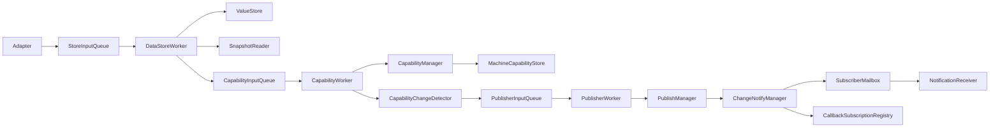

---

# レイヤ構成

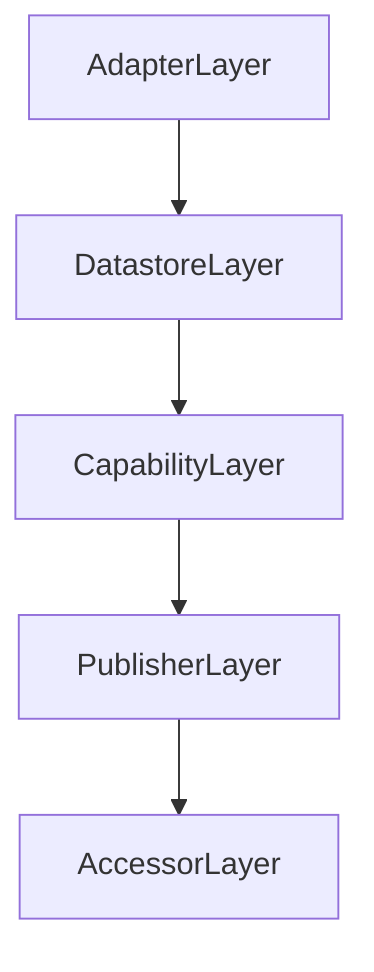

---

# Datastore 層

## 責務

```text
Data保持

Snapshot生成

Capabilityトリガ生成
```

## 構成

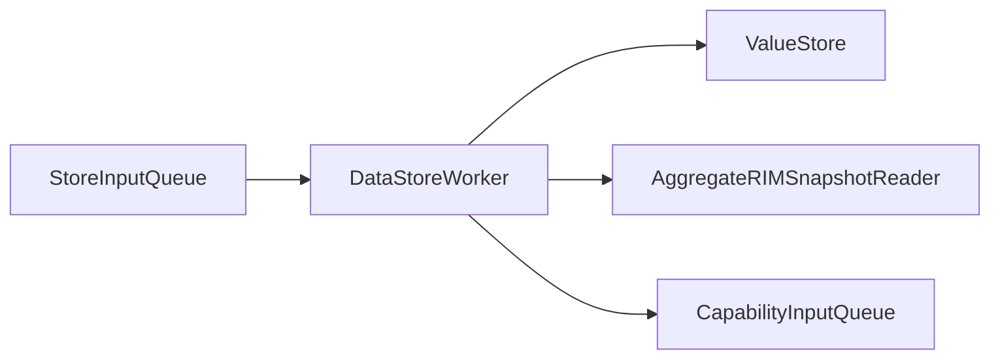

---

# Capability 層

## 責務

```text
Snapshot評価

Capability生成

差分検出
```

## 構成

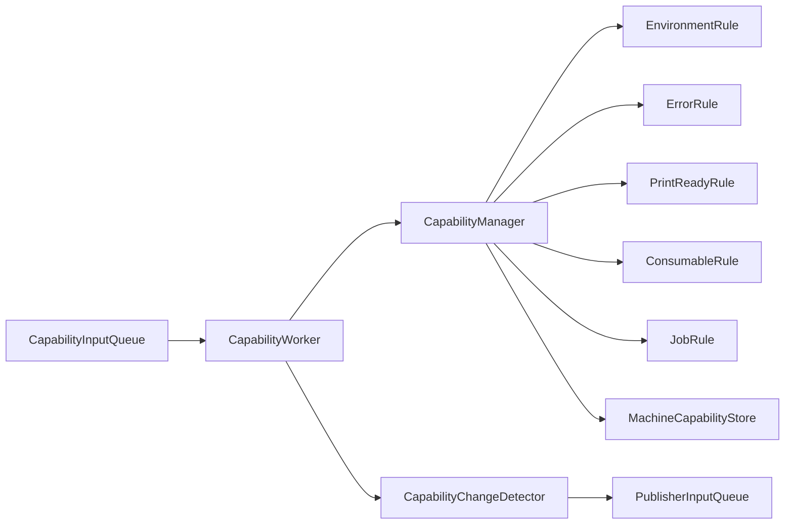

---

# Publisher 層

## 責務

```text
通知のみ

差分判定は行わない
```

## 構成

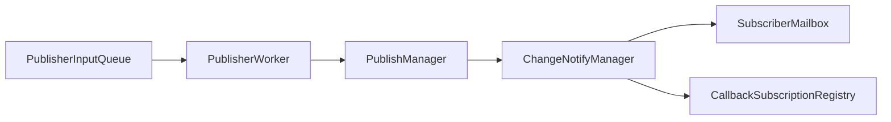

---

# Accessor 層

## 責務

```text
利用者向け取得API

通知受信API
```

## 構成

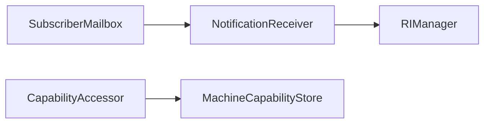

---

# 差分判定フロー

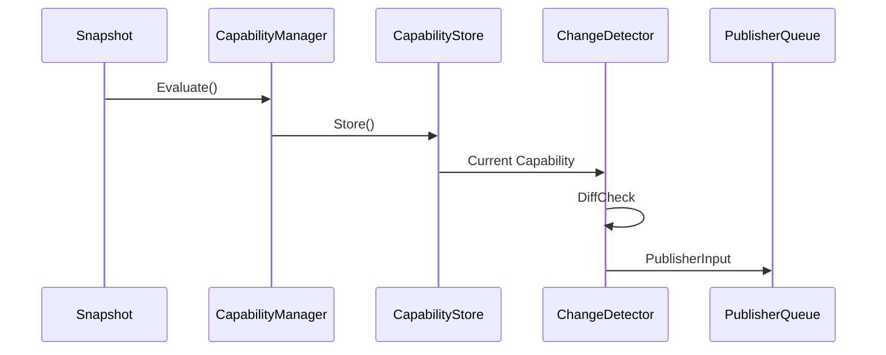

---

# 通知フロー

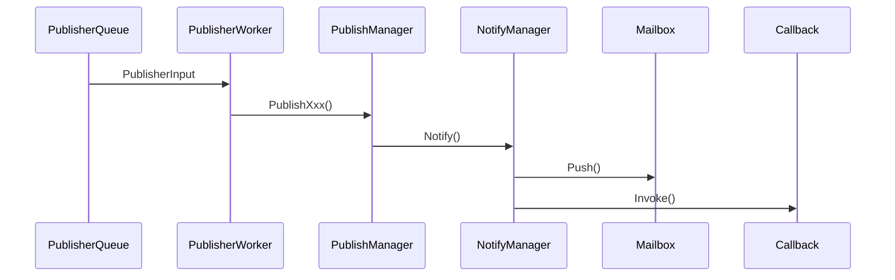

---

# 各モジュール責務一覧

## ValueStore

```text
DataId → Value 保持
```

---

## AggregateRIMSnapshotReader

```text
ValueStore → Snapshot生成
```

---

## CapabilityManager

```text
Snapshot → Capability生成
```

---

## MachineCapabilityStore

```text
Capability保持
```

---

## CapabilityDiffChecker

```text
Capability比較ロジック
```

---

## CapabilityChangeDetector

```text
前回Capability保持

差分検出

PublisherInput生成
```

---

## PublisherWorker

```text
PublisherInput解釈
```

---

## PublishManager

```text
通知実行

Diff判定は持たない
```

---

## ChangeNotifyManager

```text
Mailbox通知

Callback通知
```

---

## SubscriberMailbox

```text
Pull型通知キュー
```

---

## CallbackSubscriptionRegistry

```text
Push型通知購読管理
```

---

# 現在の責務分離

```text
Datastore
    = Data保持

CapabilityManager
    = Capability生成

CapabilityChangeDetector
    = 差分検出

PublisherWorker
    = Publish指示解釈

PublishManager
    = 通知実行

ChangeNotifyManager
    = 配信制御
```

今回のリファクタ後は、

```text
CapabilityManager
    = 生成のみ

PublishManager
    = 通知のみ

CapabilityChangeDetector
    = 差分判定のみ
```

