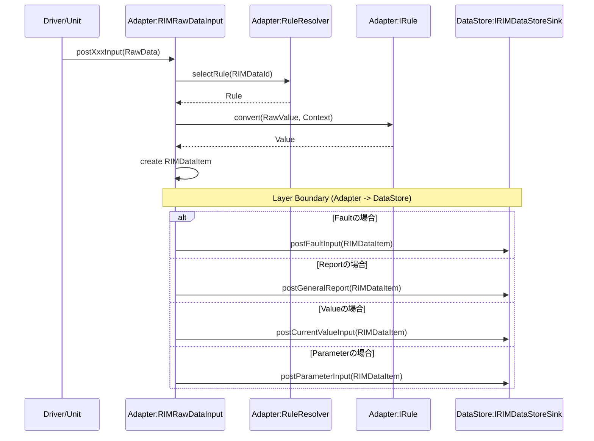

# Adapter Layer

## シーケンス図

### シーケンス概要
Driverから受け取ったRawDataをRuleで変換し、 RIMDataItemとしてDataStoreへ転送するシーケンス。

```mermaid
sequenceDiagram
participant Driver as Driver/Unit
participant Adapter as Adapter:RIMRawDataInput
participant Resolver as Adapter:RuleResolver
participant Rule as Adapter:IRule
participant StoreSink as DataStore:IRIMDataStoreSink

Driver->>Adapter: postXxxInput(RawData)
Adapter->>Resolver: selectRule(RIMDataId)
Resolver-->>Adapter: Rule
Adapter->>Rule: convert(RawValue, Context)
Rule-->>Adapter: Value
Adapter->>Adapter: create RIMDataItem

Note over Adapter,StoreSink: Layer Boundary (Adapter -> DataStore)

alt Faultの場合
    Adapter->>StoreSink: postFaultInput(RIMDataItem)
else Reportの場合
    Adapter->>StoreSink: postGeneralReport(RIMDataItem)
else Valueの場合
    Adapter->>StoreSink: postCurrentValueInput(RIMDataItem)
else Parameterの場合
    Adapter->>StoreSink: postParameterInput(RIMDataItem)
end
```

---