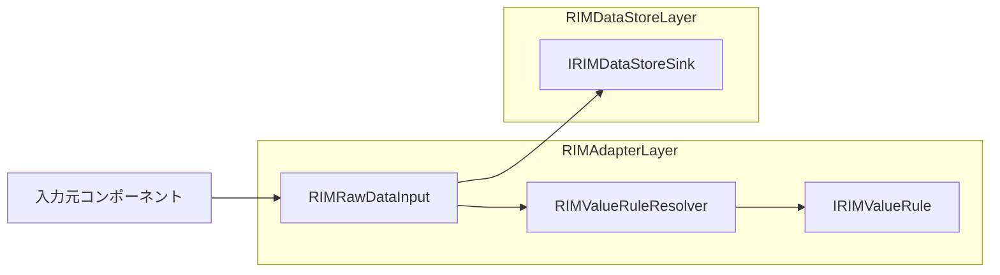
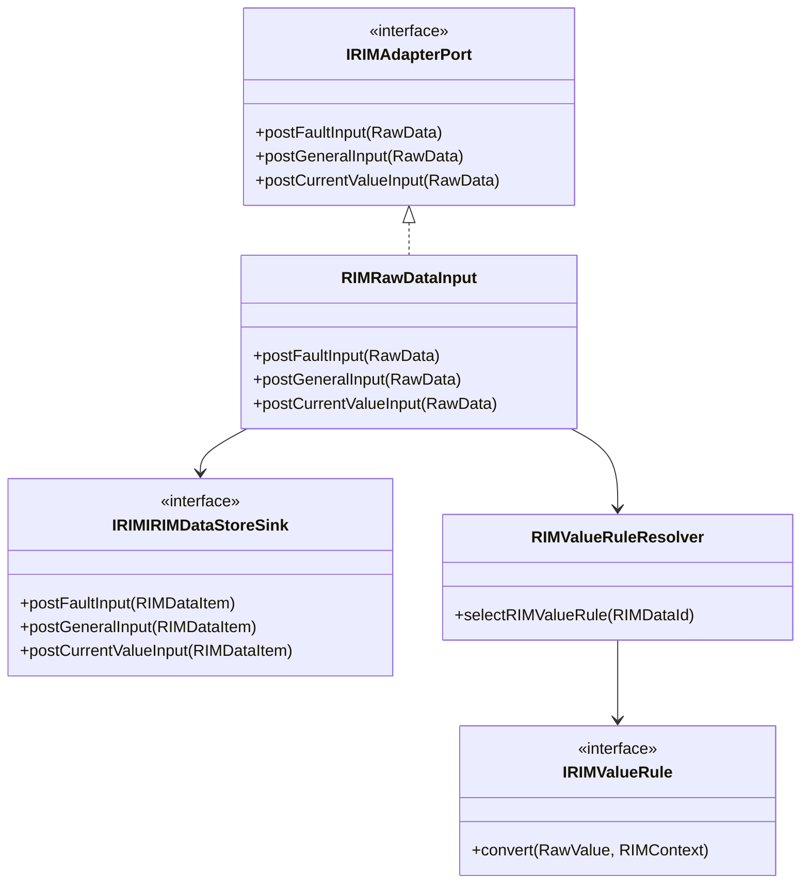
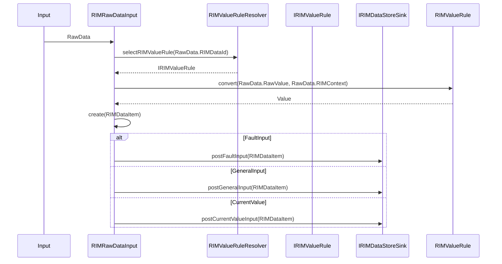

# RIMAdapter Layer 仕様設計書

---

## 1. 概要
本設計は、RIMAdapter Layerの役割・責務・構成および設計原則を定義することを目的とする。
RIMAdapter Layerは外部コンポーネントから入力されるデータをシステム内部で利用可能な形式へ正規化し、DataStore Layerへ受け渡す責務を持つ。

RIMAdapter LayerはCommonDataModelで定義されるRIMDataDefinitionおよびRIMDataItemを利用する。

RIMAdapter Layerは外部入力を正規化し、RIMDataItemとしてDataStore Layerへ受け渡す。

本書の対象範囲は以下とする。
- 外部入力の受信
- 外部入力の解析
- 外部値から中央標準値への変換
- 入力APIに応じたDataStore入力IFの選択
- RIMDataItemの生成
- RIMInputGatewayへの入力受け渡し
- RIMAdapter Layerで検出可能な入力異常の扱い

以下は対象外とする。

---

## 2. 背景

外部コンポーネントごとに以下の差異が存在する。

- データ形式の違い
- 単位やスケールの違い
- データ表現の違い

これらの差異を後続Layerで扱う場合、RIMDataStore LayerやRIMCapability Layerが外部仕様へ依存することになる。

そのため、本システムでは外部仕様との差異をRIMAdapter Layerで吸収し、後続Layerでは統一された内部形式のみを扱う構成を採用する。

---

## 3. 目的

RIMAdapter Layerの目的は以下である。

- 外部仕様をシステム内部仕様へ変換する
- 後続Layerを外部仕様から独立させる
- データ正規化処理を集約する
- データ種別追加時の変更影響を局所化する

---

#### 3.1 用語集

| 用語 | 説明 |
|--------|--------|
| RIMAdapter Layer | 外部コンポーネントから受信したデータをシステム内部で利用可能な形式へ正規化し、DataStore Layerへ受け渡すLayer。 |
| RIMDataStore Layer | RIMAdapter Layerから受け取ったDataおよび静的領域からロードされたParameterを受理・保持するLayer。 |
| RIMCapability Layer | DataStore Layerに格納されたデータを利用し、状態判定や業務機能を実現するLayer。 |
| CommonDataModel | システム内部で利用する共通データモデル。RIMDataDefinitionおよびRIMDataItemを定義する。 |
| RIMDataDefinition | CommonDataModelで定義されるデータ定義。RIMDataId、ValueTypeおよびDataDomainを保持する。 |
| RIMDataId | データ種別を識別するための識別子。 |
| RawData | 入力元コンポーネントとRIMAdapter Layer間で受け渡される契約データ。RIMDataId、RawValueおよびRIMContextを保持する。 |
| RIMDataItem | CommonDataModelで定義される標準データモデル。RIMDataId、ValueおよびRIMContextを保持する。 |
| RawValue | 入力元コンポーネントから受信した未変換データ。 |
| Value | RIMValueRuleによる正規化後の標準データ。 |
| RIMContext | Value生成および後続Layerで利用可能な補助情報。 |
| IRIMValueRule | RIMDataIdに対応する正規化処理を実装するコンポーネント。RawValueをValueへ変換する。 |
| RIMValueRuleResolver | RIMDataIdに応じて適用するRIMValueRuleを選択するコンポーネント。 |
| IRIMDataStoreSink | RIMDataStore Layerが提供する入力インターフェース。RIMAdapter Layerは本インターフェースを介してデータを送信する。 |
| Driver | 通信プロトコル解析やデバイス固有処理を担い、意味解釈済みのデータをRawDataとしてRIMAdapter Layerへ提供するコンポーネント。 |
| Unit | Driverと同様に入力データの解釈およびRawData生成を行うコンポーネント。 |
---
## 5. 責務・非責務
### 5.1 責務
RIMAdapter Layerは以下の責務を持つ。

- 外部入力の受理
- RIMDataIdに対応するRIMValueRule選択
- データ正規化
- RIMDataItem生成
- RIMDataStore Layerへのデータ送信

RIMDataStore Layerは以下のインターフェースを提供する。

- IRIMDataStoreSink

IRIMDataStoreSinkは以下の入力IFを提供する。

- postFaultInput(RIMDataItem)
- postGeneralInput(RIMDataItem)
- postCurrentValueInput(RIMDataItem)

---

### 5.2 非責務

RIMAdapter Layerは以下を責務としない。

- データの意味解釈
- 状態判定
- ビジネスロジック
- 異常判定
- 異常値補正
- データ保持
- 状態管理

これらはRIMCapability LayerまたはRIMDataStore Layerの責務とする。

---

## 6. コンポーネント構成

RIMAdapter Layerは以下のコンポーネントにより構成される。

- RIMRawDataInput
- RIMValueRuleResolver
- RIMValueRule群

RIMDataStore Layerは以下のインターフェースを提供する。

- IRIMDataStoreSink

RIMDataStore Layerとの連携インターフェース詳細は
7章「クラス構成」を参照。

IRIMDataStoreSinkは以下の入力IFを提供する。

- postFaultInput(RIMDataItem)
- postGeneralInput(RIMDataItem)
- postCurrentValueInput(RIMDataItem)

RIMAdapter LayerはRIMDataStore Layerが提供するIRIMDataStoreSinkを介してデータを送信する。

RIMValueRuleResolverはRIMDataIdに応じて適用するRIMValueRuleを決定する責務を持つ。

RIMRawDataInputは外部入力を受理し、RIMValueRuleResolverおよびRIMValueRuleを利用してRIMDataItemを生成する。

生成したRIMDataItemを入力時に用いたAPIに対応するIRIMDataStoreSinkの入力IFへ転送する。

RIMValueRuleはRawValueをValueへ変換する。  
RIMRawDataInputは変換結果を用いてRIMDataItemを生成する。

---

## 7. クラス構成
### 7.1 クラス構成概要

### 7.2 IRIMAdapterPort

RIMAdapter Layerが外部へ公開する入力インターフェースである。

外部コンポーネントは
IRIMAdapterPortを利用して
RIMAdapter Layerへデータを入力する。

モック実装によるテストを可能とするため、
外部コンポーネントはRIMRawDataInputではなく
IRIMAdapterPortへ依存する。

#### 7.2.1 提供IF

- postFaultInput(RawData)
- postGeneralInput(RawData)
- postCurrentValueInput(RawData)

### 7.3 RIMRawDataInput

RIMRawDataInputはIRIMAdapterPortの実装クラスである。

#### 7.3.1 責務

- 外部入力受理
- RIMValueRuleResolver呼び出し
- RIMValueRule実行
- RIMDataItem生成
- IRIMDataStoreSink転送

#### 7.3.2 非責務

- データ保持
- 状態管理
- 意味解釈

#### 7.3.3 提供IF

- postFaultInput(RawData)
- postGeneralInput(RawData)
- postCurrentValueInput(RawData)

### 7.4 RIMValueRuleResolver

RIMValueRuleResolverはRIMDataIdに対応するRIMValueRuleを決定する。

#### 7.4.1 責務

- RIMDataIdに対応するRIMValueRule選択

#### 7.4.2 非責務

- データ変換
- DataStore送信

#### 7.4.3 提供IF

- selectRIMValueRule(RIMDataId)

### 7.5 IRIMValueRule

RIMValueRuleはデータ種別ごとの正規化処理を実装する。

#### 7.5.1 責務

- RawValueからValueへの変換

#### 7.5.2 非責務

- RIMValueRule選択
- DataStore送信
- 状態管理

#### 7.5.3 提供IF

- convert(RawValue, RIMContext)

---

## 8. データモデル

### 8.1 RawData

RawDataは入力元コンポーネントとRIMRawDataInput間で受け渡される契約データである。

RawDataは以下の情報を保持する。

- RIMDataId
- RawValue
- RIMContext

RawDataは以下の入力を対象とする。

- 観測値
- アプリケーション情報
- 動作報告
- エラー情報

例：

- 温度
- 圧力
- 回転数
- Job開始通知
- Job終了通知
- Error発生通知
- Error解除通知

### 8.2 RIMDataItem

詳細はCommonDataModel参照

### 8.3 RIMDataId

詳細はCommonDataModel参照

### 8.4 RIMContext

詳細はCommonDataModel参照

---

## 9. 処理フロー
### 9.1 正常系処理

### 9.2 異常系処理

RIMAdapter Layerで検出可能な入力異常はRIMDataStore Layerへ転送しない。

対象例
- RIMDataId未定義
- RIMValueRule未登録
- 必須RIMContext不足
- RIMValueRule実行失敗
- 入力契約違反

入力異常発生時は以下を行う。
- ログ出力
- RIMDataStore Layerへの転送抑止
- 入力元への異常応答返却

---

## 10. 設計方針

### 10.1 責務分離方針

外部仕様との差異はRIMAdapter Layerで吸収する。

RIMDataStore Layer以降では外部仕様を意識せず、統一されたデータ表現のみを扱う。

このコンポーネントはRawDataを受ける。
機種によっては単位の変換など情報の粒度が異なる場合があるため、一定の粒度に基づいて、入力時に正規化する機能を提供する。

### 10.2 データ正規化方針

すべての入力データはRawDataとして受理される。

RIMValueRuleはRawData内のRawValueをValueへ変換する。

RIMAdapter Layerは変換結果をRIMDataItemとして構成し、
RIMDataStore Layerへ受け渡す。

RIMDataStore Layerへの受け渡しは
IRIMDataStoreSinkが提供する以下の入力IFを利用する。

- postFaultInput(RIMDataItem)
- postGeneralInput(RIMDataItem)
- postCurrentValueInput(RIMDataItem)

後続Layerは外部仕様を意識しない。

正規化例
- 温度(℉) → 温度(℃)
- 圧力(kPa) → 圧力(Pa)

正規化後の値はCommonDataModelで定義されたValueとしてRIMDataItemへ格納する。

### 10.3 拡張方針

新たなデータ種別追加時はRIMDataDefinitionおよび対応するRIMValueRuleを追加することで対応する。

既存コンポーネントの変更を最小化する。

#### 10.4 入力データ方針

RIMAdapter Layerは入力データをRawDataとして受理する。
入力データはRIMDataId、RawValueおよびRIMContextにより表現する。

RawValueは単一値、配列または構造化データを取り得る。

RIMAdapter Layerが受理するデータは、
DriverまたはUnitにより意味解釈済みのデータとする。

RIMAdapter Layerは通信プロトコル解析、
パケット解析、
バイト列解析を行わない。

入力データが表す意味の解釈は行わず、
RIMDataIdに対応するRIMValueRuleへ変換処理を委譲する。

ストリーミングデータは対象外とする。

#### 10.5 入力データ粒度方針

RIMAdapter LayerはDriverまたはUnitにより意味解釈済みのデータを受理する。

受理対象例
- 温度値
- 圧力値
- 回転数
- Job開始通知
- Job終了通知
- Error発生通知
- Error解除通知

受理対象外例
- CANフレーム
- UART受信データ
- Ethernetパケット
- 生バイト列
- 動画・音声ストリーム
- その他ストリーミングデータ

これらの受理対象外データは、
DriverまたはUnit側で解釈し、
RawDataへ変換した後にRIMAdapter Layerへ入力する。

## 11. 設計判断

### 11.1 入力方式

#### 11.1.1 候補

- Push方式
- Pull方式

#### 11.1.2 採用

Push方式

#### 11.1.3 理由

- 入力データ発生時に即時処理できる
- RIMAdapter Layerが入力元の状態を管理する必要がない
- RIMAdapter Layerがポーリング処理を持たずに済む

#### 11.1.4 制約

- 入力元からのPush入力を前提とする
- RIMAdapter Layerから入力元へデータ取得要求は行わない

### 11.2 正規化方式

#### 11.2.1 候補

- switch/ifによる集中管理方式
- RIMValueRule方式

#### 11.2.2 採用

RIMValueRule方式

#### 11.2.3 理由

- データ種別追加時の変更影響を局所化できる
- RIMValueRule単位でテスト可能
- 責務分離を維持しやすい
- RIMDataIdごとの差異をRIMValueRuleへ集約できる

### 11.3 Layer間連携方式

#### 11.3.1 候補

- DataStore直接呼び出し方式
- キューイング方式

#### 11.3.2 採用

キューイング方式

RIMDataStore Layerは内部でキューイングによる入力処理を行う。
RIMAdapter LayerはIRIMDataStoreSinkインターフェースのみを利用し、
RIMDataStore Layer内部のキュー実装には依存しない。

#### 11.3.3 理由

- RIMAdapter LayerとRIMDataStore Layerを疎結合化できる
- 入力処理と保存処理を分離できる
- 将来的な拡張に対応しやすい

---
#### 11.4 Layer間入力方式

##### 11.4.1 採用

分類別入力方式

##### 11.4.2 内容

RIMAdapter LayerはIRIMDataStoreSinkが提供する
以下の入力IFを利用する。

- postFaultInput(RIMDataItem)
- postGeneralInput(RIMDataItem)
- postCurrentValueInput(RIMDataItem)

##### 11.4.3 理由

- データ分類を明示できる
- 誤分類を防止できる
- RIMDataStore Layerとの契約が明確になる
---

## 12. 制約事項

### 12.1 アーキテクチャ制約

- RIMAdapter LayerはDataStore内部状態へアクセスしない
- RIMAdapter LayerはRIMCapability Layerへ依存しない
- RIMValueRuleはRIMDataStore Layerへ依存しない

### 12.2 機能制約

- RIMAdapter Layerは意味解釈を行わない
- RIMAdapter Layerは状態を保持しない
- RIMValueRuleは状態を保持しない
- RIMValueRuleはビジネスロジックを持たない
- 入力検証に失敗したデータはRIMDataStore Layerへ転送しない。
- RIMValueRuleResolverがRIMDataIdに対応するRIMValueRuleを特定できない場合は入力異常として扱う。
- 入力異常が発生した場合はRIMDataStore Layerへ転送しない。
- RIMAdapter Layerで検出可能な入力異常はログ出力可能とする。
- RIMAdapter Layerは入力元へ異常応答を返却可能とする。
- RIMValueRuleResolverは静的に構成されたRIMValueRule管理テーブルを参照するのみであり、実行中にRIMValueRule構成を変更しない。

#### 12.3 呼び出し制約

- RIMAdapter Layerはスレッドセーフであるため、排他制御を必要としない。
  - RIMAdapter Layerのコンポーネントは入力データを保持しない。
  - RIMRawDataInputは受信したRawDataを即時処理し、呼び出し間で共有される可変状態を持たない。
- RIMValueRuleは状態を保持しない。
- RIMAdapter Layer内部には共有可変状態が存在しないため、内部排他制御を必要としない。
- そのため複数スレッドからの同時呼び出しを許容する。

---

## 13. 非機能要件

- 処理は軽量であること
- RIMValueRule単位で単体テスト可能であること
- データ種別追加時の変更影響を局所化できること
- 障害時に影響範囲がRIMAdapter Layer内で限定されること

---

## 14. 将来拡張

### 14.1 データ種別拡張

- RIMValueRule追加によるデータ種別拡張

### 14.2 RIMContext拡張

新たな補助情報が必要となった場合は
RIMContextKey追加により拡張可能とする。

例：

- Unit
- SensorType
- ScaleFactor
- Operation
- その他将来追加属性

### 14.3 RIMValueRule選択方式拡張

- RIMValueRule選択条件の拡張

### 14.4 入力元拡張

- データ入力元の追加

### 14.5 観測時刻情報への対応

現時点では観測時刻(timestamp)は本Layerの責務対象外とする。

ただし、観測時刻管理が必要となった場合は、RIMAdapter Layerでの付与方式を検討する。