# 1. 表紙

## CONFIDENTIAL

| 項目 | 内容 |
|--------|--------|
| ドキュメント名 | Adapter Layer 仕様設計書 |
| バージョン | - |
| レイヤ | Adapter Layer |
| 対象機種 | T.B.D |
| 作成 | ブラザー工業 システムプロセス開発部 開発3G |

# 2. 更新履歴

| バージョン | 更新日 | 更新者 | 内容 |
|--------|--------|--------|--------|
| 0.01 | T.B.D | 波多野 匡寛 | AdapterLayer仕様設計書を元にCR制御仕様書章立てへ再構成 |

# 3. 目次

1. 表紙
2. 更新履歴
3. 目次
4. 概要
5. 用語集
6. 関連ドキュメント
7. 制約事項
8. 他のモジュールとの接続
9. 機能概要
10. IF仕様
11. コンフィグレーション仕様
12. 呼び出しシーケンス
13. 組み込み手順
14. 排他・整合性設計

# 4. 概要

## 4.1 本ドキュメントの目的

本ドキュメントは、Adapter Layerの仕様を規定する。

Adapter Layerが受理する外部入力、正規化処理、DataStore Layerとの接続関係、提供するIF、および構成方針を示す。
また、外部入力をシステム内部で利用可能な形式へ変換するための設計方針および責務範囲を定義する。

## 4.2 本ドキュメントの読み手

- Adapter Layerへ入力するコンポーネント設計者（例：Driver、Unit）
- Adapter Layerから入力を受け取るDataStore Layer設計者
- Capability Layer設計者
- DataDefinitionおよびValueRuleを追加・保守する設計者
- システム統合担当者

## 4.3 本モジュールの位置づけ

Adapter Layerは、外部コンポーネントから入力されるデータをシステム内部で利用可能な形式へ正規化し、DataStore Layerへ受け渡すAdapter Layerである。

外部コンポーネントごとに存在する以下の差異を吸収する。

- データ形式の違い
- 単位やスケールの違い
- データ表現の違い

これらの差異を後続Layerへ持ち込まず、DataStore LayerおよびCapability Layerでは統一された内部表現のみを扱える構成を実現する。

本モジュールはCommonDataModelで定義されるDataDefinitionおよびDataItemを利用する。
外部入力はRawDataとして受理され、DataIdに対応するValueRuleによってRawValueからValueへ変換される。
変換後のValueはDataItemとして構成され、IDataStoreSinkの入力IFへ転送される。

# 5. 用語集

## 5.1 制御階層に関する用語

| 用語 | 定義 |
|--------|--------|
| 外部入力 | 入力元コンポーネント（例：Driver、Unit）からAdapter Layerへ入力されるデータ。 |
| 入力データ | Adapter Layerが受理するRawData。DataId、RawValue、Contextを保持する。 |
| 正規化 | 外部仕様に依存したRawValueをCommonDataModelで定義されたValueへ変換すること。 |
| DataStore入力 | Adapter LayerがDataItemをIDataStoreSink経由でDataStore Layerへ送信すること。 |

## 5.2 設計原則に関する用語

| 用語 | 定義 |
|--------|--------|
| Adapter Layer | 外部仕様と内部仕様の差異を吸収し、後続Layerへ内部標準形式を渡すLayer。 |
| 責務分離 | 外部仕様吸収、データ保持、状態判定、業務機能などをLayerごとに分離する設計方針。 |
| Push方式 | 入力元がデータ発生時にAdapter Layerの入力IFを呼び出す方式。 |
| ValueRule方式 | DataIdごとの差異を個別のValueRuleへ集約する方式。 |
| 分類別入力方式 | Fault、General、CurrentValueごとに異なる入力IFを利用する方式。 |

## 5.3 モジュール固有用語

| 用語 | 定義 |
|--------|--------|
| Adapter Layer | 外部コンポーネントから受信したデータをシステム内部で利用可能な形式へ正規化し、DataStore Layerへ受け渡すLayer。 |
| DataStore Layer | Adapter Layerから受け取ったDataおよび静的領域からロードされたParameterを保持するLayer。 |
| Capability Layer | DataStore Layerに格納されたデータを利用し、状態判定や業務機能を実現するLayer。 |
| CommonDataModel | システム内部で利用する共通データモデル。 |
| DataDefinition | CommonDataModelで定義されるデータ定義。 |
| DataId | データ種別を識別するための識別子。 |
| RawData | 入力元コンポーネントとAdapter Layer間で受け渡される契約データ。 |
| DataItem | CommonDataModelで定義される標準データモデル。 |
| RawValue | 入力元コンポーネントから受信した未変換データ。 |
| Value | ValueRuleによる正規化後の標準データ。 |
| Context | Value生成および後続Layerで利用可能な補助情報。 |
| IValueRule | RawValueをValueへ変換する正規化コンポーネント。 |
| ValueRuleResolver | DataIdに応じて適用するValueRuleを選択するコンポーネント。 |
| IAdapterPort | Adapter Layerが外部へ公開する入力インターフェース。 |
| RawDataInput | IAdapterPortの実装クラス。 |
| IDataStoreSink | DataStore Layerが提供する入力インターフェース。 |
| Driver | 通信プロトコル解析やデバイス固有処理を担い、意味解釈済みデータをRawDataとして提供するコンポーネント。Adapter Layerの代表的な入力元コンポーネントの例。 |
| Unit | Driverと同様に入力データ解釈およびRawData生成を行うコンポーネント。Adapter Layerの代表的な入力元コンポーネントの例。 |

## 5.4 上位・下位レイヤに関する用語

| 用語 | 定義 |
|--------|--------|
| 入力元コンポーネント | DriverまたはUnitなど、RawDataを生成してAdapter Layerへ入力するコンポーネント。 |
| DataStore Layer | 本モジュールの直接の後続Layer。DataItemを受理・保持する。 |
| Capability Layer | DataStore Layerのデータを利用する後続Layer。 |
| ログ出力レイヤ | Adapter Layerで検出した入力異常を記録する出力先。T.B.D。 |

## 5.5 モジュール構成区分に関する用語

| 用語 | 定義 |
|--------|--------|
| 本モジュール本体 | RawDataInput、ValueRuleResolver、ValueRule群を含む再利用可能部分。 |
| 本モジュールCFG | DataIdとValueRuleの対応、IDataStoreSink接続先などを定義する構成情報。 |

# 6. 関連ドキュメント

| # | 文書名 | 版 | 備考 |
|---|---|---|---|
| 1 | CommonDataModel仕様書 | T.B.D | DataDefinition、DataItem、Context定義元 |
| 2 | DataStore Layer仕様書 | T.B.D | IDataStoreSink提供元 |
| 3 | Capability Layer仕様書 | T.B.D | データ利用先 |
| 4 | Driver仕様書 | T.B.D | RawData入力元 |
| 5 | Unit仕様書 | T.B.D | RawData入力元 |
| 6 | ログ出力レイヤ仕様書 | T.B.D | 入力異常ログ出力先 |
# 7. 制約事項

## 7.1 機能制約

Adapter Layerは、外部コンポーネントから入力される意味解釈済みデータを受理し、システム内部で利用可能な形式へ正規化することを目的とする。
そのため、本モジュールには以下の機能制約を設ける。

- Adapter Layerは外部入力をRawDataとして受理する。
- Adapter Layerが受理するデータは、入力元コンポーネントにより意味解釈済みのデータとする。
- Adapter Layerは通信プロトコル解析を行わない。
- Adapter Layerはパケット解析を行わない。
- Adapter Layerはバイト列解析を行わない。
- Adapter Layerは入力データが表す意味の解釈を行わない。
- Adapter Layerは状態判定を行わない。
- Adapter Layerはビジネスロジックを持たない。
- Adapter Layerは異常判定を行わない。
- Adapter Layerは異常値補正を行わない。
- Adapter Layerはデータ保持を行わない。
- Adapter Layerは状態管理を行わない。
- ValueRuleは状態を保持しない。
- ValueRuleはビジネスロジックを持たない。
- 入力検証に失敗したデータはDataStore Layerへ転送しない。
- ValueRuleResolverがDataIdに対応するValueRuleを特定できない場合は入力異常として扱う。
- 入力異常が発生した場合はDataStore Layerへ転送しない。
- Adapter Layerで検出可能な入力異常はログ出力可能とする。
- Adapter Layerは入力元へ異常応答を返却可能とする。
- ストリーミングデータは対象外とする。

### 7.1.1 入力対象例

- 温度値
- 圧力値
- 回転数
- Job開始通知
- Job終了通知
- Error発生通知
- Error解除通知

### 7.1.2 入力対象外例

- CANフレーム
- UART受信データ
- Ethernetパケット
- 生バイト列
- 動画ストリーム
- 音声ストリーム
- その他ストリーミングデータ

これらのデータは入力元コンポーネント側で解釈し、RawDataへ変換した後にAdapter Layerへ入力する。

## 7.2 前提条件

- 入力元コンポーネントは、Adapter Layerへ入力する前に通信プロトコル解析、パケット解析、バイト列解析を完了していること。
- 入力元コンポーネントは、意味解釈済みのデータをRawDataとして生成すること。
- RawDataはDataId、RawValueおよびContextを保持すること。
- DataIdに対応するDataDefinitionがCommonDataModelで定義されていること。
- DataIdに対応するValueRuleが登録されていること。
- DataStore LayerはIDataStoreSinkを提供すること。
- DataStore Layer側がIDataStoreSinkへの入力に対するスレッドセーフ性を保証すること。

## 7.3 呼び出し制約

- Adapter Layerのコンポーネントは入力データを保持しない。
- RawDataInputは受信したRawDataを即時処理し、呼び出し間で共有される可変状態を持たない。
- ValueRuleResolverは静的に構成されたValueRule管理テーブルを参照するのみとする。
- ValueRuleResolverは実行中にValueRule構成を変更しない。
- ValueRuleは状態を保持しない。
- Adapter Layer内部には共有可変状態を持たない前提とし、内部排他制御は不要とする。
- 複数スレッドからの同時呼び出しを許容する。
- DataStore Layerへの入力については、DataStore Layer側がスレッドセーフ性を保証する。
# 8. 他のモジュールとの接続

Adapter Layerは、入力元コンポーネントからRawDataを受理し、CommonDataModelに従ってDataItemを生成し、DataStore Layerが提供するIDataStoreSinkへ送信する。

Adapter Layerは外部仕様と内部仕様の差異を吸収する責務を持つ。そのため、DataStore Layer以降の後続Layerは外部コンポーネント固有のデータ形式、単位、スケールおよび表現方式を意識せず、統一された内部表現のみを扱う。

また、Adapter LayerはDataStore Layerの内部キュー実装、保存処理および状態管理方式には依存しない。Layer間の連携はIDataStoreSinkインターフェースを介して行う。

## 8.1 想定される接続先

| # | 分類 | 接続先 | 接続方式 | 接続要否 | 用途 |
|---|---|---|---|---|---|
| 1 | 入力元 | 入力元コンポーネント | IAdapterPort | 任意 | 意味解釈済みRawDataの入力 |
| 2 | 後続 | DataStore Layer | IDataStoreSink | 必須 | DataItemの転送 |
| 3 | 共通 | CommonDataModel | 型定義参照 | 必須 | DataDefinition、DataItem、Context利用 |
| 4 | 横断 | ログ出力レイヤ | T.B.D | 任意 | 入力異常のログ出力 |

### 8.1.1 コンポーネント接続概要

Adapter Layerは入力元コンポーネントからRawDataを受理し、ValueRuleResolverおよびValueRuleを利用してDataItemを生成する。

生成したDataItemは、DataStore Layerが提供するIDataStoreSinkを介して後続Layerへ転送される。

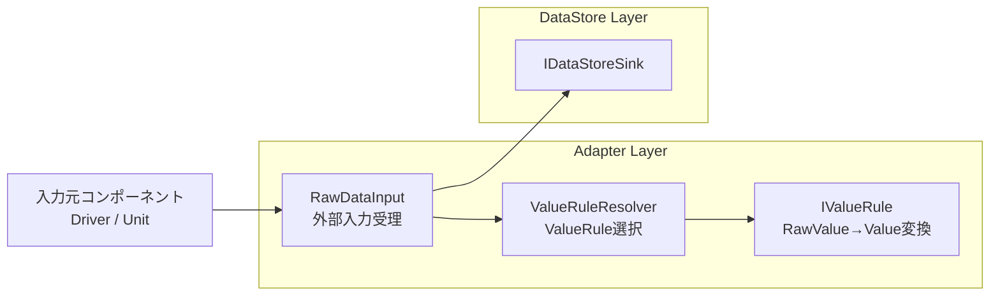

### 8.1.2 DataStore Layerとの連携

DataStore Layerは以下の入力IFを提供する。

- postFaultInput(DataItem)
- postGeneralInput(DataItem)
- postCurrentValueInput(DataItem)

Adapter LayerはDataStore Layerが提供するIDataStoreSinkを介してデータを送信する。

Adapter LayerはIDataStoreSinkインターフェースのみに依存し、DataStore Layer内部のキュー実装、保存方式および状態管理方式には依存しない。

### 8.1.3 RawDataInputの役割

RawDataInputは外部コンポーネントからの入力を受理する。

受理したRawDataに対してValueRuleResolverを呼び出し、DataIdに対応するValueRuleを取得する。

取得したValueRuleを利用して正規化処理を実行し、変換結果からDataItemを生成する。

生成したDataItemを入力時に利用したAPIに対応するIDataStoreSinkの入力IFへ転送する。

RawDataInputはデータ保持、状態管理、意味解釈および状態判定を行わない。

### 8.1.4 ValueRuleResolverの役割

ValueRuleResolverはDataIdに対応するValueRuleを決定する責務を持つ。

データ種別ごとの差異を個別のValueRuleへ集約することで、RawDataInputへの変更影響を局所化する。

新たなデータ種別追加時は、対応するValueRuleを追加することで拡張可能とする。

ValueRuleResolver自身はデータ変換およびDataStore Layerへの送信を行わない。

### 8.1.5 ValueRuleの役割

ValueRuleはRawValueをValueへ変換するコンポーネントである。

単位差異、スケール差異およびデータ表現差異はValueRuleにより吸収される。

RawDataInputは変換結果を利用してDataItemを生成し、DataStore Layerへ転送する。

ValueRuleは状態を保持せず、データ管理、状態管理およびDataStore Layerへの送信を行わない。

## 8.2 接続方針

Adapter Layerは後続Layerとの疎結合性を維持するため、インターフェースを介した接続を基本方針とする。

- 入力元コンポーネントはRawDataInputの具象クラスではなく、IAdapterPortへ依存する。
- Adapter LayerはDataStore Layerの内部構造へ依存しない。
- Adapter LayerはDataStore Layerが提供するIDataStoreSinkのみを利用する。
- Adapter LayerはCapability Layerへ依存しない。
- ValueRuleはDataStore Layerへ依存しない。
- ValueRuleResolverはDataIdに応じてValueRuleを選択する。
- RawDataInputは入力APIに応じてIDataStoreSinkの入力IFを選択する。

### 8.2.1 利用する入力IF

Adapter LayerからDataStore Layerへの受け渡しは、以下の分類別入力IFを利用する。

- postFaultInput(DataItem)
- postGeneralInput(DataItem)
- postCurrentValueInput(DataItem)

分類別入力方式を採用する。

採用理由は以下の通りである。

- データ分類を明示できる。
- 誤分類を防止できる。
- DataStore Layerとの契約を明確化できる。

### 8.2.2 Layer間依存方針

```text
入力元コンポーネント
        ↓
Adapter Layer
        ↓
DataStore Layer
        ↓
Capability Layer
```

入力元コンポーネントはIAdapterPortを介して
Adapter Layerへ入力する。

Adapter Layerは
IDataStoreSinkを介して
DataStore Layerへデータを転送する。

Layer間連携は公開インターフェースを介して行い、
具象実装への依存を禁止する。

# 9. 機能概要

## 9.1 システム構造における位置づけ

Adapter Layerは、入力元コンポーネントとDataStore Layerの間に配置されるAdapter Layerである。

入力元コンポーネント（例：Driver、Unit）は、通信プロトコル解析、デバイス固有処理および入力データの意味解釈を実施し、意味解釈済みデータをRawDataとしてAdapter Layerへ入力する。

Adapter Layerは入力されたRawDataをシステム内部標準表現へ正規化し、DataItemとしてDataStore Layerへ転送する。

DataStore Layerは受理したデータを保持し、Capability Layerは保持されたデータを利用して状態判定および業務機能を実現する。

本モジュールは外部仕様との差異吸収を担うことで、後続Layerを外部仕様から独立させる役割を持つ。

### 9.1.1 システム構造概要

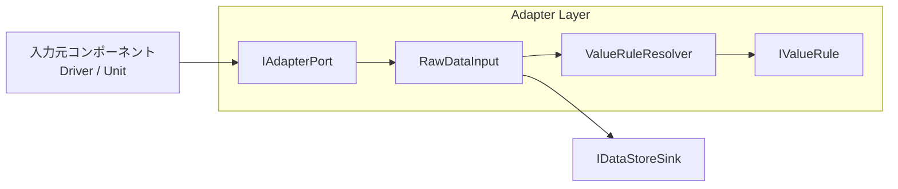

上図はAdapterLayer仕様設計書に定義されたコンポーネント構成および依存関係を示す。

入力元コンポーネントはIAdapterPortを介してRawDataを入力する。

RawDataInputはValueRuleResolverを利用して適切なValueRuleを選択する。

選択されたValueRuleによりRawValueをValueへ変換し、生成したDataItemをIDataStoreSinkへ転送する。

### 9.1.2 本モジュールの役割

本モジュールは外部コンポーネントごとに存在するデータ形式、単位、スケールおよびデータ表現方式の差異を吸収する。

外部仕様への追従を本モジュールへ集約することで、DataStore LayerおよびCapability LayerではCommonDataModelで定義された統一表現のみを扱える。

また、データ種別追加時はValueRule追加を基本拡張点とすることで変更影響を局所化する。

新たな入力元コンポーネントが追加された場合も、後続Layerの修正を最小化できる。

## 9.2 内部処理モデル

Adapter LayerはPush方式で動作する。

入力元コンポーネントからRawDataが入力されると、ValueRuleResolverにより適切なValueRuleを選択する。

選択されたValueRuleを利用してRawValueをValueへ変換し、生成したDataItemをDataStore Layerへ転送する。

### 9.2.1 正常系処理

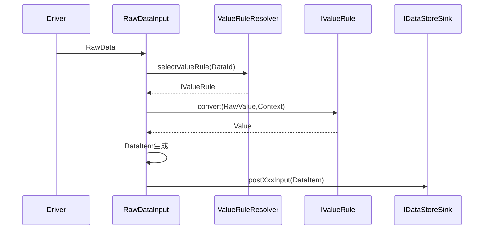

正常時はデータ種別に対応したValueRuleが選択される。

変換結果はCommonDataModelに従ったValueとなり、DataItem生成後に分類別入力IFを介してDataStore Layerへ転送される。

### 9.2.2 入力異常処理

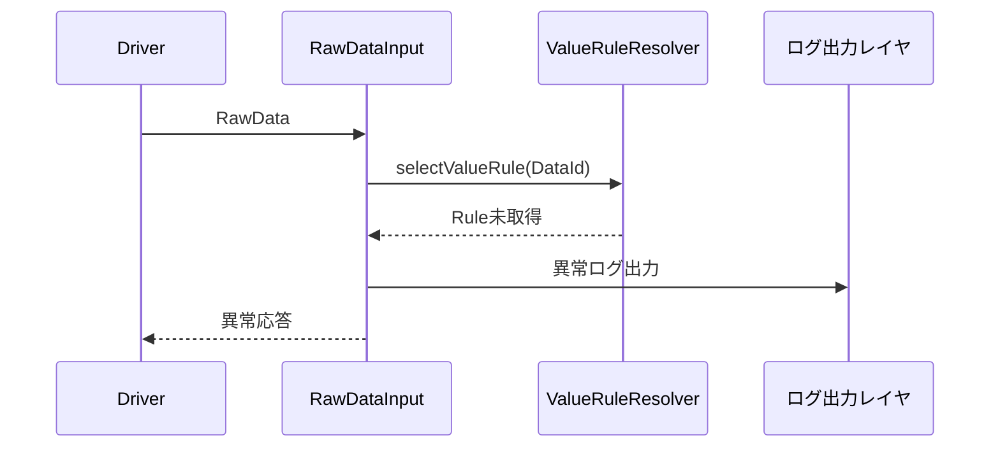

入力異常を検出した場合、対象データはDataStore Layerへ転送しない。

異常発生時はログ出力、転送抑止および入力元への異常応答返却を実施する。

## 9.3 責務

### 9.3.1 外部入力の受理

入力元コンポーネントからRawDataを受理する。

Fault、General、CurrentValue分類ごとの入力APIを提供し、入力データの利用目的を明確化する。

これにより入力段階でデータ分類を保持でき、後続Layerとの契約を維持できる。

### 9.3.2 ValueRuleの選択

DataIdに対応するValueRuleを選択する。

選択責務をValueRuleResolverへ集約することで、データ種別追加時の変更箇所を限定できる。

その結果、入力元追加やデータ種別追加時の影響を局所化できる。

### 9.3.3 データ正規化

ValueRuleを利用してRawValueをValueへ変換する。

正規化処理では以下の差異を吸収する。

- 単位差異
- スケール差異
- データ表現差異

後続Layerでは入力元固有形式を意識せず、統一されたValueのみを扱う。

#### 9.3.3.1 正規化例

- 温度(℉) → 温度(℃)
- 圧力(kPa) → 圧力(Pa)

### 9.3.4 DataItem生成

DataId、ValueおよびContextを利用してDataItemを生成する。

生成されたDataItemはシステム内部の標準データとして利用され、後続Layer間の共通契約となる。

### 9.3.5 DataStore Layerへの送信

生成したDataItemを入力分類に応じたIDataStoreSink入力IFへ転送する。

Adapter LayerはIDataStoreSinkのみに依存し、DataStore Layer内部実装には依存しない。

これによりLayer間の疎結合性を維持し、DataStore実装の変更影響を局所化する。

### 9.3.6 入力異常の扱い

検出可能な入力異常を処理する。

異常データは後続Layerへ転送せず、ログ出力および入力元への異常応答返却を実施する。

これにより不正データが後続Layerへ流入することを防止する。

## 9.4 非責務

### 9.4.1 通信プロトコル処理

通信プロトコル解析、パケット解析およびバイト列解析は実施しない。

これらは入力元に近いDriverまたはUnitの責務であり、Adapter Layerへ持ち込まない。

### 9.4.2 意味解釈および業務機能

データの意味解釈、状態判定および業務機能実装は行わない。

これらは入力元コンポーネントまたはCapability Layerの責務とする。

### 9.4.3 データ補正

異常判定および異常値補正は行わない。

本モジュールの責務は正規化であり、値の妥当性判定ではない。

### 9.4.4 データ保持および状態管理

データ保持、状態管理およびDataStore内部キュー管理は行わない。

これらはDataStore Layerの責務であり、本モジュールは転送のみを担当する。

### 9.4.5 ストリーミングデータ処理

動画データ、音声データおよびその他ストリーミングデータは対象外とする。

本モジュールは離散的な入力データの正規化を対象とする。


# 10. IF仕様

## 10.1 概要

本モジュールが提供する外部IFはIAdapterPortである。
入力元コンポーネントはIAdapterPortを介してRawDataを入力する。

Adapter LayerはDataStore Layerが提供するIDataStoreSinkを利用し、生成したDataItemを後続Layerへ転送する。

## 10.2 外部公開インターフェース一覧

|#|IF名|同期性|用途|責務|
|---|---|---|---|---|
|1|IAdapterPort::postFaultInput|同期(T.B.D)|Fault入力|外部入力受理|
|2|IAdapterPort::postGeneralInput|同期(T.B.D)|General入力|外部入力受理|
|3|IAdapterPort::postCurrentValueInput|同期(T.B.D)|CurrentValue入力|外部入力受理|

## 10.3 外部利用インターフェース一覧

|#|IF名|提供元|用途|
|---|---|---|---|
|1|IDataStoreSink::postFaultInput|DataStore Layer|Fault転送|
|2|IDataStoreSink::postGeneralInput|DataStore Layer|General転送|
|3|IDataStoreSink::postCurrentValueInput|DataStore Layer|CurrentValue転送|

## 10.4 公開型一覧

|#|型名|カテゴリ|用途|
|---|---|---|---|
|1|RawData|Data|入力契約データ|
|2|DataItem|Data|標準データモデル|
|3|DataId|Data|データ識別子|
|4|RawValue|Data|未変換値|
|5|Value|Data|正規化後値|
|6|Context|Data|補助情報|
|7|IAdapterPort|Interface|公開入力IF|
|8|RawDataInput|Component|入力処理コンポーネント|
|9|ValueRuleResolver|Component|Rule選択コンポーネント|
|10|IValueRule|Interface|変換IF|
|11|IDataStoreSink|Interface|DataStore入力IF|

## 10.5 型仕様

### 10.5.1 RawData
- 種類: Structure
- メンバ: DataId / RawValue / Context
- 説明: 入力元とAdapter Layer間の契約データ

### 10.5.2 DataItem
- 種類: Structure
- メンバ: DataId / Value / Context
- 説明: CommonDataModelで定義される標準データ

### 10.5.3 IAdapterPort
- 提供IF
  - postFaultInput(RawData)
  - postGeneralInput(RawData)
  - postCurrentValueInput(RawData)

### 10.5.4 RawDataInput
- 実装IF: IAdapterPort
- 責務: 入力受理、Rule選択、変換、DataItem生成、DataStore転送

### 10.5.5 ValueRuleResolver
- 提供IF: selectValueRule(DataId)
- 責務: ValueRule選択

### 10.5.6 IValueRule
- 提供IF: convert(RawValue,Context)
- 責務: RawValueからValueへの変換

### 10.5.7 IDataStoreSink
- 提供IF
  - postFaultInput(DataItem)
  - postGeneralInput(DataItem)
  - postCurrentValueInput(DataItem)

## 10.6 外部公開メソッド

### 10.6.1 postFaultInput

|項目|内容|
|---|---|
|IF|IAdapterPort|
|メソッド名|postFaultInput|
|構文|postFaultInput(RawData rawData)|
|同期性|同期(T.B.D)|
|再入性|Reentrant|
|入力パラメータ|Fault入力を表すRawData|
|出力パラメータ|なし|
|戻り値|T.B.D|
|機能説明|Fault入力を受理し正規化後にDataStoreへ転送する。|

### 10.6.2 postGeneralInput

|項目|内容|
|---|---|
|IF|IAdapterPort|
|メソッド名|postGeneralInput|
|構文|postGeneralInput(RawData rawData)|
|同期性|同期(T.B.D)|
|再入性|Reentrant|
|入力パラメータ|General入力を表すRawData|
|出力パラメータ|なし|
|戻り値|T.B.D|
|機能説明|General入力を受理し正規化後にDataStoreへ転送する。|

### 10.6.3 postCurrentValueInput

|項目|内容|
|---|---|
|IF|IAdapterPort|
|メソッド名|postCurrentValueInput|
|構文|postCurrentValueInput(RawData rawData)|
|同期性|同期(T.B.D)|
|再入性|Reentrant|
|入力パラメータ|CurrentValue入力を表すRawData|
|出力パラメータ|なし|
|戻り値|T.B.D|
|機能説明|CurrentValue入力を受理し正規化後にDataStoreへ転送する。|

## 10.7 内部利用インターフェース

### 10.7.1 selectValueRule

|項目|内容|
|---|---|
|提供元|ValueRuleResolver|
|メソッド名|selectValueRule|
|構文|selectValueRule(DataId dataId)|
|同期性|同期|
|再入性|Reentrant|
|入力パラメータ|DataId|
|出力パラメータ|なし|
|戻り値|IValueRule|
|機能説明|DataIdに対応するValueRuleを選択する。|
|注意事項|未登録時は入力異常として扱う。|

### 10.7.2 convert

|項目|内容|
|---|---|
|提供元|IValueRule|
|メソッド名|convert|
|構文|convert(RawValue rawValue, Context context)|
|同期性|同期|
|再入性|Reentrant|
|入力パラメータ|RawValue、Context|
|出力パラメータ|なし|
|戻り値|Value|
|機能説明|RawValueをCommonDataModelのValueへ変換する。|
|注意事項|状態保持、DataStore送信、Rule選択を行わない。|


# 11. コンフィグレーション仕様

## 11.1 設計方針

本モジュールのコンフィグレーションは、変換処理の振る舞いを規定する設定情報と処理ロジックを分離することを目的とする。

Adapter Layerは、入力データの正規化およびDataStore Layerへの転送を責務とする。データ種別ごとの変換規則をValueRuleとして分離し、それらの対応関係をコンフィグレーションとして管理することで、データ種別追加時の変更影響を局所化する。

また、DataStore接続先や異常処理方針を構成情報として管理することで、実装変更時の影響を最小化し、保守性および拡張性を確保する。

## 11.2 コンフィグレーション構造の全体像

### 11.2.1 コンフィグレーション構成要素一覧

|項目|用途|必須|
|---|---|---|
|ValueRule管理テーブル|DataIdとValueRuleの対応管理|○|
|IDataStoreSink接続設定|DataStore接続先管理|○|
|ログ出力設定|入力異常ログ出力|△|
|異常応答定義|入力元への応答定義|△|

各構成要素は独立して管理される。

これにより、Rule定義の変更、DataStore接続先変更および異常処理ポリシー変更を相互に影響させることなく実施できる。

### 11.2.2 コンフィグレーション構成概要

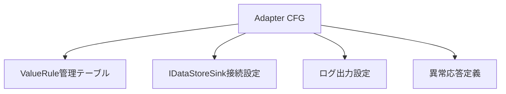

本章では構成対象を規定する。設定ファイル形式、格納方法およびロード方式は実装方式に応じて決定する。

## 11.3 ValueRule管理テーブル

### 11.3.1 役割

ValueRuleResolverはValueRule管理テーブルを参照し、DataIdに対応するValueRuleを選択する。

Resolver自身は変換規則を保持せず、管理テーブル参照に専念する。

### 11.3.2 管理方針

- 1つのDataIdに対して原則1つのValueRuleを登録する
- DataIdとValueRuleの対応関係を保持する
- 実行中に構成変更を行わない
- Resolverは管理テーブル参照のみを行う

この方式により、データ種別追加時はRule実装と対応表追加のみで拡張可能となる。

### 11.3.3 異常時の扱い

- 対応するValueRuleが存在しない場合は入力異常とする
- 入力異常データはDataStore Layerへ転送しない
- ログ出力および異常応答返却対象とする

不正なRule選択を早期に検知することで、後続Layerへの異常伝搬を防止する。

### 11.3.4 未確定事項

- 同一DataId重複登録可否はT.B.D.
- 管理テーブル実装方式はT.B.D.

## 11.4 IDataStoreSink接続

### 11.4.1 接続方針

Adapter LayerはIDataStoreSinkのみに依存し、DataStore Layer内部実装には依存しない。

これにより、DataStore内部構造変更がAdapter Layerへ波及することを防止する。

### 11.4.2 利用IF

- postFaultInput(DataItem)
- postGeneralInput(DataItem)
- postCurrentValueInput(DataItem)

入力データ分類に応じて適切なIFを選択する。

### 11.4.3 接続構造

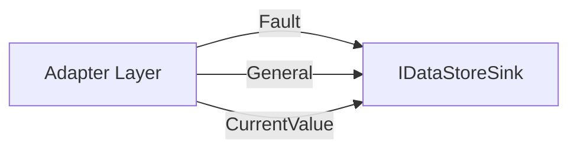

### 11.4.4 接続時の考慮事項

- DataStore内部キュー実装には依存しない
- DataStore側がスレッドセーフ性を保証する
- IDataStoreSink未接続時の扱いはT.B.D.

この構成により、Layer間の疎結合性を維持する。

## 11.5 入力異常の扱い

### 11.5.1 異常対象

- DataId未定義
- ValueRule未登録
- 必須Context不足
- ValueRule実行失敗
- 入力契約違反

### 11.5.2 異常発生時処理

|処理|内容|
|---|---|
|ログ出力|異常内容を記録|
|転送抑止|DataStoreへの転送を停止|
|異常応答|入力元へ異常通知|

異常データは後続Layerへ伝搬させない。

これはデータ整合性を維持し、Capability Layerへの影響を防止するためである。

## 11.6 拡張方針

### 11.6.1 データ種別拡張

DataDefinitionおよび対応するValueRuleを追加することで対応する。

### 11.6.2 Context拡張

追加例:

- Unit
- SensorType
- ScaleFactor
- Operation

### 11.6.3 ValueRule選択方式拡張

将来的にDataId以外の条件が必要な場合はResolverの選択条件を拡張する。

### 11.6.4 入力元拡張

RawData契約とIAdapterPort契約を満たすことで既存構成を維持可能とする。

### 11.6.5 観測時刻情報への対応

現時点ではtimestampは責務対象外であるが、将来的な要求に応じて付与方式を検討する。

## 11.7 初期化時の整合性検査

システム起動時に以下の整合性確認を行うことを推奨する。

|検査項目|目的|
|---|---|
|IDataStoreSink設定確認|接続先未設定防止|
|Rule管理テーブル空チェック|構成漏れ防止|
|NULL登録チェック|実行時異常防止|
|重複登録ルール確認|運用不整合防止|
|Context定義確認|変換失敗防止|

これらの検査は、運用開始後に発生する構成不整合や変換失敗を事前に検出するために実施する。

実際の検査方式は実装方式に応じて決定する。
# 12. 呼び出しシーケンス

## 12.1 概要

本章では、Adapter Layerが外部入力を受理し、正規化処理を経てDataStore Layerへ転送するまでの代表的な呼び出しシーケンスを示す。

Adapter LayerはPush方式で動作し、入力元コンポーネントから受信したRawDataをDataItemへ変換しDataStoreへ転送する。

## 12.2 Fault入力

### 12.2.1 シナリオ概要

Fault分類のRawDataを受理し、正規化後にFault入力IFへ転送する。

### 12.2.2 シーケンス図

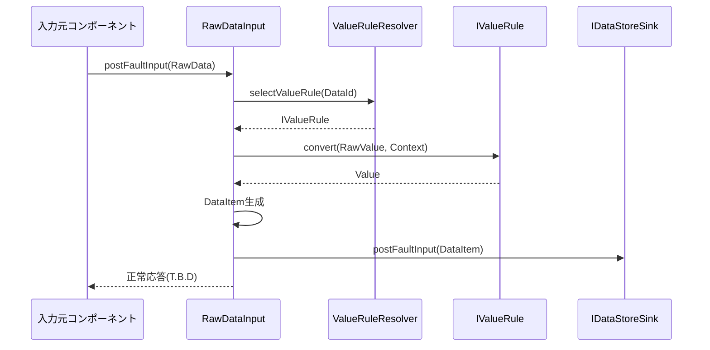

### 12.2.3 処理内容

1. Fault入力を受理する。
2. Ruleを選択する。
3. Valueへ変換する。
4. DataItemを生成する。
5. Fault入力IFへ転送する。

## 12.3 General入力

### 12.3.1 シナリオ概要

General分類のRawDataを受理し、正規化後にGeneral入力IFへ転送する。

### 12.3.2 シーケンス図

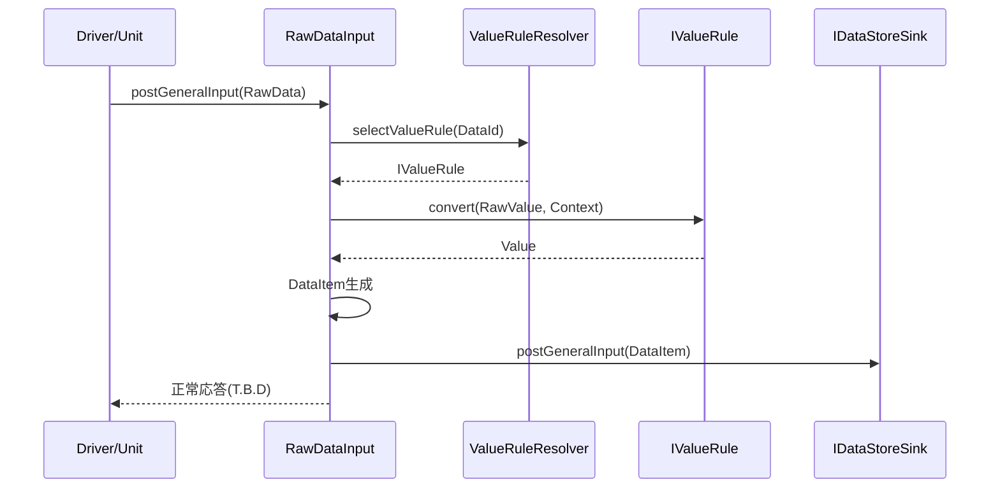

### 12.3.3 処理内容

1. General入力を受理する。
2. Ruleを選択する。
3. Valueへ変換する。
4. DataItemを生成する。
5. General入力IFへ転送する。

## 12.4 CurrentValue入力

### 12.4.1 シナリオ概要

CurrentValue分類のRawDataを受理し、正規化後にCurrentValue入力IFへ転送する。

### 12.4.2 シーケンス図

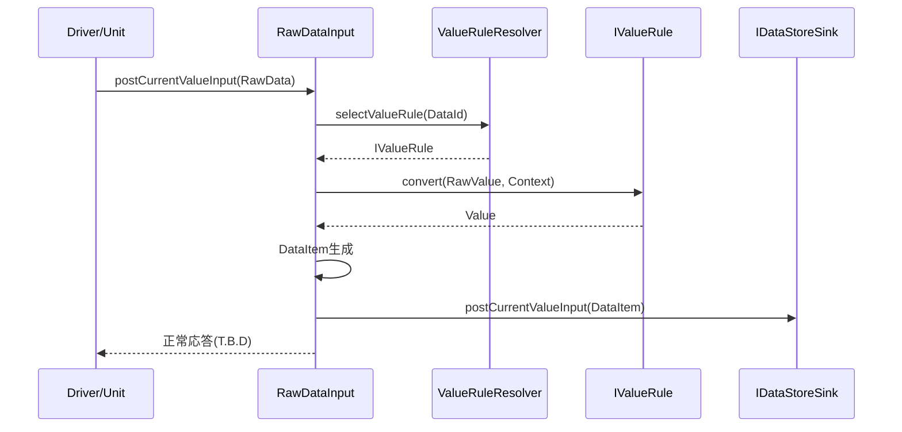

### 12.4.3 処理内容

1. CurrentValue入力を受理する。
2. Ruleを選択する。
3. Valueへ変換する。
4. DataItemを生成する。
5. CurrentValue入力IFへ転送する。

## 12.5 ValueRule未登録

### 12.5.1 シナリオ概要

DataIdに対応するValueRuleが存在しない場合は入力異常として扱う。

### 12.5.2 シーケンス図

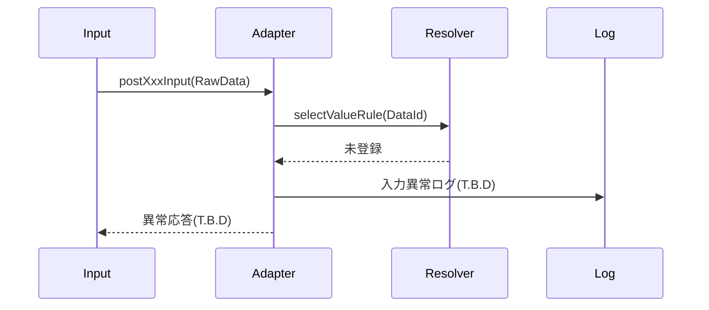

### 12.5.3 処理内容

1. Rule選択を実施する。
2. 未登録を検出する。
3. ログ出力する。
4. DataStoreへの転送を抑止する。
5. 異常応答を返却する。

## 12.6 ValueRule実行失敗

### 12.6.1 シナリオ概要

ValueRuleによるValue変換が失敗した場合は入力異常として扱う。

### 12.6.2 シーケンス図

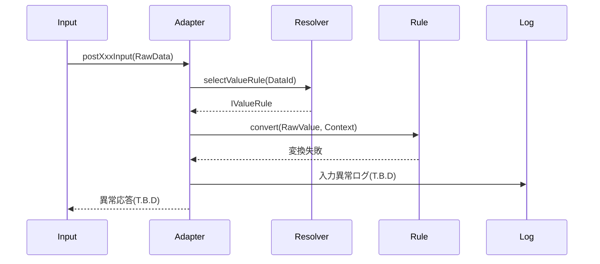

### 12.6.3 処理内容

1. Rule実行を行う。
2. 変換失敗を検出する。
3. ログ出力する。
4. DataStoreへの転送を抑止する。
5. 異常応答を返却する。

# 13. 組み込み手順

## 13.1 ファイル構造

### 13.1.1 構成方針

Adapter Layerは、公開IF、実装、Rule選択、Rule実装、およびコンフィグレーションから構成される。

### 13.1.2 ファイル構成例

|階層|ファイル名|役割|
|---|---|---|
|公開IF|IAdapterPort|入力元コンポーネントが依存する公開IF|
|実装|RawDataInput|RawData受理および正規化処理実装|
|Rule選択|ValueRuleResolver|ValueRule選択|
|Rule IF|IValueRule|Value変換IF|
|Rule実装|ValueRule群|データ種別ごとの変換処理|
|Config|AdapterCfg(T.B.D.)|Rule対応表および接続設定|

### 13.1.3 依存ポリシー

- 入力元コンポーネントはIAdapterPortへ依存する
- RawDataInputへ直接依存しない
- Adapter LayerはIDataStoreSinkへ依存する
- DataStore Layer内部実装へ依存しない
- Capability Layerへ依存しない

## 13.2 組み込み準備

### 13.2.1 CommonDataModel確認

組み込み前に対象データのDataDefinitionが定義されていることを確認する。

確認項目:

- DataId
- ValueType
- DataDomain

### 13.2.2 ValueRule作成

対象となるDataIdごとにValueRuleを作成する。

ValueRuleは以下を満たすこと。

- RawValueからValueへ変換する
- 状態を保持しない
- DataStore送信を行わない
- ビジネスロジックを含まない

### 13.2.3 ValueRuleResolver構成

DataIdとValueRuleの対応関係を登録する。

確認項目:

- 未登録DataIdが存在しない
- 必須Ruleが定義されている
- 重複登録ポリシーが定義されている

## 13.3 接続手順

### 13.3.1 DataStore接続

Adapter LayerへIDataStoreSinkを設定する。

接続確認項目:

- IDataStoreSink設定済み
- Fault入力IF利用可能
- General入力IF利用可能
- CurrentValue入力IF利用可能

### 13.3.2 入力元接続

入力元コンポーネントはIAdapterPortへ接続する。

入力元コンポーネントは、Adapter Layerへ入力する前に必要な前処理（通信プロトコル解析、意味解釈等）を完了していること。

### 13.3.3 ログ接続

入力異常を記録可能なログ出力先を接続する。

ログ出力方式およびログレベルはT.B.D.とする。

## 13.4 呼び出し側の責務

### 13.4.1 RawData契約遵守

呼び出し側は以下を適切に設定すること。

- DataId
- RawValue
- Context

### 13.4.2 分類別IF選択

入力分類に応じて適切なIFを呼び出すこと。

- postFaultInput
- postGeneralInput
- postCurrentValueInput

### 13.4.3 DataId管理

未定義DataIdを入力しないこと。

利用するDataIdはCommonDataModelおよびValueRuleへ登録済みであること。

### 13.4.4 Context付与

ValueRuleが必要とする補助情報を不足なく設定すること。

### 13.4.5 異常応答への対応

入力異常が返却された場合は、呼び出し側で適切なエラー処理を実施すること。

### 13.4.6 非責務の理解

呼び出し側は以下をAdapter Layerへ期待してはならない。

- 状態判定
- ビジネスロジック
- 異常値補正
- データ保持
- 状態管理

## 14. 排他・整合性設計

Adapter Layer は入力データを保持せず、共有可変状態を持たない。

そのため Adapter Layer 固有の排他制御は行わない。

データ整合性保証および保持データに対する排他制御は
DataStore Layer または Storage Layer の責務とする。