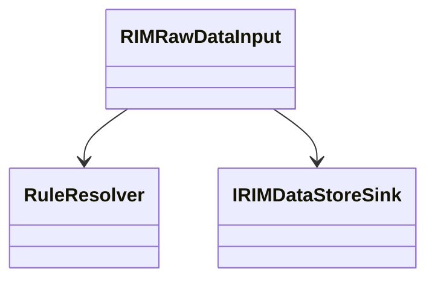
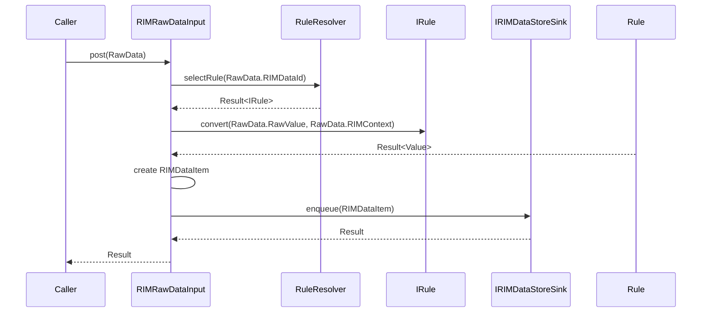

# RIMRawDataInput 詳細設計書

---

## 1. 概要

RIMRawDataInputはAdapter Layerの入力エントリポイントである。

本コンポーネントは入力元コンポーネントから渡されたRawDataを受け取り、Rule選択、値変換およびDataStoreへの送信処理を実行する。

RIMRawDataInput自身はRule選択や値変換の詳細ロジックを保持せず、各コンポーネントを適切な順序で呼び出し、処理全体を制御する責務を持つ。

---

## 2. 目的

本コンポーネントの目的は、入力データの受付からDataStoreへの送信要求までの処理を一元管理することである。

入力処理の起点を明確にし、RIMAdapter Layer内部の処理フローを統制する。

---

## 3. 背景・採用理由

RIMAdapter Layerは外部仕様との差異を吸収し、後続Layerへ統一されたデータ形式を提供する責務を持つ。

RIMRawDataInputはその入口として機能し、入力受付からDataStore送信までの処理フローを統括する。

また、Rule選択、値変換およびDataStore送信を個別コンポーネントへ分離することで、責務分離およびテスト容易性を向上させる。

RIMRawDataInputはRIMDataIdとRuleの対応を管理しない。

適用するRuleの決定はRuleResolverへ委譲し、RIMRawDataInputは処理制御に専念する。

---

## 4. 責務

RIMRawDataInputは以下の責務を持つ。

- RawDataの受付
- RuleResolverの呼び出し
- Ruleの実行
- IRIMDataStoreSinkへの送信
- 処理結果の返却
- 各コンポーネントの実行順序制御
- 下位コンポーネントの実行結果の集約

---

## 5. 非責務

RIMRawDataInputは以下を責務としない。

- Rule選択ロジックの実装
- データ変換ロジックの実装
- DataStoreへの保存処理
- データ保持
- 状態管理
- RawDataの妥当性検証

これらは他コンポーネントまたは他Layerの責務とする。

RIMRawDataInputはRawDataが契約を満たしていることを前提とする。

必須項目の妥当性検証は入力元コンポーネントの責務とする。

---

## 6. 保持データ

RIMRawDataInputは状態を保持しない。

処理に必要な情報は引数として受け取り、処理完了後に保持しない。

---

## 7. 依存関係

### 7.1 利用するコンポーネント

- RuleResolver
- IRIMDataStoreSink

RuleResolverはRIMDataIdに対応するRuleを取得するために利用する。

IRIMDataStoreSinkは正規化済みデータの送信先として利用する。

IRIMDataStoreSinkは投入成功のみを保証する。

DataStoreへの反映結果は保証対象外であり、反映処理はRIMDataStore Layerの責務とする。

### 7.2 利用されるコンポーネント

RIMRawDataInputはRawDataを生成する上位コンポーネントから利用される。

入力元の実装には依存しない。




---

## 8. データモデル

### 8.1 RawData

RawDataは入力元コンポーネントとRIMRawDataInput間で受け渡される契約データである。

RawDataは以下の情報を保持する。

- RIMDataId
- RawValue
- RIMContext


RawDataは以下の入力を対象とする。

- 観測値
- アプリケーション情報
- 動作報告
- エラー情報

例：

- 温度
- 圧力
- 回転数
- Job開始通知
- Job終了通知
- Error発生通知
- Error解除通知
- 
### 8.2 RIMDataItem

RIMDataItemはRIMAdapter Layerから
RIMDataStore Layerへ受け渡される標準データである。

RIMDataItemは以下の情報を保持する。

- RIMDataId
- Value
- RIMContext

RIMRawDataInputはValue生成後に
RIMDataItemを生成する。

### 8.3 RIMDataId

データ種別を識別するための識別子である。

RIMDataIdは必須項目である。

RIMDataIdは空文字であってはならない。

### 8.4 RawValue

入力された未変換データである。

RawValueは必須項目である。

Ruleによる変換処理の対象となる。

変換後の値はValueとして利用される。

RawValueは単一値、配列または構造化データを取り得る。

ストリーミングデータは対象外とする。

#### 8.5 Value

ValueはRuleによる変換後の標準データである。

ValueはRIMDataStore Layer以降で利用される
統一された内部表現を表す。

Valueの具体的な構造および型は
データ種別ごとに定義する。

### 8.6 RIMContext

RIMContextはValue生成および後続Layerで利用可能な補助情報である。

RIMContextはKey-Value形式で管理する。

RIMContextは省略可能である。

RIMContextはRIMDataStore Layerへ受け渡される。

RIMContextKeyは必要に応じて追加可能とする。

RIMContextValueは複数型を保持可能な型とする。

RIMContextKey例：

- Unit
- SensorType
- ScaleFactor
- Operation


### 8.7 ErrorCode

- RuleNotFound
- ConvertError
- QueueError

### 8.8 Result

処理結果を表す共通型である。

成功または失敗を表現する。

### 8.9 Result`<T>`

値を伴う処理結果を表す共通型である。

---

## 9. 提供IF

### 9.1 postFaultRepot

#### 9.1.1 IF

```
Result postFaultRepot(RawData rawData)
```

#### 9.1.2 説明

入力された異常・警告・安全系報告を受け取り、正規化処理を実施した後、DataStoreへ送信する。

異常・警告・安全系報告についてIDを定義し、それら以外のIDを受け付けないこと。

本IFの成功はDataStoreへの保存完了を意味しない。

IRIMDataStoreSinkへの投入成功のみを保証する。

### 9.2 postOperationRepot

#### 9.2.1 IF

```
Result postOperationRepot(RawData rawData)
```

#### 9.2.2 説明

入力された動作報告を受け取り、正規化処理を実施した後、DataStoreへ送信する。

動作報告についてIDを定義し、それら以外のIDを受け付けないこと。

本IFの成功はDataStoreへの保存完了を意味しない。

IRIMDataStoreSinkへの投入成功のみを保証する。

### 9.3 postCurrentValue

#### 9.3.1 IF

```
Result postCurrentValue(RawData rawData)
```

#### 9.3.2 説明

入力された温度・湿度・インク残量などドライバからのデータを受け取り、正規化処理を実施した後、DataStoreへ送信する。

ドライバからのデータについてIDを定義し、それら以外のIDを受け付けないこと。

本IFの成功はDataStoreへの保存完了を意味しない。

IRIMDataStoreSinkへの投入成功のみを保証する。

### 9.3 postCurrentValue

#### 9.3.1 IF

```
Result postCurrentValue(RawData rawData)
```

#### 9.3.2 説明

入力された温度・湿度・インク残量などドライバからのデータを受け取り、正規化処理を実施した後、DataStoreへ送信する。

ドライバからのデータについてIDを定義し、それら以外のIDを受け付けないこと。

本IFの成功はDataStoreへの保存完了を意味しない。

IRIMDataStoreSinkへの投入成功のみを保証する。


---

## 10. 処理フロー

ここでは提供IFについてまとめてpost()として記載する。



### 10.1 成功条件

- Rule取得成功
- 値変換成功
- IRIMDataStoreSinkへの投入成功

---

## 11. エラー処理

### 11.1 エラー種別

| エラーコード | 発生元 | 内容 |
|-------------|--------|------|
| RuleNotFound | RuleResolver | 設計不備によるRule未定義 |
| ConvertError | IRule | 値変換失敗 |
| QueueError | IRIMDataStoreSink | キュー格納失敗 |

### 11.2 挙動

エラー発生時は処理を中断する。

再試行制御は呼び出し元または上位コンポーネントの責務とする。

---

## 12. 制約事項

### 12.1 アーキテクチャ制約

- RIMRawDataInputは状態を保持しない
- RIMRawDataInputはDataStore内部へ直接アクセスしない
- RIMRawDataInputは入力元コンポーネントの実装へ依存しない

### 12.2 機能制約

- RIMRawDataInput内部の処理は同期的に実行する
- Rule選択ロジックを保持しない
- データ変換ロジックを保持しない


### 12.3 呼び出し制約

RIMRawDataInputは状態を保持しない。

そのため複数スレッドからの同時呼び出しを許容する。

呼び出し元による排他制御は不要とする。

---

## 13. 非機能要件

- 単体テスト可能であること
- モック利用可能であること
- 異常系の挙動が一貫していること
- 状態を持たないこと

---

## 14. 将来拡張

### 14.1 入力元追加

新たな入力元コンポーネントを追加可能とする。

### 14.2 入力検証強化

RawDataの妥当性検証を追加可能とする。

### 14.3 エラーハンドリング強化

障害分類やリトライ制御を追加可能とする。

### 14.4 メトリクス取得

処理件数やエラー件数などの監視情報取得を追加可能とする。
