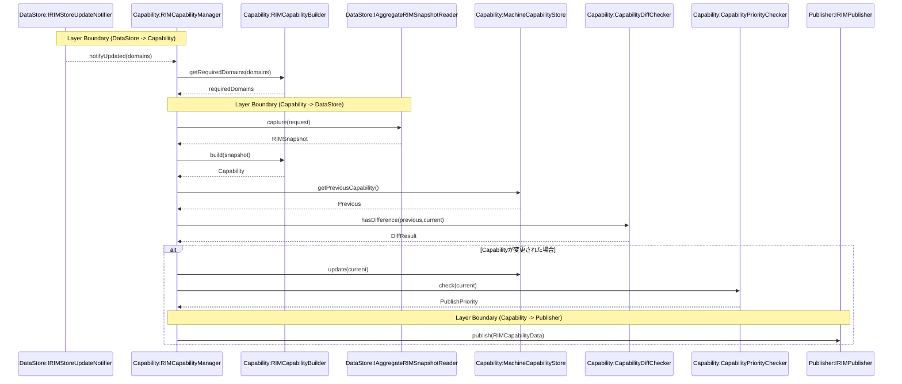

# Capability Layer

## 概要
DataStoreに保持されたDataからCapability(State)を生成する。

## シーケンス図

```mermaid
sequenceDiagram
participant Store as DataStore:IRIMStoreUpdateNotifier
participant Manager as Capability:RIMCapabilityManager
participant Builder as Capability:RIMCapabilityBuilder
participant Reader as DataStore:IAggregateRIMSnapshotReader
participant CapStore as Capability:MachineCapabilityStore
participant Diff as Capability:CapabilityDiffChecker
participant Priority as Capability:CapabilityPriorityChecker
participant Publisher as Publisher:IRIMPublisher

Note over Store,Manager: Layer Boundary (DataStore -> Capability)
Store-->>Manager: notifyUpdated(domains)
Manager->>Builder: getRequiredDomains(domains)
Builder-->>Manager: requiredDomains

Note over Manager,Reader: Layer Boundary (Capability -> DataStore)

Manager->>Reader: capture(request)
Reader-->>Manager: RIMSnapshot
Manager->>Builder: build(snapshot)
Builder-->>Manager: Capability
Manager->>CapStore: getPreviousCapability()
CapStore-->>Manager: Previous
Manager->>Diff: hasDifference(previous,current)
Diff-->>Manager: DiffResult

alt Capabilityが変更された場合
    Manager->>CapStore: update(current)
    Manager->>Priority: check(current)
    Priority-->>Manager: PublishPriority

    Note over Manager,Publisher: Layer Boundary (Capability -> Publisher)

    Manager->>Publisher: publish(RIMCapabilityData)
end
```

---