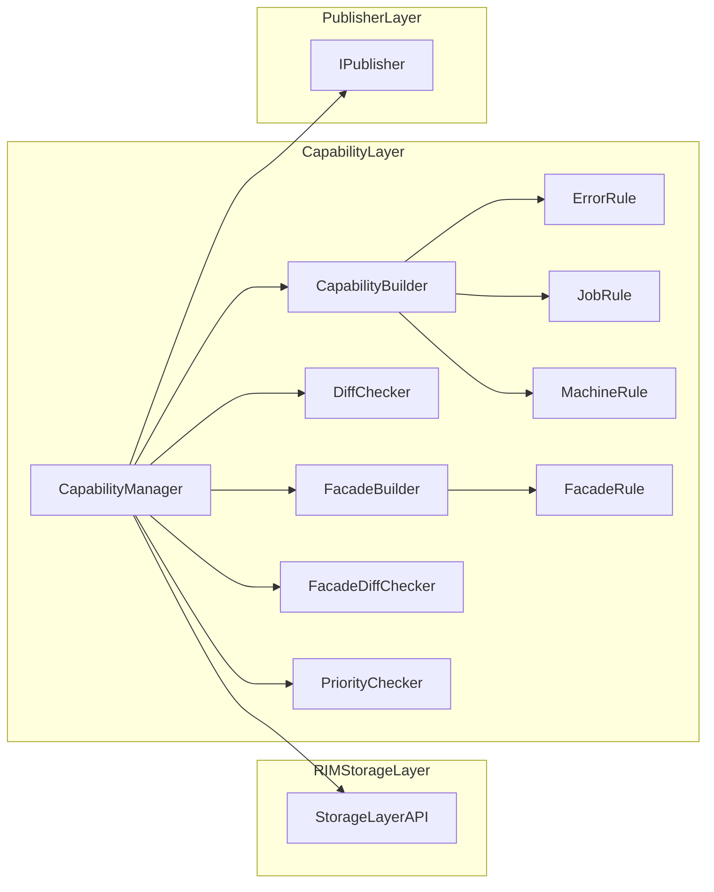
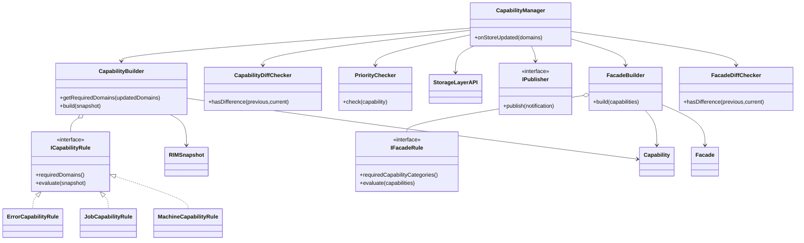

# Capability Layer 仕様設計書

---

## 1. はじめに
### 1.1 本書の目的
本設計は、Capability Layerの役割・責務・構成および設計原則を定義することを目的とする。
Capability Layerは、Domain DataStoreに保持された事実データを入力として受け取り、意味のある状態（Capability）を導出する層である。
本設計により、
- 状態の意味解釈を一箇所に集約
- 判定ロジックの分散防止
- UI・制御・外部連携に対する一貫した状態提供
を実現する。

---

### 1.2 対象範囲
本書で扱う範囲を明確化する。

---

### 1.3 用語定義
| 用語 | 説明 |
|--------|--------|
| RIMDataItem | DataStore Layer内部で利用する標準データモデル |
| Data | Mediator外部から入力される情報。 |
| State | Dataを解釈した結果。Dataから再計算可能なものである。Capability Layerにて用いられる。 |
| RIMDataId | データ種別識別子。DataStore Layerにおいては保存先特定を主目的として利用する。 |
| RIMContext | データに付与される補足情報 |
| Storage | システム内のデータを集約して管理するコンポーネント |
| DataDomain | Storage内の保存領域を示すドメイン。例えばStorage内の温度湿度関係データのドメインといったように指定可能。 |
| DataDomainSet | DataDomainの複数指定版 |
| Error | 異常系の入力。Error、Warningなど緊急性が高く、すぐにでも処理する必要がある入力。 |
| Value | 最新値系の入力。ドライバから上がってくるセンサの値など最新値が欲しい入力。 |
| RIMSnapshot | ある時点のStorage状態を読み取り専用で表現したデータ |
| CapabilityCategory | Capabilityの種別識別子。Capabilityの保存および変更通知時の識別に利用する。 |
| CapabilityCategorySet | CapabilityCategoryの複数指定版。 |
| Facade | Capabilityを入力として導出される上位集約状態。Storage Layerに保存される。 |
| FacadeCategory | Facadeの種別識別子。Facadeの保存および変更通知時の識別に利用する。 |
| FacadeCategorySet | FacadeCategoryの複数指定版。 |

---

## 2. Capability Layerの位置づけ
### 2.1 システム全体構成
Adapter Layer（正規化・変換）  
        ↓  
DataStore Layer（事実保持）  
        ↓  
Capability Layer（意味・判断）    
        ↓  
Publisher Layer / 外部IF（公開）  

---

### 2.2 Capability Layerの責務

Capability Layerは、DataStore Layerに保持された事実データを解釈し、
システム外部および上位層が利用しやすい意味のある状態（Capability）を提供する責務を持つ。

主な責務を以下に示す。

- DataStore LayerからのData更新通知を受ける。
- 更新内容に応じて必要なRIMSnapshot取得範囲を決定する。
- RIMSnapshotを利用してCapabilityを生成する。
- 同一RIMSnapshotに基づく一貫したCapabilityを生成する。
- Storage Layerに保存された前回Capabilityとの差分を検知する。
- Capabilityの重要度およびPublish優先度を判定する。
- 変更があったCapabilityをPublisher Layerへ通知する。
- 更新されたDataDomainを含む通知をPublisher Layerへ通知する。
- イベント通知属性を持つCapabilityの重要な変化を明示イベントとして通知する。
- Capability生成ロジックを一箇所へ集約し、UI・制御・外部連携へ一貫した状態を提供する。
- DataStore Layerから受信した更新通知をPublisher Layerへ転送する。
- 更新されたCapabilityをStorage Layerへ保存する。
- Capabilityを入力としてFacadeを生成する。
- Storage Layerに保存された前回Facadeとの差分を検知する。
- 更新されたFacadeをStorage Layerへ保存する。
- Capability変更通知をPublisher Layerへ通知する。
- Facade変更通知をPublisher Layerへ通知する。


Capability Layerは「事実データの保持」ではなく、
「事実データの意味解釈と状態導出」を担当する層である。

---

### 2.3 Capability Layerの非責務

Capability Layerは状態導出を担当する層であり、
以下の処理は責務としない。

- データ正規化
- Storageへのデータ保存
- RIMSnapshot生成処理
- CapabilityのPublish
- RIMSnapshot保持
- Capability保持
- Facade保持
- 通知配信処理

Capability Layerはあくまで「現在の事実から現在の意味状態を生成する」ことのみを責務とし、状態に応じた動作実行は他Layerが担当する。

---

## 3. 入出力仕様
### 3.1 入力
Capability Layerへの主な入力はDataStore LayerからのData更新通知である。

入力内容：  
- 更新されたStorage領域がどこかわかるもの

---

### 3.2 参照データ
Capability LayerはStorage Layerを介してRIMSnapshotを取得する。

---

### 3.3 出力
Capability LayerはPublisher Layerへ変更通知を渡す。

出力内容：
- DataChangedNotification
- CapabilityChangedNotification
- FacadeChangedNotification

Capability LayerはCapabilityおよびFacadeそのものを
Publisher Layerへ通知しない。

状態データの取得先はStorage Layerとする。

---
### 3.4 通知モデル
#### 3.4.1 DataChangedNotification
更新されたDataDomain情報を保持する通知。

#### 3.4.2 CapabilityChangedNotification
変更されたCapabilityCategory情報を保持する通知。

#### 3.4.3 FacadeChangedNotification
変更されたFacadeCategory情報を保持する通知。


---
## 4. Capability生成方針
### 4.1 基本方針
Capability Layerは、DataStoreLayerから更新通知を受けたあと、必要なRIMSnapshotを取得し、現在状態を生成する。　　
Capability Layerは全Capabilityの再生成を行わない。  
更新されたDataDomainをrequiredDomainsに含むCapabilityRuleのみ再評価を行う。  

Data更新通知  
↓  
更新通知キューへ登録  
↓  
FIFO順に通知取り出し  
↓  
影響CapabilityRule抽出  
↓  
必要RIMSnapshot決定  
↓  
RIMSnapshot取得  
↓  
対象Capabilityのみ生成  
↓  
前回Capabilityと比較  
↓  
変化ありならPublisherへ通知  
↓  
イベント通知属性を持つCapabilityに変化がある場合は明示イベントとして通知する  

---

### 4.2 Capability生成単位
Capabilityをどの単位で生成するかを定義する。  
TBD

---

### 4.3 Capability構成
Capabilityの構成例  
TBD

---

### 4.4 Capability生成ルール
TBD

---

## 5. RIMSnapshot取得設計
Capability Layerは毎回すべてのStorageを参照せず、更新内容に応じて必要なRIMSnapshotのみ取得する。  
RIMSnapshot取得対象は、RegistrtyDomainで指定する。(DataStore Layer参照)  
ステータス管理モジュールはStorageを直接ロックしない。

Storage Layerが返却するRIMSnapshotは、要求されたDataDomain集合に対して同一時点の整合性が保証されたものでなければならない。

Capability Layerは同一RIMSnapshotを利用してCapabilityを算出することで、一貫した状態解釈を実現する。
RIMSnapshotの生成および保持はStorage Layerの責務とする。

Capability LayerはRIMSnapshotを保持しない。

Capability Layerは必要なRIMSnapshotをStorage Layerから取得し利用する。

---

## 6. Capability生成設計
Capability Layerは取得したRIMSnapshotを元にCapabilityを生成する。  
Capabilityの種類ごとに判定クラスが存在しており、それを用いてRIMSnapshotからCapabilityの生成を行う。  
各判定クラスについては現在TBD


CapabilityRuleは以下の責務を持つ。

- Capability算出に必要なDataDomain定義
- RIMSnapshotからCapabilityを算出する判定ロジック

CapabilityBuilderは判定ロジックを持たず、CapabilityRuleの呼び出しおよび結果集約のみを行う。

CapabilityRuleはrequiredDomainsを定義する。

CapabilityBuilderは更新通知されたDataDomainをもとに、影響を受けるCapabilityRuleを抽出する

必要なRIMSnapshot取得範囲は、抽出されたCapabilityRuleのrequiredDomainsの和集合として決定する。

Capability LayerはStorage Layerから前回Capabilityを取得する。

生成したCapabilityとの差分判定を行う。

差分が存在する場合のみStorage Layerへ保存する。

差分が存在する場合のみCapabilityChangedNotificationを発行する。

---


## 7. Facade生成設計
### 7.1 基本方針
FacadeはCapabilityを入力として生成される上位集約状態である。

FacadeはFactDataおよびRIMSnapshotを直接参照しない。

FacadeはStorage Layerに保存されたCapabilityを入力として生成される。

### 7.2 FacadeRule
Facade生成はFacadeRuleにより行う。

FacadeRuleは依存するCapabilityCategoryを定義可能とする。

依存情報の利用方法は実装依存とし、
本設計では規定しない。

### 7.3 評価方針
FacadeはCapability変更を契機として評価される。

再評価の詳細な実行条件は実装依存とする。
### 7.4 差分判定
生成したFacadeは前回Facadeと比較する。

差分が存在する場合のみStorage Layerへ保存する。

差分が存在する場合のみFacadeChangedNotificationを発行する。

---

## 8. 差分検知設計
Capability LayerはStorage Layerに保存された
前回Capabilityおよび前回Facadeを取得する。

生成したCapabilityとの差分有無を判定する。

差分が存在する場合、
Storage LayerへCapabilityを保存し、
CapabilityChangedNotificationを発行する。

FacadeはCapability変更を契機として生成する。

生成したFacadeとの差分有無を判定する。

差分が存在する場合、
Storage LayerへFacadeを保存し、
FacadeChangedNotificationを発行する。

---

## 9. クラス構成  
Capability Layerを構成するクラス、およびCapability Layerが利用する外部IFについて定義する。

Capability Layer内のクラスは、以下を対象とする。
- CapabilityManager
- CapabilityBuilder
- CapabilityDiffChecker
- PriorityChecker

また、Capability Layerは以下の外部IFを利用する。
- StorageLayerAPI
- IPublisher

---

### 9.1 クラス構成概要
Capability Layerのコンポーネント図、クラス構成図を以下に示す。




CapabilityManagerは、DataStore Layerからの更新通知を契機として、RIMSnapshot取得、Capability生成、差分判定、Publisher通知を制御する。

CapabilityBuilderは、RIMSnapshotからCapabilityを生成する。

CapabilityDiffCheckerは、前回のCapabilityと今回生成したCapabilityを比較し、Publisherへ通知すべき差分があるかを判定する。

PriorityCheckerは、今回生成した、Capabilityの内容をもとに、Publish優先度を判定する。

---

### 9.2 Capability Layerクラス一覧
| クラス | 概要 |
|--------|--------|
| CapabilityManager | Capability Layer処理の中心クラス |
| CapabilityBuilder | RIMSnapshotからCapabilityを生成するクラス |
| CapabilityDiffChecker | 前回Capabilityと今回Capabilityの差分を判定するクラス |
| PriorityChecker | 今回生成したCapabilityの内容をもとに、Publish優先度を判定するクラス。 |
| FacadeBuilder | Facade生成を行うクラス |
| FacadeDiffChecker | Facade差分判定を行うクラス |

---

### 9.3 外部依存IF一覧
| IF | 所属Layer | 概要 |
|--------|--------|--------|
| StorageLayerAPI | RIMStorage Layer |  RIMSnapshot、CapabilityおよびFacadeの取得・保存を行うためのIF |
| IPublisher | Publisher Layer | 変更通知をPublisher層へ渡すためのIF |

上記クラスは、Capability Layer内のクラスではない。
ただしCapability Layerが処理を行うために利用する外部依存IFとして、本章に記載する。

---

### 9.4 CapabilityManager
#### 9.4.1 責務
CapabilityManagerは、Capability Layer処理全体を制御する中心クラスである。

主な責務を以下に示す。
- Data更新通知を受ける。
- 更新されたDataDomainをもとにRIMSnapshot取得範囲を決定する。
- StorageLayerAPIを介してRIMSnapshotを取得する。
- CapabilityBuilderにCapability生成を依頼する。
- PriorityCheckerにPublish優先度判定を依頼する。
- 更新通知キューを管理する。
- 更新通知をFIFO順に処理する。
- Storage Layerから前回Capabilityを取得する。
- 初回生成時のCapability有無を確認する
- 更新されたDataDomain情報をPublisher通知データへ付与する。
- 受信したData更新通知をPublisher Layerへ転送する。
- 差分有りの場合のみCapabilityを保存する。
- CapabilityChangedNotificationを発行する。
- Storage Layerから前回Facadeを取得する。
- Facade差分判定を行う。
- 差分有りの場合のみFacadeを保存する。
- FacadeChangedNotificationを発行する。

---

#### 9.4.2 非責務
CapabilityManagerは、以下を行わない。
- Storageへの入力反映
- Storageの直接参照
- RIMSnapshotの実コピー処理
- Capabilityの詳細な生成ロジック
- Subscriberへの実配信処理

---

#### 9.4.3 提供IF
CapabilityManagerの提供IFを以下に示す。

| IF | 内容 |
|--------|--------|
| onDataUpdated(DataDomainSet& domains) | DataStore LayerからのData更新通知を受け、ステータス生成処理を開始する。 |

※IFは疑似コードであり、特定の言語の実装に準拠しない。

---

#### 9.4.4 内部処理
```
Store更新通知
↓
Data変更通知転送
↓
更新通知キューへ登録
↓
更新通知取り出し
↓
影響RIMCapabilityRule抽出
↓
必要RIMSnapshot決定
↓
RIMSnapshot取得
↓
前回Capability取得
↓
Capability生成
↓
Capability差分判定

差分なし
↓
終了

差分あり
↓
Capability保存
↓
Capability変更通知

↓
前回Facade取得
↓
Facade生成
↓
Facade差分判定

差分なし
↓
終了

差分あり
↓
Facade保存
↓
Facade変更通知
```

Capability Layerは全Capabilityの再生成を行わない。

Data更新通知を受けた際は、更新されたDataDomainをrequiredDomainsに含むCapabilityRuleのみ再評価を行う。

各Capabilityは独立して算出されるものとし、Capability間の依存関係を持たない。

---

### 9.5 CapabilityBuilder
#### 9.5.1 責務
CapabilityBuilderは、RIMSnapshotからCapabilityを生成するクラスである。

主な責務を以下に示す。
- RIMSnapshotからCapabilityを生成する。
- CapabilityRuleの実行結果を集約する。
- 更新されたDataDomainから対象CapabilityRuleを選定する。

---

#### 9.5.2 非責務
CapabilityBuilderは、いかを行わない。
- Data更新通知の受信
- RIMSnapshot取得
- 前回Capabilityとの差分判定
- Publisher Layerへの通知
- Storageの直接参照
- Capability判定ロジックそのもの（これはRule）

---

#### 9.5.3 提供IF
CapabilityBuilderの提供IFを以下に示す。

| IF | 内容 |
|--------|--------|
| build(RIMSnapshot) | RIMSnapshotを元にCapabilityを生成する。 |

※IFは疑似コードであり、特定の言語の実装に準拠しない。

---

### 9.6 CapabilityDiffChecker
#### 9.6.1 責務
CapabilityDiffCheckerは、前回生成済のCapabilityと今回生成したCapabilityを比較し、Publisher Layerへ通知すべき差分があるかを判定するクラスである。

主な責務を以下に示す。
- 前回Capabilityと今回Capabilityを比較する。
- Capabilityに差分があるか判定する。

---

#### 9.6.2 非責務
CapabilityDiffCheckerは以下を行わない。
- Capabilityの生成
- RIMSnapshotの取得
- Publisher Layerへの通知
- 前回Capabilityの更新管理

---

#### 9.6.3 提供IF
CapabilityDiffCheckerの提供IFを以下に示す。
| IF | 内容 |
|--------|--------|
| hasDifference(previousCapability, currentCapability) | 前回Capabilityと今回Capabilityを比較し、差分がある場合に差分有無と変更Capabilityを返す。 |

差分判定は再評価対象Capabilityについてのみ実施する。
全Capabilityの比較は行わない。

---

#### 9.6.4 データ型
```
struct StatusDiffResult{
    変更有無,
    変更Capabilityがどれか
}

```

---

### 9.7 PriorityChecker（TBD）
TBD

通知時に利用する優先度を判定するクラス。
詳細な判定対象および判定方法は詳細設計にて定義する。

---

#### 9.7.1 責務
Publish時に利用する優先度を判定する。
詳細はTBD。

---

#### 9.7.2 非責務
PriorityCheckerは以下を行わない。
- Capabilityの生成
- RIMSnapshotの取得
- Publisher Layerへの通知
- 前回Capabilityの更新管理

---

#### 9.7.3 関連データ型
```
CapabilityPriority
```
Low、Normal、High、Criticalのいずれかの値をとるenum。

CapabilityPriorityはPublisher Layerに対する配送優先度の参考情報である。

Publisher Layerは本情報を利用して配送順序制御を行ってもよいが、配送順序を保証するものではない。

---

#### 9.7.4 提供IF
PriorityCheckerの提供IFを以下に示す。
| IF | 内容 |
|--------|--------|
| check(target) | 優先度判定対象を入力としてPublish優先度を返す。 |

---

### 9.8 StorageLayerAPI（外部依存IF）
本IFはRIMStorage Layerが提供するIFである。

CapabilityManagerが
RIMSnapshot、
Capability、
Facadeの取得および保存のために利用する。

| IF | 内容 |
|--------|--------|
| capture(RIMSnapshotRequest request) | 指定されたDataDomainSetに対応するRIMSnapshotを取得する。 |

詳細については、RIMStorage Layerの設計書を参照すること。

---

### 9.9 IPublisher（外部依存IF）
本IFはPublisher Layerが提供する通知IFである。
CapabilityManagerがPublisher Layerへ
各種変更通知を通知するために用いる。
| IF | 内容 |
|--------|--------|
| publish(notification) | Data、Capability、Facadeの変更通知を渡す。 |

---

### 9.10 クラス間の呼び出し関係
TBD

---

### 9.11 クラス構成上の方針
本構成では以下の方針とする。
- CapabilityManagerに処理を集中させすぎない。
- Capability LayerはStorageを直接参照しない
- Capability LayerはSubscriberに直接Publishしない。

---

## 10. 処理シーケンス
```
DataStore Layer
↓
Store更新通知
↓
RIMCapabilityManager
↓
Data変更通知転送
↓
更新通知キュー登録
↓
FIFO順で通知取り出し
↓
影響Rule抽出
↓
必要Snapshot取得
↓
前回Capability取得
↓
Capability生成
↓
Capability差分判定

差分なし
↓
終了

差分あり
↓
Capability保存
↓
Capability変更通知

↓
前回Facade取得
↓
Facade生成
↓
Facade差分判定

差分なし
↓
終了

差分あり
↓
Facade保存
↓
Facade変更通知

```

---

## 11. 異常処理設計
### 11.1 RIMSnapshot取得失敗
RIMSnapshot取得失敗時は、Capability生成を中止し、ログを出力する。

---

### 11.2 不整合RIMSnapshot
RIMSnapshot内のデータに不整合がある場合、Capability生成への影響が限定的なものは可能な範囲でCapabilityを生成する。

Capability生成結果の信頼性が保証できない場合はCapability生成を中止し、ログを出力する。

---

## 11.3 CapabilityRule評価失敗
CapabilityRule評価中にエラーが発生した場合、当該Capabilityの生成のみ中止する。

他Capabilityの生成および通知処理は継続する。

発生したエラーはログへ出力する。

---

## 11.4 Publisher通知失敗

Publisher Layerへの通知失敗時の再送制御および配送保証はPublisher Layerの責務とする。

Capability Layerは通知要求を行った時点で処理完了とみなす。

---

## 12. 排他・リアルタイム性設計
Capability LayerはStorageLayerAPI経由でSnapshotを取得する。

RIMSnapshotはコピーコストが発生するが、
Storageロック時間の短縮、
Capability評価中の書き込み阻害防止、
および整合性確保を優先する。

そのため本システムでは、
性能向上のための参照共有は行わず、
RIMSnapshot単位で独立したインスタンスを保持する。


Data更新通知はFIFOキューに格納する。
CapabilityManagerは単一コンシューマとしてキューを逐次処理する。


更新通知キュー長は、最大通知発生レートおよびCapability処理時間から算出する。  
具体値は性能評価結果を用いて決定する。  
その際算出結果が小数となる場合は切り上げる。  

算出式
```
QueueLength =
最大通知発生レート[event/sec]
×
最大Capability処理時間[sec]
```

---

## 13. テスト方針
TBD

