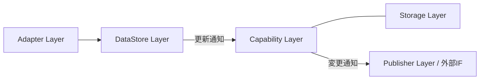
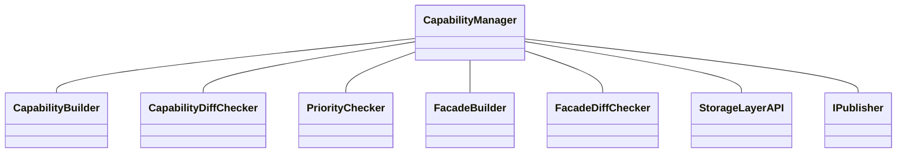
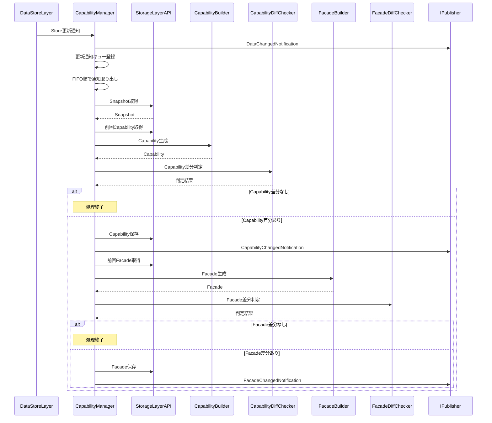
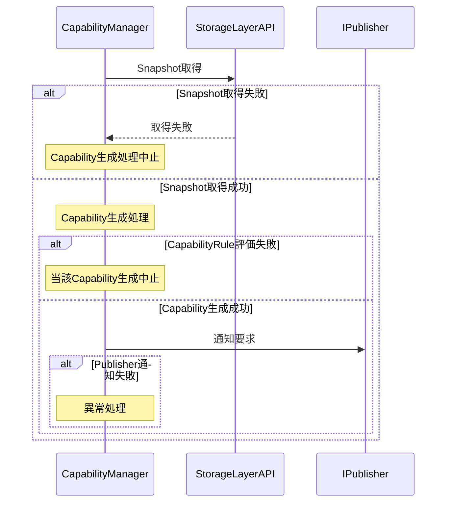
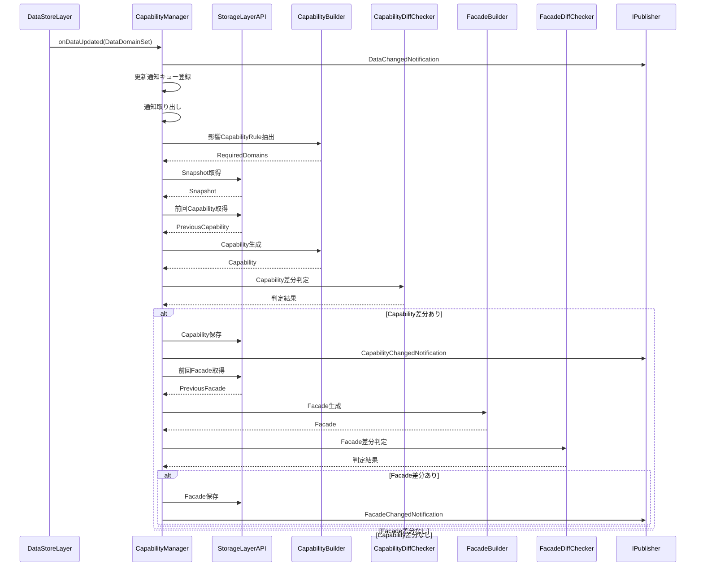
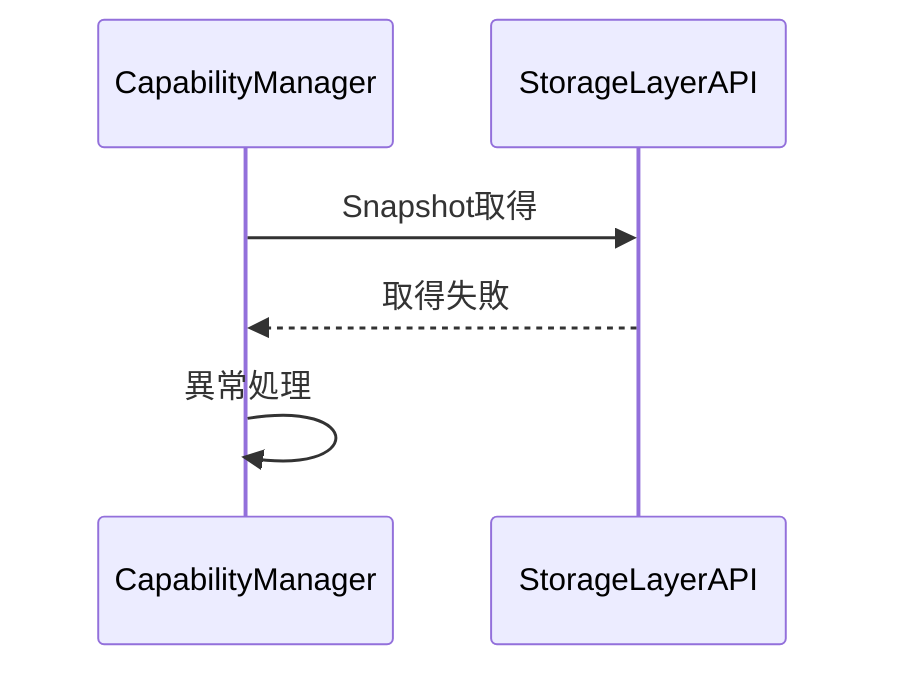
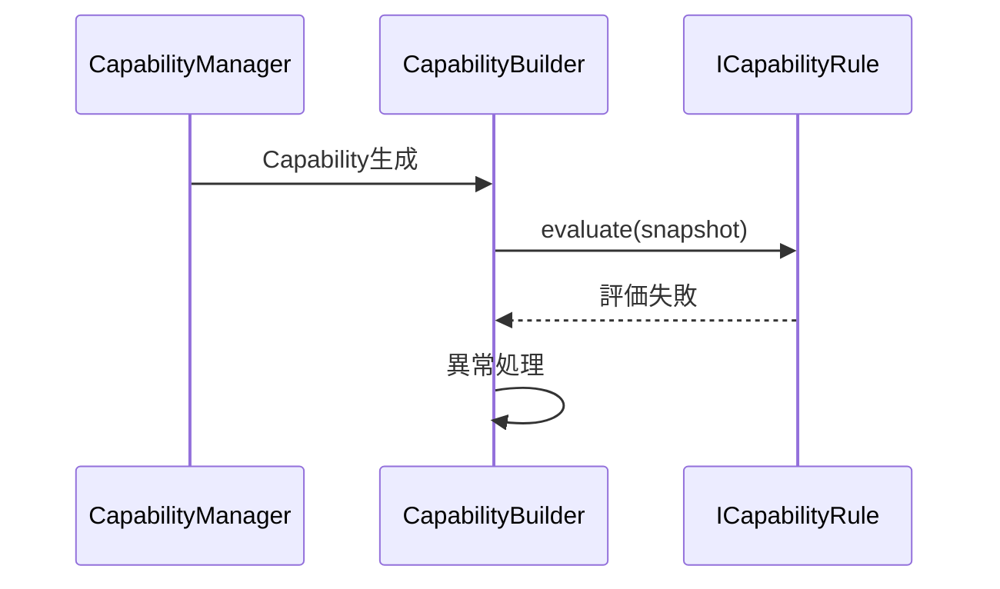
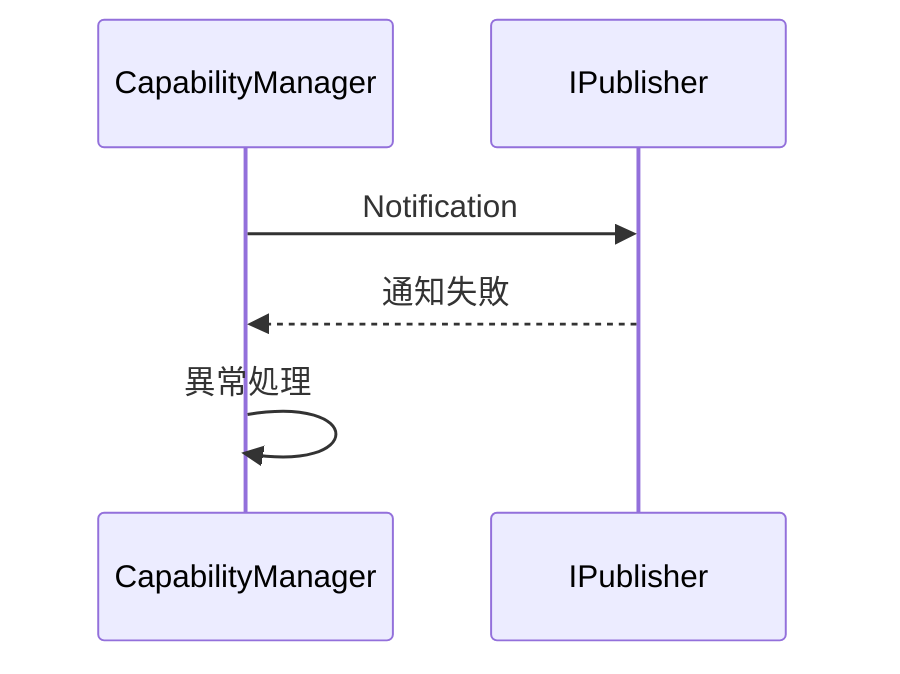

# Capability Layer モジュール仕様書

## 1. 表紙

### CONFIDENTIAL

| 項目 | 内容 |
|---|---|
| ドキュメント名 | Capability Layer モジュール仕様書 |
| バージョン | - |
| レイヤ | Capability Layer |
| 対象機種 | T.B.D |
| 作成 | ブラザー工業 システムプロセス開発部 開発3G |

## 2. 更新履歴

| バージョン | 更新日 | 更新者 | 内容 |
|---|---|---|---|
| 0.01 | T.B.D | 波多野 匡寛 | Capability Layer仕様設計書を基に初版作成 |

## 3. 目次

1. 表紙
2. 更新履歴
3. 目次
4. 概要
5. 用語集
6. 関連ドキュメント
7. 制約事項
8. 他のモジュールとの接続
9. 機能概要
10. IF仕様
11. コンフィグレーション仕様
12. 呼び出しシーケンス
13. 組み込み手順
14. 排他・整合性設計

## 4. 概要

### 4.1 本ドキュメントの目的

本ドキュメントは、Capability Layerの仕様を規定する。

Capability Layerが担う状態導出処理、Capability生成、Facade生成、差分検知、通知生成、DataStore LayerおよびPublisher Layerとの接続関係、提供するIF、およびモジュール構成を定義する。

### 4.2 本ドキュメントの読み手

- Capability Layerを利用する上位モジュール設計者
- DataStore Layer設計者
- Publisher Layer設計者
- CapabilityRule設計者
- FacadeRule設計者
- システム統合担当者

### 4.3 本モジュールの位置づけ

Capability LayerはDataStore Layerから更新通知を受信し、Storage Layerを介してSnapshotおよび過去状態を取得する。生成したCapabilityおよびFacadeはStorage Layerへ保存される。また状態変化はPublisher Layerへ通知される。

本Layerは以下を実現する。

- 状態解釈の一元化
- 判定ロジックの分散防止
- UIへの一貫した状態提供
- 制御処理への一貫した状態提供
- 外部連携への一貫した状態提供
- 状態変化の効率的な通知

## 5. 用語集

### 5.1 設計原則に関する用語

| 用語 | 定義 |
|---|---|
| Data | Mediator外部から入力される情報 |
| State | Dataを解釈した結果 |
| Capability | Dataから導出された意味状態 |
| Facade | Capabilityから導出される上位集約状態 |
| Snapshot | ある時点のStorage状態を読み取り専用で表現したデータ |

### 5.2 モジュール固有用語

| 用語 | 定義 |
|---|---|
| CapabilityCategory | Capability種別識別子 |
| CapabilityCategorySet | CapabilityCategoryの複数指定版 |
| FacadeCategory | Facade種別識別子 |
| FacadeCategorySet | FacadeCategoryの複数指定版 |
| CapabilityRule | Capability算出ルール |
| FacadeRule | Facade生成ルール |
| requiredDomains | Capability生成に必要なDataDomain集合。DataDomainSet型 |
| CapabilityManager | Capability Layer全体を制御する中心コンポーネント |
| CapabilityBuilder | Capability生成コンポーネント |
| CapabilityDiffChecker | Capability差分判定コンポーネント |
| PriorityChecker | Publish優先度判定コンポーネント |
| FacadeBuilder | Facade生成コンポーネント |
| FacadeDiffChecker | Facade差分判定コンポーネント |

### 5.3 データモデルに関する用語

| 用語 | 定義 |
|---|---|
| DataItem | DataStore Layer内部で利用する標準データモデル |
| DataId | データ種別識別子 |
| Context | データに付与される補足情報 |
| DataDomain | Storage内の保存領域を示すドメイン |
| DataDomainSet | DataDomainの複数指定版 |
| Storage | システム内のデータを集約管理するコンポーネント |

### 5.4 通知モデルに関する用語

| 用語 | 定義 |
|---|---|
| DataChangedNotification | 更新されたDataDomain情報を保持する通知 |
| CapabilityChangedNotification | 変更されたCapabilityCategory情報を保持する通知 |
| FacadeChangedNotification | 変更されたFacadeCategory情報を保持する通知 |

### 5.5 上位・下位レイヤに関する用語

| 用語 | 定義 |
|---|---|
| DataStore Layer | 事実データを保持し、Snapshotを提供するLayer |
| Storage Layer | Snapshot・Capability・Facade保持を担うLayer |
| Publisher Layer | 各種変更通知を配信するLayer |
| StorageLayerAPI | Snapshot、CapabilityおよびFacadeの取得・保存を行うIF |
| IPublisher | 通知をPublisher Layerへ送信するIF |

### 5.6 モジュール構成区分に関する用語

| 用語 | 定義 |
|---|---|
| 本モジュール本体 | CapabilityManager、CapabilityBuilder、Rule群、DiffChecker群で構成されるCapability Layer本体 |

## 6. 関連ドキュメント

| # | 文書名 | 版 | 備考 |
|---|---|---|---|
| 1 | CommonDataModel 仕様書 | T.B.D | DataItem、DataId、Context定義元 |
| 2 | DataStore Layer 仕様書 | T.B.D | Data更新通知元 |
| 3 | Storage Layer 仕様書 | T.B.D | StorageLayerAPI提供元 |
| 4 | Publisher Layer 仕様書 | T.B.D | 通知送信先 |rebyu- ji
| 5 | Capability Layer 仕様設計書 | 現版 | 本仕様書の正本 |

# 7. 制約事項

## 7.1 機能制約

- Capability Layer は事実データの保持を行わない。
- Capability Layer は DataStore Layer に保存された事実データを解釈し、Capability を生成する。
- Capability Layer は Data 正規化を行わない。
- Capability Layer は Storage への Data 保存処理を行わない。
- Capability Layer は Snapshot の生成を行わない。
- Capability Layer は Snapshot を保持しない。
- Capability Layer は Capability の保持を行わない。
- Capability Layer は Facade の保持を行わない。
- Capability Layer は通知配信処理を行わない。通知配信は Publisher Layer の責務とする。
- Capability Layer は Subscriber への直接通知を行わない。
- Capability Layer は更新通知を受信した際、全 Capability の再生成を行わない。
- 更新された DataDomain を requiredDomains に含む CapabilityRule のみ再評価する。
- Capability 間の依存関係は持たないものとする。各 Capability は独立して算出される。
- Facade は FactData および Snapshot を直接参照しない。
- Facade は Storage Layer に保存された Capability を入力として生成する。
- 差分が存在しない Capability は再保存しない。
- 差分が存在しない Facade は再保存しない。
- Capability Layer は Capability および Facade そのものを Publisher Layer へ通知しない。状態データの取得先は Storage Layer とする。

## 7.2 前提条件

- DataStore Layer が更新 DataDomain を含む更新通知を提供すること。
- Storage Layer が StorageLayerAPI を提供すること。
- Storage Layer が要求された DataDomain 集合に対して整合性の取れた Snapshot を返却すること。
- Storage Layer が Capability および Facade の取得・保存機能を提供すること。
- Publisher Layer が IPublisher を提供すること。
- CapabilityRule ごとに requiredDomains が定義されていること。
- CapabilityRule が Snapshot を入力として Capability を導出可能であること。
- FacadeRule が Capability を入力として Facade を導出可能であること。
- Publisher Layer 側が通知の配送保証および再送制御を担うこと。

## 7.3 呼び出し制約

- Data 更新通知は FIFO キューへ格納する。
- CapabilityManager は単一コンシューマとして更新通知を逐次処理する。
- 更新通知は受信順に処理する。
- Capability Layer は Storage を直接ロックしない。
- Capability Layer は StorageLayerAPI を介してのみ Snapshot を取得する。
- CapabilityBuilder は CapabilityRule の選定および実行を行うが、差分判定は行わない。
- CapabilityDiffChecker は差分判定のみを行い、Capability 生成は行わない。
- PriorityChecker は優先度判定のみを行い、通知送信は行わない。
- FacadeBuilder は Capability を入力として Facade を生成する。
- StorageLayerAPI を介した Snapshot 取得失敗時は Capability 生成処理を中止する。
- CapabilityRule 評価失敗時は当該 Capability の生成のみ中止し、他 Capability の生成処理は継続する。
- Publisher 通知失敗時の再送制御は行わない。
- 更新通知キュー長は最大通知発生レートと最大 Capability 処理時間から算出する。
# 8. 他のモジュールとの接続

Capability Layer は DataStore Layer から更新通知を受信し、Storage Layer を介して状態データを取得する。取得した状態データを基に Capability および Facade を生成し、変更通知を Publisher Layer へ送信する。

Capability Layer は Storage Layer の内部実装に依存せず、StorageLayerAPI を利用して状態データへアクセスする。

Capability Layer は Publisher Layer の内部配送処理に依存せず、IPublisher を介して通知要求のみを行う。

## 8.1 想定される接続先

| # | 分類 | 接続先 | 接続方式 | 接続要否 | 用途 |
|---|---|---|---|---|---|
| 1 | 入力元 | DataStore Layer | 更新通知 | 必須 | Data更新契機の受信 |
| 2 | 共通 | Storage Layer | StorageLayerAPI | 必須 | Snapshot取得 |
| 3 | 共通 | Storage Layer | StorageLayerAPI | 必須 | Capability取得・保存 |
| 4 | 共通 | Storage Layer | StorageLayerAPI | 必須 | Facade取得・保存 |
| 5 | 後続 | Publisher Layer | IPublisher | 必須 | DataChangedNotification通知 |
| 6 | 後続 | Publisher Layer | IPublisher | 必須 | CapabilityChangedNotification通知 |
| 7 | 後続 | Publisher Layer | IPublisher | 必須 | FacadeChangedNotification通知 |

## 8.2 接続方針

- Capability Layer は DataStore Layer の提供する更新通知を契機として処理を開始する。
- Capability Layer は DataStore Layer の内部構造へ依存しない。
- Capability Layer は Storage Layer の内部実装へ依存しない。
- Capability Layer は StorageLayerAPI のみを利用する。
- Capability Layer は Storage を直接参照しない。
- Capability Layer は Storage を直接ロックしない。
- Capability Layer は同一時点の整合性が保証された Snapshot を利用する。
- Capability Layer は Publisher Layer の内部配送処理へ依存しない。
- Capability Layer は IPublisher のみを利用する。
- Capability Layer は Subscriber へ直接 Publish しない。

# 9. 機能概要

## 9.1 システム構造における位置づけ

Capability Layer は DataStore Layer に保持された事実データを解釈し、意味のある状態である Capability を生成する Layer である。さらに Capability を入力として Facade を生成し、上位層および外部機能へ一貫した状態を提供する。

Capability Layer は DataStore Layer からの更新通知を契機として動作し、Storage Layer から取得した Snapshot および過去状態を利用して状態を算出する。状態変化が発生した場合は Publisher Layer へ変更通知を送信する。

### 図1. Capability Layer主要クラス構成

## 9.2 内部処理モデル

Capability Layer は DataStore Layer から更新通知を受信すると、更新された DataDomain を requiredDomains に含む CapabilityRule のみ再評価する。全 Capability の再生成は行わない。

### 9.2.1 正常系処理 Capability Layer処理シーケンス

1. DataStore Layer から更新通知を受信する。
2. DataChangedNotification を Publisher Layer へ転送する。
3. 更新通知キューへ登録する。
4. FIFO順で更新通知を処理する。
5. 影響を受ける CapabilityRule を抽出する。
6. 必要な Snapshot 範囲を決定する。
7. Storage Layer から Snapshot を取得する。
8. Storage Layer から前回 Capability を取得する。
9. CapabilityBuilder により Capability を生成する。
10. CapabilityDiffChecker により差分判定を行う。
11. 差分が存在する場合のみ Capability を保存する。
12. CapabilityChangedNotification を発行する。
13. Storage Layer から前回 Facade を取得する。
14. FacadeBuilder により Facade を生成する。
15. FacadeDiffChecker により差分判定を行う。
16. 差分が存在する場合のみ Facade を保存する。
17. FacadeChangedNotification を発行する。

### 9.2.2 異常系処理モデル Capability Layer処理シーケンス

- Snapshot取得失敗時は Capability生成処理を中止する。
- CapabilityRule評価中にエラーが発生した場合は、当該Capabilityの生成を中止する
- Publisher通知失敗時は異常処理を行う。

## 9.3 責務

### 9.3.1 更新通知管理

- DataStore Layer から Data 更新通知を受信する。
- 更新された DataDomain 情報を Publisher Layer へ通知する。
- 更新通知キューを管理する。
- 更新通知を FIFO 順で処理する。

### 9.3.2 Capability生成

- 更新内容に応じて必要な Snapshot 取得範囲を決定する。
- Snapshot を利用して Capability を生成する。
- 同一 Snapshot に基づく一貫した Capability を生成する。
- Capability生成ロジックを集約する。

### 9.3.3 差分判定

- 前回 Capability との差分を判定する。
- 前回 Facade との差分を判定する。
- 差分が存在する場合のみ保存および通知を行う。

### 9.3.4 優先度判定

- Publish優先度を判定する。

### 9.3.5 Facade生成

- Capability を入力として Facade を生成する。
- Capability 変更を契機として Facade を評価する。

### 9.3.6 通知管理

- DataChangedNotification を通知する。
- CapabilityChangedNotification を通知する。
- FacadeChangedNotification を通知する。

## 9.4 非責務

- データ正規化
- Storageへのデータ保存
- Snapshot生成処理
- CapabilityのPublish
- Snapshot保持
- Capability保持
- Facade保持
- 通知配信処理
- Storageへの入力反映
- Storageの直接参照
- Storageの直接ロック
- Subscriberへの実配信処理
- 状態に応じた動作実行
# 10. IF仕様

## 10.1 概要

Capability Layer が提供する外部公開インターフェース、利用する外部インターフェース、および外部との間で受け渡される公開型を定義する。

Capability Layer は DataStore Layer から変更通知を受信し、Storage Layer が提供する StorageLayerAPI を利用して Snapshot、Capability および Facade を取得・保存する。また、Publisher Layer が提供する IPublisher を利用して通知を発行する。 

### 10.1.1 外部公開インターフェース一覧

| # | IF名 | 用途 |
|---|---|---|
| 1 | IStoreUpdateNotifier | DataStore Layerから変更DataDomainSet通知を受信する |

### 10.1.2 外部利用インターフェース一覧

| # | IF名 | 提供元 | 用途 |
|---|---|---|---|
| 1 | StorageLayerAPI | Storage Layer | Snapshot取得、Capability取得・保存、Facade取得・保存 |
| 2 | IPublisher | Publisher Layer | Notification発行 |

### 10.1.3 外部公開型一覧

| # | 型名 | カテゴリ | 用途 |
|---|---|---|---|
| 1 | DataChangedNotification | Notification | Data変更通知 |
| 2 | CapabilityChangedNotification | Notification | Capability変更通知 |
| 3 | FacadeChangedNotification | Notification | Facade変更通知 |

---

## 10.2 外部公開型

### 10.2.1 DataChangedNotification

| 項目 | 内容 |
|--------|--------|
| 種類 | Notification |
| メンバ | T.B.D. |
| 説明 | 更新されたDataDomain情報を通知するための通知データ |
| 用途 | Data変更通知 |

### 10.2.2 CapabilityChangedNotification

| 項目 | 内容 |
|--------|--------|
| 種類 | Notification |
| メンバ | T.B.D. |
| 説明 | Capability変更を通知するための通知データ |
| 用途 | Capability変更通知 |

### 10.2.3 FacadeChangedNotification

| 項目 | 内容 |
|--------|--------|
| 種類 | Notification |
| メンバ | T.B.D. |
| 説明 | Facade変更を通知するための通知データ |
| 用途 | Facade変更通知 |

---

## 10.3 外部公開定数

T.B.D.

---

## 10.4 外部公開関数／メソッド

### 10.4.1 notifyUpdated

| 項目 | 内容 |
|--------|--------|
| IF | IStoreUpdateNotifier |
| メソッド名 | notifyUpdated |
| 入力 | DataDomainSet |
| 出力 | なし |
| 戻り値 | T.B.D. |
| 説明 | DataStore Layerから変更DataDomainSet通知を受信する |

# 11. コンフィグレーション仕様

## 11.1 設計方針

本モジュールのコンフィグレーションは、Capability生成ルールおよびFacade生成ルールを本モジュールへ提供する。

Capability Layerは個々の状態判定ロジックをCapabilityRuleへ分離し、Capability生成を構成情報によって拡張可能とする。 

---

## 11.2 コンフィグレーション構造の全体像

コンフィグレーションは以下の要素で構成される。

- CapabilityRule管理テーブル
- FacadeRule管理テーブル
- CapabilityCategory定義
- FacadeCategory定義
- CapabilityRuleのrequiredDomains定義
- FacadeRuleのrequiredCapabilityCategories定義

注記:

- 具体的なConfig型名、所有者、配置ファイル形式はT.B.D.とする。
- 本章では構成対象を規定する。 

---

## 11.3 CapabilityRule管理テーブル

CapabilityRuleはCapability生成に必要な設定情報を保持する。 

### CapabilityRule構成例

| 項目 | 内容 |
|--------|--------|
| Rule名 | T.B.D. |
| CapabilityCategory | Capability種別識別子 |
| requiredDomains | DataDomainSet |

### 設定方針

- CapabilityRuleはrequiredDomainsを定義する。
- requiredDomainsはCapability生成に必要なDataDomain集合を示す。
- CapabilityCategoryは生成対象Capabilityを識別するために利用する。 

---

## 11.4 FacadeRule管理テーブル

FacadeRuleはFacade生成に必要な設定情報を保持する。 

### FacadeRule構成例

| 項目 | 内容 |
|--------|--------|
| Rule名 | T.B.D. |
| FacadeCategory | Facade種別識別子 |
| requiredCapabilityCategories | CapabilityCategorySet |

### 設定方針

- FacadeRuleは依存するCapabilityCategoryを定義可能とする。
- FacadeCategoryは生成対象Facadeを識別するために利用する。 

---

## 11.5 PriorityChecker設定

T.B.D.

CapabilityPriorityは以下の値を持つ。 

- Low
- Normal
- High
- Critical

---

## 11.6 拡張方針

### Capability拡張

新たなCapabilityを追加する場合は、
CapabilityCategoryおよび対応するCapabilityRuleを追加する。

### Facade拡張

新たなFacadeを追加する場合は、
FacadeCategoryおよび対応するFacadeRuleを追加する。

---

## 11.7 初期化時の整合性検査

T.B.D.

# 12. 呼び出しシーケンス

本章では、Capability Layerが実行する代表的な呼び出しシーケンスを示す。

Capability LayerはDataStore Layerからの更新通知を契機としてCapabilityおよびFacadeを生成し、変更が発生した場合のみPublisher Layerへ通知する。

---

## 12.1 Data更新通知受信（正常系）

DataStore Layerから変更DataDomainSet通知を受信した場合の基本シーケンスを示す。

Capability差分が存在する場合のみCapabilityChangedNotificationを通知する。

Facade差分が存在する場合のみFacadeChangedNotificationを通知する。

図上では省略しているが、通知の際にはPriorityCheckerによる優先度判定を行い、情報として同梱すること。

---

## 12.2 Snapshot取得失敗

Snapshot取得失敗時のシーケンスを示す。

Snapshot取得失敗時はCapability生成を中止し、ログを出力する。

---

## 12.3 CapabilityRule評価失敗

CapabilityRule評価中にエラーが発生した場合のシーケンスを示す。

CapabilityRule評価中にエラーが発生した場合は当該Capabilityの生成のみ中止する。

他Capabilityの生成処理および通知処理は継続する。

発生したエラーはログへ出力する。

---

## 12.4 Publisher通知失敗

Publisher通知失敗時のシーケンスを示す。

# 13. 組み込み手順

## 13.1 ファイル構造

### 13.1.1 本モジュール構成

Capability Layerは以下のコンポーネントにより構成される。

#### 本モジュール本体

- CapabilityManager
- CapabilityBuilder
- CapabilityDiffChecker
- PriorityChecker
- FacadeBuilder
- FacadeDiffChecker
- ICapabilityRule
- IFacadeRule
- CapabilityRule群
- FacadeRule群

#### 外部依存IF

- StorageLayerAPI
- IPublisher

Capability LayerはStorageを直接参照せず、StorageLayerAPIを介して状態データへアクセスする。

Capability LayerはSubscriberへ直接通知せず、IPublisherを介して通知要求を行う。

---

## 13.2 接続手順

### 13.2.1 接続構成

Capability Layerは以下のモジュールと接続する。

| 接続先 | 接続方式 | 用途 |
|----------|----------|----------|
| DataStore Layer | 更新通知 | Data更新契機の受信 |
| Storage Layer | StorageLayerAPI | Snapshot取得 |
| Storage Layer | StorageLayerAPI | Capability取得・保存 |
| Storage Layer | StorageLayerAPI | Facade取得・保存 |
| Publisher Layer | IPublisher | DataChangedNotification通知 |
| Publisher Layer | IPublisher | CapabilityChangedNotification通知 |
| Publisher Layer | IPublisher | FacadeChangedNotification通知 |

### 13.2.2 組み込み条件

Capability Layerを利用するためには以下を満たすこと。

- DataStore Layerが更新通知を提供していること。
- Storage LayerがStorageLayerAPIを提供していること。
- Storage Layerが整合性の取れたSnapshotを返却できること。
- Storage LayerがCapabilityおよびFacadeの取得・保存機能を提供していること。
- Publisher LayerがIPublisherを提供していること。
- CapabilityRuleごとにrequiredDomainsが定義されていること。
- CapabilityRuleがSnapshotからCapabilityを導出可能であること。
- FacadeRuleがCapabilityからFacadeを導出可能であること。

### 13.2.3 組み込み手順

Capability Layerは静的依存関係を前提として構成される。組み込み時には以下を接続する。

- CapabilityRule群
- FacadeRule群
- StorageLayerAPI
- IPublisher
- DataStore Layer更新通知IF

接続順序は規定しない。各依存要素が利用可能な状態であることを前提とする。

---

## 13.3 呼び出し側の責務

### 13.3.1 DataStore Layer

- Data更新通知を送信すること。
- 更新DataDomain情報を通知へ含めること。

### 13.3.2 Storage Layer

- StorageLayerAPIを提供すること。
- Snapshot取得機能を提供すること。
- Capability取得・保存機能を提供すること。
- Facade取得・保存機能を提供すること。
- 要求されたDataDomain集合に対し整合性の取れたSnapshotを返却すること。

### 13.3.3 Publisher Layer

- IPublisherを提供すること。
- 通知の配送保証および再送制御を担うこと。

### 13.3.4 CapabilityRule設計者

- CapabilityRuleごとにrequiredDomainsを定義すること。
- CapabilityRuleがSnapshotからCapabilityを導出可能であること。

### 13.3.5 FacadeRule設計者

- FacadeRuleがCapabilityからFacadeを導出可能であること。
- requiredCapabilityCategoriesを定義可能であること。

## 14. 排他・整合性設計

本Layerは更新通知をFIFO順に逐次処理するため、本Layer固有の排他制御は行わない。