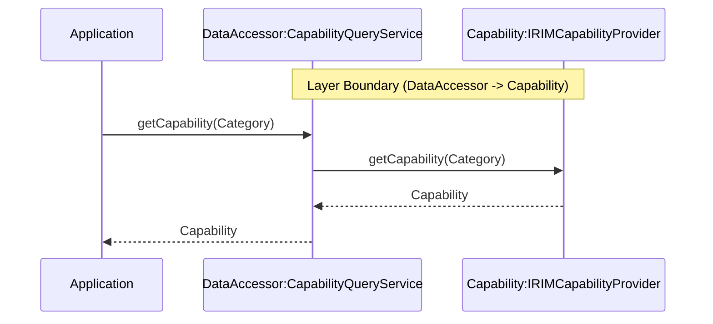
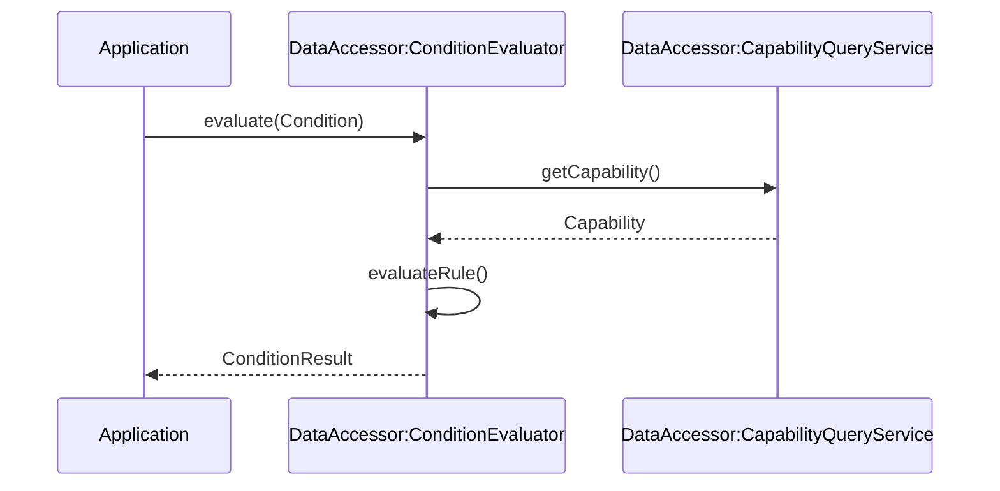
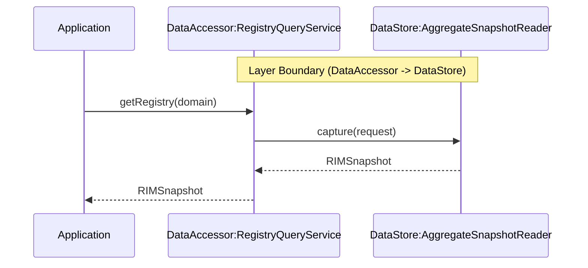

# DataAccessor Layer

## 1.Capability取得

### シーケンス概要
Applicationからの要求に応じて最新Capabilityを取得するシーケンス。

## 2.Condition評価
### シーケンス概要
Capabilityを利用して業務条件を評価し、判定結果を返却するシーケンス。

## 3.Registry取得

### シーケンス概要
DataStoreが保持するData情報をRIMSnapshotとして取得するシーケンス。

---