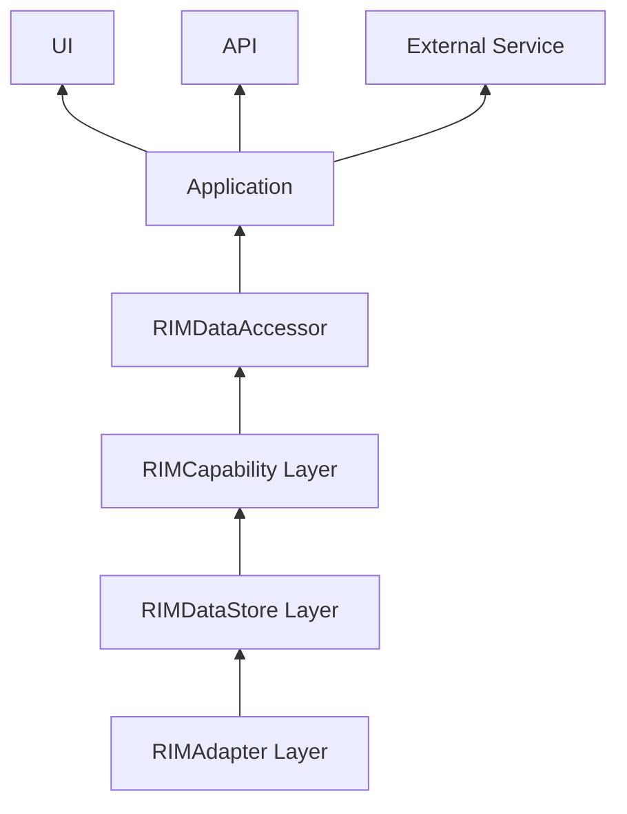
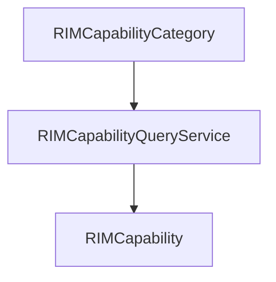
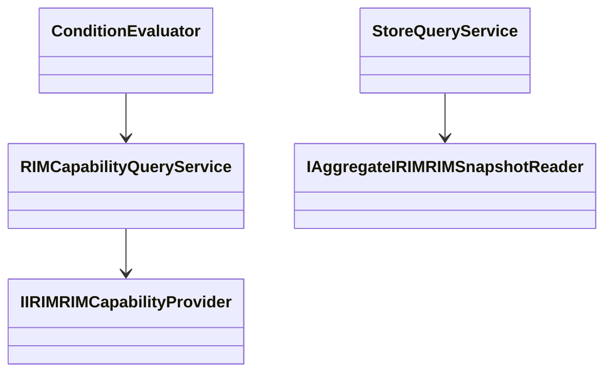
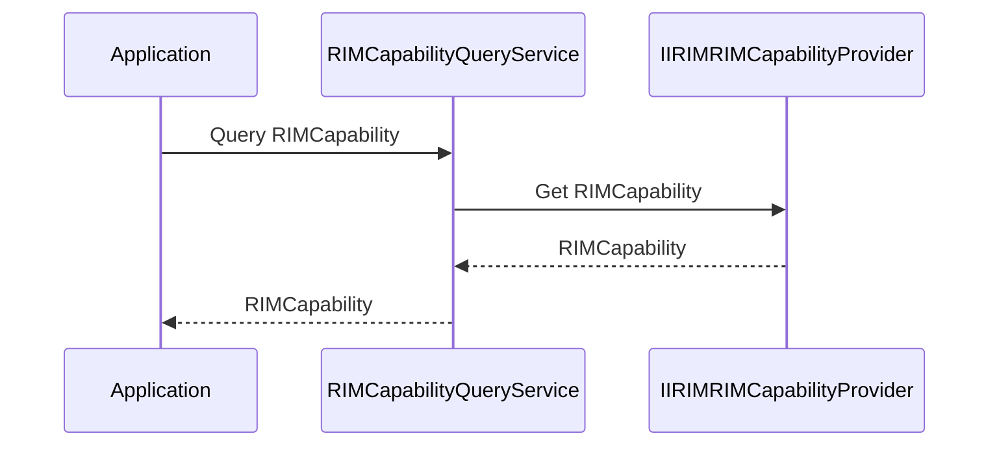
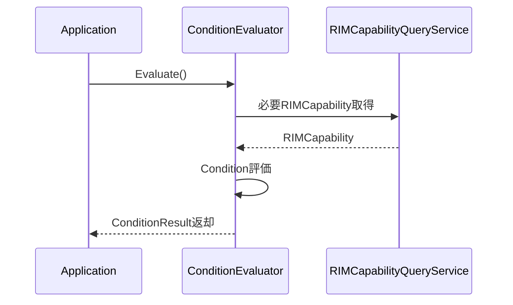
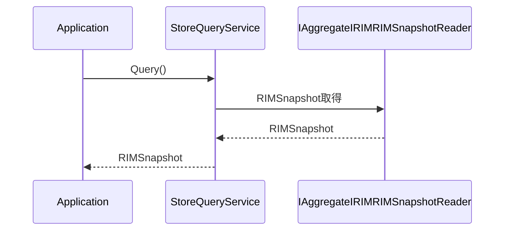

# RIMDataAccessor 基本設計書

## 1. 概要

### 1.1 目的

本設計書は、RIMDataAccessorの責務、構成および設計方針を定義することを目的とする。

RIMDataAccessorは、上位層からの問い合わせに対して以下の機能を提供する。

- RIMCapability取得
- Condition評価
- Store取得
  
本コンポーネントにより、上位層はRIMCapability LayerおよびRIMDataStore Layerの内部構造を意識することなく、必要な情報を取得できる。

---

### 1.2 対象範囲

本書で扱う範囲を以下とする。

- RIMCapability取得
- Condition評価
- Store取得
- RIMDataAccessorのクラス構成
- RIMDataAccessorが利用する外部IF

以下は対象外とする。

- RIMCapability生成
- RIMCapability更新
- RIMSnapshot生成
- Publisher通知

---

### 1.3 用語定義

| 用語 | 説明 |
|--------|--------|
| RIMCapability | RIMCapability Layerが生成する状態情報 |
| RIMCapabilityCategory | RIMCapabilityの分類識別子 |
| Condition | 複数RIMCapabilityを利用した問い合わせ |
| Store | RIMDataStore Layerが保持するデータストア |
| DataDomain | Store内の論理的な管理単位 |
| RIMSnapshot | Store状態を表現した読み取り専用データ |

---

# 2. システム構成上の位置づけ

## 2.1 システム構成

```text
RIMAdapter Layer
    ↓
RIMDataStore Layer
    ↓
RIMCapability Layer
    ↓
RIMDataAccessor
    ↓
Application
UI
API
External Service
```


---

## 2.2 責務

RIMDataAccessorは以下の責務を持つ。

- RIMCapability取得
- Condition評価
- Store取得
- 情報取得のためのIF提供


RIMDataAccessorは情報取得を担当する。


---

## 2.3 非責務

RIMDataAccessorは以下を行わない。

- RIMCapability生成
- RIMCapability更新
- RIMSnapshot生成
- 状態管理
- Publisher通知

RIMCapability生成責務はRIMCapability Layerが担う。
StoreおよびRIMSnapshot管理責務はRIMCapability Layerが担う。

---

# 3. 提供機能

## 3.1 RIMCapability取得

指定されたRIMCapabilityCategoryに対応するRIMCapabilityを取得する。

```text
RIMCapabilityCategory
    ↓
RIMCapabilityQueryService
    ↓
RIMCapability
```


取得対象はRIMCapability Layerが保持する最新RIMCapabilityとする。

問い合わせ時にRIMCapability再計算は行わない。

---

## 3.2 Condition評価

複数RIMCapabilityを利用して問い合わせ結果を返却する。

例

```text
CanPrint

CanStartJob

CanOperateMachine
```

Conditionおよび評価ルールの具体的構成については本設計では規定しない。

Conditionは将来的な追加・変更に対応可能な構造とする。

---

## 3.3 Store取得

指定されたDataDomainに対応するデータを取得する。

```text
DataDomain
    ↓
StoreQueryService
    ↓
RIMSnapshot
```

取得にはCapability Layerが提供するRIMSnapshot取得IFを利用する。

---

# 4. 入出力設計

## 4.1 RIMCapability取得

入力

```cpp
RIMCapabilityCategory
```

出力

```cpp
RIMCapability
```

---

## 4.2 Condition評価

入力

```cpp
ConditionId
```

出力

```cpp
ConditionResult
```

### ConditionResult

```cpp
enum class ConditionResult
{
    Success,
    FailureReason1,
    FailureReason2,
    FailureReason3
};
```

Successの場合は条件成立とみなす。

それ以外の値は条件不成立理由を表す。

具体的な値はConditionごとに定義する。

---

## 4.3 Store取得

入力

```cpp
DataDomain
```

出力

```cpp
RIMSnapshot
```
---

# 5. コンポーネント構成

RIMDataAccessorは以下のコンポーネントで構成する。

- RIMCapabilityQueryService
- ConditionEvaluator
- StoreQueryService
---

## 5.1 クラス構成図



---

# 6. クラス設計

## 6.1 RIMCapabilityQueryService

### 責務

RIMCapability取得を行う。

### 主な責務

- RIMCapabilityCategoryからRIMCapability取得
- RIMCapability Layerからの情報取得

### 非責務

- RIMCapability生成
- RIMCapability更新
- Condition評価
- Store取得

### 提供IF

```cpp
RIMCapability getRIMCapability(
    RIMCapabilityCategory category);
```

---

## 6.2 ConditionEvaluator

### 責務

RIMCapabilityを利用したCondition評価を行う。

### 主な責務

- Condition評価
- 必要RIMCapability取得
- 評価結果返却

### 非責務

- RIMCapability生成
- Store取得
- RIMSnapshot取得

### 提供IF

```cpp
ConditionResult evaluate(
    ConditionId condition);
```

### 評価方針

ConditionEvaluatorはRIMCapabilityQueryServiceを利用して必要なRIMCapabilityを取得する。

Conditionおよび評価ルールの追加方法については詳細設計で定義する。

---

## 6.3 StoreQueryService

### 責務

Store情報取得を行う。

### 主な責務

- DataDomain指定取得
- RIMSnapshot取得

### 非責務

- Store更新
- RIMSnapshot生成
- RIMCapability生成

### 提供IF

```cpp
RIMSnapshot getStore(
    DataDomain domain);
```

---
# 7. 外部依存IF

## 7.1 IRIMCapabilityProvider

RIMCapability Layerが提供するRIMCapability取得IFである。

RIMCapabilityQueryServiceが利用する。

### 提供IF

```cpp
RIMCapability getRIMCapability(
    RIMCapabilityCategory category);
```

取得対象はRIMCapabilityManagerが保持する最新RIMCapabilityとする。

---

## 7.2 IAggregateIRIMSnapshotReader

RIMCapability Layerが提供するRIMSnapshot取得IFである。

StoreQueryServiceが利用する。

### 提供IF

```cpp
RIMSnapshot capture(
    RIMSnapshotRequest request);
```

詳細はRIMCapability Layer設計書を参照する。
---

# 8. シーケンス設計

## 8.1 RIMCapability取得

```text
Application
    ↓
RIMCapabilityQueryService
    ↓
IIRIMRIMCapabilityProvider
    ↓
RIMCapability取得
    ↓
Application
```


---

## 8.2 Condition評価

```text
Application
    ↓
ConditionEvaluator
    ↓
RIMCapabilityQueryService
    ↓
必要RIMCapability取得
    ↓
Condition評価
    ↓
ConditionResult返却
```


---

## 8.3 Store取得

```text
Application
    ↓
StoreQueryService
    ↓
IAggregateIRIMRIMSnapshotReader
    ↓
RIMSnapshot取得
    ↓
Application
```

---

# 9. 異常処理設計

## 9.1 RIMCapability取得失敗

指定されたRIMCapabilityCategoryが存在しない場合はエラーを返却する。

ログ出力方法は詳細設計で定義する。

---

## 9.2 Condition評価失敗

Condition評価中に必要情報が取得できない場合は評価失敗とする。

具体的な返却値は詳細設計で定義する。

---

## 9.3 RIMSnapshot取得失敗

RIMSnapshot取得に失敗した場合は取得エラーを返却する。

詳細なリトライ方針はRIMCapability Layerに委譲する。

---

# 10. 排他・性能設計

RIMDataAccessorは状態を保持しない。

排他制御はRIMCapability LayerおよびRIMCapability Layerに委譲する。

RIMCapability取得は保持済RIMCapabilityを参照するため、問い合わせ時のRIMCapability再評価は行わない。

Condition評価は必要なRIMCapabilityのみ取得して実施する。

---

# 11. テスト方針

以下の観点でテストを実施する。

- RIMCapability取得正常系
- RIMCapability取得異常系
- Condition評価正常系
- Condition評価異常系
- Store取得正常系
- Store取得異常系
- 外部IF異常時の動作確認

詳細なテストケースは詳細設計にて定義する。

---

# 12. 拡張方針

本コンポーネントは将来的なCondition追加に対応可能な構造とする。

新たなRIMCapabilityCategory追加時はRIMCapabilityQueryServiceを変更することなく取得できることを前提とする。

新たなDataDomain追加時はStoreQueryServiceを変更することなく取得できることを前提とする。