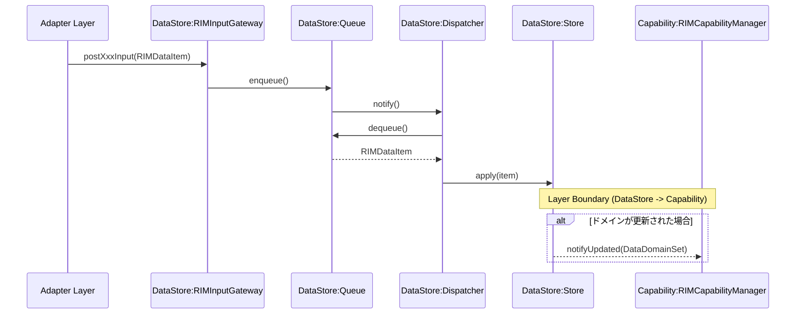
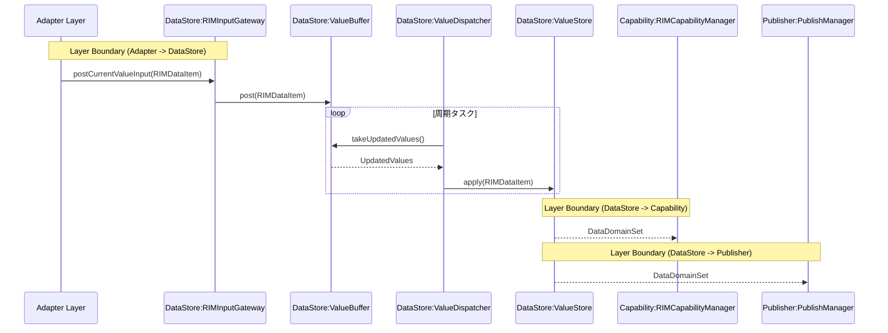
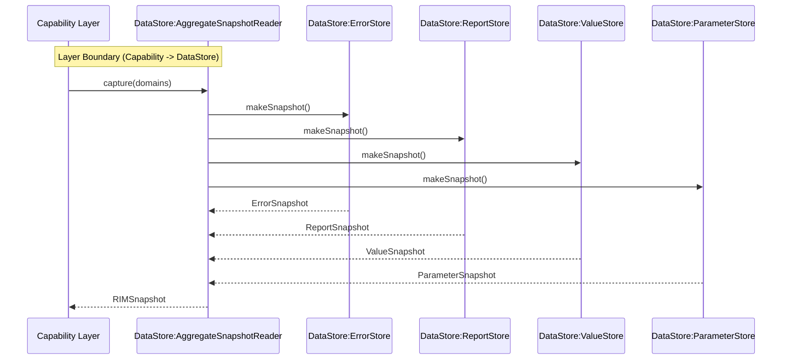

# DataStore Layer

## 1.Fault / Report / Parameter シーケンス

### シーケンス概要
Adapterから受け取ったDataをQueue経由でStoreへ反映し、更新DomainをCapabilityへ通知するシーケンス。

## 2.Value シーケンス

### シーケンス概要
最新ValueをBufferで管理し、Storeへ反映後にCapabilityへ更新通知するシーケンス。

## 3.Snapshot取得シーケンス

### シーケンス概要
CapabilityまたはDataAccessorからの要求に応じて、Store群から整合性のあるRIMSnapshotを生成して返却するシーケンス。

### 概要
CapabilityやDataAccessorからの要求に応じて、Store群の状態を整合性のあるRIMSnapshotとして提供するシーケンス。

---