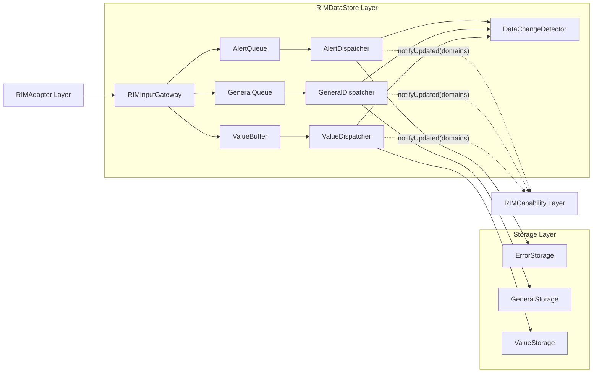
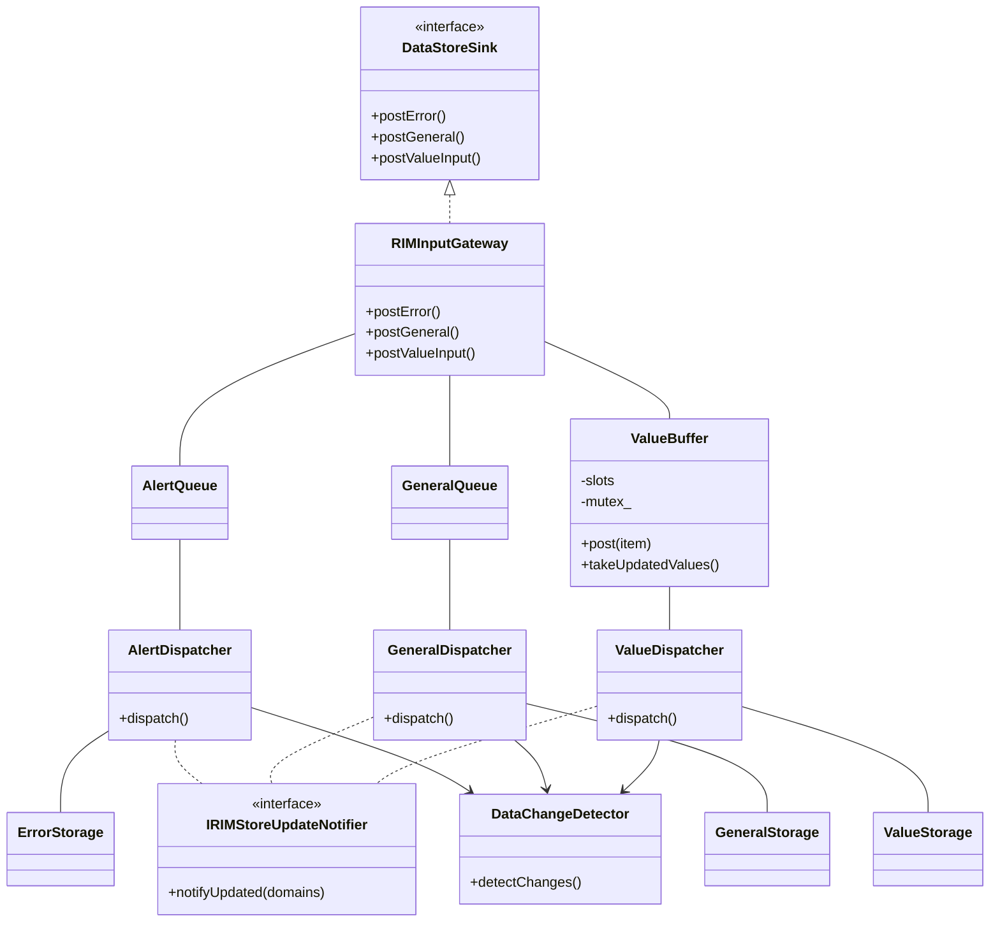
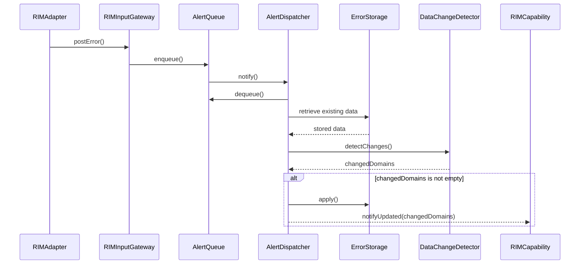
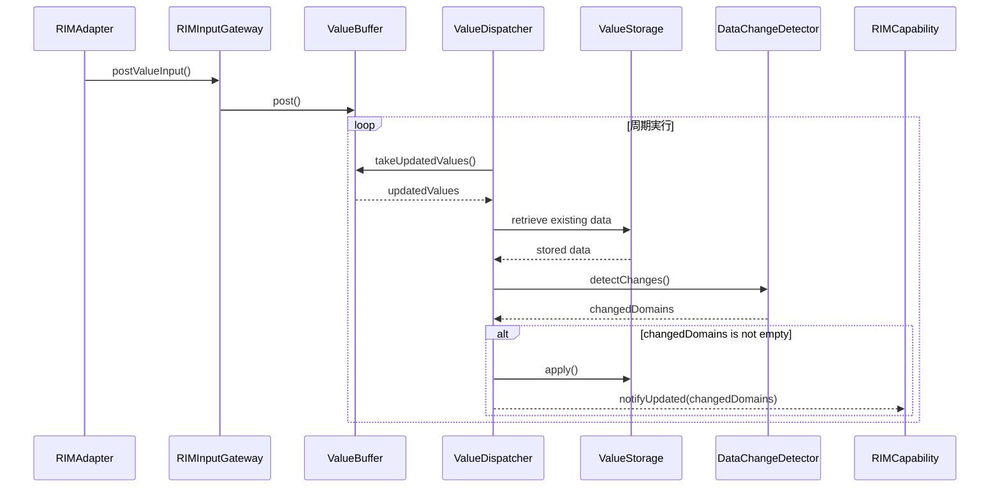

# DataStore Layer 仕様設計書

## 1. 概要

RIMDataStore Layerはシステム内のデータを集約して管理するLayerである。


本LayerはRIMAdapter Layerから入力されたDataを受理し、
Strage Layerへ反映する。


また、DataDomain更新通知をRIMCapability Layerへ提供する。

本Layerは入力データ反映、変更検知および更新通知責務を担う。

---

## 2. 用語
| 用語 | 説明 |
|--------|--------|
| RIMDataItem | CommonDataModelで定義される標準データモデル。RIMDataId、Value、RIMContextを持つ。 |
| State | Dataを解釈した結果。Dataから再計算可能なものである。RIMCapability Layerにて用いられる。 |
| Store | DataStore LayerでDataを保持・管理するコンポーネント |
| DataDomain | Store内の論理的なデータ管理単位。RIMDataDefinitionに定義されたDataDomainに基づき、RIMDataItemの格納先・更新通知単位・RIMSnapshot取得単位として利用する。 |
| DataDomainSet | DataDomainの複数指定版 |
| Error | 異常系の入力。Errorとして緊急性が高く、すぐにでも処理する必要がある入力。 |
| General | 汎用系の入力。異常系ではないが緊急性が高く即座に処理したい入力。 |
| Value | 最新値系の入力。ドライバから上がってくるセンサの値など最新値が欲しい入力。 |
| Parameter | 内部設定値。General系の一種であり、RIM内では静的領域への保存を意識しない。 |
| RIMSnapshot | ある時点のStore状態を読み取り専用で表現したデータ |

---

## 3. 背景

システム内では複数の機能が共通データを利用する。

例

```text
Temperature

Humidity

Safety

JobInformation

CurrentError
```

各機能が個別にデータを保持した場合、以下の問題が発生する。

- データの重複
- データ不整合
- 変更影響範囲の拡大
- 障害解析性の低下

また、RIMCapability Layerは複数のDataを組み合わせて状態判定を行うため、その組み合わせ単位で整合したデータ提供機構が必要となる。

---

## 4. 目的

RIMDataStore Layerの目的は以下である。

- Strageへのデータ反映
- 更新通知
- データ整合性の維持
- 状態再現性および障害解析性の向上

---

## 5. 責務

RIMDataStore Layerは以下の責務を持つ。

- データ受理
- 変更検知
- 変更DataDomainSet生成
- データ反映
- 更新通知


RIMDataStore LayerはStorage上の既存データと
入力データを比較し、変更有無を判定する。

変更が検知された場合、
変更されたDataDomainSetを生成し、
Storage更新および更新通知処理に利用する。

変更が検知されなかった場合、
Storage更新および更新通知は行わない。


RIMDataStore Layerは以下を責務としない。

- 状態判定
- ビジネスロジック
- 閾値判定
- アラーム判定
- 状態遷移制御
- 外部機器制御
- RIMCapability実行
- Store管理
- RIMSnapshot生成
- RIMSnapshot提供


これらはRIMCapability Layerまたは上位Layerの責務とする。

---

## 6. クラス構成


RIMDataStore Layerは以下のコンポーネントで構成される。

- RIMInputGateway

- AlertQueue
- GeneralQueue
- ValueBuffer

- AlertDispatcher
- GeneralDispatcher
- ValueDispatcher

- DataChangeDetector



クラス構造図


### 6.1 RIMInputGateway(中央入力ポート)

AdapterがRIMDataStore Layerへ報告する入口としてDataStoreSinkを提供する。  

- Adapterから3種のキューごとに設けられたpost()関数を経由してRIMDataItemを受け取る
- 呼ばれたpost関数の種類とRIMDataIdが意味するデータの分類があっていることを確認する。
  - 例：postErrorは異常系のIdしか受け付けない。
- Value型とRIMDataIdの定義があっていることを確認する。
  - 例：温度センサを示すIdの場合、温度センサとして格納することを決めているデータ型しかValueとして受け入れるべきではない。
- 問題なければQueue / Bufferへ入れる。
- RIMDataIdの妥当性確認およびValueType確認は、CommonDataModelで定義されるRIMDataDefinitionを参照して行う。
- RIMInputGatewayは複数Producerからの同時入力を受け付ける。
- 入力されたRIMDataItemは対応するQueueまたはBufferへ転送される。
- QueueおよびBufferは複数スレッドからの同時投入を許容する。


#### 6.1.1 属性  
特筆すべき点はない。

#### 6.1.2 提供IF  

返却値は入力検証結果を表す。

falseとなる条件例：
- RIMDataIdが未定義である
- RIMDataIdとValue型の組み合わせが不正である


- bool postError()
- bool postGeneral()
- bool postValueInput()
---

### 6.2 AlertQueue
```
using AlertQueue = IQueue<RIMDataItem>;
```
異常系のRIMDataItemを受理するQueueである。
 
- FIFOで保持し、高優先度で処理する。  
- 汎用系や最新値系のRIMDataItemを入れない。  
- 受理時にAlertDispatcherへ通知を行う。

Queue容量は、想定最大バースト入力および処理遅延許容時間を考慮して決定する。

- Errorを保持する有限長Queueである。
- Errorは取りこぼし不可データであるため、Queueへの投入に失敗した場合、対応するpostXXXInput()はfalseを返却する。


#### 6.2.1 属性  
一般的なQueueを踏襲する。

#### 6.2.2 提供IF  
一般的なQueueを踏襲する。

---

### 6.3 GeneralQueue
```
using GeneralQueue = IQueue<RIMDataItem>;
```

即座に通知を行いたいがエラーではない系統のRIMDataItemを受理するQueueである。  
  
- FIFOで保持する。   
- 異常系や最新値系のRIMDataItemを入れない。  
- 受理時にGeneralDispatcherへ通知を行う。


Queue容量は、想定最大バースト入力および処理遅延許容時間を考慮して決定する。

- Generalを保持する有限長Queueである。
- Generalは取りこぼし不可データであるため、Queue満杯時は投入失敗を返却する。

#### 6.3.1 属性  

一般的なQueueを踏襲する。

#### 6.3.2 提供IF  

一般的なQueueを踏襲する。


### 6.4 ValueBuffer

最新値系のRIMDataItemを受理するBufferである。

- Idごとに最新値を上書き保持する。  
- キューへの格納とキューからの取得の競合を内部で吸収する。  
- 異常系や汎用系のRIMDataItemを入れない。
- 受理時にValueDispatcherへ通知を行わない。


- Valueは最新値管理を目的とする。
- 同一RIMDataIdへの入力は上書き保持する。
- 中間更新値の保持は保証しない。


#### 6.4.1 属性
```疑似コード
struct slot {
    RIMDataItem data;
    bool dirty = false;
}
```
- ID分のRIMDataItemとdirtyフラグを収めるコンテナが必要である。

```
mutex mutex_;
```
- ミューテックスが必要である。


#### 6.4.2 提供IF
```
bool post(const RIMDataItem& item);
```
- バッファにデータを格納するためのポスト関数を提供する。
```
std:vector(RIMDataItem) takeUpdatedValues();
```
- dirtyフラグの立っているバッファからデータを取り出して、dirtyフラグを落とすIF関数を提供する。
- 周期内で同一IDが複数更新されていても取り出すのは最新の1件のみである。
- dirtyフラグの確認とクリアは同じロック内で行う必要がある。

---
### 6.5 DataChangeDetector
DataChangeDetectorは変更検知を担当する
コンポーネントである。

Storage上の既存データと入力データを比較し、
変更有無を判定する。

DataChangeDetectorは
変更の影響を受けるDataDomainを特定し、
変更されたDataDomainSetを生成して返却する。

変更が存在しない場合は
空のDataDomainSetを返却する。

DataChangeDetectorは比較処理のみを担当し、
Storage更新および更新通知は実施しない。

#### 6.5.1 属性
特筆すべき属性はない。

#### 6.5.2 提供IF
```
DataDomainSet detectChanges()
```

Storage上の既存データと
入力データを比較し、
変更されたDataDomainSetを返却する。

変更が存在しない場合は
空集合を返却する。

---


### 6.6 AlertDispatcher
AlertQueueからの通知を受けて起動される。

AlertDispatcherはAlertQueueからRIMDataItemを取得する。

取得したRIMDataItemに対応する既存データをStorageから取得し、
DataChangeDetectorを利用して変更検知を行う。

DataChangeDetectorは変更されたDataDomainSetを返却する。

変更DataDomainSetが空の場合、
入力データのStorage反映および更新通知は行わない。

変更DataDomainSetが非空の場合のみ、
入力データをStorageへ反映し、
変更DataDomainSetをCapability Layerへ通知する。

AlertDispatcherはビジネスロジックを持たず、
AlertQueue、DataChangeDetector、Storageおよび
Capability Layer間の処理を調停する責務を持つ。


#### 6.6.1 属性  
本クラスにおける属性記述は詳細処理に立ち入るためここでは記載しない。

#### 6.6.2 提供IF  
```
dispatch()
```

---

### 6.7 GeneralDispatcher

GeneralQueueからの通知を受けて起動される。

GeneralDispatcherはGeneralQueueからRIMDataItemを取得する。

取得したRIMDataItemに対応する既存データをStorageから取得し、
DataChangeDetectorを利用して変更検知を行う。

DataChangeDetectorは変更されたDataDomainSetを返却する。

変更DataDomainSetが空の場合、
入力データのStorage反映および更新通知は行わない。

変更DataDomainSetが非空の場合のみ、
入力データをStorageへ反映し、
変更DataDomainSetをCapability Layerへ通知する。

GeneralDispatcherはビジネスロジックを持たず、
GeneralQueue、DataChangeDetector、Storageおよび
Capability Layer間の処理を調停する責務を持つ。


#### 6.7.1 属性  
本クラスにおける属性記述は詳細処理に立ち入るためここでは記載しない。

#### 6.7.2 提供IF  
```
dispatch()
```

---

### 6.8 ValueDispatcher
ValueDispatcherは周期起動する。

ValueDispatcherはValueBufferから更新データを取得する。

取得した更新データに対応する既存データをStorageから取得し、
DataChangeDetectorを利用して変更検知を行う。

DataChangeDetectorは変更されたDataDomainSetを返却する。

変更DataDomainSetが空の場合、
入力データのStorage反映および更新通知は行わない。

変更DataDomainSetが非空の場合のみ、
入力データをStorageへ反映し、
変更DataDomainSetをCapability Layerへ通知する。

ValueDispatcherはビジネスロジックを持たず、
ValueBuffer、DataChangeDetector、Storageおよび
Capability Layer間の処理を調停する責務を持つ。
#### 6.8.1 属性  
本クラスにおける属性記述は詳細処理に立ち入るためここでは記載しない。

#### 6.8.2 提供IF  
```
dispatch()
```
---

## 7. 処理モデル
### 7.1 Error処理


#### 7.2 General処理


### 7.3 Value処理


### 7.4 整合性モデル

RIMDataStore Layerは以下を保証する。

・Storeの排他制御
・RIMSnapshotの読み取り専用性
・生成後不変性
・ドメインごとの整合性
・Store内部状態の隠蔽

RIMCapability LayerはStoreを直接参照しない。


更新通知は変更契機のみを通知し、
実際のデータ取得はStrage Layerを介して行う。

本方針はRIMCapability Layerおよび
RIMPublisher Layer双方に適用する。


---

## 8. 設計方針

### 8.1 DataとStateの分離

RIMDataStore LayerはDataのみを管理する。

StateはRIMCapability Layerが生成する。

```text
RIMDataStore Layer
    Data管理

RIMCapability Layer
    State管理
```

---

### 8.2 Single Source of Truth

システム内データの正本はStrageが管理する。

---


### 8.3 現在値管理と現在情報管理の分離

RIMDataStore Layerでは現在値管理と現在情報管理を分離する。
RIMSnapshotは以下Storeから生成される。

```text
ValueStorage
    現在値管理

GeneralStorage
    現在汎用情報管理(parameter含む)

AlertStorage
    現在異常情報管理
```
---

### 8.5 データ保持方針

RIMDataStore Layerはデータ特性に応じて保存先を決定する。

- ErrorおよびGeneralは現在状態管理を目的としてRAM上で管理する。
- ParameterはGeneral系の一種として扱い、不揮発領域への保存はRIMでは意識しない。
- Valueは状態値として扱い、RAM上で管理する。

保存媒体上の保存形式は媒体制約に応じて変換される場合がある。

ただし、RIMDataStore Layerが提供するDataおよびRIMSnapshotは、
共通データモデルに従った形式で取得できるものとする。


---

## 9. 制約事項

### 9.1 アーキテクチャ制約

- RIMDataStore LayerはState判定を行わない
- RIMSnapshotはRIMCapability Layerが取得する
- RIMCapability LayerはRIMSnapshot以外を参照しない
- RIMDataStore Layerは唯一のデータ正本である
- RIMAdapter LayerはRIMDataStore Layer内部状態へアクセスしない
- RIMDataStore Layerは変更DataDomainを利用してRIMCapability LayerおよびRIMPublisher Layerへ更新通知を行う。
- 更新通知にはDataDomainSetを利用する


---

### 9.2 機能制約

- RIMDataStore LayerはDataのみを管理する
- Stateは保持しない
- RIMSnapshotは読み取り専用とする
- StoreはStateを管理しない
- RIMAdapter LayerからのError、General、Value入力を許容する。
- QueueおよびBufferはスレッドセーフであることを前提とする。
- 変更が検知されない場合、Storage更新を行わない
- 変更が検知されない場合、Capability Layerへの通知を行わない

---

## 10. 非機能要件

- システム全体整合性を維持できること
- RIMCapability評価の再現性を保証できること
- 単一時点整合性を保証できること
- 責務分離を維持できること
- コンポーネント単位でテスト可能であること
- 障害解析可能であること
- 将来的なデータ種別追加に対応できること
- Valueの高頻度更新に対してRIMSnapshot生成頻度を抑制できること
- RIMDataStore LayerがRIMCapability Layerの処理時間に依存しないこと
- 更新通知による差分監視が行えること

