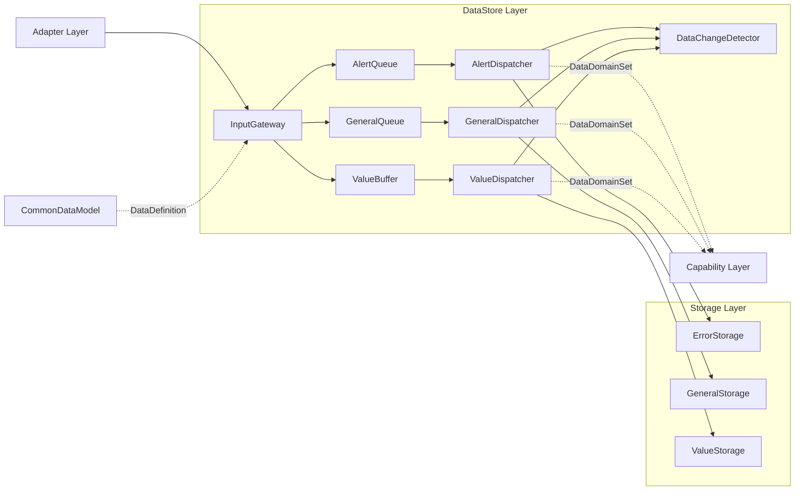
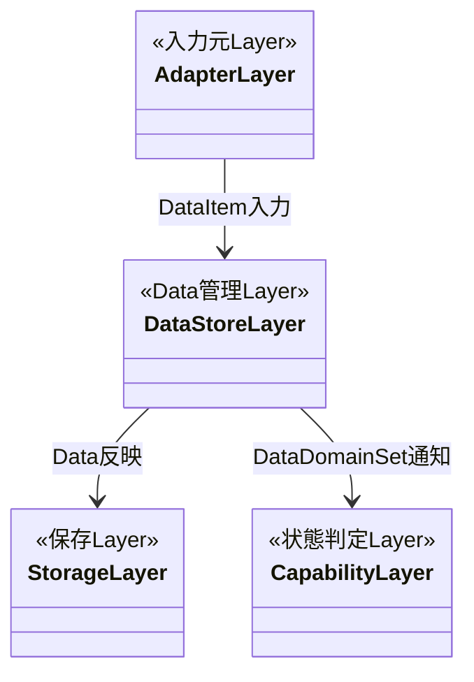
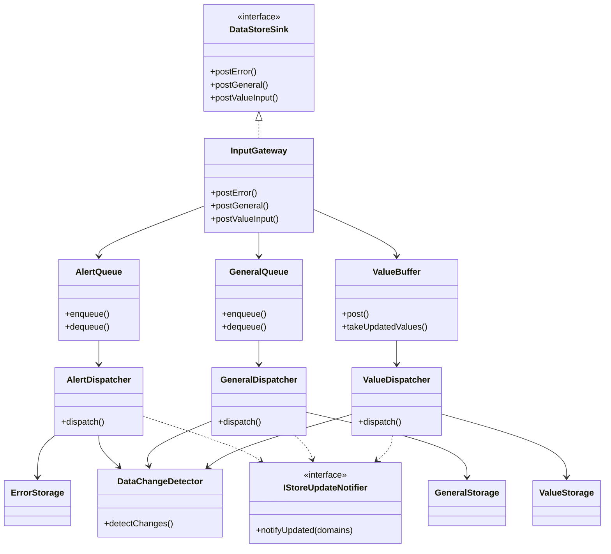
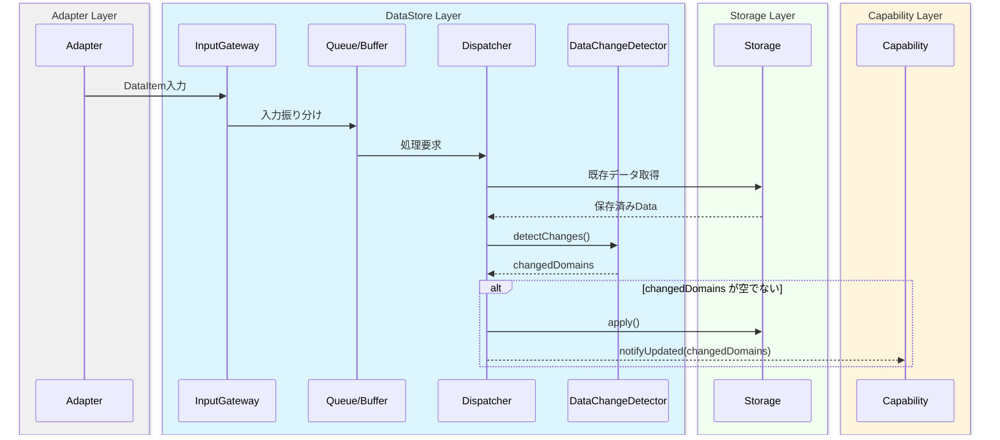
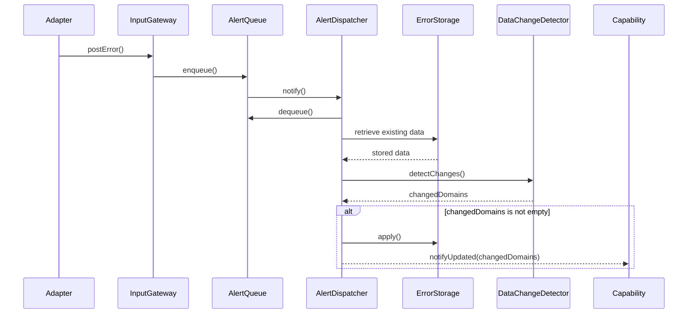
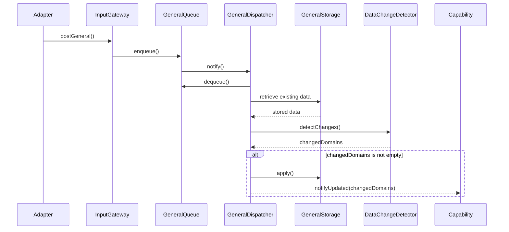
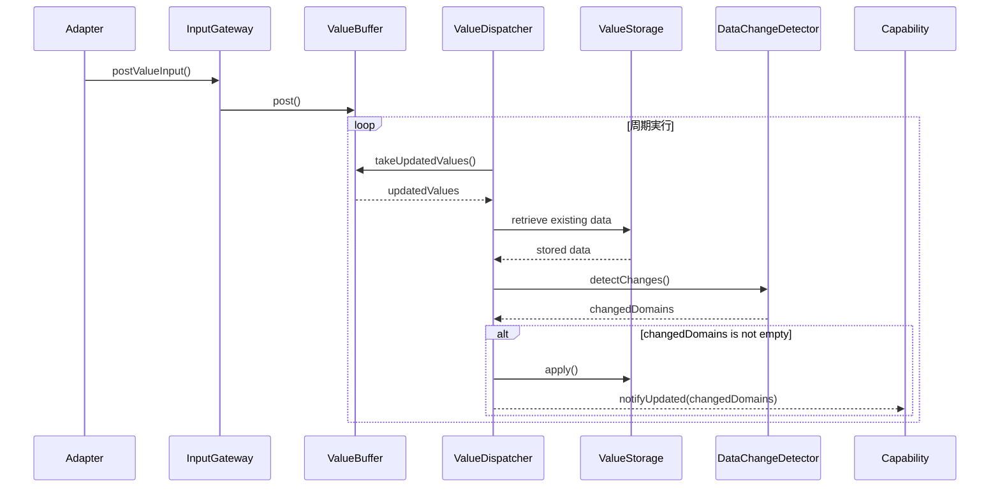

# 1. 表紙

## CONFIDENTIAL

| 項目 | 内容 |
|------|------|
| ドキュメント名 | DataStore Layer モジュール仕様書 |
| バージョン | - |
| レイヤ | DataStore Layer |
| 対象機種 | T.B.D |
| 作成 | ブラザー工業 システムプロセス開発部 開発3G |

# 2. 更新履歴

| バージョン | 更新日 | 更新者 | 内容 |
|------|------|------|------|
| 0.01 | T.B.D | 波多野匡寛 | 初版作成 |

# 3. 目次

1. 表紙
2. 更新履歴
3. 目次
4. 概要
5. 用語集
6. 関連ドキュメント
7. 制約事項
8. 他のモジュールとの接続
9. 機能概要
10. IF仕様
11. コンフィグレーション仕様
12. 呼び出しシーケンス
13. 組み込み手順
14. 排他・整合性設計

# 4. 概要

## 4.1 本ドキュメントの目的

本ドキュメントは、DataStore Layer の仕様を規定する。
DataStore Layer が受理するデータ、Storage Layer への反映方式、変更検知方式、更新通知方式、提供する IF、およびシステム内での責務を示す。

DataStore Layer の目的は以下である。

- Storage へのデータ反映
- 更新通知
- データ整合性の維持
- 状態再現性の向上
- 障害解析性の向上

## 4.2 本ドキュメントの読み手

- DataStore Layer の設計者
- Adapter Layer の設計者
- Capability Layer の設計者
- Storage Layer の設計者
- システム統合担当者
- CommonDataModel の設計者および保守担当者

## 4.3 本モジュールの位置づけ

DataStore Layer は、Adapter Layer と Capability Layer の間に位置するデータ管理 Layer である。

システム内では複数機能が共通データを利用する。各機能が個別にデータを保持した場合、データ重複、データ不整合、変更影響範囲増大、および障害解析性低下の問題が発生する。

Capability Layer は複数 Data を組み合わせて状態判定を行うため、整合したデータ提供機構が必要となる。

DataStore Layer はシステム共通のデータ正本管理層として配置され、入力データ反映、変更検知、変更 DataDomainSet 生成、および更新通知を担当する。

# 5. 用語集

## 5.1 制御階層に関する用語

| 用語 | 定義 |
|------|------|
| DataItem | CommonDataModelで定義される標準データモデル |
| State | Dataから導出される状態情報 |
| Storage | Storage Layerでデータを保持するコンポーネント |
| Snapshot | ある時点のStore状態を表す読み取り専用データ |

## 5.2 設計原則に関する用語

| 用語 | 定義 |
|------|------|
| DataとStateの分離 | DataStoreはDataのみ管理しStateは管理しない |
| Single Source of Truth | システム内データの正本をStorageが管理する設計方針 |
| DataDomain | 論理的なデータ管理単位 |

## 5.3 モジュール固有用語

| 用語 | 定義 |
|------|------|
| DataDomain | 格納先・更新通知単位・Snapshot取得単位 |
| DataDomainSet | 複数DataDomainの集合 |
| Error | 緊急性が高く即時処理が必要な異常入力 |
| General | 異常ではないが即時処理したい入力 |
| Value | 最新値管理を目的とした入力 |
| Parameter | General系として扱われる内部設定値 |
| InputGateway | Adapterからの入力を受理し、入力検証とQueue/Buffer振り分けを行う中央入力ポート |
| AlertQueue | Error系DataItemをFIFOで保持し、高優先度で処理するQueue |
| GeneralQueue | General系DataItemをFIFOで保持するQueue |
| ValueBuffer | DataIdごとに最新値を上書き保持するBuffer |
| AlertDispatcher | AlertQueueから取得したデータの変更検知を行い、変更時のみStorage更新と通知を実施するDispatcher |
| GeneralDispatcher | GeneralQueueから取得したデータの変更検知を行い、変更時のみStorage更新と通知を実施するDispatcher |
| ValueDispatcher | 周期起動しValueBufferの更新データを処理して変更時のみStorage更新と通知を実施するDispatcher |
| DataChangeDetector | Storage上の既存データとの差分比較を行い、変更DataDomainSetを生成するコンポーネント |
| ErrorStorage | Errorデータを保持するStorage |
| GeneralStorage | Generalデータを保持するStorage |
| ValueStorage | Valueデータを保持するStorage |

## 5.4 上位・下位レイヤに関する用語

| 用語 | 定義 |
|------|------|
| Adapter Layer | 本Layerへのデータ入力元 |
| Storage Layer | データ保持および永続化を担うLayer |
| Capability Layer | 更新通知を受け状態判定を実施するLayer |
| Publisher Layer | 更新通知を利用するLayer |
| CommonDataModel | システム共通データモデル |

## 5.5 モジュール構成区分に関する用語

| 用語 | 定義 |
|------|------|
| DataStoreSink | Adapter Layerへ提供する入力インターフェース |
| IStoreUpdateNotifier | Capability LayerへDataDomainSetを通知するインターフェース |
| Queue | ErrorおよびGeneral入力を保持する機構 |
| Buffer | Value入力を保持する機構 |
| Dispatcher | Queue/Bufferから取得した入力に対して変更検知・反映・通知を調停するコンポーネント |

# 6. 関連ドキュメント

| # | 文書名 | 版 | 備考 |
|---|---|---|---|
| 1 | CommonDataModel仕様書 | T.B.D | DataItem、DataDomain定義元 |
| 2 | Adapter Layer仕様書 | T.B.D | 入力元Layer仕様 |
| 3 | Capability Layer仕様書 | T.B.D | 更新通知利用先 |
| 4 | Storage Layer仕様書 | T.B.D | 保存先仕様 |
| 5 | Publisher Layer仕様書 | T.B.D | 更新通知利用先 |
| 6 | DataDefinition仕様書 | T.B.D | DataDomain定義元 |

# 7. 制約事項

## 7.1 機能制約

DataStore Layer は以下の機能制約を持つ。

- DataStore Layer は Data のみを管理する。
- State は管理しない。
- State 判定は行わない。
- ビジネスロジックを持たない。
- 閾値判定を行わない。
- アラーム判定を行わない。
- 状態遷移制御を行わない。
- 外部機器制御を行わない。
- Capability 実行を行わない。
- Storage 管理を行わない。
- Snapshot 生成を行わない。
- Snapshot 提供を行わない。
- Adapter Layer からの Error、General、Value 入力を受理する。
- DataChangeDetector による変更検知結果に基づいて Storage 更新を行う。
- 変更が検知されなかった場合は Storage 更新を行わない。
- 変更が検知されなかった場合は Capability Layer への通知を行わない。
- 更新通知には DataDomainSet を利用する。
- DataStore Layer は DataDomain 単位で更新通知を行う。
- Snapshot は読み取り専用であることを前提とする。

## 7.2 前提条件

DataStore Layer は以下を前提とする。

- CommonDataModel において DataDefinition が定義されていること。
- DataDefinition に DataDomain が定義されていること。
- Adapter Layer が DataStoreSink を利用して入力を行うこと。
- 入力されるデータが DataItem 形式であること。
- InputGateway が DataDefinition に基づき入力検証を実施できること。
- Storage Layer が ErrorStorage、GeneralStorage、ValueStorage を提供すること。
- Storage Layer が既存データ取得機能を提供すること。
- Capability Layer が DataDomainSet ベースの更新通知を受信可能であること。
- Queue および Buffer がスレッドセーフであること。
- ValueBuffer が排他制御機構を提供すること。

## 7.3 呼び出し制約

DataStore Layer のコンポーネントは以下の呼び出し制約を持つ。

- InputGateway は複数 Producer からの同時入力を許容する。
- AlertQueue は複数スレッドからの同時投入を許容する。
- GeneralQueue は複数スレッドからの同時投入を許容する。
- ValueBuffer は複数スレッドからの同時投入を許容する。
- AlertDispatcher は AlertQueue の通知を契機に起動する。
- GeneralDispatcher は GeneralQueue の通知を契機に起動する。
- ValueDispatcher は周期起動する。
- ValueBuffer の dirty フラグ確認およびクリアは同一ロック区間で実施する。
- DataChangeDetector は変更検知のみを担当し、Storage 更新および通知処理を実施しない。
- Dispatcher は変更 DataDomainSet が空の場合、Storage 更新および更新通知を行わない。
- Queue および Buffer の排他制御は各コンポーネント内部で完結する。
- 更新通知は変更契機のみを通知し、実データの取得は Storage Layer を介して実施する。

# 8. 他のモジュールとの接続

DataStore Layer は、Adapter Layer から入力された DataItem を受理し、Storage Layer へ反映するとともに、変更された DataDomainSet を Capability Layer へ通知する。

DataStore Layer は CommonDataModel で定義される DataDefinition、DataItem、および DataDomain を利用する。

DataStore Layer は各 Layer の内部実装へ依存せず、入力インターフェースおよび更新通知インターフェースを介して連携する。

## 8.1 想定される接続先

| # | 分類 | 接続先 | 接続方式 | 接続要否 | 用途 |
|---|---|---|---|---|---|
| 1 | 入力元 | Adapter Layer | DataStoreSink | 必須 | DataItem入力 |
| 2 | 保存先 | Storage Layer | Storage API | 必須 | データ保持・既存データ取得 |
| 3 | 後続 | Capability Layer | IStoreUpdateNotifier | 必須 | 更新通知 |
| 4 | 共通 | CommonDataModel | 型定義参照 | 必須 | データ定義利用 |

### 接続構成図

## 8.2 接続方針

- Adapter Layer は DataStoreSink を介して DataItem を入力する。
- DataStore Layer は Adapter Layer の内部実装へ依存しない。
- InputGateway は入力種別に応じて AlertQueue、GeneralQueue、ValueBuffer へ入力を振り分ける。
- Dispatcher は Storage Layer から既存データを取得し、DataChangeDetector による変更検知を実施する。
- DataChangeDetector は変更された DataDomainSet を生成する。
- Dispatcher は変更 DataDomainSet が非空の場合のみ Storage 更新を行う。
- Dispatcher は変更 DataDomainSet が非空の場合のみ更新通知を行う。
- 更新通知には DataDomainSet を利用する。
- 更新通知は変更契機のみを通知し、実データ取得は Storage Layer を介して行う。
- DataStore Layer はシステム内の唯一のデータ正本として機能する。

# 9. 機能概要

## 9.1 システム構造における位置づけ

DataStore Layer は、Adapter Layer と Capability Layer の間に位置するデータ管理 Layer である。

Adapter Layer から入力された DataItem を受理し、Storage Layer へ反映するとともに、変更された DataDomainSet を Capability Layer へ通知する。

本 Layer はシステム内データの集約管理点として機能し、複数機能から利用されるデータの整合性維持を担う。

### 図1. システム構造における本モジュールの位置づけ

## 9.2 内部処理モデル

DataStore Layer は入力種別に応じて Queue または Buffer を利用し、変更検知を経て Storage 更新および更新通知を実施する。

変更が存在しない場合は Storage 更新および更新通知を行わない。

### 図2. DataStore内部構造

### 図3. 内部処理シーケンス

Error、General、Value の個別シーケンスについては12章で説明する。

## 9.3 責務

### データ受理

- Adapter Layer から DataItem を受理する。
- Queue または Buffer へ転送する。

### 入力検証

- DataId 妥当性確認
- ValueType 妥当性確認
- DataDefinition に基づく検証

### 変更検知

- Storage上の既存データとの比較
- DataDomainSet生成

### データ反映

- 変更が存在する場合のみ Storage を更新する。

### 更新通知

- 変更DataDomainSetを生成する。
- Capability Layerへ通知する。

## 9.4 非責務

- 状態判定
- ビジネスロジック
- 閾値判定
- アラーム判定
- 状態遷移制御
- 外部機器制御
- Capability実行
- Store管理
- Snapshot生成
- Snapshot提供

これらは Capability Layer または上位 Layer の責務とする。

## 9.5 整合性モデル

DataStore Layer は以下を保証する。

- Storeの排他制御
- Snapshotの読み取り専用性
- 生成後不変性
- DataDomain単位の整合性
- Store内部状態の隠蔽

更新通知は変更契機のみを通知し、実データ取得は Storage Layer を介して行う。

本方針により以下を維持する。

- 単一時点整合性
- 状態再現性
- 障害解析性

# 10. IF仕様

## 10.1 外部公開インターフェース一覧

本モジュールは Adapter Layer に対して DataStoreSink を公開し、入力分類に応じたデータ受理機能を提供する。

| # | IF名 | 利用者 | 入力 | 概要 |
|---|---|---|---|---|
| 1 | DataStoreSink::postError | Adapter Layer | DataItem | Errorデータ受理 |
| 2 | DataStoreSink::postGeneral | Adapter Layer | DataItem | Generalデータ受理 |
| 3 | DataStoreSink::postValueInput | Adapter Layer | DataItem | Valueデータ受理 |

## 10.2 外部利用インターフェース一覧

DataStore Layer は Storage Layer および Capability Layer が提供する機能を利用する。

| # | IF名 | 提供元 | 用途 |
|---|---|---|---|
| 1 | IStoreUpdateNotifier::notifyUpdated | Capability Layer | 変更DataDomainSet通知 |
| 2 | Storage Layer取得IF | Storage Layer | 既存データ取得 |
| 3 | Storage Layer更新IF | Storage Layer | データ反映 |

## 10.3 契約利用型一覧

DataStore Layer が外部とのデータ受け渡しで利用する主要型を以下に示す。
CommonDataModel仕様書にて定義。

| # | 型名 | 概要 | 利用箇所 |
|---|---|---|---|
| 1 | DataItem | CommonDataModelで定義されるシステム共通データモデル | DataStoreSink入力 |
| 2 | DataDomain | データ格納・更新通知・管理の論理単位 | Storage管理、変更検知 |
| 3 | DataDomainSet | 変更されたDataDomainの集合 | 更新通知 |

## 10.4 外部公開関数 / メソッド

### 10.4.1 DataStoreSink

| 項目 | 内容 |
|------|------|
| 種類 | Interface |
| 提供元 | DataStore Layer |
| 提供IF | postError / postGeneral / postValueInput |
| 利用者 | Adapter Layer |
| 説明 | DataStore Layer が外部へ公開する入力インターフェース |

DataStoreSink は DataStore Layer の中央入力ポートとして機能する。Adapter Layer は本インターフェースを利用して Error、General および Value データを入力する。

#### 10.4.1.1 postError

| 項目 | 内容 |
|------|------|
| 構文 | postError(DataItem item) |
| 戻り値 | bool |
| 入力パラメータ | item : Error分類のDataItem |
| 機能説明 | Errorデータ受理 |
| 失敗条件 | DataId未定義、ValueType不整合、AlertQueue投入失敗 |

Error 分類の DataItem を受理する。入力検証に成功した場合のみ AlertQueue へ投入する。Error は取りこぼし不可データであるため、Queue投入失敗時は false を返却する。

#### 10.4.1.2 postGeneral

| 項目 | 内容 |
|------|------|
| 構文 | postGeneral(DataItem item) |
| 戻り値 | bool |
| 入力パラメータ | item : General分類のDataItem |
| 機能説明 | Generalデータ受理 |
| 失敗条件 | DataId未定義、ValueType不整合、GeneralQueue投入失敗 |

General 分類の DataItem を受理する。入力検証に成功した場合のみ GeneralQueue へ投入する。General は取りこぼし不可データであるため、Queue投入失敗時は false を返却する。

#### 10.4.1.3 postValueInput

| 項目 | 内容 |
|------|------|
| 構文 | postValueInput(DataItem item) |
| 戻り値 | bool |
| 入力パラメータ | item : Value分類のDataItem |
| 機能説明 | Valueデータ受理 |
| 失敗条件 | DataId未定義、ValueType不整合 |

Value 分類の DataItem を受理する。入力検証に成功した場合のみ ValueBuffer へ格納する。入力検証失敗時は false を返却する。同一 DataId が既に存在する場合は最新値で上書きする。

# 11. コンフィグレーション仕様

## 11.1 設計方針

DataStore Layer は、データ定義、データ管理単位および接続先情報を外部定義として利用する。

本モジュールは CommonDataModel が提供する DataDefinition を参照し、入力検証、DataDomain 判定および変更通知単位決定を行う。

また、本モジュールは Storage Layer および Capability Layer と接続するが、各 Layer の内部実装へ依存しない。

---

## 11.2 コンフィグレーション構造の全体像

本モジュールは以下の構成情報を利用する。

- DataDefinition
- DataDomain定義
- Storage Layer接続情報
- 更新通知接続情報
- Queue容量決定方針
- Dispatcher起動方式

### 構成要素

| 構成項目 | 用途 |
|----------|----------|
| DataDefinition | 入力検証 |
| DataDomain定義 | 格納先および通知単位決定 |
| Storage Layer接続情報 | データ取得・更新 |
| 更新通知接続情報 | Capability通知 |
| Queue容量決定方針 | Error/Generalのバッファリング設計 |
| Dispatcher起動方式 | 各入力系統の処理起動 |

---

## 11.3 DataDefinition利用方針

InputGateway は CommonDataModel が提供する DataDefinition を参照して入力検証を実施する。

検証対象は以下とする。

- DataId が定義済みであること
- ValueType が定義と一致すること
- DataDomain が定義されていること

入力検証に失敗した場合、入力データは受理しない。

---

## 11.4 Storage Layer接続

DataStore Layer は Storage Layer を利用して既存データ取得およびデータ反映を行う。

接続対象は以下である。

| 接続先 | 用途 |
|----------|----------|
| ErrorStorage | Error保持 |
| GeneralStorage | General保持 |
| ValueStorage | Value保持 |

Storage Layer の内部実装には依存せず、データ取得および更新契約のみを利用する。

---

## 11.5 更新通知接続

DataStore Layer は変更検知結果を DataDomainSet として後続 Layer へ通知する。

通知先は Capability Layer とする。

通知方針は以下とする。

- 変更が存在しない場合は通知しない
- 通知対象は DataDomainSet のみとする
- 実データは通知しない
- 実データ取得は Storage Layer を利用する

---

## 11.6 Queue / Buffer設定

### AlertQueue

AlertQueue は Error を保持する有限長 Queue とする。

Queue容量は、想定最大バースト入力件数および処理遅延許容時間を考慮して決定する。具体的な容量値は詳細設計で決定する。

Error は取りこぼし不可データであるため、Queue投入失敗時は入力失敗を返却する。

### GeneralQueue

GeneralQueue は General を保持する有限長 Queue とする。

Queue容量は、想定最大バースト入力件数および処理遅延許容時間を考慮して決定する。具体的な容量値は詳細設計で決定する。

General は取りこぼし不可データであるため、Queue投入失敗時は入力失敗を返却する。

### ValueBuffer

ValueBuffer は DataId ごとの最新値を保持する。

同一 DataId への入力は上書き保持し、中間更新値の保持は保証しない。

---

## 11.7 Dispatcher起動方針

各 Dispatcher の起動条件は以下とする。

| Dispatcher | 起動条件 |
|------------|------------|
| AlertDispatcher | AlertQueue受信通知 |
| GeneralDispatcher | GeneralQueue受信通知 |
| ValueDispatcher | 周期起動 |

ValueDispatcher は周期起動する。

周期値の決定方式（固定値、コンフィグレーション設定、OSタイマ設定等）は実装方式に依存するため T.B.D. とする。

---

## 11.8 拡張方針

### Data種別追加

新たなデータ種別追加時は、DataDefinition および対応する DataDomain 定義を追加することで対応する。

### DataDomain追加

新たな DataDomain を追加した場合は、Storage管理対象および更新通知対象として扱う。

### Storage拡張

Storage Layer の内部実装変更が発生した場合でも、DataStore Layer は取得および更新契約を維持することで変更影響を最小化する。

---

## 11.9 初期化時整合性検査

起動時には以下を確認することを推奨する。

- DataDefinition が参照可能であること
- DataDomain 定義が存在すること
- Storage Layer 接続先が初期化済みであること
- 更新通知先が初期化済みであること
- Queue および Buffer が利用可能状態であること

本章で定義する構成情報の整合性が維持されていることを前提として、DataStore Layer は動作する。

# 12. 呼び出しシーケンス

本章では、DataStore Layer が提供する代表的な処理シーケンスを示す。

DataStore Layer は入力分類ごとに異なる処理経路を持つが、いずれも変更検知を経由して Storage 更新および更新通知を行う。変更が存在しない場合は Storage 更新および更新通知を行わない。

---

## 12.1 Error処理

Error データ入力時の処理シーケンスを示す。Error は AlertQueue を経由して AlertDispatcher により処理される。

### 処理概要

1. Error入力を受理する。
2. AlertQueueへ投入する。
3. AlertDispatcherが起動する。
4. Storage上の既存データと比較する。
5. 変更が存在する場合のみ Storage更新および通知を実施する。

---

## 12.2 General処理

General データ入力時の処理シーケンスを示す。General は GeneralQueue を経由して GeneralDispatcher により処理される。

### 処理概要

1. General入力を受理する。
2. GeneralQueueへ投入する。
3. GeneralDispatcherが起動する。
4. Storage上の既存データと比較する。
5. 変更が存在する場合のみ Storage更新および通知を実施する。

---

## 12.3 Value処理

Value データ入力時の処理シーケンスを示す。Value は ValueBuffer へ格納され、ValueDispatcher が周期的に処理する。

### 処理概要

1. Value入力を受理する。
2. ValueBufferへ格納する。
3. ValueDispatcherが周期起動する。
4. 更新データを取得する。
5. Storage上の既存データと比較する。
6. 変更が存在する場合のみ Storage更新および通知を実施する。

---

## 12.4 共通処理ルール

Error、General、および Value の各処理に共通するルールを以下に示す。

- 入力検証に失敗したデータは受理しない。
- 変更検知は DataChangeDetector が実施する。
- 変更が存在しない場合、Storage更新を行わない。
- 変更が存在しない場合、更新通知を行わない。
- 更新通知には DataDomainSet を利用する。
- 実データは通知せず、必要なデータ取得は Storage Layer を介して行う。
# 13. 組み込み手順

本章では、DataStore Layer をシステムへ組み込む際の構成要素、接続手順および利用者責務を示す。

## 13.1 ファイル構造

実際のファイル配置は実装言語および開発環境に依存するため T.B.D. とする。

以下は構成例である。

| 区分 | 構成要素 | 役割 |
|--------|--------|--------|
| 公開IF | DataStoreSink | 外部入力契約 |
| 実装 | InputGateway | DataStoreSink実装 |
| 実装 | Dispatcher群 | データ反映・通知調停 |
| 実装 | DataChangeDetector | 変更検知 |
| 設定 | CommonDataModel定義 | DataDefinition / DataDomain定義 |
| 接続 | Storage Layer | データ取得・更新 |
| 接続 | IStoreUpdateNotifier | 更新通知先IF |

### 13.1.1 依存ポリシー

- Adapter Layer は DataStoreSink に依存する。
- DataStore Layer は Storage Layer の内部実装へ依存しない。
- DataStore Layer は Capability Layer の内部実装へ依存しない。
- CommonDataModel の定義を契約として利用する。

## 13.2 接続手順

### 13.2.1 CommonDataModel 準備

利用する DataId、ValueType および DataDomain が DataDefinition として定義されていることを確認する。

### 13.2.2 Storage Layer 接続

以下の接続先を利用可能状態にする。

- ErrorStorage
- GeneralStorage
- ValueStorage

### 13.2.3 更新通知先接続

IStoreUpdateNotifier の実装を接続する。

通知には DataDomainSet を利用する。

### 13.2.4 Queue / Buffer 初期化

以下のコンポーネントを初期化する。

- AlertQueue
- GeneralQueue
- ValueBuffer

### 13.2.5 Dispatcher 起動

以下の Dispatcher を起動する。

- AlertDispatcher
- GeneralDispatcher
- ValueDispatcher

ValueDispatcher は周期起動とする。

### 13.2.6 入力元接続

Adapter Layer から DataStoreSink が呼び出される状態とする。

利用可能な入力IFは以下である。

- postError()
- postGeneral()
- postValueInput()

## 13.3 呼び出し側の責務

### 13.3.1 入力契約を満たすこと

DataItem は CommonDataModel の定義に従って構成する。

### 13.3.2 正しい入力IFを利用すること

- Error → postError()
- General → postGeneral()
- Value → postValueInput()

### 13.3.3 未定義 DataId を入力しないこと

DataDefinition に定義された DataId のみ利用する。

### 13.3.4 ValueType 整合性を満たすこと

DataId に対応する ValueType と一致するデータを入力する。

### 13.3.5 DataStore Layer の非責務を前提とすること

以下を DataStore Layer に期待してはならない。

- 状態判定
- ビジネスロジック実行
- 閾値判定
- アラーム判定
- 状態遷移制御
- 外部機器制御
- Snapshot生成
- Snapshot提供
- 
## 14. 排他・整合性設計

DataStore Layer は機能間の排他制御を行わない。

| 対象A | 対象B | 結果 | 備考 |
|--------|--------|--------|--------|
| Error処理 | Error処理 | 並列可 | 排他制御なし |
| General処理 | General処理 | 並列可 | 排他制御なし |
| Value処理 | Value処理 | 並列可 | 排他制御なし |
| Error処理 | General処理 | 並列可 | 独立処理系統 |
| Error処理 | Value処理 | 並列可 | 独立処理系統 |
| General処理 | Value処理 | 並列可 | 独立処理系統 |

DataStore Layer は DataDomain 単位の排他制御を行わない。
Data整合性および Storage 更新時の排他制御は Storage Layer の責務とする。