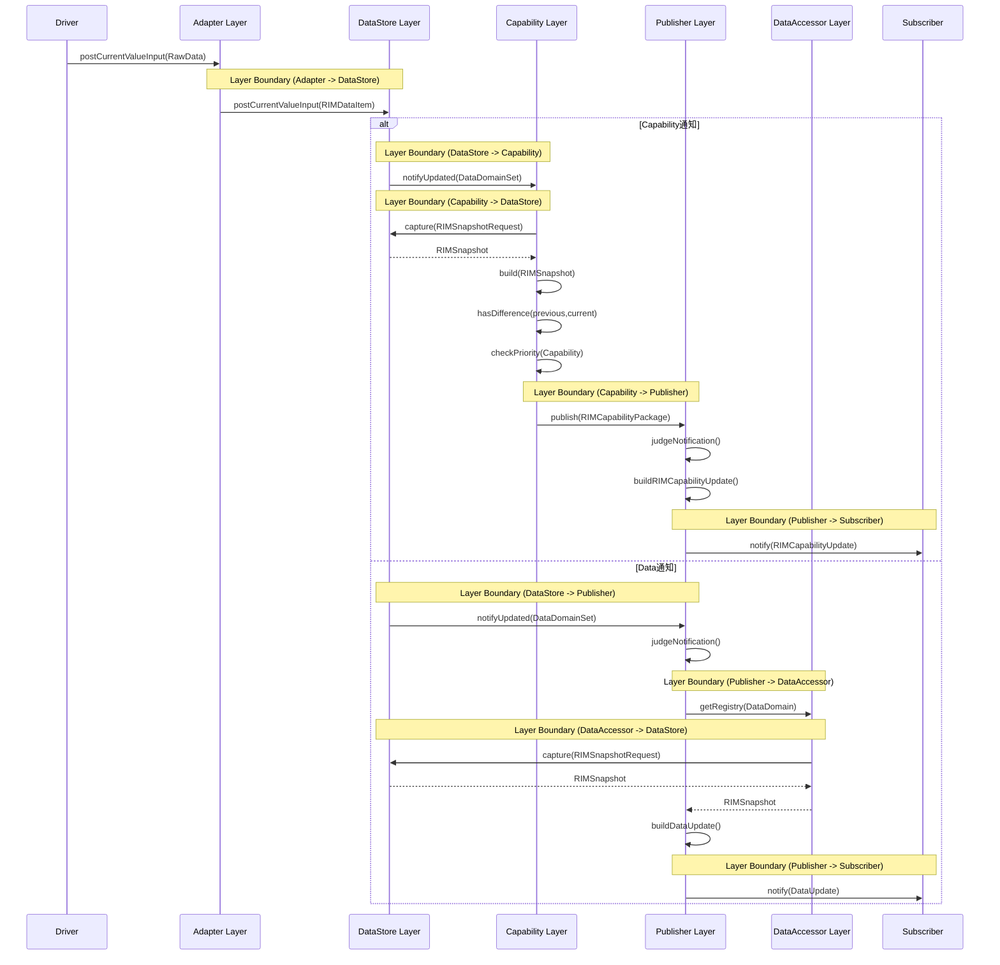

## End-to-End シーケンス図

## 概要
RIManager全体の代表的な処理フローを示す。

本シーケンスはレイヤ間連携により、センサー値などのData情報を処理し、Capability(State)へ変換した状態通知、またはData情報そのものを利用したData通知としてSubscriberへ通知する一連の処理を表現する。

## レイヤー構成

```text
Adapter
  : RawDataをRIMDataItemへ変換

DataStore
  : Dataの保存・更新通知・Snapshot提供

Capability
  : DataからCapability(State)を生成

Publisher
  : CapabilityUpdateおよびDataUpdateを生成し通知

DataAccessor
  : CapabilityおよびDataを参照提供
    （Data通知生成時に利用）

```


## シーケンス
### シーケンス概要
Driverから入力されたDataがDataStoreへ保存され、
Capability通知またはData通知として
Subscriberへ通知されるシーケンス。


