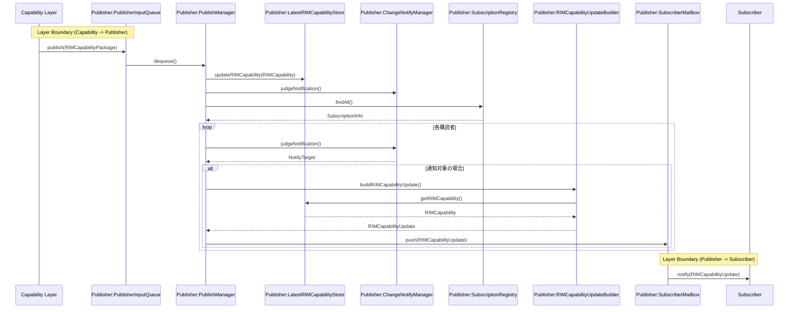
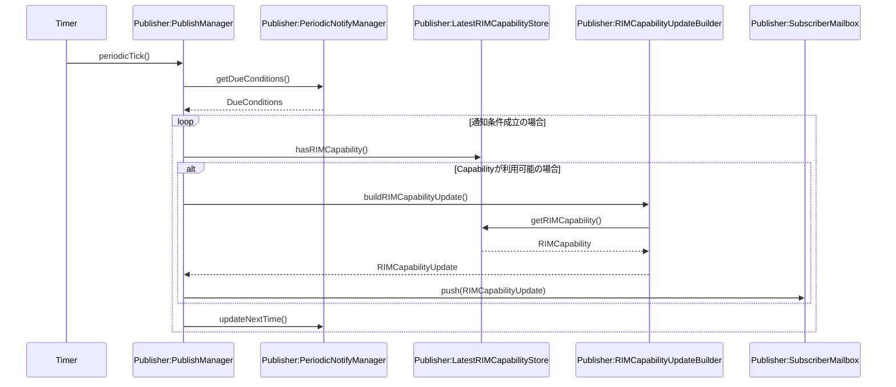
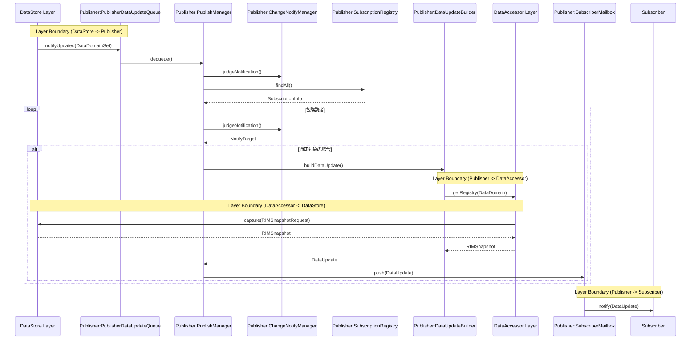
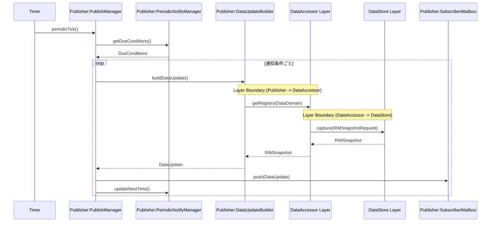

# Publisher Layer

## 1.Capability変更通知シーケンス

### シーケンス概要
Capability変更時に通知対象Subscriberを判定し、CapabilityUpdateを生成して配送するシーケンス。

## 2.Capability周期通知シーケンス

### シーケンス概要
登録された周期通知条件に基づいてCapabilityUpdateを生成し、Subscriberへ配送するシーケンス。

## 3.Data変更通知シーケンス

### シーケンス概要
DataStoreから通知されたDataDomain更新を契機に通知対象Subscriberを判定し、DataAccessorから取得した最新Dataを用いてDataUpdateを生成し配送するシーケンス。

## 4.Data周期通知シーケンス

### シーケンス概要
周期通知条件に従ってDataAccessorから最新Dataを取得し、DataUpdateを生成してSubscriberへ通知するシーケンス。

---