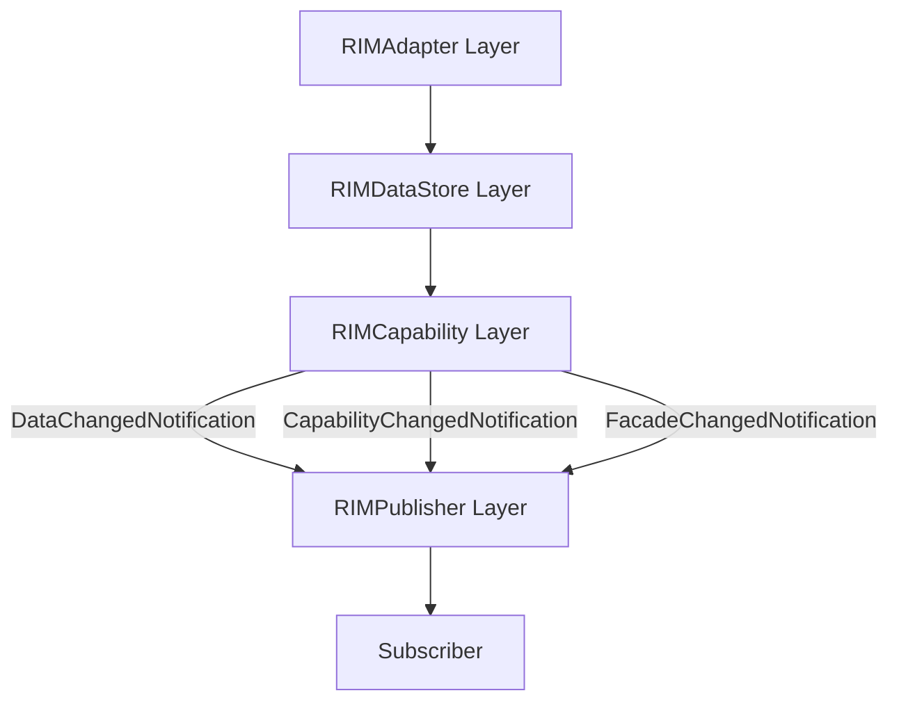
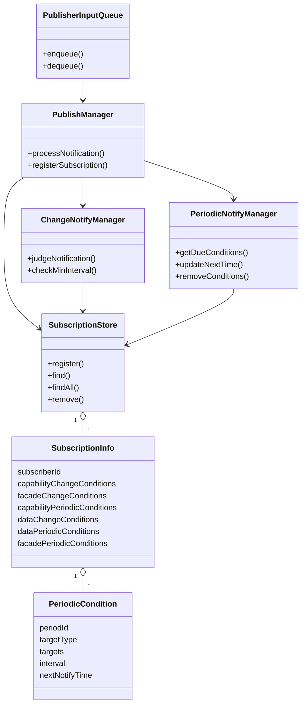
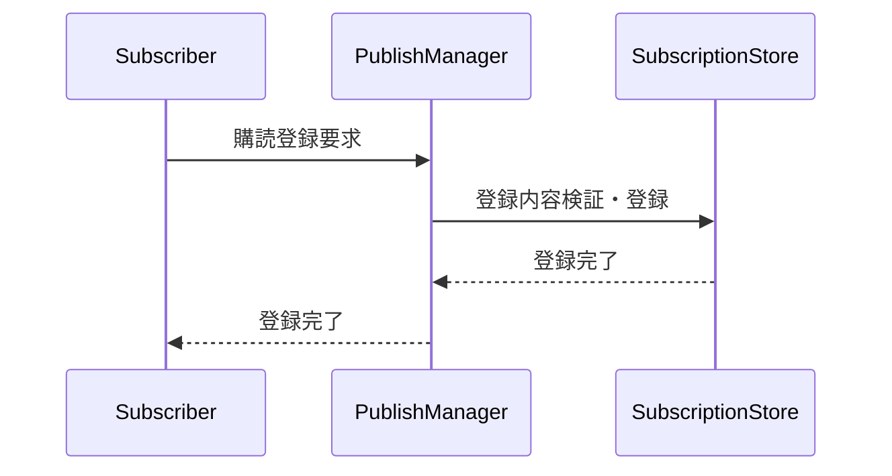
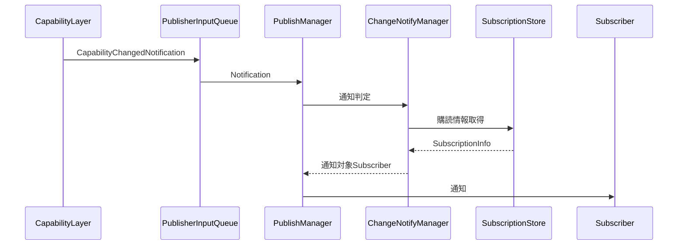
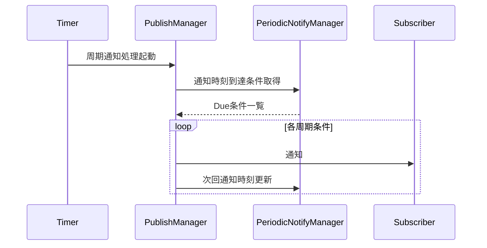
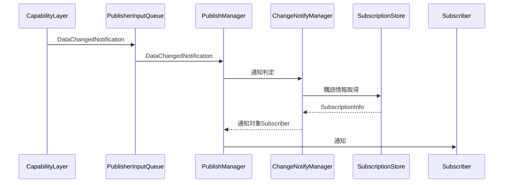
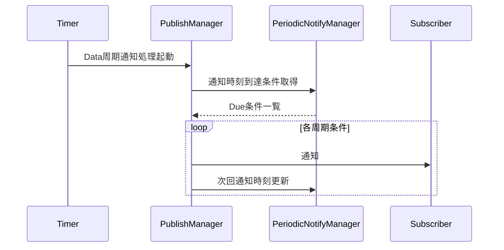
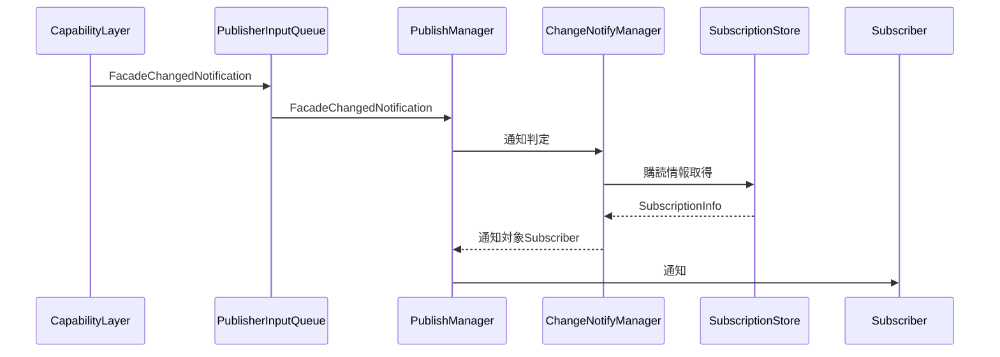
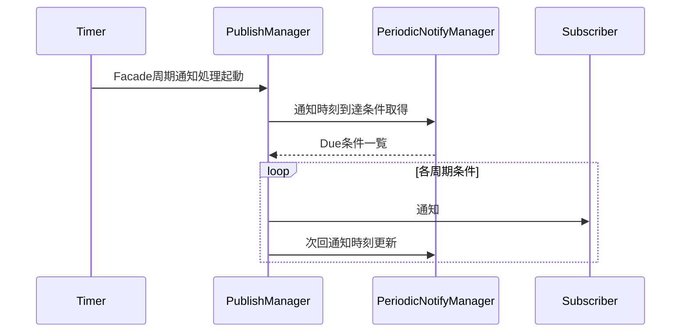

# Publisher Layer 仕様設計書
## 1. はじめに
### 1.1 本書の目的
本書は、RIMPublisher Layerの役割・責務・構成および設計原則を定義することを目的とする。
RIMPublisher Layerは、RIMCapability Layerから受信した変更通知をもとに、Subscriberの購読条件に応じた通知を行う責務を持つ。


本書の対象範囲は以下とする。

- Capability LayerからのDataChangedNotification受付
- Capability LayerからのCapabilityChangedNotification受付
- Capability LayerからのFacadeChangedNotification受付
- Subscriberからの購読登録要求の受付
- 購読情報の保持
- Capability変更通知
- Capability周期通知
- Data変更通知
- Data周期通知
- Subscriber向け更新通知の配送

---

### 1.2 用語集

| 用語 | 定義 |
|--------|--------|
| RIMCapabilityCategory | RIMCapabilityを論理的に分類したカテゴリ。購読条件および通知対象判定の単位として使用する。 |
| Subscriber | RIMPublisher Layerが提供する通知データを利用するコンポーネントまたは機能単位。 |
| Subscription | SubscriberがRIMPublisher Layerへ登録する購読契約の総称。変更通知条件および周期通知条件を含む。 |
| SubscriptionInfo | RIMPublisher Layerが管理する購読情報。Subscriber識別情報、通知先、変更通知条件、周期通知条件から構成される。 |
| SubscriptionRequest | Subscriberからの購読登録要求、またはRIMPublisher Layerが保持する購読設定情報を指す概念。 |
| Subscriber識別情報 | Subscriberを一意に識別するための情報。購読登録の単位となる。 |
| 変更通知 | RIMCapabilityCategoryまたはDataDomainの変更を契機として実施される通知。 |
| 変更通知条件 | 変更時に通知を受ける対象を定義する条件。 通知対象にはRIMCapabilityCategoryまたはDataDomainを指定できる。 |
| 周期通知 | 指定された時間間隔に基づいて実施される通知。 |
| 周期通知条件 |周期通知対象および通知周期を定義した条件。通知対象にはRIMCapabilityCategoryまたはDataDomainを指定できる。 |
| PeriodicCondition | 周期通知条件を表す管理単位。周期設定ID、通知対象種別、通知対象、通知周期、次回通知時刻を保持する。 |
| 通知優先度 | 変更通知に含まれる通知制御情報。。通知間隔制御などの判定に利用する。 |
| 最小通知間隔 | 変更通知が短時間に集中することを防ぐために設ける通知抑制時間。 |
| PublisherInputQueue | RIMCapability Layerから受信した変更通知を受け渡すためのキュー。 |
| Category一致判定 | 変更されたRIMCapabilityCategoryと購読条件を比較し、通知要否を判定する処理。 |
| DataChangedNotification | Capability Layerから通知されるData更新通知。通知内容の詳細はCapability Layer仕様書で定義する。 |
| CapabilityChangedNotification | Capability Layerから通知されるCapability更新通知。通知内容の詳細はCapability Layer仕様書で定義する。 |
| FacadeChangedNotification | Capability Layerから通知されるFacade更新通知。通知内容の詳細はCapability Layer仕様書で定義する。 |
| Facade変更通知条件 | Facade変更時に通知を受ける対象を定義する条件。 |
| Facade周期通知条件 | Facadeを対象とした周期通知条件。 |

---

## 2. Publisher Layerの位置づけ



RIMPublisher LayerはRIMCapability Layerの後段に位置し、
Capability Layerから通知される変更通知を
Subscriberへ配送する責務を持つ。

Publisher Layerは状態データを保持しない。

Publisher Layerは状態データの取得を行わない。

状態データの取得先はStorage Layerとし、
取得タイミングおよび取得方法は利用側モジュールの責務とする。

---

## 3. RIMPublisher Layerの責務
### 3.1 担当する責務  
- Subscriberからの購読登録要求を受け付ける。
- 購読登録内容を検証し、購読情報を保持する。
- 変更されたRIMCapabilityCategoryと購読Categoryから変更通知対象を判定する。
- 周期通知設定から周期通知対象を判定する。
- 通知失敗を検出し、所定の異常処理を行う。
- DataChangedNotificationを受け付ける
- CapabilityChangedNotificationを受け付ける
- FacadeChangedNotificationを受け付ける
- 更新通知対象Subscriberを判定する
- Subscriberへの通知配送
- Facade変更通知対象判定
- Facade周期通知対象判定

---

### 3.2 担当しない責務
- RIMCapabilityの生成
- 変更Categoryの判定
- 通知優先度の判定
- Subscriberの起動
- Subscriber内部の処理
- Capabilityの取得
- Dataの取得
- Facadeの取得
- Capabilityの保持
- Dataの保持
- Facadeの保持

---

## 4. 入出力データ
### 4.1 入力通知
Publisher Layerは以下の通知を入力として受け付ける。

- DataChangedNotification
- CapabilityChangedNotification
- FacadeChangedNotification

通知の詳細なデータ構造は
Capability Layer仕様書で定義する。
### 4.2 SubscriptionRequest（購読者登録）

概念として以下を含む。

- Subscriber識別情報
- Capability変更通知条件
- Data変更通知条件
- Facade変更通知条件
- Capability周期通知条件
- Data周期通知条件
- Facade周期通知条件

### 4.3 出力通知
Publisher Layerは通知対象Subscriberに対して通知を行う。

通知方式、
通知データ形式、
配送方式については
詳細設計で定義する。


---


## 5. 購読情報
Subscriberの識別情報、通知先、変更通知条件および周期通知条件を、1つの購読情報として管理する。
```
SubscriptionInfo
├─Subscriber識別情報
├─通知先
├─変更時通知条件
└─周期通知条件
    ├─ 周期設定ID
    ├─ 通知対象種別
    ├─ 通知対象
    └─ Interval


変更時通知条件
├─ Capability変更通知条件
├─ Data変更通知条件
└─ Facade変更通知条件

周期通知条件
├─ Capability周期通知条件
├─ Data周期通知条件
└─ Facade周期通知条件

```

---

### 6.1 変更時通知条件
更時通知条件は、変更を契機として通知を受けるRIMCapabilityCategoryを示す。

変更時通知条件は
Capability変更通知条件、
Data変更通知条件、
Facade変更通知条件を含む。

---

### 6.2 周期通知条件
周期設定は、周期的に通知を受けるCategoryと通知周期を表す。
1つのSubscriberは、異なる周期を持つ複数の周期通知条件を持つことが出来る。

変更通知条件と周期通知条件は独立して設定する。
同じRIMCapabilityCategoryを、変更通知と周期通知の両方に指定することもできる。

周期通知条件は
Capability周期通知条件、
Data周期通知条件、
Facade周期通知条件を含む。


---

### 6.3 購読単位
Subscriber登録、変更通知登録、周期通知登録を別々の操作には分けない。
RIMPublisher Layerは購読登録時に以下を行う。
- 登録内容を検証する
- 購読情報を登録する

購読登録を契機とした状態通知は行わない。


SubscriberはCapability通知およびData通知を同時に購読できる。

Capability通知条件とData通知条件は独立して設定する。

---

## 7. 通知方針
### 7.1 非同期通知
Publisher LayerからSubscriberへの
通知方式、
Subscriberとの接続方式、
配送保証方針については
詳細設計で定義する。

Publisher LayerはSubscriberの業務処理を実行しない。

---

### 7.2 Capability変更通知
受信したCapabilityChangedNotificationの
CapabilityCategoryと
SubscriberのCapability変更通知条件を比較する。

一致したSubscriberへ
Capability更新通知を配送する。

通知には変更されたCategory情報のみを含める。
Capability実体は通知しない。

---

### 7.3 変更通知の最小通知間隔
短時間に変更通知が集中することを防ぐため、変更通知には最小通知間隔を設ける。

最小通知間隔は、変更通知にのみ適用し、周期通知には適用しない。

最小通知間隔内に複数の変更が発生した場合は、通知可能となった時点の最新状態を通知する。

通知優先度がクリティカルの場合は、最小通知間隔を適用しないことを可能とする。
最小通知間隔の具体値および管理単位は詳細設計で定義する。

---

### 7.4 Capability周期通知
周期通知は、各周期通知条件に指定された周期に従って実行する。
---
### 7.5 Data変更通知

受信したDataChangedNotificationの
DataDomainと
SubscriberのData変更通知条件を比較する。

一致したSubscriberへ
Data更新通知を配送する。

通知には変更されたDataDomain情報のみを含める。
実データは通知しない。

---
### 7.6 Data周期通知

Data周期通知はData周期通知条件に指定された周期で実施する。

### 7.7 Facade変更通知
受信したFacadeChangedNotificationの
FacadeCategoryと
SubscriberのFacade変更通知条件を比較する。

一致したSubscriberへ
Facade更新通知を配送する。

通知には変更されたFacadeCategory情報のみを含める。
Facade実体は通知しない。
---

## 8. 主要クラスと責務
### 8.1 PublishManager
RIMPublisher Layer全体の処理を制御する。
主な責務を以下に示す。
- DataChangedNotification処理制御
- CapabilityChangedNotification処理制御
- FacadeChangedNotification処理制御
- Subscriber通知制御
---

### 8.2 ChangeNotifyManager
変更通知に関する判定を担当する。
主な責務を以下に示す。
- Capability変更通知判定
- Data変更通知判定
- Facade変更通知判定
- 最小通知間隔制御
- 通知優先度を考慮した通知判定

---

### 8.3 SubscriptionStore
Subscriberごとの購読情報を管理する。
主な責務を以下に示す。
- 購読情報の登録
- 購読情報の検索
- 通知対象となる購読情報の提供
- 購読情報の削除

---

### 8.4 PeriodicNotifyManager
周期通知条件と通知予定時刻を管理する。
主な責務を以下に示す。
- Capability周期通知条件管理
- Data周期通知条件管理
- Facade周期通知条件管理

---

### 8.5 PublisherInputQueue
Capability Layerから通知された変更通知をPublishManagerに受け渡す。


---

## 9. 主要提供IF
本章では提供IFを示す。
具体的な関数名、引数型、戻り値およびエラーコードは詳細設計で定義する。。

---

### 9.1 RIMCapability Layer向けIF
- DataChangedNotification受付
- CapabilityChangedNotification受付
- FacadeChangedNotification受付

受付処理は内部Queueへ投入後、
処理完了を待たずに復帰する。

---

### 9.2 Subscriber向け購読管理IF
- 購読登録
Subscriber識別情報、
Capability変更通知条件、
Data変更通知条件、
Facade変更通知条件、
Capability周期通知条件、
Data周期通知条件、
Facade周期通知条件
を受け付ける。

---

### 9.4 Layer内主要IF
```
SubscriptionStore
・購読情報登録
・購読情報取得
・購読情報一覧取得

ChangeNotifyManager
・変更通知判定

PeriodicNotifyManager
・通知時刻到達条件取得
・次回通知時刻更新

PublisherInputQueue
・enqueue()
・dequeue()
```

---

## 10. クラス図


---

## 11. シーケンス図
## 11.1 購読登録

購読登録時には状態通知を行わない

---

## 11.2 Capability変更通知


---

## 11.3 Capability周期通知


---

## 11.4 Data変更通知

---

## 11.5 Data周期通知



---
### 11.6 Facade変更通知

---
### 11.7 Facade周期通知


---
## 12. 異常時の基本方針
TBD
通知方式の詳細、
再送制御、
バッファリング方式、
エラー処理方針については
詳細設計で定義する。
